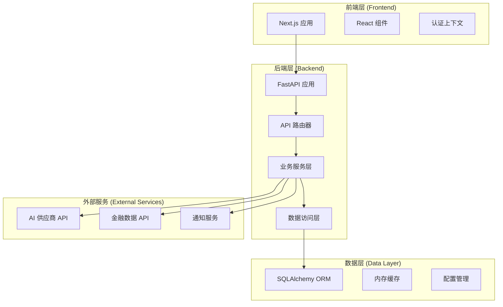
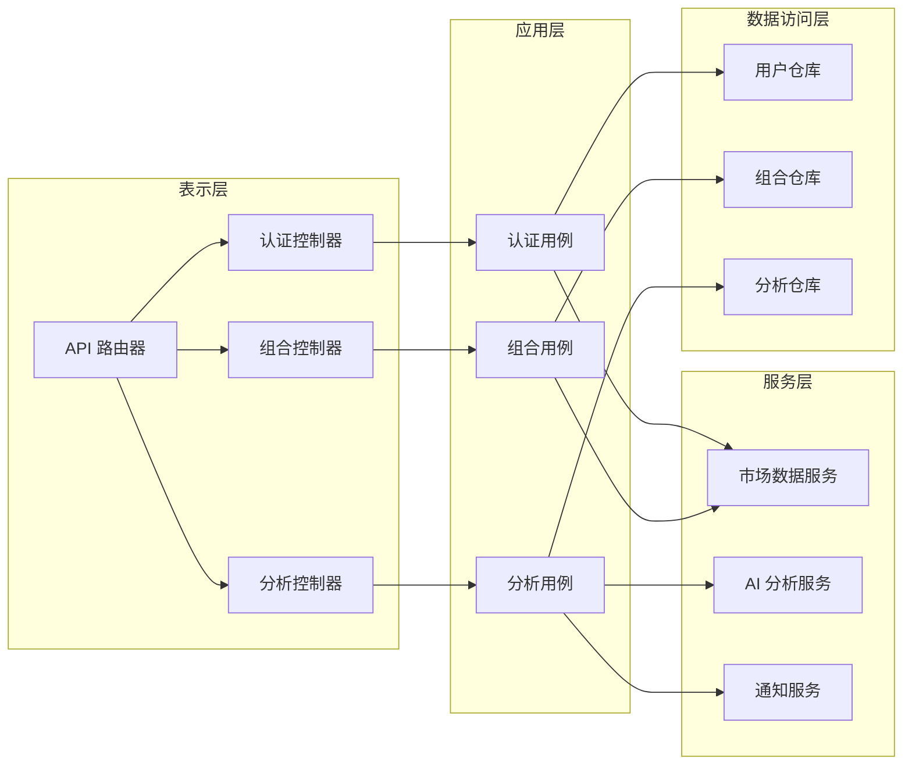
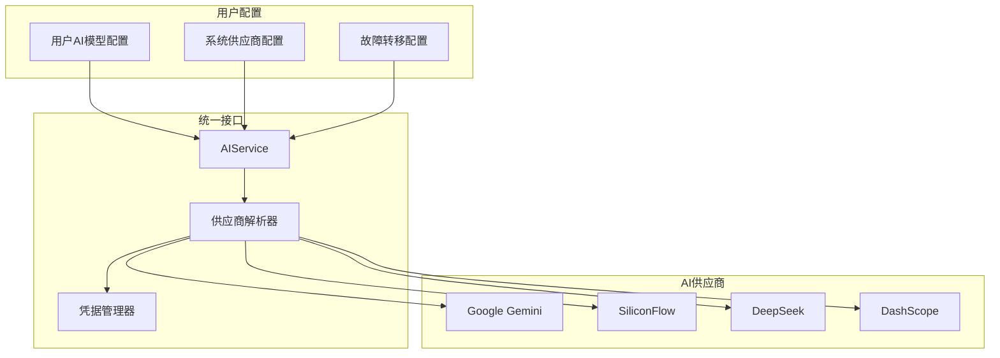
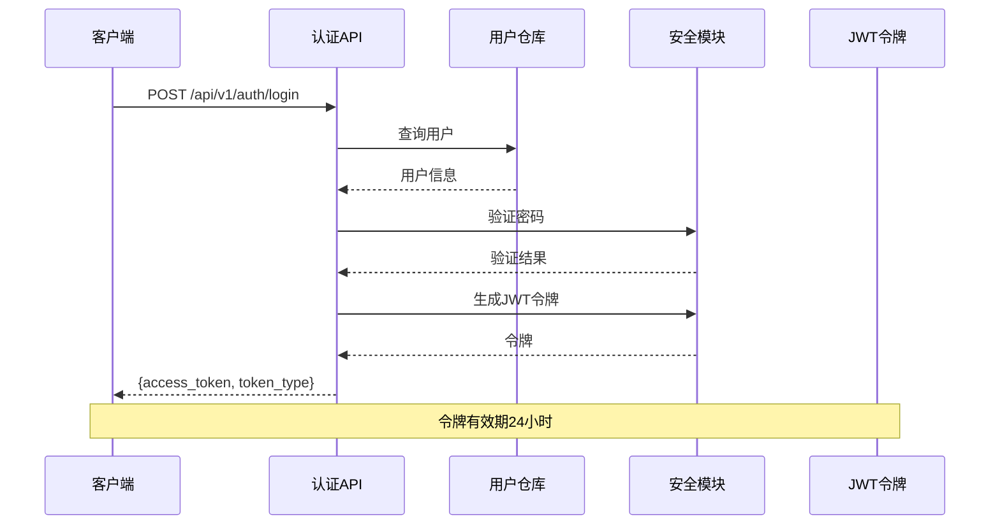
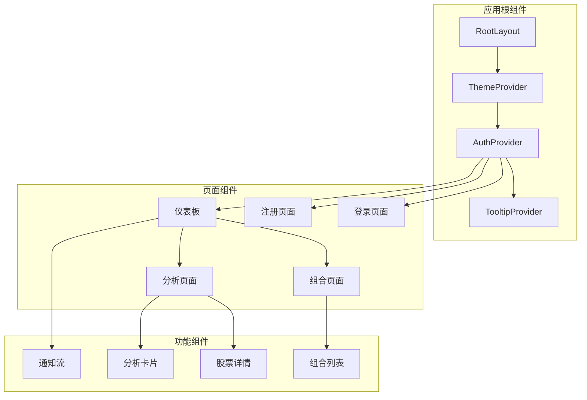
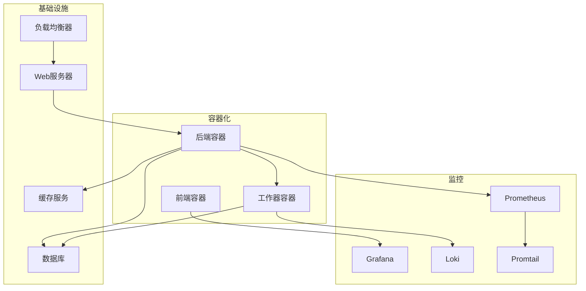

# 系统架构

<cite>
**本文引用的文件**
- [backend/app/main.py](file://backend/app/main.py)
- [backend/app/core/config.py](file://backend/app/core/config.py)
- [backend/app/core/database.py](file://backend/app/core/database.py)
- [backend/app/core/security.py](file://backend/app/core/security.py)
- [backend/app/api/v1/api.py](file://backend/app/api/v1/api.py)
- [backend/app/api/v1/endpoints/auth.py](file://backend/app/api/v1/endpoints/auth.py)
- [backend/app/api/v1/endpoints/user.py](file://backend/app/api/v1/endpoints/user.py)
- [backend/app/api/v1/endpoints/portfolio.py](file://backend/app/api/v1/endpoints/portfolio.py)
- [backend/app/api/v1/endpoints/analysis.py](file://backend/app/api/v1/endpoints/analysis.py)
- [backend/app/models/user.py](file://backend/app/models/user.py)
- [backend/app/models/portfolio.py](file://backend/app/models/portfolio.py)
- [backend/app/models/stock.py](file://backend/app/models/stock.py)
- [backend/app/models/analysis.py](file://backend/app/models/analysis.py)
- [backend/app/services/ai_service.py](file://backend/app/services/ai_service.py)
- [frontend/app/layout.tsx](file://frontend/app/layout.tsx)
- [frontend/context/AuthContext.tsx](file://frontend/context/AuthContext.tsx)
</cite>

## 更新摘要
**所做更改**
- 移除了抽象的架构描述，转向更实用的技术文档
- 更新了API路由结构和模块化设计说明
- 增强了数据模型和业务流程的技术细节
- 完善了AI服务和多供应商集成的技术实现
- 优化了前端认证和状态管理的技术架构

## 目录
1. [引言](#引言)
2. [系统概述](#系统概述)
3. [技术栈与选型](#技术栈与选型)
4. [系统架构设计](#系统架构设计)
5. [API路由与模块化](#api路由与模块化)
6. [数据模型与持久化](#数据模型与持久化)
7. [AI服务与多供应商集成](#ai服务与多供应商集成)
8. [认证与安全机制](#认证与安全机制)
9. [前端架构与状态管理](#前端架构与状态管理)
10. [性能优化策略](#性能优化策略)
11. [部署与运维](#部署与运维)
12. [故障排查指南](#故障排查指南)

## 引言
本文件为"AI股票顾问系统"的技术架构文档，采用实用主义方法，专注于系统的实际实现、技术细节和最佳实践。系统采用前后端分离架构，后端基于FastAPI构建RESTful API，前端使用Next.js开发响应式界面，通过模块化设计实现清晰的业务边界和可维护的代码结构。

## 系统概述
AI股票顾问系统是一个集成了多源金融数据和AI分析能力的投资辅助平台。系统支持实时股票分析、技术指标计算、AI诊断报告生成、组合管理和模拟交易等功能。通过模块化架构设计，系统实现了高内聚、低耦合的业务逻辑，支持多供应商AI模型集成和灵活的配置管理。



**图表来源**
- [backend/app/main.py:29-33](file://backend/app/main.py#L29-L33)
- [backend/app/api/v1/api.py:1-33](file://backend/app/api/v1/api.py#L1-L33)
- [backend/app/core/database.py:25-34](file://backend/app/core/database.py#L25-L34)

## 技术栈与选型
系统采用现代全栈技术栈，确保高性能、可扩展性和开发效率：

### 后端技术栈
- **FastAPI**: 高性能异步Web框架，提供自动API文档和类型安全
- **SQLAlchemy**: 异步ORM，支持多种数据库后端
- **Pydantic**: 数据验证和序列化
- **Uvicorn**: ASGI服务器，支持异步处理

### 前端技术栈
- **Next.js**: React框架，支持SSR/CSR混合模式
- **TypeScript**: 类型安全的JavaScript超集
- **Tailwind CSS**: 实用优先的CSS框架
- **React Query**: 状态管理和数据获取

### 数据与缓存
- **SQLite/PostgreSQL**: 主数据库支持
- **异步连接池**: 优化数据库连接性能
- **内存缓存**: 技术指标和市场数据缓存

**章节来源**
- [backend/app/main.py:29-33](file://backend/app/main.py#L29-L33)
- [backend/app/core/config.py:4-38](file://backend/app/core/config.py#L4-L38)
- [frontend/app/layout.tsx:1-52](file://frontend/app/layout.tsx#L1-L52)

## 系统架构设计
系统采用分层架构设计，每层职责明确，便于维护和扩展：

### 应用层 (Application Layer)
负责业务用例的编排和协调，实现业务规则和流程控制。

### 服务层 (Service Layer)
封装外部服务调用、算法计算和业务逻辑处理。

### 数据访问层 (Data Access Layer)
提供数据持久化和查询功能，实现数据映射和事务管理。

### 表示层 (Presentation Layer)
处理HTTP请求和响应，实现API接口和前端交互。



**图表来源**
- [backend/app/api/v1/endpoints/auth.py:24-48](file://backend/app/api/v1/endpoints/auth.py#L24-L48)
- [backend/app/api/v1/endpoints/portfolio.py:71-78](file://backend/app/api/v1/endpoints/portfolio.py#L71-L78)
- [backend/app/api/v1/endpoints/analysis.py:30-51](file://backend/app/api/v1/endpoints/analysis.py#L30-L51)

## API路由与模块化
系统采用模块化的API路由设计，每个业务模块都有独立的路由前缀和功能范围：

### 路由层次结构
- **/api/v1/auth**: 用户认证相关接口
- **/api/v1/portfolio**: 投资组合管理接口
- **/api/v1/stocks**: 股票数据查询接口
- **/api/v1/analysis**: AI分析相关接口
- **/api/v1/user**: 用户设置和配置接口
- **/api/v1/macro**: 宏观市场分析接口
- **/api/v1/notifications**: 通知历史接口
- **/api/v1/paper-trading**: 模拟交易接口

### 路由注册机制
系统通过APIRouter实现动态路由注册，支持按模块扩展和维护。

**章节来源**
- [backend/app/api/v1/api.py:1-33](file://backend/app/api/v1/api.py#L1-L33)
- [backend/app/api/v1/endpoints/auth.py:14-14](file://backend/app/api/v1/endpoints/auth.py#L14-L14)
- [backend/app/api/v1/endpoints/portfolio.py:21-21](file://backend/app/api/v1/endpoints/portfolio.py#L21-L21)

## 数据模型与持久化
系统采用SQLAlchemy ORM实现数据持久化，支持SQLite和PostgreSQL数据库后端。

### 核心数据模型

#### 用户模型 (User)
```python
class User(Base):
    id: String  # UUID主键
    email: String  # 唯一邮箱
    hashed_password: String  # 加密密码
    membership_tier: MembershipTier  # 会员等级
    api_key_gemini: String  # Gemini API密钥
    preferred_data_source: MarketDataSource  # 偏好数据源
    preferred_ai_model: AIModel  # 默认AI模型
```

#### 投资组合模型 (Portfolio)
```python
class Portfolio(Base):
    user_id: String  # 用户ID外键
    ticker: String   # 股票代码外键
    quantity: Float  # 持仓数量
    avg_cost: Float  # 持仓均价
    sort_order: Integer  # 排序权重
```

#### 市场数据缓存模型 (MarketDataCache)
```python
class MarketDataCache(Base):
    ticker: String  # 股票代码主键
    current_price: Float  # 当前价格
    rsi_14: Float  # RSI指标
    macd_val: Float  # MACD值
    bb_upper: Float  # 布林带上轨
    volume_ma_20: Float  # 20日成交量均值
    market_status: MarketStatus  # 市场状态
    last_updated: DateTime  # 最后更新时间
```

### 数据库连接优化
- **异步连接池**: 支持SQLite和PostgreSQL
- **WAL模式**: SQLite性能优化
- **连接预检测**: 确保连接有效性
- **自动回滚**: 异常处理和数据一致性

**章节来源**
- [backend/app/models/user.py:28-80](file://backend/app/models/user.py#L28-L80)
- [backend/app/models/portfolio.py:8-35](file://backend/app/models/portfolio.py#L8-L35)
- [backend/app/models/stock.py:53-109](file://backend/app/models/stock.py#L53-L109)
- [backend/app/core/database.py:25-69](file://backend/app/core/database.py#L25-L69)

## AI服务与多供应商集成
系统实现了灵活的AI服务架构，支持多个AI供应商的无缝集成和故障转移。

### AI供应商架构


**图表来源**
- [backend/app/services/ai_service.py:132-193](file://backend/app/services/ai_service.py#L132-L193)
- [backend/app/services/ai_service.py:395-447](file://backend/app/services/ai_service.py#L395-L447)

### 供应商解析与故障转移
系统实现了智能的供应商解析机制，支持以下特性：

1. **优先级排序**: 按供应商优先级和用户偏好排序
2. **凭据管理**: 支持用户级和系统级API密钥
3. **故障转移**: 自动切换到备用供应商
4. **降级处理**: 支持JSON格式和纯文本响应

### AI模型配置管理
系统支持用户自定义AI模型配置，包括：
- 自定义模型ID和基础URL
- 用户级API密钥管理
- 模型激活状态控制
- 默认模型回退机制

**章节来源**
- [backend/app/services/ai_service.py:24-516](file://backend/app/services/ai_service.py#L24-L516)
- [backend/app/api/v1/endpoints/user.py:252-382](file://backend/app/api/v1/endpoints/user.py#L252-L382)

## 认证与安全机制
系统采用JWT令牌认证和多层安全防护机制，确保用户数据和API调用的安全性。

### 认证流程


**图表来源**
- [backend/app/api/v1/endpoints/auth.py:24-48](file://backend/app/api/v1/endpoints/auth.py#L24-L48)

### 安全特性
- **密码哈希**: 使用bcrypt算法加密存储
- **JWT令牌**: 24小时有效期的访问令牌
- **API密钥加密**: 使用Fernet对称加密存储
- **CORS配置**: 严格控制跨域访问
- **异常处理**: 全局异常捕获和日志记录

### 前端认证集成
前端通过AuthContext管理认证状态，实现：
- 自动令牌存储和传递
- 路由守卫和权限控制
- 登录状态持久化
- 错误处理和重定向

**章节来源**
- [backend/app/api/v1/endpoints/auth.py:1-83](file://backend/app/api/v1/endpoints/auth.py#L1-L83)
- [backend/app/core/security.py:13-63](file://backend/app/core/security.py#L13-L63)
- [frontend/context/AuthContext.tsx](file://frontend/context/AuthContext.tsx)

## 前端架构与状态管理
前端采用Next.js框架构建现代化的单页应用，实现响应式设计和良好的用户体验。

### 应用结构


**图表来源**
- [frontend/app/layout.tsx:24-51](file://frontend/app/layout.tsx#L24-L51)

### 状态管理策略
- **React Query**: 异步数据获取和缓存
- **Context API**: 全局认证状态管理
- **本地存储**: 用户偏好和令牌持久化
- **组件状态**: 局部UI状态管理

### UI组件架构
系统采用原子化设计，组件层次清晰：
- **基础组件**: Button, Input, Card等
- **复合组件**: DashboardShell, PortfolioTabContainer等
- **页面组件**: 完整业务页面的组合

**章节来源**
- [frontend/app/layout.tsx:1-52](file://frontend/app/layout.tsx#L1-L52)
- [frontend/context/AuthContext.tsx](file://frontend/context/AuthContext.tsx)

## 性能优化策略
系统实施多层次的性能优化策略，确保在高并发场景下的稳定运行。

### 数据库优化
- **连接池配置**: 根据数据库类型优化连接参数
- **WAL模式**: SQLite性能提升
- **索引策略**: 关键字段建立适当索引
- **查询优化**: 使用JOIN和批量操作减少查询次数

### 缓存策略
- **内存缓存**: 技术指标和市场数据缓存
- **缓存失效**: 基于时间戳的缓存管理
- **缓存预热**: 启动时预加载常用数据
- **缓存穿透防护**: 查询结果为空时的处理

### 异步处理
- **异步API**: FastAPI异步支持
- **后台任务**: 调度器异步执行
- **并发控制**: 限流和防雪崩机制
- **资源池**: 连接和任务资源管理

### 前端性能
- **代码分割**: Next.js自动代码分割
- **懒加载**: 组件和路由懒加载
- **缓存策略**: 浏览器缓存和API缓存
- **渲染优化**: React.memo和useMemo优化

## 部署与运维
系统支持容器化部署和云原生架构，提供灵活的部署选项。

### 部署架构


### 环境配置
- **开发环境**: SQLite + 本地开发服务器
- **测试环境**: PostgreSQL + Docker容器
- **生产环境**: Neon PostgreSQL + Kubernetes

### 监控与日志
- **结构化日志**: JSON格式日志输出
- **指标收集**: 性能和业务指标
- **告警系统**: 关键指标异常告警
- **分布式追踪**: 请求链路追踪

## 故障排查指南
提供系统性的故障排查方法和解决方案。

### 常见问题诊断
- **认证失败**: 检查用户凭证和JWT令牌
- **数据库连接**: 验证连接字符串和权限
- **AI服务异常**: 检查API密钥和供应商状态
- **前端路由**: 确认认证状态和路由配置

### 日志分析
- **后端日志**: 查看结构化JSON日志
- **前端日志**: 浏览器开发者工具
- **数据库日志**: SQL查询和性能分析
- **AI服务日志**: 供应商调用和响应

### 性能问题定位
- **慢查询**: 分析数据库查询性能
- **内存泄漏**: 检查前端组件卸载
- **并发问题**: 监控连接池使用情况
- **缓存失效**: 验证缓存策略有效性

### 紧急恢复
- **服务重启**: 安全的服务重启流程
- **数据回滚**: 数据库迁移回滚
- **配置恢复**: 环境变量和配置文件
- **备份恢复**: 数据备份和恢复流程