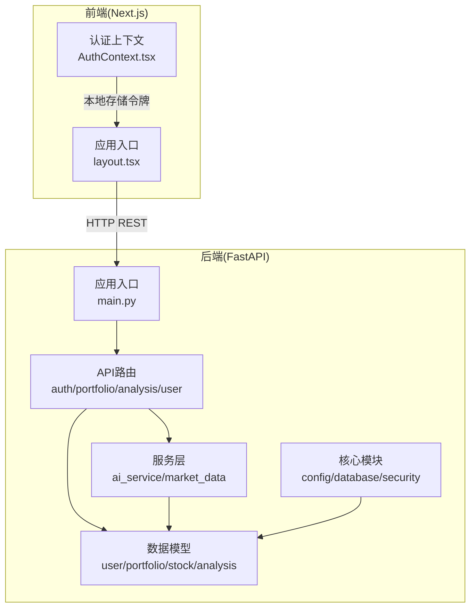
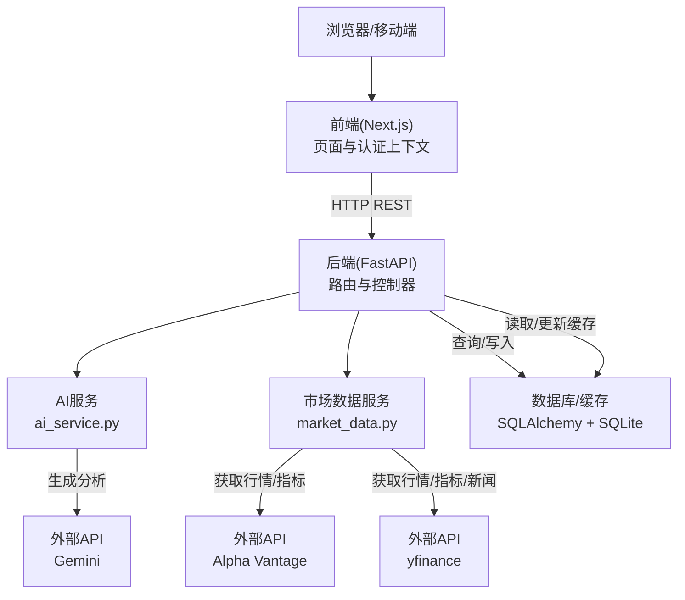
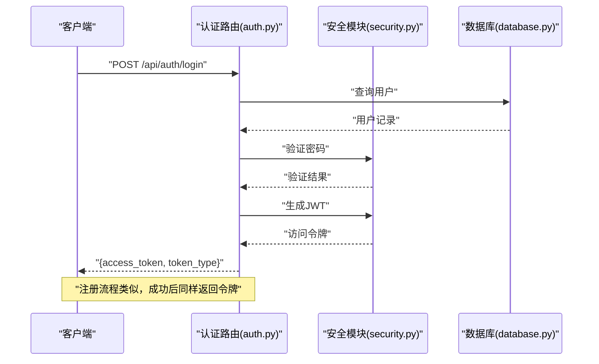
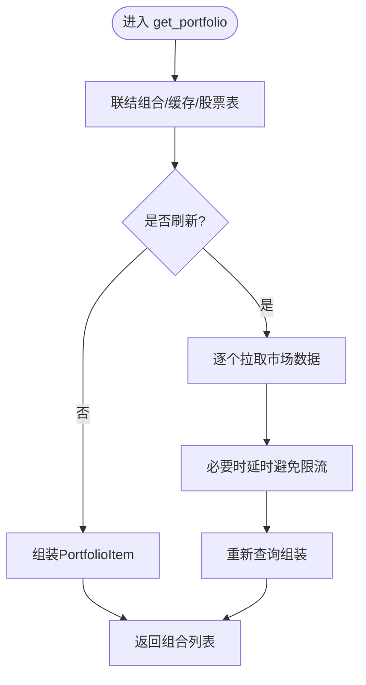
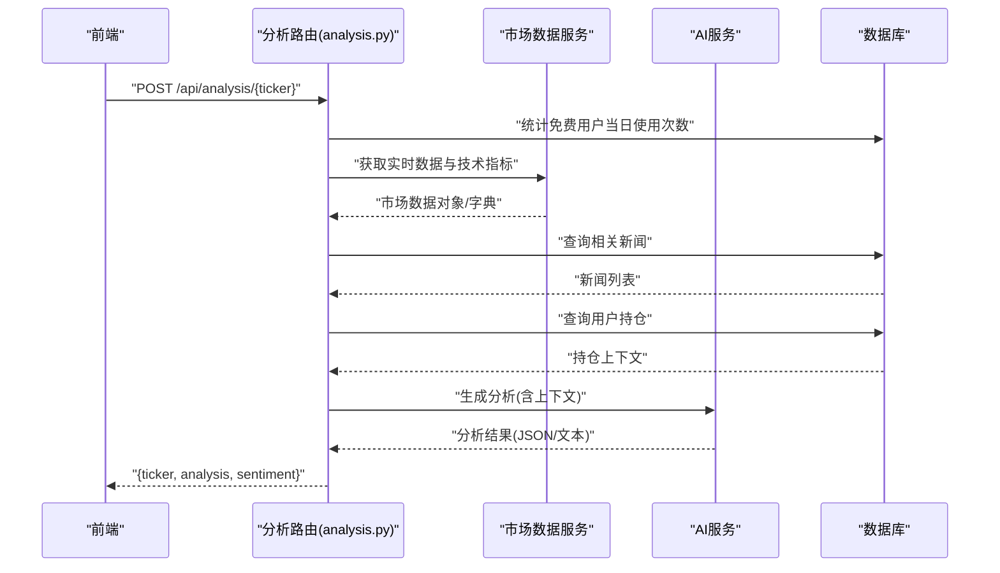
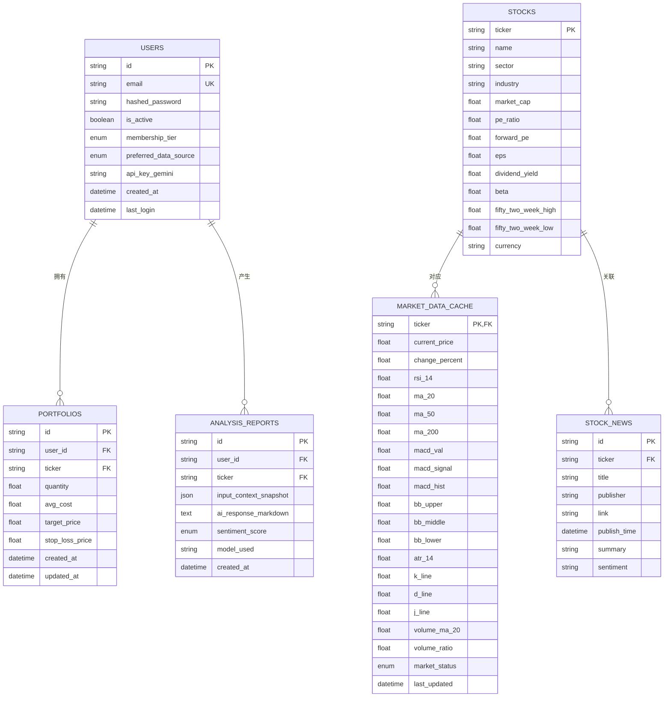
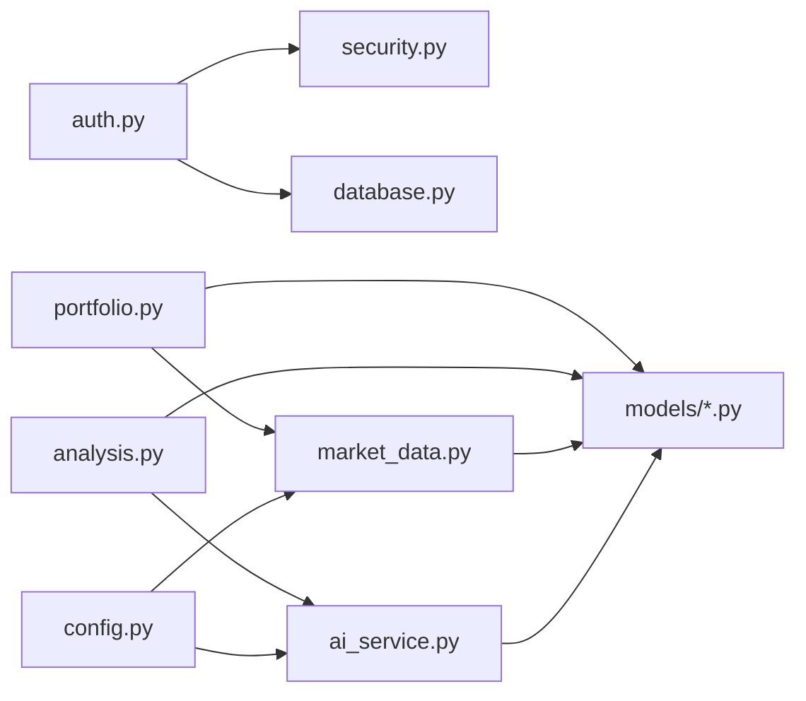

# 系统架构

<cite>
**本文引用的文件**
- [backend/app/main.py](file://backend/app/main.py)
- [backend/app/core/config.py](file://backend/app/core/config.py)
- [backend/app/core/database.py](file://backend/app/core/database.py)
- [backend/app/core/security.py](file://backend/app/core/security.py)
- [backend/app/api/auth.py](file://backend/app/api/auth.py)
- [backend/app/api/user.py](file://backend/app/api/user.py)
- [backend/app/api/portfolio.py](file://backend/app/api/portfolio.py)
- [backend/app/api/analysis.py](file://backend/app/api/analysis.py)
- [backend/app/models/user.py](file://backend/app/models/user.py)
- [backend/app/models/portfolio.py](file://backend/app/models/portfolio.py)
- [backend/app/models/stock.py](file://backend/app/models/stock.py)
- [backend/app/models/analysis.py](file://backend/app/models/analysis.py)
- [backend/app/services/ai_service.py](file://backend/app/services/ai_service.py)
- [backend/app/services/market_data.py](file://backend/app/services/market_data.py)
- [frontend/app/layout.tsx](file://frontend/app/layout.tsx)
- [frontend/context/AuthContext.tsx](file://frontend/context/AuthContext.tsx)
</cite>

## 目录
1. [引言](#引言)
2. [项目结构](#项目结构)
3. [核心组件](#核心组件)
4. [架构总览](#架构总览)
5. [详细组件分析](#详细组件分析)
6. [依赖关系分析](#依赖关系分析)
7. [性能考量](#性能考量)
8. [故障排查指南](#故障排查指南)
9. [结论](#结论)
10. [附录](#附录)

## 引言
本文件为“AI股票顾问系统”的系统架构文档，面向技术与非技术读者，聚焦于整体设计、前后端分离、微服务风格的模块化组织、数据流与外部服务集成、认证与安全、数据库与缓存策略、可扩展性与性能优化，以及部署拓扑与基础设施要求。系统采用FastAPI作为后端Web框架，Next.js作为前端框架，通过REST API进行前后端通信；后端以领域模型与服务层解耦，围绕“用户-组合-市场数据-AI分析”形成清晰的数据流。

## 项目结构
系统采用前后端分离的典型布局：
- 后端（Python/SQLAlchemy/FastAPI）：位于 backend/，包含API路由、核心配置、数据库与ORM模型、服务层（AI与市场数据）、迁移脚本与工具脚本。
- 前端（Next.js/React）：位于 frontend/，包含页面、UI组件、全局样式与认证上下文。

图表来源
- [backend/app/main.py](file://backend/app/main.py#L1-L38)
- [frontend/app/layout.tsx](file://frontend/app/layout.tsx#L20-L38)

章节来源
- [backend/app/main.py](file://backend/app/main.py#L1-L38)
- [frontend/app/layout.tsx](file://frontend/app/layout.tsx#L1-L39)

## 核心组件
- 应用入口与路由
  - 后端通过FastAPI创建应用实例，启用CORS中间件，挂载认证、用户、组合、分析等路由前缀。
- 安全与认证
  - 使用基于JWT的访问令牌，密码采用哈希存储，支持登录与注册流程。
- 数据与缓存
  - 使用异步SQLAlchemy连接SQLite，定义用户、组合、股票、市场缓存与分析报告等模型；市场数据采用内存级缓存（1分钟窗口）与多源回退。
- AI与市场数据服务
  - AI服务封装Gemini调用与回退逻辑；市场数据服务整合Alpha Vantage与yfinance，计算并缓存技术指标。
- 前端认证上下文
  - 在客户端维护令牌并在路由间传递，实现登录态管理。

章节来源
- [backend/app/main.py](file://backend/app/main.py#L1-L38)
- [backend/app/core/security.py](file://backend/app/core/security.py#L1-L26)
- [backend/app/core/config.py](file://backend/app/core/config.py#L1-L24)
- [backend/app/core/database.py](file://backend/app/core/database.py#L1-L24)
- [backend/app/services/ai_service.py](file://backend/app/services/ai_service.py#L1-L112)
- [backend/app/services/market_data.py](file://backend/app/services/market_data.py#L1-L370)
- [frontend/context/AuthContext.tsx](file://frontend/context/AuthContext.tsx#L1-L60)

## 架构总览
系统采用“前后端分离 + 微服务风格模块化”的架构：
- 前端负责UI与用户交互，通过HTTP REST与后端通信。
- 后端按功能拆分为API层、服务层与数据层，API层编排业务流程，服务层封装外部调用与算法，数据层负责持久化与缓存。
- 外部服务集成：AI服务（Gemini）、金融数据API（Alpha Vantage、yfinance），并具备代理与限流回退策略。

图表来源
- [backend/app/main.py](file://backend/app/main.py#L24-L29)
- [backend/app/api/analysis.py](file://backend/app/api/analysis.py#L13-L124)
- [backend/app/api/portfolio.py](file://backend/app/api/portfolio.py#L143-L224)
- [backend/app/services/ai_service.py](file://backend/app/services/ai_service.py#L42-L112)
- [backend/app/services/market_data.py](file://backend/app/services/market_data.py#L15-L170)

## 详细组件分析

### 认证与授权（后端）
- 登录/注册流程
  - 登录：校验邮箱与密码，签发JWT访问令牌。
  - 注册：检查邮箱唯一性，加密密码并签发令牌。
- 安全配置
  - 使用密钥与算法生成JWT，设置过期时间；密码使用哈希方案。
- 前端集成
  - 前端通过认证上下文管理令牌，登录成功后写入本地存储并跳转首页。

图表来源
- [backend/app/api/auth.py](file://backend/app/api/auth.py#L24-L50)
- [backend/app/core/security.py](file://backend/app/core/security.py#L11-L25)
- [backend/app/core/database.py](file://backend/app/core/database.py#L21-L23)

章节来源
- [backend/app/api/auth.py](file://backend/app/api/auth.py#L1-L88)
- [backend/app/core/security.py](file://backend/app/core/security.py#L1-L26)
- [frontend/context/AuthContext.tsx](file://frontend/context/AuthContext.tsx#L15-L51)

### 组合与市场数据（后端）
- 组合查询
  - 支持搜索股票、列出组合、新增/删除组合项；在刷新时调用市场数据服务更新缓存。
- 市场数据缓存
  - 1分钟内命中缓存；优先使用首选数据源（Alpha Vantage或yfinance），失败时回退到另一源或模拟数据。
- 技术指标计算
  - 在yfinance回源时计算RSI、MACD、布林带、KDJ、ATR、成交量相关指标，写入缓存表。

图表来源
- [backend/app/api/portfolio.py](file://backend/app/api/portfolio.py#L143-L224)
- [backend/app/services/market_data.py](file://backend/app/services/market_data.py#L15-L170)

章节来源
- [backend/app/api/portfolio.py](file://backend/app/api/portfolio.py#L1-L297)
- [backend/app/services/market_data.py](file://backend/app/services/market_data.py#L1-L370)

### AI分析（后端）
- 业务流程
  - 校验用户配额（免费用户每日上限），获取市场数据与新闻，拼接用户持仓上下文，调用AI服务生成分析。
- AI服务
  - 支持Gemini调用与JSON响应解析，失败时回退纯文本；支持按用户自定义API Key覆盖全局Key。
- 数据模型
  - 分析报告持久化，包含输入快照、AI输出、情感倾向与模型标识。

图表来源
- [backend/app/api/analysis.py](file://backend/app/api/analysis.py#L13-L124)
- [backend/app/services/ai_service.py](file://backend/app/services/ai_service.py#L42-L112)
- [backend/app/services/market_data.py](file://backend/app/services/market_data.py#L15-L170)

章节来源
- [backend/app/api/analysis.py](file://backend/app/api/analysis.py#L1-L124)
- [backend/app/models/analysis.py](file://backend/app/models/analysis.py#L1-L25)
- [backend/app/services/ai_service.py](file://backend/app/services/ai_service.py#L1-L112)

### 数据模型与缓存策略
- 用户与权限
  - 用户模型包含邮箱、哈希密码、会员等级、偏好数据源与AI Key字段。
- 组合与股票
  - 组合表记录用户持仓；股票表记录基础财务信息；市场数据缓存表存储技术指标与状态。
- 缓存策略
  - 1分钟内缓存命中；若缓存不完整或缺失，触发后台任务补全技术指标；回源失败时采用模拟数据维持体验。

图表来源
- [backend/app/models/user.py](file://backend/app/models/user.py#L15-L31)
- [backend/app/models/stock.py](file://backend/app/models/stock.py#L13-L85)
- [backend/app/models/portfolio.py](file://backend/app/models/portfolio.py#L7-L26)
- [backend/app/models/analysis.py](file://backend/app/models/analysis.py#L12-L25)

章节来源
- [backend/app/models/user.py](file://backend/app/models/user.py#L1-L31)
- [backend/app/models/stock.py](file://backend/app/models/stock.py#L1-L85)
- [backend/app/models/portfolio.py](file://backend/app/models/portfolio.py#L1-L26)
- [backend/app/models/analysis.py](file://backend/app/models/analysis.py#L1-L25)

### 技术栈选型理由
- FastAPI
  - 强类型路由、自动OpenAPI文档、高性能ASGI、内置依赖注入与安全特性，适合构建可演进的API网关与业务服务。
- Next.js
  - SSR/CSR混合、路由体系、TypeScript友好、UI组件生态，适合作为前端单页应用与多页面场景。
- 数据库与ORM
  - SQLAlchemy异步引擎与模型定义，SQLite便于本地开发与部署简化，同时具备迁移到生产数据库的平滑路径。
- 外部服务
  - Alpha Vantage提供宏观报价与概览，yfinance提供丰富历史与技术指标，Gemini用于LLM分析；均具备回退与限流策略。

章节来源
- [backend/app/main.py](file://backend/app/main.py#L1-L38)
- [backend/app/core/config.py](file://backend/app/core/config.py#L1-L24)
- [backend/app/services/market_data.py](file://backend/app/services/market_data.py#L1-L370)
- [backend/app/services/ai_service.py](file://backend/app/services/ai_service.py#L1-L112)

## 依赖关系分析
- 组件耦合
  - API层仅依赖服务层与数据库会话，服务层依赖配置与外部SDK，降低API层复杂度。
- 外部依赖
  - Alpha Vantage、yfinance、Gemini构成核心外部依赖，通过配置中心统一管理密钥与代理。
- 数据依赖
  - 组合查询通过JOIN聚合缓存与股票基础信息，减少多次往返；缓存命中率直接影响响应延迟。

图表来源
- [backend/app/api/auth.py](file://backend/app/api/auth.py#L1-L88)
- [backend/app/api/portfolio.py](file://backend/app/api/portfolio.py#L1-L297)
- [backend/app/api/analysis.py](file://backend/app/api/analysis.py#L1-L124)
- [backend/app/services/ai_service.py](file://backend/app/services/ai_service.py#L1-L112)
- [backend/app/services/market_data.py](file://backend/app/services/market_data.py#L1-L370)
- [backend/app/core/config.py](file://backend/app/core/config.py#L1-L24)
- [backend/app/core/database.py](file://backend/app/core/database.py#L1-L24)

章节来源
- [backend/app/api/auth.py](file://backend/app/api/auth.py#L1-L88)
- [backend/app/api/portfolio.py](file://backend/app/api/portfolio.py#L1-L297)
- [backend/app/api/analysis.py](file://backend/app/api/analysis.py#L1-L124)
- [backend/app/services/ai_service.py](file://backend/app/services/ai_service.py#L1-L112)
- [backend/app/services/market_data.py](file://backend/app/services/market_data.py#L1-L370)
- [backend/app/core/config.py](file://backend/app/core/config.py#L1-L24)
- [backend/app/core/database.py](file://backend/app/core/database.py#L1-L24)

## 性能考量
- 缓存与回源
  - 1分钟缓存窗口平衡实时性与成本；多源回退与模拟数据保障可用性。
- 并发与限流
  - yfinance回源采用超时与指数退避，避免雪崩；组合刷新顺序执行以规避SQLite并发问题。
- 前端体验
  - 登录态由前端上下文管理，路由跳转与本地存储减少重复鉴权开销。
- 可扩展建议
  - 引入Redis缓存热点数据；将AI与市场数据服务拆分为独立进程/容器；引入消息队列处理后台任务；CDN加速静态资源。

[本节为通用性能指导，无需特定文件引用]

## 故障排查指南
- 认证失败
  - 检查用户名/密码是否正确；确认数据库中用户存在且密码哈希匹配。
- AI分析异常
  - 确认Gemini API Key配置；查看日志中的错误提示；尝试回退到纯文本生成。
- 市场数据为空
  - 检查Alpha Vantage与yfinance密钥与网络代理；观察回退到模拟数据的日志。
- 组合刷新无效
  - 确认用户偏好数据源设置；检查缓存最后更新时间与数据库写入情况。

章节来源
- [backend/app/api/auth.py](file://backend/app/api/auth.py#L38-L43)
- [backend/app/services/ai_service.py](file://backend/app/services/ai_service.py#L103-L111)
- [backend/app/services/market_data.py](file://backend/app/services/market_data.py#L30-L47)
- [backend/app/api/portfolio.py](file://backend/app/api/portfolio.py#L162-L174)

## 结论
本系统以FastAPI与Next.js为核心，采用前后端分离与微服务风格模块化设计，围绕“用户-组合-市场数据-AI分析”形成闭环数据流。通过多源回退、缓存与限流策略保障稳定性，配合JWT认证与本地令牌管理提升安全性。未来可在缓存、异步任务、容器化与CDN等方面进一步增强可扩展性与性能。

[本节为总结性内容，无需特定文件引用]

## 附录

### 系统边界与组件交互
- 边界
  - 前端：负责UI与认证态；后端：提供REST API与业务编排；外部：Alpha Vantage、yfinance、Gemini。
- 交互
  - 前端通过HTTP与后端交互；后端通过服务层调用外部API与数据库；分析流程串联市场数据与AI服务。

章节来源
- [backend/app/main.py](file://backend/app/main.py#L24-L29)
- [backend/app/api/analysis.py](file://backend/app/api/analysis.py#L13-L124)
- [backend/app/services/market_data.py](file://backend/app/services/market_data.py#L15-L170)
- [backend/app/services/ai_service.py](file://backend/app/services/ai_service.py#L42-L112)

### 部署拓扑与基础设施要求
- 基础设施
  - 后端：Python运行时、依赖安装、数据库文件；前端：Node.js运行时、构建产物；可选反向代理与静态资源服务器。
- 部署建议
  - 后端容器化（含环境变量与密钥管理）；前端静态部署；数据库可从SQLite迁移到PostgreSQL/MySQL；引入负载均衡与健康检查。
- 关键配置
  - 数据库URL、JWT密钥、AI与金融数据API Key、代理设置、CORS白名单。

章节来源
- [backend/app/core/config.py](file://backend/app/core/config.py#L4-L21)
- [backend/app/core/database.py](file://backend/app/core/database.py#L5-L17)
- [backend/app/main.py](file://backend/app/main.py#L9-L22)