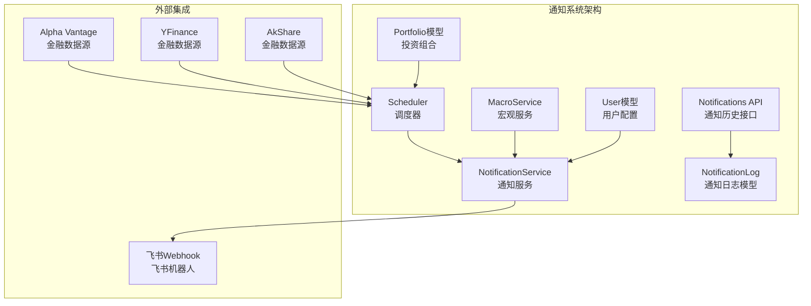
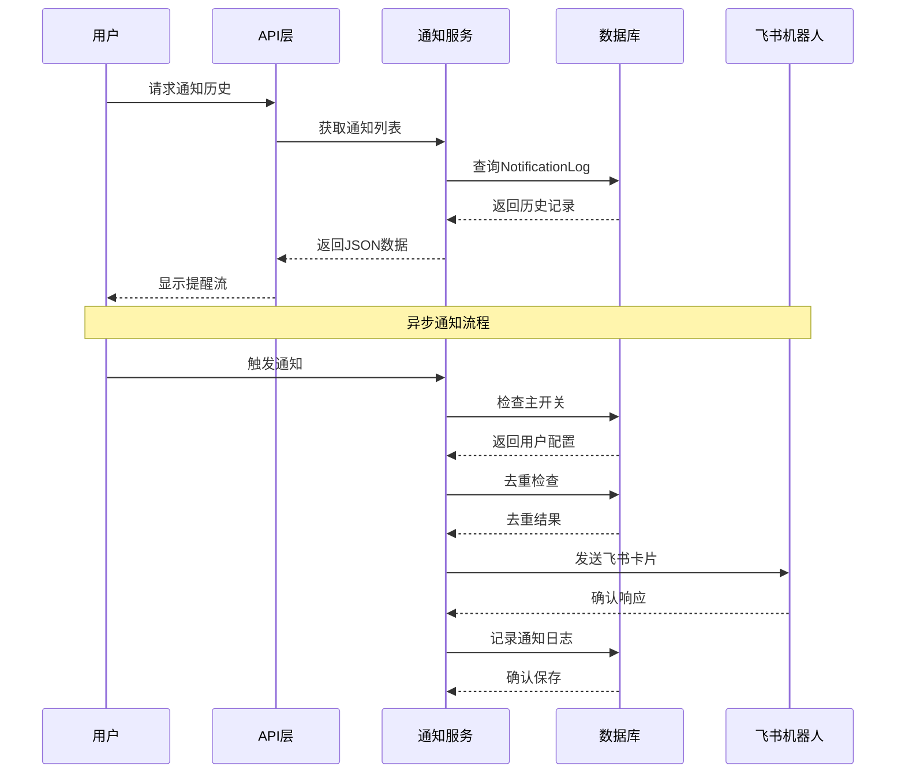
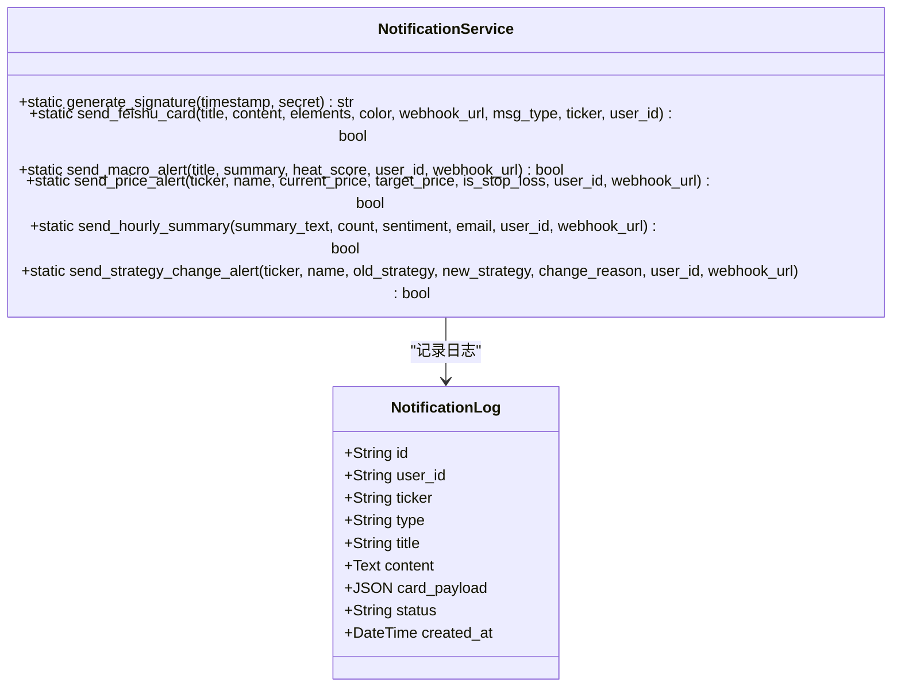
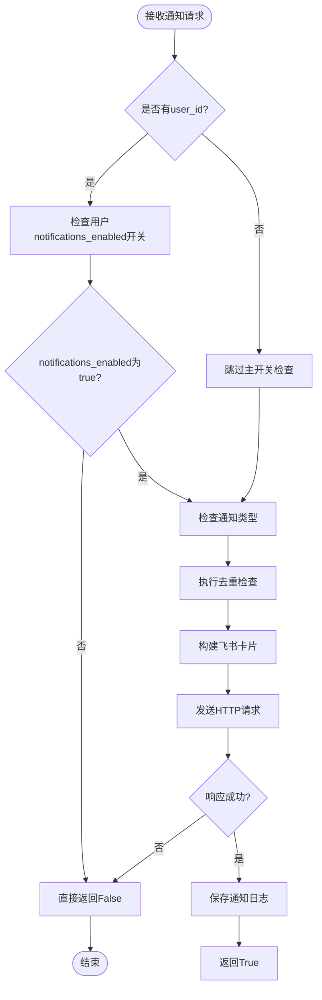
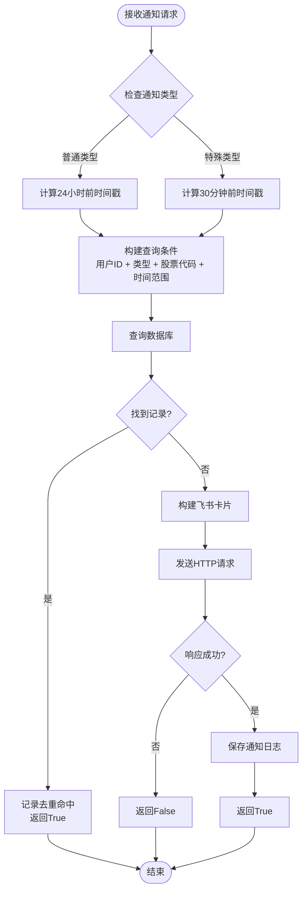
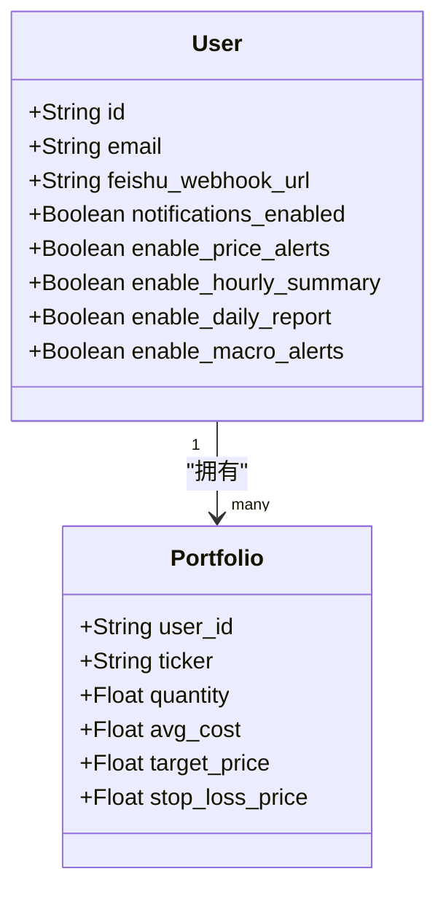
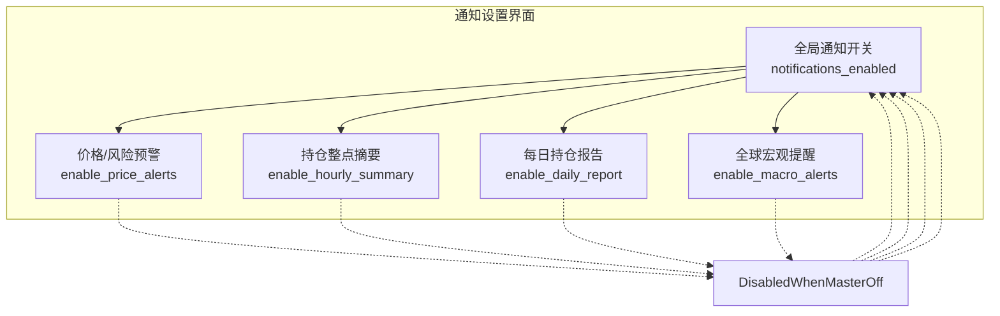
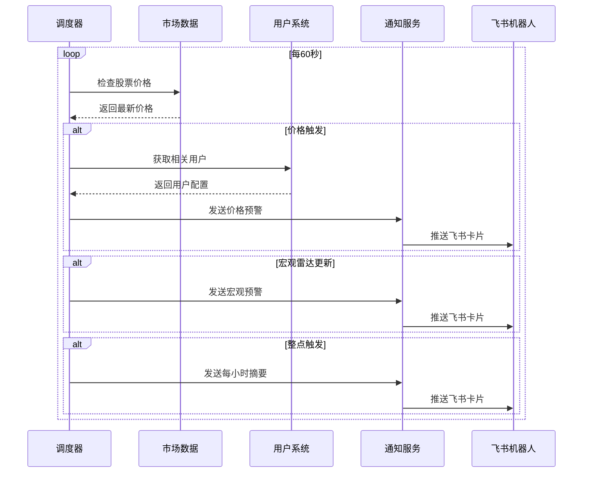
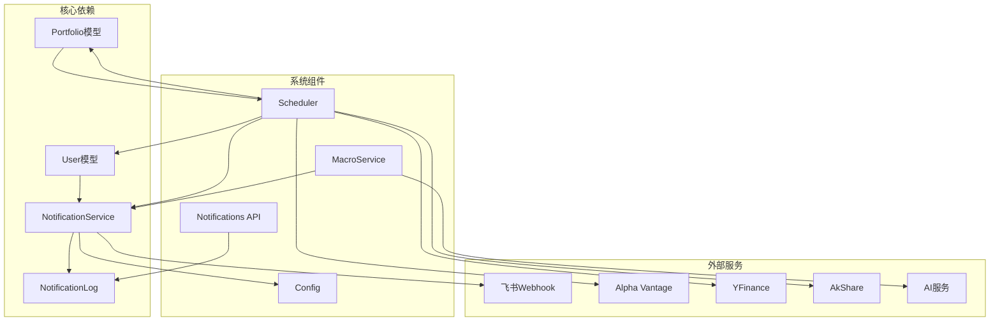

# 通知系统

<cite>
**本文档引用的文件**
- [backend/app/services/notification_service.py](file://backend/app/services/notification_service.py)
- [backend/app/models/user.py](file://backend/app/models/user.py)
- [backend/app/api/v1/endpoints/notifications.py](file://backend/app/api/v1/endpoints/notifications.py)
- [backend/app/api/v1/endpoints/user.py](file://backend/app/api/v1/endpoints/user.py)
- [backend/app/schemas/user_settings.py](file://backend/app/schemas/user_settings.py)
- [backend/migrations/versions/3e8869343958_add_notifications_enabled_to_user.py](file://backend/migrations/versions/3e8869343958_add_notifications_enabled_to_user.py)
- [frontend/app/settings/page.tsx](file://frontend/app/settings/page.tsx)
- [frontend/components/features/AlertStream.tsx](file://frontend/components/features/AlertStream.tsx)
- [frontend/features/notifications/api.ts](file://frontend/features/notifications/api.ts)
- [backend/app/models/notification.py](file://backend/app/models/notification.py)
- [backend/app/services/scheduler.py](file://backend/app/services/scheduler.py)
- [backend/app/services/macro_service.py](file://backend/app/services/macro_service.py)
- [backend/app/models/portfolio.py](file://backend/app/models/portfolio.py)
- [backend/app/api/v1/api.py](file://backend/app/api/v1/api.py)
- [backend/app/core/config.py](file://backend/app/core/config.py)
- [backend/app/main.py](file://backend/app/main.py)
</cite>

## 更新摘要
**变更内容**
- 新增全局通知主开关 notifications_enabled 功能
- 新增细粒度通知控制选项（价格预警、每小时摘要、每日报告、宏观提醒）
- 前端设置界面支持通知偏好管理
- 后端实现主开关检查和去重机制优化
- 数据库迁移支持通知开关字段

## 目录
1. [简介](#简介)
2. [项目结构](#项目结构)
3. [核心组件](#核心组件)
4. [架构概览](#架构概览)
5. [详细组件分析](#详细组件分析)
6. [依赖关系分析](#依赖关系分析)
7. [性能考虑](#性能考虑)
8. [故障排除指南](#故障排除指南)
9. [结论](#结论)

## 简介

通知系统是AI智能投资顾问后端的重要组成部分，负责通过飞书机器人向用户推送各类投资相关的通知和提醒。该系统实现了多种类型的告警通知，包括价格预警、宏观雷达预警、每日报告、每小时新闻摘要等，为用户提供及时的投资决策支持。

**重大更新**：系统现已引入全局通知主开关和细粒度通知控制功能，用户可以完全控制通知的接收和偏好设置。

系统采用异步设计，支持24小时去重机制，确保用户不会收到重复的通知。同时集成了丰富的通知模板和颜色编码，提供直观的视觉反馈。

## 项目结构

通知系统在项目中的组织结构如下：

**图表来源**
- [backend/app/services/notification_service.py:14-423](file://backend/app/services/notification_service.py#L14-L423)
- [backend/app/models/user.py:67-72](file://backend/app/models/user.py#L67-L72)

**章节来源**
- [backend/app/services/notification_service.py:1-423](file://backend/app/services/notification_service.py#L1-L423)
- [backend/app/models/user.py:1-80](file://backend/app/models/user.py#L1-L80)

## 核心组件

通知系统由以下几个核心组件构成：

### 1. NotificationService (通知服务)
- **职责**: 负责所有通知推送的核心逻辑
- **功能**: 飞书卡片消息发送、去重机制、多种通知类型支持
- **特性**: 异步处理、签名验证、颜色编码、模板化消息、主开关检查

### 2. NotificationLog (通知日志)
- **职责**: 持久化通知历史记录
- **字段**: 用户ID、股票代码、通知类型、标题、内容、状态等
- **用途**: 前端"提醒流"展示、通知去重、审计跟踪

### 3. Scheduler (调度器)
- **职责**: 后台任务调度和通知触发
- **功能**: 定时任务、价格监控、宏观雷达、每日报告等
- **特性**: 多任务协调、时间窗口控制、并发处理

### 4. 用户配置系统
- **职责**: 管理用户的通知偏好设置
- **功能**: 全局通知开关、价格预警、宏观预警、每日报告、每小时摘要等开关
- **特性**: 细粒度控制、个性化推送、主开关保护

**章节来源**
- [backend/app/services/notification_service.py:14-423](file://backend/app/services/notification_service.py#L14-L423)
- [backend/app/models/user.py:67-72](file://backend/app/models/user.py#L67-L72)
- [backend/app/services/scheduler.py:566-643](file://backend/app/services/scheduler.py#L566-L643)
- [frontend/app/settings/page.tsx:715-751](file://frontend/app/settings/page.tsx#L715-L751)

## 架构概览

通知系统的整体架构采用分层设计，实现了松耦合和高内聚：

**图表来源**
- [backend/app/api/v1/endpoints/notifications.py:25-36](file://backend/app/api/v1/endpoints/notifications.py#L25-L36)
- [backend/app/services/notification_service.py:28-140](file://backend/app/services/notification_service.py#L28-L140)

系统采用以下设计原则：

1. **异步处理**: 所有网络请求都采用异步方式，避免阻塞主线程
2. **主开关保护**: 首先检查全局通知开关，防止不必要的数据库查询
3. **去重机制**: 24小时去重和特殊类型的30分钟去重，防止重复推送
4. **容错设计**: 数据库故障不影响通知发送，仅记录警告日志
5. **模板化**: 统一的消息模板和颜色编码，提供一致的用户体验

## 详细组件分析

### NotificationService 类分析

**图表来源**
- [backend/app/services/notification_service.py:14-423](file://backend/app/services/notification_service.py#L14-L423)
- [backend/app/models/notification.py:6-23](file://backend/app/models/notification.py#L6-L23)

#### 主开关检查机制

**更新**：通知系统现在实现了智能的主开关检查机制：

**图表来源**
- [backend/app/services/notification_service.py:48-57](file://backend/app/services/notification_service.py#L48-L57)
- [backend/app/services/notification_service.py:61-86](file://backend/app/services/notification_service.py#L61-L86)

#### 去重机制设计

通知系统实现了智能的去重机制：

**图表来源**
- [backend/app/services/notification_service.py:61-86](file://backend/app/services/notification_service.py#L61-L86)
- [backend/app/services/notification_service.py:115-140](file://backend/app/services/notification_service.py#L115-L140)

#### 通知类型分类

系统支持多种通知类型，每种都有特定的触发条件和显示样式：

| 通知类型 | 触发条件 | 颜色编码 | 去重策略 |
|---------|---------|---------|---------|
| MACRO_ALERT | 宏观热点热度≥90 | 红/橙 | 24小时 |
| MACRO_SUMMARY | 每小时扫描汇总 | 蓝 | 30分钟 |
| PRICE_ALERT | 价格触及目标/止损 | 绿/红 | 24小时 |
| HOURLY_NEWS_SUMMARY | 每小时新闻摘要 | 蓝 | 30分钟 |
| STRATEGY_CHANGE | 策略重大调整 | 橙/红 | 24小时 |
| DAILY_REPORT | 每日持仓报告 | 蓝 | 24小时 |

**章节来源**
- [backend/app/services/notification_service.py:142-423](file://backend/app/services/notification_service.py#L142-L423)

### 用户配置系统

**更新**：用户配置系统现已支持全局通知主开关和细粒度控制：

**图表来源**
- [backend/app/models/user.py:67-72](file://backend/app/models/user.py#L67-L72)
- [backend/app/models/portfolio.py:9-35](file://backend/app/models/portfolio.py#L9-L35)

#### 通知偏好设置界面

**新增**：前端提供了完整的通知偏好管理界面：

**图表来源**
- [frontend/app/settings/page.tsx:715-751](file://frontend/app/settings/page.tsx#L715-L751)

**章节来源**
- [backend/app/models/user.py:67-72](file://backend/app/models/user.py#L67-L72)
- [backend/app/models/portfolio.py:16-25](file://backend/app/models/portfolio.py#L16-L25)
- [frontend/app/settings/page.tsx:715-751](file://frontend/app/settings/page.tsx#L715-L751)

### 调度器集成分析

调度器负责触发各种定时通知任务：

**图表来源**
- [backend/app/services/scheduler.py:578-642](file://backend/app/services/scheduler.py#L578-L642)
- [backend/app/services/scheduler.py:215-288](file://backend/app/services/scheduler.py#L215-L288)

**章节来源**
- [backend/app/services/scheduler.py:161-214](file://backend/app/services/scheduler.py#L161-L214)
- [backend/app/services/scheduler.py:294-356](file://backend/app/services/scheduler.py#L294-L356)

## 依赖关系分析

通知系统与其他组件的依赖关系如下：

**图表来源**
- [backend/app/services/notification_service.py:10-12](file://backend/app/services/notification_service.py#L10-L12)
- [backend/app/services/scheduler.py:11-12](file://backend/app/services/scheduler.py#L11-L12)

### 关键依赖链

1. **配置依赖**: NotificationService → Config → 飞书Webhook配置
2. **数据依赖**: Scheduler → User/Portfolio → 通知触发条件
3. **外部依赖**: MacroService → Alpha Vantage/YFinance/AkShare → 市场数据
4. **存储依赖**: NotificationService → NotificationLog → 数据持久化

**章节来源**
- [backend/app/core/config.py:22-23](file://backend/app/core/config.py#L22-L23)
- [backend/app/services/scheduler.py:220-239](file://backend/app/services/scheduler.py#L220-L239)

## 性能考虑

通知系统在设计时充分考虑了性能优化：

### 主开关优化
**新增**：通过全局通知主开关减少不必要的数据库查询：
- 在有user_id的情况下首先检查notifications_enabled
- 如果主开关关闭，直接返回False，避免数据库查询
- 提升系统整体性能，减少无效负载

### 异步处理优化
- 所有HTTP请求采用异步方式，避免阻塞事件循环
- 使用连接池和超时控制，提高网络请求效率
- 并发任务限制，防止过度消耗系统资源

### 缓存和去重机制
- 数据库查询缓存，减少重复查询
- 智能去重算法，避免重复通知
- 24小时和30分钟双重去重策略

### 资源管理
- 连接池管理，避免频繁建立连接
- 任务调度优化，合理分配系统负载
- 错误处理和重试机制，提高系统稳定性

## 故障排除指南

### 常见问题及解决方案

#### 1. 通知无法发送
**症状**: 飞书机器人无响应
**排查步骤**:
1. 检查飞书Webhook URL配置
2. 验证网络连接和防火墙设置
3. 查看系统日志中的错误信息

**解决方案**:
- 确保FEISHU_WEBHOOK_URL配置正确
- 检查飞书机器人的权限设置
- 验证网络代理配置

#### 2. 主开关失效问题
**症状**: 全局通知开关无法生效
**排查步骤**:
1. 检查数据库中notifications_enabled字段
2. 验证用户配置是否正确保存
3. 查看NotificationService中的主开关检查逻辑

**解决方案**:
- 确保数据库迁移已完成
- 检查User模型中的notifications_enabled字段
- 验证NotificationService的主开关检查逻辑

#### 3. 重复通知问题
**症状**: 用户收到相同通知多次
**排查步骤**:
1. 检查NotificationLog表中的重复记录
2. 验证去重机制是否正常工作
3. 检查时间戳和阈值设置

**解决方案**:
- 调整去重阈值设置
- 清理历史重复记录
- 检查系统时间同步

#### 4. 性能问题
**症状**: 通知延迟或系统响应缓慢
**排查步骤**:
1. 监控数据库查询性能
2. 检查网络请求延迟
3. 分析系统资源使用情况

**解决方案**:
- 优化数据库索引
- 调整并发限制
- 升级服务器资源配置

**章节来源**
- [backend/app/services/notification_service.py:48-57](file://backend/app/services/notification_service.py#L48-L57)
- [backend/app/services/notification_service.py:84-86](file://backend/app/services/notification_service.py#L84-L86)

## 结论

通知系统作为AI智能投资顾问的核心功能模块，实现了完整的投资通知生态。系统具有以下特点：

1. **完整性**: 支持多种通知类型，覆盖投资决策的各个场景
2. **可靠性**: 异步设计、去重机制、容错处理确保系统稳定运行
3. **可扩展性**: 模块化设计便于功能扩展和维护
4. **用户体验**: 智能的颜色编码、模板化消息提供直观的视觉反馈
5. **控制性**: 全局主开关和细粒度控制满足不同用户需求

**重大更新**：通过引入notifications_enabled主开关和细粒度通知控制选项，系统现在提供了更强大的用户控制能力，用户可以完全掌控通知的接收和偏好设置。

通过合理的架构设计和性能优化，通知系统能够为用户提供及时、准确的投资提醒，成为AI投资顾问的重要组成部分。未来可以进一步增强个性化推荐、多渠道通知支持等功能，为用户提供更加丰富的投资体验。