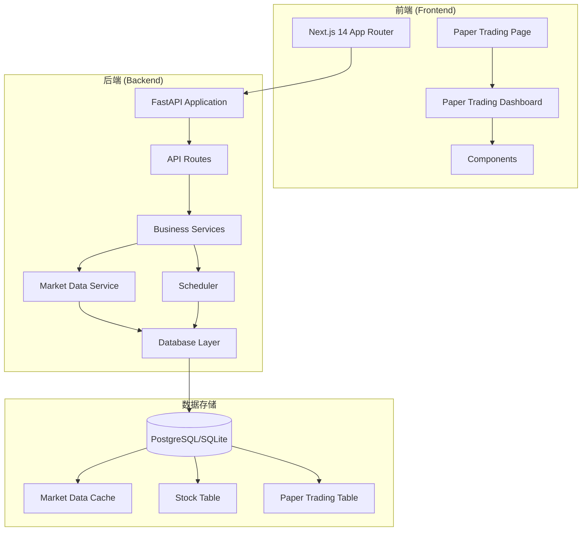
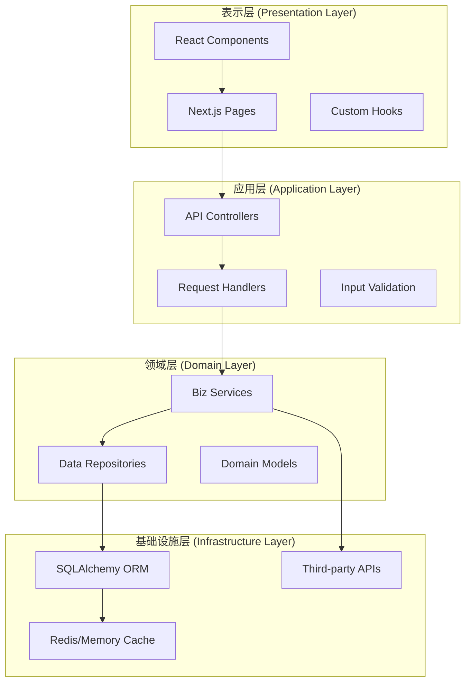
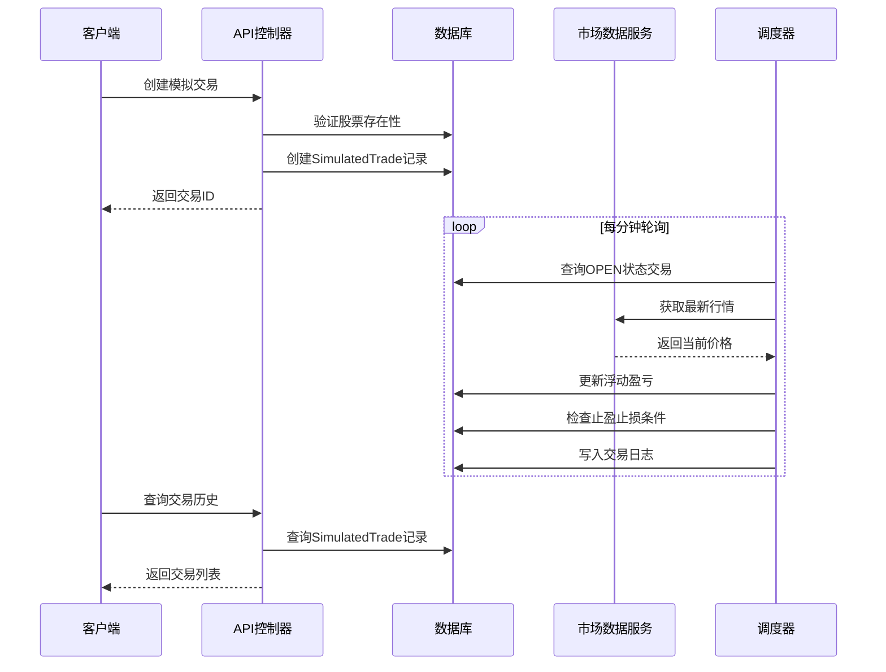
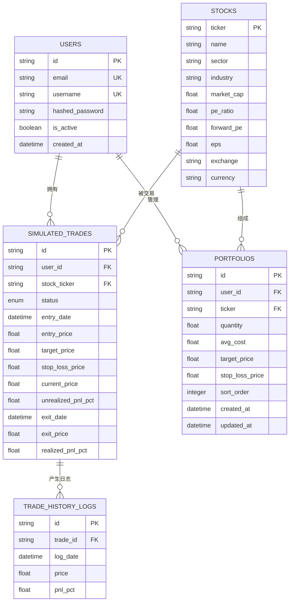
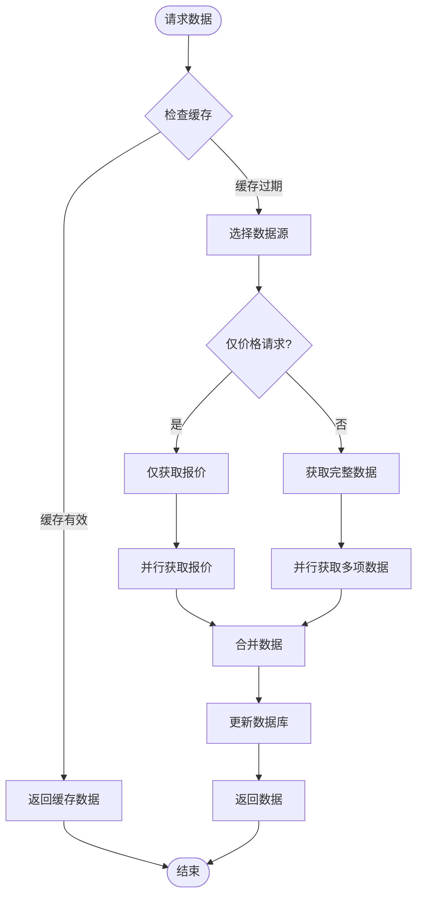
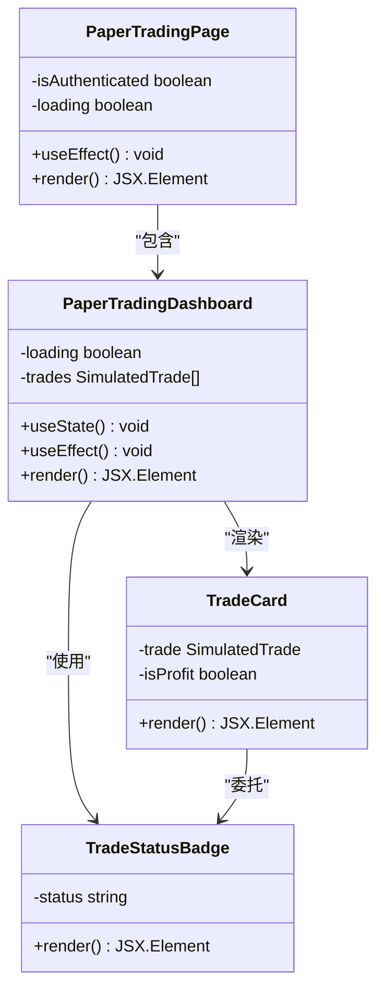
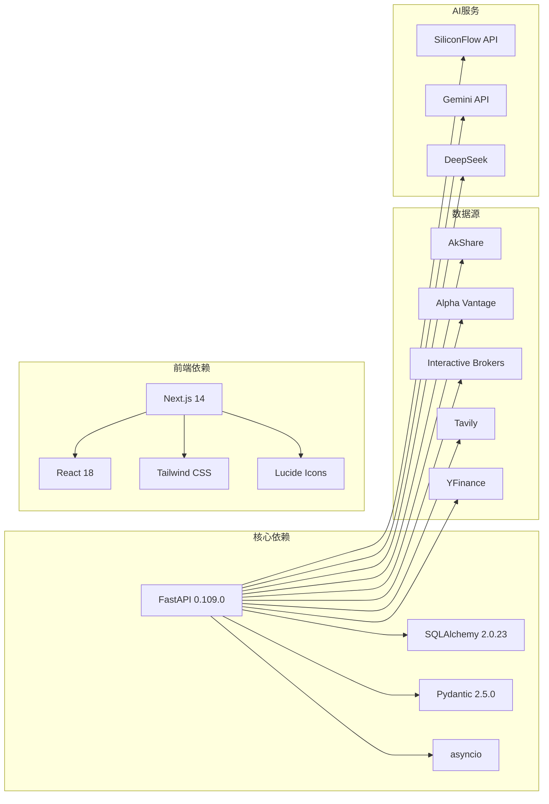

# 纸交易系统

<cite>
**本文档引用的文件**
- [backend/app/main.py](file://backend/app/main.py)
- [backend/app/api/v1/api.py](file://backend/app/api/v1/api.py)
- [backend/app/api/v1/endpoints/paper_trading.py](file://backend/app/api/v1/endpoints/paper_trading.py)
- [backend/app/models/trade.py](file://backend/app/models/trade.py)
- [backend/app/models/stock.py](file://backend/app/models/stock.py)
- [backend/app/models/portfolio.py](file://backend/app/models/portfolio.py)
- [backend/app/schemas/portfolio.py](file://backend/app/schemas/portfolio.py)
- [backend/app/schemas/market_data.py](file://backend/app/schemas/market_data.py)
- [backend/app/core/database.py](file://backend/app/core/database.py)
- [backend/app/core/config.py](file://backend/app/core/config.py)
- [backend/app/services/market_data.py](file://backend/app/services/market_data.py)
- [backend/app/services/scheduler.py](file://backend/app/services/scheduler.py)
- [frontend/app/paper-trading/page.tsx](file://frontend/app/paper-trading/page.tsx)
- [frontend/components/features/paper-trading/PaperTradingDashboard.tsx](file://frontend/components/features/paper-trading/PaperTradingDashboard.tsx)
- [README.md](file://README.md)
</cite>

## 目录
1. [简介](#简介)
2. [项目结构](#项目结构)
3. [核心组件](#核心组件)
4. [架构概览](#架构概览)
5. [详细组件分析](#详细组件分析)
6. [依赖分析](#依赖分析)
7. [性能考虑](#性能考虑)
8. [故障排除指南](#故障排除指南)
9. [结论](#结论)
10. [附录](#附录)

## 简介
本项目是一个基于 FastAPI 和 Next.js 的智能投资助手后端系统，专注于纸交易（模拟交易）功能。系统集成了多源数据获取、AI 分析能力、实时行情监控和通知推送等功能，为用户提供完整的量化决策辅助体验。

系统的核心特色包括：
- **精准量化可视化**：采用决策价位锚定坐标系，摒弃常规等分刻度
- **全球宏观热点雷达**：5小时自动巡检，支持飞书BOT集成推送
- **AI信号复盘系统**：真实胜率追踪，实时P&L统计
- **可解释性AI**：端到端逻辑溯源，交互式验证

## 项目结构
项目采用前后端分离架构，后端使用FastAPI构建RESTful API，前端使用Next.js 14 (App Router)开发用户界面。

**图表来源**
- [backend/app/main.py:1-146](file://backend/app/main.py#L1-L146)
- [backend/app/api/v1/api.py:1-33](file://backend/app/api/v1/api.py#L1-L33)

**章节来源**
- [README.md:1-98](file://README.md#L1-L98)
- [backend/app/main.py:1-146](file://backend/app/main.py#L1-L146)

## 核心组件
系统的核心组件包括：

### 1. 纸交易模块
- **SimulatedTrade模型**：管理模拟交易的生命周期
- **TradeHistoryLog模型**：记录每日价格追踪
- **Paper Trading API**：提供创建和查询模拟交易的功能

### 2. 市场数据模块
- **MarketDataService**：核心数据获取和缓存服务
- **多数据源支持**：AkShare、AlphaVantage、IBKR、Tavily、YFinance
- **实时行情缓存**：优化数据访问性能

### 3. 调度系统
- **后台任务调度**：定时刷新数据、生成报告、推送通知
- **多市场时区管理**：支持A股、港股、美股的时区差异
- **智能风控**：价格触点检测和止损机制

### 4. 前端界面
- **Paper Trading Dashboard**：实时追踪AI决策
- **响应式设计**：支持多种设备访问
- **数据可视化**：直观展示交易状态和收益情况

**章节来源**
- [backend/app/models/trade.py:1-68](file://backend/app/models/trade.py#L1-L68)
- [backend/app/api/v1/endpoints/paper_trading.py:1-78](file://backend/app/api/v1/endpoints/paper_trading.py#L1-L78)
- [backend/app/services/market_data.py:1-407](file://backend/app/services/market_data.py#L1-L407)
- [backend/app/services/scheduler.py:1-643](file://backend/app/services/scheduler.py#L1-L643)

## 架构概览
系统采用分层架构设计，确保各组件职责清晰、耦合度低。

**图表来源**
- [backend/app/main.py:27-146](file://backend/app/main.py#L27-L146)
- [backend/app/api/v1/api.py:1-33](file://backend/app/api/v1/api.py#L1-L33)

## 详细组件分析

### 纸交易系统核心流程
纸交易系统的核心业务流程包括交易创建、实时监控和历史记录管理。

**图表来源**
- [backend/app/api/v1/endpoints/paper_trading.py:17-78](file://backend/app/api/v1/endpoints/paper_trading.py#L17-L78)
- [backend/app/services/scheduler.py:16-98](file://backend/app/services/scheduler.py#L16-L98)

### 数据模型关系
系统采用关系型数据库设计，通过外键约束保证数据完整性。

**图表来源**
- [backend/app/models/trade.py:14-68](file://backend/app/models/trade.py#L14-L68)
- [backend/app/models/stock.py:22-124](file://backend/app/models/stock.py#L22-L124)
- [backend/app/models/portfolio.py:9-35](file://backend/app/models/portfolio.py#L9-L35)

### 市场数据服务架构
市场数据服务采用多数据源聚合和智能缓存策略。

**图表来源**
- [backend/app/services/market_data.py:21-66](file://backend/app/services/market_data.py#L21-L66)
- [backend/app/services/market_data.py:68-227](file://backend/app/services/market_data.py#L68-L227)

**章节来源**
- [backend/app/models/trade.py:1-68](file://backend/app/models/trade.py#L1-L68)
- [backend/app/models/stock.py:1-124](file://backend/app/models/stock.py#L1-L124)
- [backend/app/schemas/portfolio.py:1-86](file://backend/app/schemas/portfolio.py#L1-L86)

### 前端界面组件
前端采用模块化组件设计，提供丰富的用户体验。

**图表来源**
- [frontend/app/paper-trading/page.tsx:10-54](file://frontend/app/paper-trading/page.tsx#L10-L54)
- [frontend/components/features/paper-trading/PaperTradingDashboard.tsx:8-228](file://frontend/components/features/paper-trading/PaperTradingDashboard.tsx#L8-L228)

**章节来源**
- [frontend/app/paper-trading/page.tsx:1-54](file://frontend/app/paper-trading/page.tsx#L1-L54)
- [frontend/components/features/paper-trading/PaperTradingDashboard.tsx:1-228](file://frontend/components/features/paper-trading/PaperTradingDashboard.tsx#L1-L228)

## 依赖分析
系统的关键依赖关系如下：

**图表来源**
- [backend/app/core/config.py:4-36](file://backend/app/core/config.py#L4-L36)
- [README.md:58-63](file://README.md#L58-L63)

**章节来源**
- [backend/app/core/config.py:1-36](file://backend/app/core/config.py#L1-L36)
- [backend/app/core/database.py:1-69](file://backend/app/core/database.py#L1-L69)

## 性能考虑
系统在多个层面进行了性能优化：

### 1. 数据缓存策略
- **智能缓存失效**：1分钟内有效，支持价格-only模式
- **批量数据库操作**：使用UPSERT减少查询次数
- **WAL模式优化**：SQLite使用预写日志提升并发性能

### 2. 异步处理
- **并发数据获取**：使用asyncio.gather并行获取多源数据
- **后台任务调度**：1分钟精度的轮询机制
- **信号量控制**：限制并发请求数量防止API限流

### 3. 前端优化
- **懒加载组件**：按需加载Paper Trading组件
- **状态管理**：使用React hooks优化渲染性能
- **响应式设计**：适配不同屏幕尺寸

## 故障排除指南
常见问题及解决方案：

### 1. 数据获取失败
**症状**：API返回缓存数据而非实时数据
**原因**：第三方API限流或网络问题
**解决方案**：
- 检查API密钥配置
- 查看日志中的错误信息
- 确认网络连接状态

### 2. 模拟交易无法创建
**症状**：创建交易时报"股票不存在"
**原因**：股票代码未在数据库中
**解决方案**：
- 先调用股票搜索接口
- 确认股票代码格式正确
- 检查数据库连接

### 3. 前端页面空白
**症状**：Paper Trading页面显示空白
**原因**：认证状态异常
**解决方案**：
- 检查本地存储的token
- 确认用户已登录
- 查看浏览器控制台错误

**章节来源**
- [backend/app/main.py:33-47](file://backend/app/main.py#L33-L47)
- [backend/app/api/v1/endpoints/paper_trading.py:37-38](file://backend/app/api/v1/endpoints/paper_trading.py#L37-L38)

## 结论
纸交易系统是一个功能完整、架构清晰的量化投资辅助平台。系统通过以下关键特性提供了优秀的用户体验：

1. **实时性**：1分钟精度的数据刷新和交易监控
2. **可靠性**：多数据源备份和智能缓存机制
3. **可扩展性**：模块化设计支持功能扩展
4. **易用性**：直观的界面设计和响应式布局

系统特别适合量化投资者进行策略验证和风险控制，通过AI驱动的决策支持帮助用户做出更明智的投资选择。

## 附录

### API端点说明
- **POST /api/paper-trading/**：创建模拟交易
- **GET /api/paper-trading/**：获取交易历史
- **GET /api/health**：健康检查

### 配置选项
- **DATABASE_URL**：数据库连接字符串
- **SECRET_KEY**：JWT加密密钥
- **ALLOWED_ORIGINS**：CORS允许的域名列表
- **FEISHU_WEBHOOK_URL**：飞书机器人Webhook地址

### 数据库迁移
系统使用Alembic进行数据库版本管理，支持自动表结构同步和数据迁移。