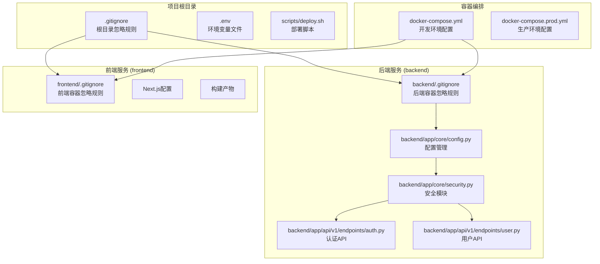
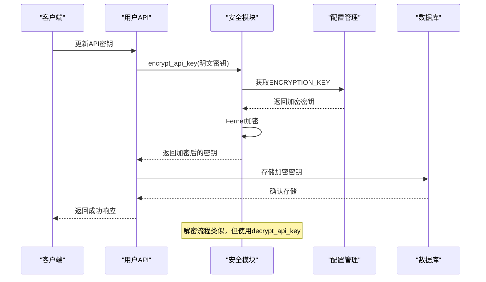
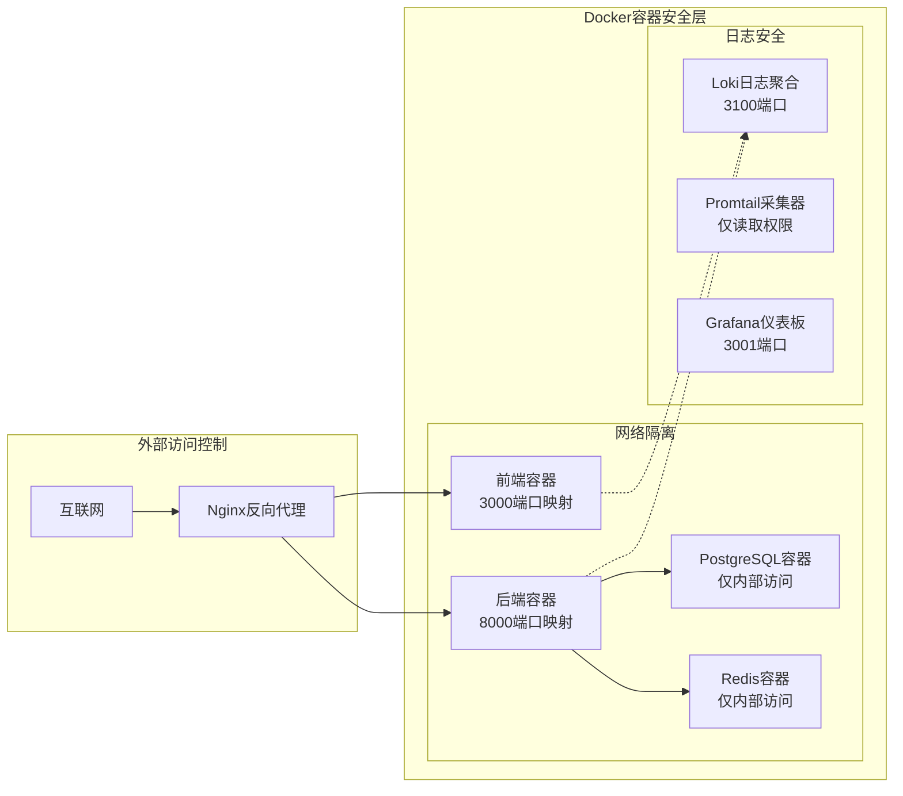
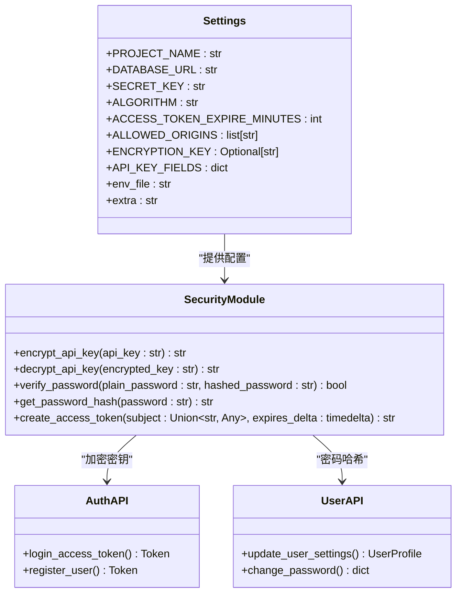
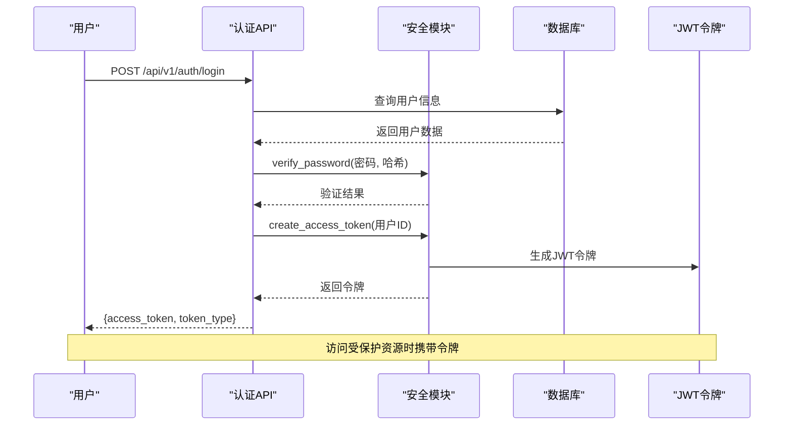
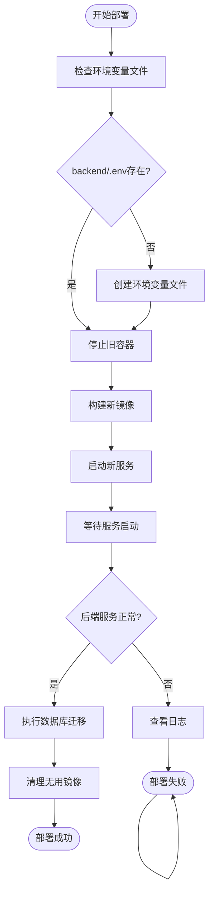

# .gitignore安全规则

<cite>
**本文档引用的文件**
- [.gitignore](file://.gitignore)
- [frontend/.gitignore](file://frontend/.gitignore)
- [backend/.dockerignore](file://backend/.dockerignore)
- [frontend/.dockerignore](file://frontend/.dockerignore)
- [backend/app/core/security.py](file://backend/app/core/security.py)
- [backend/app/core/config.py](file://backend/app/core/config.py)
- [backend/app/api/v1/endpoints/auth.py](file://backend/app/api/v1/endpoints/auth.py)
- [backend/app/api/v1/endpoints/user.py](file://backend/app/api/v1/endpoints/user.py)
- [docker-compose.yml](file://docker-compose.yml)
- [docker-compose.prod.yml](file://docker-compose.prod.yml)
- [scripts/deploy.sh](file://scripts/deploy.sh)
</cite>

## 目录
1. [简介](#简介)
2. [项目结构概览](#项目结构概览)
3. [.gitignore核心规则分析](#gitignore核心规则分析)
4. [安全配置与密钥管理](#安全配置与密钥管理)
5. [Docker容器安全规则](#docker容器安全规则)
6. [环境变量与敏感信息保护](#环境变量与敏感信息保护)
7. [API安全实现](#api安全实现)
8. [部署安全策略](#部署安全策略)
9. [安全最佳实践建议](#安全最佳实践建议)
10. [总结](#总结)

## 简介

本文档深入分析了AI智能投资顾问项目的.gitignore安全规则体系，这是一个基于FastAPI和Next.js构建的全栈应用。项目采用了多层次的安全防护机制，包括文件系统级别的忽略规则、容器化的安全隔离、API认证授权机制以及环境变量管理等。

该系统集成了多种AI模型提供商（如Gemini、DeepSeek、SiliconFlow等），因此对API密钥的保护尤为重要。通过分析.gitignore文件及其相关配置，我们可以了解项目如何防止敏感信息意外泄露，同时保持开发效率。

## 项目结构概览

**图表来源**
- [.gitignore:1-65](file://.gitignore#L1-L65)
- [backend/.dockerignore:1-13](file://backend/.dockerignore#L1-L13)
- [frontend/.dockerignore:1-13](file://frontend/.dockerignore#L1-L13)

## .gitignore核心规则分析

### 根目录.gitignore规则

项目根目录的.gitignore文件包含了全面的忽略规则，主要分为以下几个方面：

#### Python开发环境规则
- **字节码文件**: `__pycache__/`, `*.py[cod]`, `$py.class`
- **打包文件**: `*.egg-info/`, `*.egg`, `dist/`, `build/`
- **虚拟环境**: `.venv/`, `venv/`, `env/`, `ENV/`
- **临时文件**: `.pytest_cache`, `.DS_Store`

#### Node.js开发环境规则
- **依赖管理**: `/node_modules`, `.pnp/`, `.yarn/*`
- **构建产物**: `/out/`, `/build/`, `.next/`
- **调试文件**: `npm-debug.log*`, `yarn-debug.log*`

#### IDE配置文件
- **IntelliJ IDEA**: `.idea/`
- **VS Code**: `.vscode/`

#### 数据库文件
- **SQLite文件**: `*.db`, `*.sqlite3`

#### 环境变量文件
- **敏感配置**: `.env`, `.env.local`

#### 测试脚本
- **测试工具**: `backend/test_*.py`, `backend/reset_password.py`, `backend/seed_stocks.py`

#### 个人文件
- **简历文件**: `backend/resume/`

**章节来源**
- [.gitignore:1-65](file://.gitignore#L1-L65)

### 前端.gitignore规则

前端目录的.gitignore规则更加精细，主要针对Next.js框架的特点：

#### 依赖管理
- **Yarn包管理**: `/node_modules`, `.pnp/`, `.yarn/*`
- **排除特定文件**: `!.yarn/patches`, `!.yarn/plugins`

#### 构建产物
- **Next.js构建**: `/out/`, `/build`, `/.next/`
- **TypeScript缓存**: `*.tsbuildinfo`, `next-env.d.ts`

#### 环境变量
- **环境文件**: `.env*`（可选择性提交）

#### 调试文件
- **日志文件**: `*.log*`

**章节来源**
- [frontend/.gitignore:1-42](file://frontend/.gitignore#L1-L42)

## 安全配置与密钥管理

### 加密机制实现

项目实现了多层次的API密钥保护机制：

**图表来源**
- [backend/app/core/security.py:11-28](file://backend/app/core/security.py#L11-L28)
- [backend/app/api/v1/endpoints/user.py:125-132](file://backend/app/api/v1/endpoints/user.py#L125-L132)

### 密钥管理流程

#### 加密存储流程
1. **接收明文密钥**: 用户通过API提交原始API密钥
2. **验证加密密钥**: 检查系统是否配置了主加密密钥
3. **执行加密算法**: 使用Fernet对称加密算法
4. **存储加密结果**: 将加密后的密钥保存到数据库
5. **返回确认**: 向客户端返回操作成功状态

#### 解密使用流程
1. **查询存储密钥**: 从数据库获取加密的API密钥
2. **执行解密算法**: 使用相同的Fernet密钥进行解密
3. **错误处理**: 如果解密失败，返回原始密钥或抛出异常
4. **安全传输**: 在内存中使用解密后的密钥，避免再次存储

**章节来源**
- [backend/app/core/security.py:11-28](file://backend/app/core/security.py#L11-L28)
- [backend/app/api/v1/endpoints/user.py:125-132](file://backend/app/api/v1/endpoints/user.py#L125-L132)

## Docker容器安全规则

### 容器级忽略规则

Docker容器环境下的忽略规则更加严格，确保容器内部不会包含敏感文件：

#### 后端容器忽略规则
- **Python缓存**: `__pycache__`, `*.py[cod]`, `$py.class`
- **虚拟环境**: `.venv`, `venv`, `ENV`, `env`
- **测试缓存**: `.pytest_cache`
- **系统文件**: `.DS_Store`, `app.log`
- **数据库文件**: `ai_advisor.db`

#### 前端容器忽略规则
- **Node模块**: `node_modules`
- **构建输出**: `.next`, `out`, `build`
- **环境文件**: `.env.local`, `.env.development.local`
- **调试日志**: `*.log*`

### 容器安全架构

**图表来源**
- [docker-compose.yml:7-44](file://docker-compose.yml#L7-L44)
- [docker-compose.prod.yml:2-18](file://docker-compose.prod.yml#L2-L18)

**章节来源**
- [backend/.dockerignore:1-13](file://backend/.dockerignore#L1-L13)
- [frontend/.dockerignore:1-13](file://frontend/.dockerignore#L1-L13)
- [docker-compose.yml:7-44](file://docker-compose.yml#L7-L44)

## 环境变量与敏感信息保护

### 配置管理架构

项目采用分层的配置管理策略：

**图表来源**
- [backend/app/core/config.py:4-37](file://backend/app/core/config.py#L4-L37)
- [backend/app/core/security.py:1-65](file://backend/app/core/security.py#L1-L65)

### 敏感信息处理策略

#### 环境变量管理
- **数据库连接**: `DATABASE_URL`支持SQLite和PostgreSQL
- **认证配置**: `SECRET_KEY`用于JWT令牌签名
- **API密钥**: 多个LLM提供商的API密钥字段
- **加密密钥**: `ENCRYPTION_KEY`用于本地密钥加密

#### 密钥轮换机制
- **动态加密**: 运行时根据环境变量决定是否启用加密
- **降级处理**: 当加密密钥缺失时，提供安全的降级方案
- **兼容性**: 支持新旧格式的密钥存储

**章节来源**
- [backend/app/core/config.py:4-37](file://backend/app/core/config.py#L4-L37)
- [backend/app/core/security.py:11-28](file://backend/app/core/security.py#L11-L28)

## API安全实现

### 认证与授权机制

**图表来源**
- [backend/app/api/v1/endpoints/auth.py:24-48](file://backend/app/api/v1/endpoints/auth.py#L24-L48)

### 安全中间件实现

项目实现了多层次的安全防护：

#### CORS配置
- **开发环境**: 允许本地开发域名访问
- **生产环境**: 支持动态配置允许的源
- **安全头**: 设置严格的跨域策略

#### 异常处理
- **全局异常捕获**: 捕获所有未处理异常
- **结构化错误响应**: 返回统一的错误格式
- **日志记录**: 记录详细的错误信息用于审计

#### 请求拦截
- **JWT解析**: 从Authorization头解析用户身份
- **访问日志**: 记录请求的详细信息
- **性能监控**: 记录请求处理时间

**章节来源**
- [backend/app/api/v1/endpoints/auth.py:24-48](file://backend/app/api/v1/endpoints/auth.py#L24-L48)
- [backend/app/main.py:35-112](file://backend/app/main.py#L35-L112)

## 部署安全策略

### 安全部署流程

**图表来源**
- [scripts/deploy.sh:8-48](file://scripts/deploy.sh#L8-L48)

### 生产环境安全配置

#### 容器资源限制
- **内存限制**: 后端800m，前端350m
- **CPU限制**: 后端1.0核，前端0.5核
- **进程限制**: PID数量限制防止资源滥用

#### 健康检查
- **HTTP健康检查**: 定期检查/health端点
- **重试机制**: 支持多次重试确保稳定性
- **启动延迟**: 配置合理的启动等待时间

#### 网络安全
- **端口映射**: 明确的服务端口映射
- **主机网络**: 支持host.docker.internal访问
- **外部访问**: 仅开放必要的服务端口

**章节来源**
- [docker-compose.prod.yml:1-39](file://docker-compose.prod.yml#L1-L39)
- [scripts/deploy.sh:1-62](file://scripts/deploy.sh#L1-L62)

## 安全最佳实践建议

### 文件系统安全

1. **定期审查.gitignore规则**
   - 确保没有遗漏新的敏感文件类型
   - 定期更新测试脚本和工具文件的忽略规则

2. **环境变量管理**
   - 使用不同的.env文件区分环境
   - 定期轮换API密钥和数据库密码
   - 实施最小权限原则

3. **代码审查**
   - 建立敏感信息检查清单
   - 使用自动化工具检测硬编码的密钥
   - 定期进行安全审计

### 容器安全

1. **镜像安全**
   - 使用官方基础镜像并及时更新
   - 实施镜像扫描和漏洞检测
   - 最小化容器内的文件数量

2. **网络隔离**
   - 使用Docker网络隔离不同服务
   - 配置防火墙规则限制不必要的端口
   - 实施服务发现和负载均衡

3. **存储安全**
   - 使用只读文件系统
   - 定期清理临时文件和缓存
   - 实施数据备份和恢复策略

### API安全

1. **认证授权**
   - 实施多因素认证
   - 定期轮换JWT密钥
   - 实施API速率限制

2. **输入验证**
   - 实施严格的输入验证和清理
   - 使用参数化查询防止SQL注入
   - 实施CORS白名单机制

3. **日志监控**
   - 实施结构化日志记录
   - 设置异常告警机制
   - 定期分析访问日志

## 总结

该项目的.gitignore安全规则体系体现了现代Web应用的安全最佳实践，通过多层次的防护机制确保敏感信息不被意外泄露：

### 核心安全特性

1. **文件系统隔离**: 通过.gitignore和.dockerignore确保开发环境和生产环境的文件隔离
2. **密钥加密存储**: 实现API密钥的加密存储和安全传输
3. **容器化安全**: 通过Docker实现网络和服务隔离
4. **API安全防护**: 实现完整的认证授权和访问控制机制
5. **部署安全策略**: 提供安全的CI/CD部署流程和监控机制

### 安全优势

- **零信任架构**: 默认拒绝所有访问，需要明确授权
- **最小权限原则**: 每个组件只拥有必要的权限
- **纵深防御**: 多层次的安全防护机制
- **可观测性**: 完善的日志记录和监控系统
- **合规性**: 符合行业标准的安全实践

### 持续改进方向

1. **自动化安全扫描**: 集成静态代码分析和依赖漏洞扫描
2. **安全培训**: 定期对开发团队进行安全意识培训
3. **渗透测试**: 定期进行安全渗透测试
4. **应急响应**: 建立完善的安全事件响应机制

通过这些综合性的安全措施，项目能够在保证开发效率的同时，有效防止敏感信息泄露，为用户提供安全可靠的投资顾问服务。