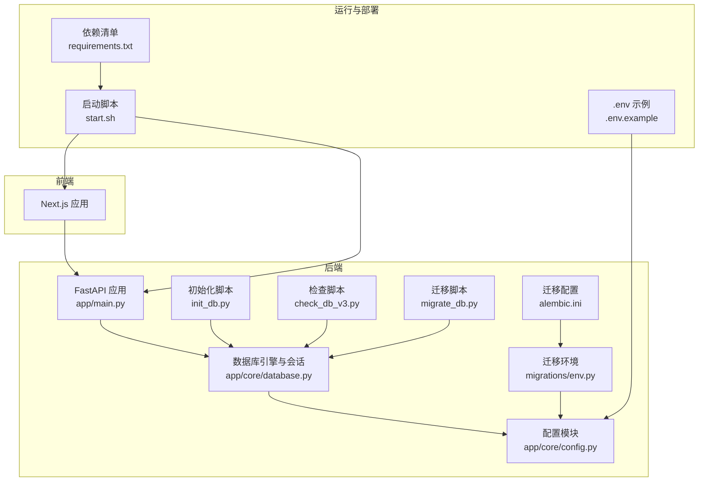
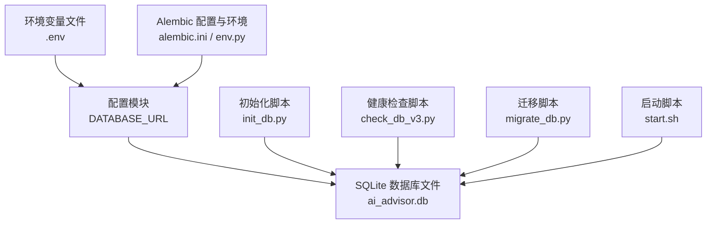
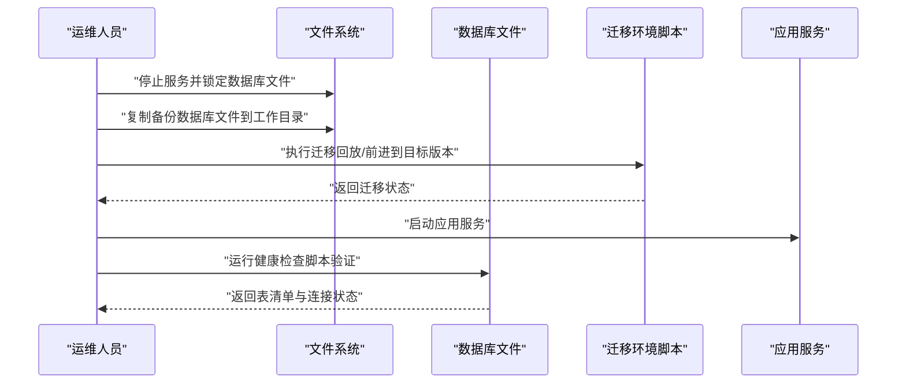
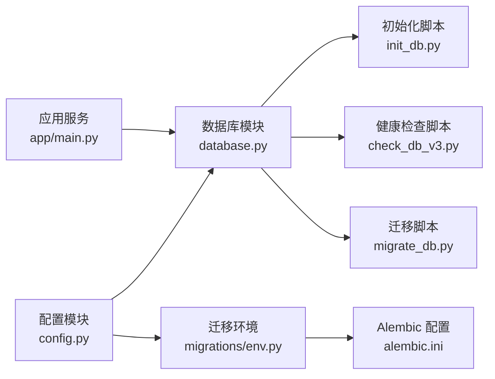

# 备份与灾难恢复

<cite>
**本文引用的文件**
- [backend/app/core/config.py](file://backend/app/core/config.py)
- [backend/app/core/database.py](file://backend/app/core/database.py)
- [backend/alembic.ini](file://backend/alembic.ini)
- [backend/migrations/env.py](file://backend/migrations/env.py)
- [backend/init_db.py](file://backend/init_db.py)
- [backend/check_db_v3.py](file://backend/check_db_v3.py)
- [backend/migrate_db.py](file://backend/migrate_db.py)
- [backend/app/main.py](file://backend/app/main.py)
- [.env.example](file://.env.example)
- [start.sh](file://start.sh)
- [backend/requirements.txt](file://backend/requirements.txt)
- [doc/Database Schema & Data Flow Specification.md](file://doc/Database Schema & Data Flow Specification.md)
- [doc/PRD.md](file://doc/PRD.md)
</cite>

## 目录
1. [简介](#简介)
2. [项目结构](#项目结构)
3. [核心组件](#核心组件)
4. [架构总览](#架构总览)
5. [详细组件分析](#详细组件分析)
6. [依赖分析](#依赖分析)
7. [性能考量](#性能考量)
8. [故障排查指南](#故障排查指南)
9. [结论](#结论)
10. [附录](#附录)

## 简介
本指南面向“AI智能投顾助手”项目的备份与灾难恢复，围绕数据库备份策略（全量与增量）、数据恢复流程（完整恢复与时间点恢复）、配置文件与版本管理、备份存储策略（本地与云）、灾备演练与测试、迁移与升级中的备份要求、备份验证与恢复测试、监控与告警、以及合规与数据保护等方面进行系统化说明。结合项目现有实现，明确SQLite数据库、Alembic迁移、环境变量与脚本等关键要素，给出可落地的操作步骤与最佳实践。

## 项目结构
项目采用前后端分离架构，后端使用FastAPI + SQLAlchemy异步引擎，数据库默认为SQLite文件，迁移工具为Alembic；前端为Next.js应用。整体结构清晰，便于实施集中式备份与灾备演练。

图表来源
- [backend/app/main.py](file://backend/app/main.py#L1-L38)
- [backend/app/core/config.py](file://backend/app/core/config.py#L1-L25)
- [backend/app/core/database.py](file://backend/app/core/database.py#L1-L24)
- [backend/alembic.ini](file://backend/alembic.ini#L1-L148)
- [backend/migrations/env.py](file://backend/migrations/env.py#L1-L93)
- [backend/init_db.py](file://backend/init_db.py#L1-L85)
- [backend/check_db_v3.py](file://backend/check_db_v3.py#L1-L26)
- [backend/migrate_db.py](file://backend/migrate_db.py#L1-L30)
- [start.sh](file://start.sh#L1-L44)
- [.env.example](file://.env.example#L1-L10)
- [backend/requirements.txt](file://backend/requirements.txt#L1-L75)

章节来源
- [backend/app/main.py](file://backend/app/main.py#L1-L38)
- [backend/app/core/config.py](file://backend/app/core/config.py#L1-L25)
- [backend/app/core/database.py](file://backend/app/core/database.py#L1-L24)
- [backend/alembic.ini](file://backend/alembic.ini#L1-L148)
- [backend/migrations/env.py](file://backend/migrations/env.py#L1-L93)
- [backend/init_db.py](file://backend/init_db.py#L1-L85)
- [backend/check_db_v3.py](file://backend/check_db_v3.py#L1-L26)
- [backend/migrate_db.py](file://backend/migrate_db.py#L1-L30)
- [start.sh](file://start.sh#L1-L44)
- [.env.example](file://.env.example#L1-L10)
- [backend/requirements.txt](file://backend/requirements.txt#L1-L75)

## 核心组件
- 数据库与连接
  - 默认使用SQLite文件数据库，连接字符串由配置模块提供，异步引擎与会话工厂在数据库模块中定义，便于统一管理。
- 迁移与版本控制
  - Alembic配置与环境脚本负责从配置读取数据库URL并执行在线/离线迁移，确保数据库结构演进与备份恢复的一致性。
- 初始化与健康检查
  - 初始化脚本创建表并填充种子数据；健康检查脚本用于验证数据库连接与表存在性。
- 配置与环境变量
  - 配置模块从“.env”加载数据库URL与密钥等敏感信息；示例文件提供字段清单，便于统一管理。
- 启动与运行
  - 启动脚本负责安装依赖并分别启动前后端服务，便于在单一入口下完成灾备演练与恢复验证。

章节来源
- [backend/app/core/database.py](file://backend/app/core/database.py#L1-L24)
- [backend/app/core/config.py](file://backend/app/core/config.py#L1-L25)
- [backend/migrations/env.py](file://backend/migrations/env.py#L1-L93)
- [backend/alembic.ini](file://backend/alembic.ini#L1-L148)
- [backend/init_db.py](file://backend/init_db.py#L1-L85)
- [backend/check_db_v3.py](file://backend/check_db_v3.py#L1-L26)
- [.env.example](file://.env.example#L1-L10)
- [start.sh](file://start.sh#L1-L44)

## 架构总览
下图展示了备份与灾备的关键路径：数据库文件、迁移脚本、配置与环境变量、以及启动脚本之间的关系。

图表来源
- [backend/app/core/config.py](file://backend/app/core/config.py#L1-L25)
- [.env.example](file://.env.example#L1-L10)
- [backend/alembic.ini](file://backend/alembic.ini#L1-L148)
- [backend/migrations/env.py](file://backend/migrations/env.py#L1-L93)
- [backend/init_db.py](file://backend/init_db.py#L1-L85)
- [backend/check_db_v3.py](file://backend/check_db_v3.py#L1-L26)
- [backend/migrate_db.py](file://backend/migrate_db.py#L1-L30)
- [start.sh](file://start.sh#L1-L44)

## 详细组件分析

### 数据库备份策略
- 全量备份
  - 目标：备份SQLite数据库文件与迁移历史，确保可完整回滚到任一版本。
  - 步骤：
    1) 停止写入或进入只读模式，锁定数据库文件。
    2) 复制数据库文件至安全位置（本地或云存储）。
    3) 记录当前迁移版本（通过迁移环境脚本查询），并与备份一同归档。
  - 关键点：
    - SQLite为文件型数据库，备份即复制文件；需保证一致性。
    - 迁移版本与备份文件一一对应，便于恢复定位。
- 增量备份
  - 适用性：SQLite文件级备份通常以全量为主；如需更细粒度，可在应用层面增加审计日志表并单独备份该表，配合迁移版本进行差异恢复。
  - 风险与权衡：增量备份在SQLite场景复杂度较高，建议优先采用全量+版本控制的方式。

章节来源
- [backend/app/core/database.py](file://backend/app/core/database.py#L1-L24)
- [backend/migrations/env.py](file://backend/migrations/env.py#L1-L93)
- [backend/alembic.ini](file://backend/alembic.ini#L1-L148)

### 数据恢复流程
- 完整恢复
  - 目标：将数据库恢复到最近一次全量备份的状态。
  - 步骤：
    1) 停止服务，确认数据库未被占用。
    2) 将备份的数据库文件替换当前数据库文件。
    3) 使用迁移环境脚本执行迁移，确保版本一致。
    4) 启动服务并运行健康检查脚本验证。
- 时间点恢复（概念）
  - 由于SQLite文件级备份与Alembic版本控制的组合，时间点恢复可通过“回退到某版本迁移 + 应用到最新备份文件”的方式实现，但需额外的日志表或外部审计记录支撑。

图表来源
- [backend/migrations/env.py](file://backend/migrations/env.py#L1-L93)
- [backend/check_db_v3.py](file://backend/check_db_v3.py#L1-L26)
- [backend/app/main.py](file://backend/app/main.py#L1-L38)

章节来源
- [backend/migrations/env.py](file://backend/migrations/env.py#L1-L93)
- [backend/check_db_v3.py](file://backend/check_db_v3.py#L1-L26)
- [backend/app/main.py](file://backend/app/main.py#L1-L38)

### 配置文件备份与版本管理
- 配置文件
  - .env文件包含数据库URL、密钥等敏感信息，应纳入版本控制的示例文件（.env.example）进行管理，并对真实.env进行严格保密。
- 版本管理
  - 使用Git跟踪配置变更，对敏感信息使用分支隔离或加密存储；每次变更均记录变更说明与责任人。
- 环境变量加载
  - 配置模块从“.env”加载参数，确保与数据库URL一致，避免恢复后连接失败。

章节来源
- [.env.example](file://.env.example#L1-L10)
- [backend/app/core/config.py](file://backend/app/core/config.py#L1-L25)

### 备份存储策略
- 本地备份
  - 将数据库文件与迁移版本信息打包，存放于本地安全介质或NAS。
- 云存储
  - 将备份文件上传至对象存储（如S3、OSS），开启版本化与生命周期策略，设置访问权限与加密。
- 多地冗余
  - 至少保留本地与异地云两套备份，定期校验可用性与完整性。

（本节为通用策略说明，不直接分析具体文件）

### 灾难恢复演练计划与测试流程
- 演练计划
  - 定期（如月度/季度）进行演练，覆盖完整恢复与时间点恢复场景。
  - 演练内容包括：停止服务、替换数据库文件、执行迁移、启动服务、健康检查。
- 测试流程
  - 准备测试数据集，模拟生产数据规模与结构。
  - 验证点：服务可用性、数据库连接、表结构与数据一致性、迁移版本正确性。

章节来源
- [backend/check_db_v3.py](file://backend/check_db_v3.py#L1-L26)
- [backend/migrations/env.py](file://backend/migrations/env.py#L1-L93)

### 数据迁移与升级过程中的备份要求
- 迁移前备份
  - 执行一次全量备份，记录当前迁移版本。
- 迁移执行
  - 使用迁移环境脚本执行迁移，确保版本一致。
- 回滚准备
  - 如遇问题，使用备份文件回滚到迁移前状态，并回退迁移版本。

章节来源
- [backend/migrations/env.py](file://backend/migrations/env.py#L1-L93)
- [backend/alembic.ini](file://backend/alembic.ini#L1-L148)

### 备份验证与恢复测试方法
- 验证清单
  - 数据库文件完整性校验（哈希值）。
  - 迁移版本一致性核对。
  - 健康检查脚本执行成功。
- 恢复测试
  - 在隔离环境中恢复备份，验证服务启动与基本功能。
  - 对比关键业务表的数据量与关键字段。

章节来源
- [backend/check_db_v3.py](file://backend/check_db_v3.py#L1-L26)
- [backend/init_db.py](file://backend/init_db.py#L1-L85)

### 备份监控与告警配置
- 监控项
  - 备份任务执行状态、备份文件大小变化、迁移版本更新。
- 告警策略
  - 备份失败、版本不一致、恢复测试失败时触发告警。
- 工具建议
  - 使用日志收集与告警平台（如Prometheus/Grafana、ELK）对接脚本输出。

（本节为通用策略说明，不直接分析具体文件）

### 合规性要求与数据保护措施
- 数据分类
  - 用户信息、API密钥、分析记录等按敏感等级分类。
- 传输与存储加密
  - 云存储启用服务端加密，本地备份文件加密保存。
- 访问控制
  - 限制对备份文件与配置文件的访问权限，遵循最小权限原则。
- 审计与追踪
  - 记录备份与恢复操作日志，保留至少一个审计周期。

（本节为通用策略说明，不直接分析具体文件）

## 依赖分析
- 组件耦合
  - 数据库模块依赖配置模块提供的连接字符串；迁移环境脚本依赖配置模块与数据库元数据；初始化与检查脚本依赖数据库模块。
- 外部依赖
  - SQLAlchemy异步引擎、Alembic迁移框架、FastAPI应用服务。
- 风险点
  - 配置错误导致连接失败；迁移版本不一致导致恢复异常；备份文件损坏或缺失。

图表来源
- [backend/app/core/config.py](file://backend/app/core/config.py#L1-L25)
- [backend/app/core/database.py](file://backend/app/core/database.py#L1-L24)
- [backend/migrations/env.py](file://backend/migrations/env.py#L1-L93)
- [backend/alembic.ini](file://backend/alembic.ini#L1-L148)
- [backend/init_db.py](file://backend/init_db.py#L1-L85)
- [backend/check_db_v3.py](file://backend/check_db_v3.py#L1-L26)
- [backend/migrate_db.py](file://backend/migrate_db.py#L1-L30)
- [backend/app/main.py](file://backend/app/main.py#L1-L38)

章节来源
- [backend/app/core/config.py](file://backend/app/core/config.py#L1-L25)
- [backend/app/core/database.py](file://backend/app/core/database.py#L1-L24)
- [backend/migrations/env.py](file://backend/migrations/env.py#L1-L93)
- [backend/alembic.ini](file://backend/alembic.ini#L1-L148)
- [backend/init_db.py](file://backend/init_db.py#L1-L85)
- [backend/check_db_v3.py](file://backend/check_db_v3.py#L1-L26)
- [backend/migrate_db.py](file://backend/migrate_db.py#L1-L30)
- [backend/app/main.py](file://backend/app/main.py#L1-L38)

## 性能考量
- 备份窗口
  - SQLite文件级备份通常快速，但需避免在高峰期执行，减少对业务的影响。
- 恢复效率
  - 恢复时优先使用最近一次全量备份，迁移版本较少时恢复更快。
- 并发与锁
  - 恢复过程中避免并发写入，确保数据库文件一致性。

（本节为通用指导，不直接分析具体文件）

## 故障排查指南
- 常见问题
  - 数据库连接失败：检查配置模块中的数据库URL与“.env”文件是否匹配。
  - 迁移版本不一致：使用迁移环境脚本查看当前版本，必要时回滚或升级。
  - 健康检查失败：确认数据库文件存在且可读，表结构与迁移一致。
- 排查步骤
  - 使用健康检查脚本验证连接与表清单。
  - 查看应用日志与迁移日志，定位错误原因。
  - 在隔离环境重放恢复流程，验证修复方案。

章节来源
- [backend/check_db_v3.py](file://backend/check_db_v3.py#L1-L26)
- [backend/migrations/env.py](file://backend/migrations/env.py#L1-L93)
- [backend/app/core/config.py](file://backend/app/core/config.py#L1-L25)

## 结论
本指南基于项目现有实现，明确了以SQLite文件备份为核心、结合Alembic迁移版本控制的备份与灾备策略。通过规范化的备份流程、恢复演练、配置与版本管理、监控告警以及合规与数据保护措施，可有效保障系统的数据安全与业务连续性。建议在生产环境中进一步引入自动化脚本与云存储策略，持续优化备份与恢复的可靠性与效率。

## 附录
- 数据模型与关键实体
  - 用户、股票、投资组合、行情缓存、分析记录等，详见数据库规格文档。
- 启动与运行
  - 使用启动脚本一键启动前后端服务，便于灾备演练与恢复验证。

章节来源
- [doc/Database Schema & Data Flow Specification.md](file://doc/Database Schema & Data Flow Specification.md#L1-L108)
- [start.sh](file://start.sh#L1-L44)