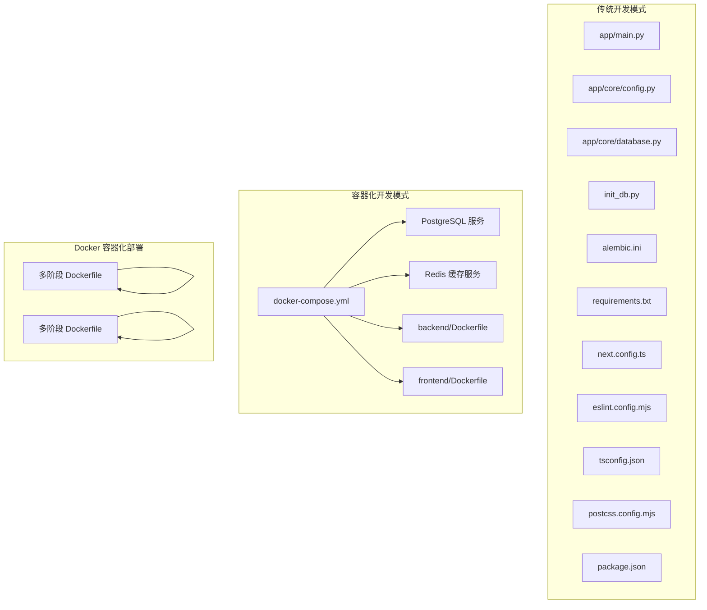
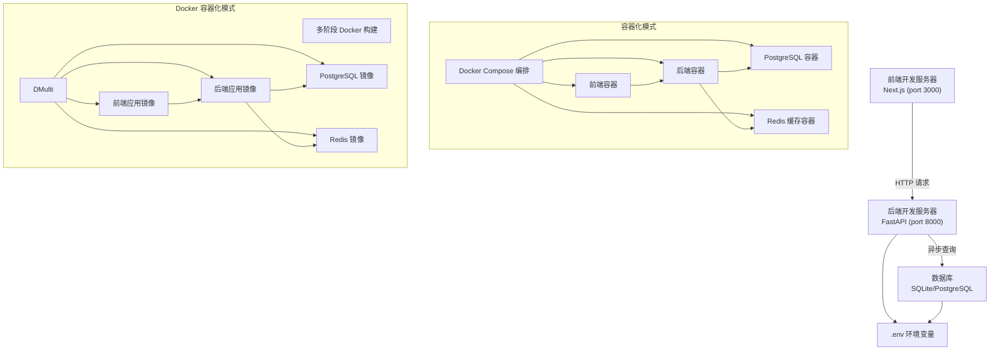
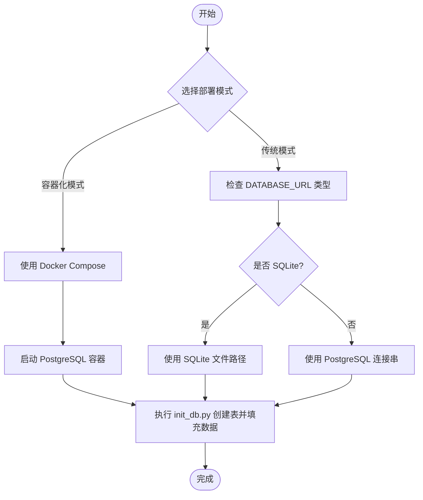
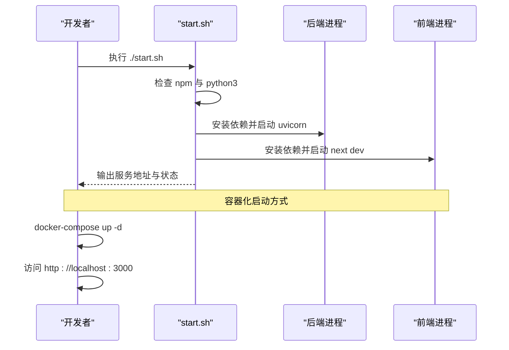
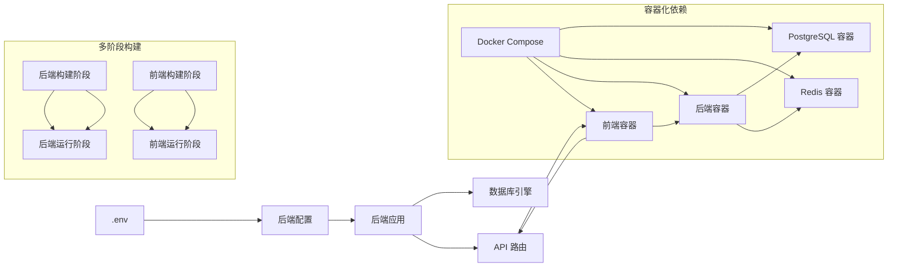

# 开发环境搭建

<cite>
**本文档引用的文件**
- [README.md](file://README.md)
- [.env.example](file://.env.example)
- [docker-compose.yml](file://docker-compose.yml)
- [start.sh](file://start.sh)
- [backend/Dockerfile](file://backend/Dockerfile)
- [frontend/Dockerfile](file://frontend/Dockerfile)
- [backend/.dockerignore](file://backend/.dockerignore)
- [frontend/.dockerignore](file://frontend/.dockerignore)
- [backend/requirements.txt](file://backend/requirements.txt)
- [backend/app/core/config.py](file://backend/app/core/config.py)
- [backend/app/core/database.py](file://backend/app/core/database.py)
- [backend/app/main.py](file://backend/app/main.py)
- [backend/init_db.py](file://backend/init_db.py)
- [backend/alembic.ini](file://backend/alembic.ini)
- [frontend/package.json](file://frontend/package.json)
- [frontend/next.config.ts](file://frontend/next.config.ts)
- [frontend/eslint.config.mjs](file://frontend/eslint.config.mjs)
- [frontend/tsconfig.json](file://frontend/tsconfig.json)
- [frontend/postcss.config.mjs](file://frontend/postcss.config.mjs)
- [doc/tech_stack.md](file://doc/tech_stack.md)
</cite>

## 更新摘要
**变更内容**
- 新增 Docker Compose 多服务编排配置，支持 PostgreSQL 数据库和 Redis 缓存
- 新增 Dockerfile 容器化部署方案，支持多阶段构建优化
- 新增 .dockerignore 文件，优化容器构建和运行时性能
- 更新环境变量管理方式，支持容器化环境变量传递
- 保持原有传统开发方式(start.sh 脚本)作为备选方案
- 完善数据库服务依赖关系和端口映射配置
- 增强开发环境配置，支持更灵活的部署选项

## 目录
1. [简介](#简介)
2. [项目结构](#项目结构)
3. [核心组件](#核心组件)
4. [架构总览](#架构总览)
5. [详细组件分析](#详细组件分析)
6. [依赖关系分析](#依赖关系分析)
7. [性能考虑](#性能考虑)
8. [故障排除指南](#故障排除指南)
9. [结论](#结论)
10. [附录](#附录)

## 简介
本指南面向首次参与开发的工程师，提供从零开始搭建开发环境的完整流程，涵盖：
- Python 后端环境配置（版本、虚拟环境、依赖安装）
- Node.js 前端环境配置（包管理器、构建与开发服务器）
- 环境变量配置（数据库连接、API 密钥、AI 服务）
- 本地数据库设置（SQLite 初始化与 PostgreSQL 配置）
- 开发服务器启动（前后端同时启动与热重载）
- Docker Compose 多服务编排（容器化开发环境）
- Docker 容器化部署（多阶段构建优化）
- IDE 配置建议（代码格式化、类型检查、调试）
- 常见问题排查与解决方案

## 项目结构
项目采用前后端分离架构，现已支持三种开发模式：
- 传统开发模式：独立的 Python 后端和 Node.js 前端
- 容器化开发模式：通过 Docker Compose 编排多服务
- Docker 容器化部署模式：单个应用容器部署

**图表来源**
- [docker-compose.yml](file://docker-compose.yml#L1-L53)
- [backend/Dockerfile](file://backend/Dockerfile#L1-L29)
- [frontend/Dockerfile](file://frontend/Dockerfile#L1-L30)

**章节来源**
- [README.md](file://README.md#L45-L50)
- [doc/tech_stack.md](file://doc/tech_stack.md#L1-L51)

## 核心组件
- 后端应用入口与路由注册：定义 API 路由前缀与健康检查端点。
- 配置系统：集中管理数据库连接、安全密钥、外部 AI 服务密钥等。
- 数据库引擎与会话：基于 SQLAlchemy AsyncIO 的异步连接池与会话工厂。
- 数据初始化脚本：创建表结构并填充基础数据。
- 前端构建与开发配置：Next.js、TypeScript、ESLint、Tailwind CSS 配置。
- Docker Compose 编排：多服务容器化部署，包含数据库、缓存和应用服务。
- Docker 多阶段构建：优化镜像大小和构建效率。
- .dockerignore 文件：排除不需要的文件和目录，提升构建性能。

**章节来源**
- [backend/app/main.py](file://backend/app/main.py#L1-L91)
- [backend/app/core/config.py](file://backend/app/core/config.py#L1-L26)
- [backend/app/core/database.py](file://backend/app/core/database.py#L1-L24)
- [backend/init_db.py](file://backend/init_db.py#L1-L85)
- [frontend/package.json](file://frontend/package.json#L1-L43)
- [docker-compose.yml](file://docker-compose.yml#L1-L53)
- [backend/Dockerfile](file://backend/Dockerfile#L1-L29)
- [frontend/Dockerfile](file://frontend/Dockerfile#L1-L30)

## 架构总览
下图展示了开发环境中的关键交互：前端通过 Next.js 开发服务器访问后端 FastAPI，后端通过 SQLAlchemy AsyncIO 访问数据库；环境变量驱动配置加载。现在支持三种部署模式。

**图表来源**
- [backend/app/main.py](file://backend/app/main.py#L1-L91)
- [backend/app/core/config.py](file://backend/app/core/config.py#L1-L26)
- [backend/app/core/database.py](file://backend/app/core/database.py#L1-L24)
- [.env.example](file://.env.example#L1-L10)
- [docker-compose.yml](file://docker-compose.yml#L1-L53)
- [backend/Dockerfile](file://backend/Dockerfile#L1-L29)
- [frontend/Dockerfile](file://frontend/Dockerfile#L1-L30)

## 详细组件分析

### Python 后端环境配置
- Python 版本要求
  - 技术栈文档明确后端使用 Python 3.10+。
- 虚拟环境创建
  - 推荐使用标准库 venv 创建隔离环境，并激活后安装依赖。
- 依赖安装
  - 使用 requirements.txt 安装后端依赖，包含 FastAPI、SQLAlchemy AsyncIO、Uvicorn、Pydantic、AI SDK 等。
- 开发服务器启动
  - 使用 Uvicorn 启动 ASGI 应用，默认启用热重载，便于开发迭代。

**章节来源**
- [doc/tech_stack.md](file://doc/tech_stack.md#L33-L35)
- [backend/requirements.txt](file://backend/requirements.txt#L1-L76)
- [README.md](file://README.md#L16-L31)

### Node.js 前端环境配置
- 包管理器选择
  - 项目使用 npm（package.json 中定义了 npm 脚本）。
- 依赖安装与开发服务器
  - 安装依赖后运行 next dev 启动开发服务器，端口默认 3000。
- 构建与类型检查
  - 支持 next build、next start；ESLint 与 TypeScript 配置已就绪。

**章节来源**
- [frontend/package.json](file://frontend/package.json#L1-L43)
- [README.md](file://README.md#L33-L43)
- [frontend/eslint.config.mjs](file://frontend/eslint.config.mjs#L1-L19)
- [frontend/tsconfig.json](file://frontend/tsconfig.json#L1-L43)

### 环境变量配置
- 必填项
  - 数据库连接字符串 DATABASE_URL
  - AI 服务密钥 GEMINI_API_KEY、DEEPSEEK_API_KEY
  - 安全密钥 SECRET_KEY（用于 JWT）
- 前端 API 地址
  - NEXT_PUBLIC_API_URL 指向后端地址（默认 http://localhost:8000）
- 容器化环境变量
  - Docker Compose 中通过 env_file 和环境变量传递机制管理
  - 支持环境变量覆盖和默认值设置

**章节来源**
- [.env.example](file://.env.example#L1-L10)
- [backend/app/core/config.py](file://backend/app/core/config.py#L1-L26)
- [frontend/package.json](file://frontend/package.json#L1-L43)
- [docker-compose.yml](file://docker-compose.yml#L30-L44)

### 本地数据库设置
- SQLite 初始化
  - 默认数据库 URL 指向本地 SQLite 文件；可通过 init_db.py 创建表并填充基础股票数据。
- PostgreSQL 配置
  - 可在 DATABASE_URL 中替换为 PostgreSQL 连接串；Alembic 提供迁移能力，需确保 alembic.ini 中 sqlalchemy.url 正确指向目标数据库。
- Docker Compose 数据库服务
  - 使用官方 PostgreSQL 15-alpine 镜像，持久化存储到 postgres_data 卷

**图表来源**
- [backend/app/core/config.py](file://backend/app/core/config.py#L6-L6)
- [backend/init_db.py](file://backend/init_db.py#L61-L81)
- [backend/alembic.ini](file://backend/alembic.ini#L84-L87)
- [docker-compose.yml](file://docker-compose.yml#L5-L16)

**章节来源**
- [backend/app/core/config.py](file://backend/app/core/config.py#L6-L6)
- [backend/init_db.py](file://backend/init_db.py#L1-L85)
- [backend/alembic.ini](file://backend/alembic.ini#L84-L87)
- [docker-compose.yml](file://docker-compose.yml#L5-L16)

### 开发服务器启动
- 单命令启动
  - 提供 start.sh 脚本，自动检测 npm 与 python3，按顺序启动后端与前端，并在前台输出服务状态。
- Docker Compose 启动
  - 使用 docker-compose up -d 启动所有服务，包括数据库、缓存和应用服务。
- 手动启动
  - 后端：进入 backend 目录，激活虚拟环境（可选），安装依赖后使用 uvicorn 启动。
  - 前端：进入 frontend 目录，安装依赖后运行 next dev。

**图表来源**
- [start.sh](file://start.sh#L1-L44)
- [docker-compose.yml](file://docker-compose.yml#L26-L53)

**章节来源**
- [start.sh](file://start.sh#L1-L44)
- [README.md](file://README.md#L5-L12)
- [docker-compose.yml](file://docker-compose.yml#L26-L53)

### Docker Compose 多服务编排
- 服务架构
  - PostgreSQL 数据库服务：使用 postgres:15-alpine 镜像，端口 5432 映射
  - Redis 缓存服务：使用 redis:7-alpine 镜像，端口 6379 映射
  - 后端服务：基于自定义 Dockerfile 构建，依赖数据库和缓存
  - 前端服务：基于自定义 Dockerfile 构建，依赖后端服务
- 环境变量管理
  - 通过 env_file 指定后端环境变量文件
  - 通过环境变量传递 DATABASE_URL 和 REDIS_URL
  - 支持 NEXT_PUBLIC_API_URL 构建参数
- 依赖关系
  - 后端服务依赖数据库和缓存服务
  - 前端服务依赖后端服务
  - 使用 depends_on 确保服务启动顺序

**章节来源**
- [docker-compose.yml](file://docker-compose.yml#L1-L53)
- [backend/Dockerfile](file://backend/Dockerfile#L1-L29)
- [frontend/Dockerfile](file://frontend/Dockerfile#L1-L30)

### Docker 容器化部署
- 多阶段构建优化
  - 后端使用 Python 3.11-slim 基础镜像，分阶段安装系统依赖和 Python 依赖
  - 前端使用多阶段构建，第一阶段安装依赖和构建，第二阶段仅复制构建产物
- 系统依赖安装
  - 后端安装 build-essential、python3-dev、libpq-dev 等编译依赖
  - 前端安装 python3、make、g++ 等构建工具
- 生产环境运行
  - 后端使用 gunicorn + uvicorn workers 进行生产级部署
  - 前端使用 npm start 在生产环境运行

**章节来源**
- [backend/Dockerfile](file://backend/Dockerfile#L1-L29)
- [frontend/Dockerfile](file://frontend/Dockerfile#L1-L30)

### .dockerignore 文件优化
- 后端忽略规则
  - 缓存文件：__pycache__、*.pyc、*.pyo、*.pyd
  - 虚拟环境：.venv、venv、ENV、env
  - 环境文件：.env
  - 测试缓存：.pytest_cache
  - 系统文件：.DS_Store、app.log
  - 本地数据库：ai_advisor.db
- 前端忽略规则
  - 构建产物：node_modules、.next、out、build
  - 环境文件：.env.local、.env.development.local、.env.test.local、.env.production.local
  - 日志文件：npm-debug.log*、yarn-debug.log*、yarn-error.log*
  - 系统文件：.DS_Store

**章节来源**
- [backend/.dockerignore](file://backend/.dockerignore#L1-L13)
- [frontend/.dockerignore](file://frontend/.dockerignore#L1-L13)

### IDE 配置建议
- 代码格式化与类型检查
  - 前端已配置 ESLint 与 TypeScript，建议在 IDE 中启用实时检查与保存时自动修复。
- 路径别名与模块解析
  - TypeScript 配置了路径别名 @/*，确保编辑器正确解析相对路径。
- Tailwind CSS 集成
  - PostCSS 已集成 Tailwind 插件，建议开启编辑器的 CSS 增强功能以获得最佳体验。
- Docker 开发支持
  - 建议安装 Docker 相关插件，支持容器化开发环境的可视化管理。

**章节来源**
- [frontend/eslint.config.mjs](file://frontend/eslint.config.mjs#L1-L19)
- [frontend/tsconfig.json](file://frontend/tsconfig.json#L26-L30)
- [frontend/postcss.config.mjs](file://frontend/postcss.config.mjs#L1-L8)

## 依赖关系分析
- 后端依赖
  - FastAPI、SQLAlchemy AsyncIO、Uvicorn、Pydantic、AI SDK（Google Generative AI、OpenAI 兼容）、HTTP 客户端与数据处理库。
- 前端依赖
  - Next.js、React、Axios、ESLint、Tailwind CSS、Radix UI 组件库、Zod 类型校验。
- 配置耦合
  - 后端通过 pydantic-settings 读取 .env；前端通过 NEXT_PUBLIC_* 暴露公共 API 地址。
- 容器化依赖
  - Docker Compose 管理服务间依赖关系和网络通信。
- 多阶段构建依赖
  - 构建阶段依赖完整的开发工具链，运行阶段仅依赖必要的运行时组件。

**图表来源**
- [backend/app/core/config.py](file://backend/app/core/config.py#L1-L26)
- [backend/app/main.py](file://backend/app/main.py#L1-L91)
- [frontend/package.json](file://frontend/package.json#L1-L43)
- [docker-compose.yml](file://docker-compose.yml#L1-L53)
- [backend/Dockerfile](file://backend/Dockerfile#L1-L29)
- [frontend/Dockerfile](file://frontend/Dockerfile#L1-L30)

**章节来源**
- [backend/requirements.txt](file://backend/requirements.txt#L1-L76)
- [frontend/package.json](file://frontend/package.json#L1-L43)
- [docker-compose.yml](file://docker-compose.yml#L1-L53)

## 性能考虑
- 异步数据库访问
  - 使用 SQLAlchemy AsyncIO 减少阻塞，提升并发处理能力。
- 热重载与增量编译
  - 后端 uvicorn --reload 与前端 Next.js 开发服务器均支持热更新，缩短迭代周期。
- 依赖精简
  - 按需安装第三方库，避免不必要的体积与启动时间。
- 容器化优化
  - 使用多阶段构建减少镜像大小
  - 适当的资源限制和重启策略
  - .dockerignore 文件排除不必要的文件，提升构建速度
- 系统依赖优化
  - 仅安装必要的编译工具和运行时依赖
  - 使用 slim 基础镜像减少镜像体积

## 故障排除指南
- 启动脚本报错：缺少 npm 或 python3
  - 现象：脚本提示未安装相应工具。
  - 处理：安装 Node.js/npm 与 Python 3.10+ 后重试。
- 端口占用
  - 现象：端口 8000 或 3000 被占用。
  - 处理：释放端口或修改对应服务端口。
- 数据库连接失败
  - 现象：后端无法连接数据库。
  - 处理：检查 DATABASE_URL 是否正确；如使用 PostgreSQL，确认网络连通性与凭据。
- CORS 跨域错误
  - 现象：浏览器控制台报跨域错误。
  - 处理：确认后端允许的源包含前端地址（localhost:3000/127.0.0.1:3000）。
- AI 服务密钥无效
  - 现象：调用 AI 分析接口返回鉴权错误。
  - 处理：在 .env 中填写有效密钥并重启后端服务。
- Docker 容器启动失败
  - 现象：容器无法启动或频繁重启。
  - 处理：检查环境变量配置、卷挂载权限和网络连接。
- 数据持久化问题
  - 现象：容器重启后数据丢失。
  - 处理：确认 postgres_data 卷正确挂载和权限设置。
- Docker 构建失败
  - 现象：Docker 构建过程中出现依赖安装错误。
  - 处理：检查 .dockerignore 文件是否排除了必要的文件，确认网络连接正常。
- 多阶段构建问题
  - 现象：构建阶段成功但运行阶段失败。
  - 处理：检查构建阶段是否正确复制了所有必需的文件和依赖。

**章节来源**
- [start.sh](file://start.sh#L9-L17)
- [backend/app/main.py](file://backend/app/main.py#L57-L75)
- [.env.example](file://.env.example#L2-L9)
- [docker-compose.yml](file://docker-compose.yml#L5-L16)

## 结论
通过本指南，您可以选择适合的开发模式完成环境搭建与日常开发工作流。推荐使用 Docker Compose 进行容器化开发，它提供了标准化的服务编排和环境一致性。Docker 多阶段构建进一步优化了部署效率和镜像大小。传统开发方式(start.sh脚本)适合需要直接控制开发环境的场景。遇到问题时，可依据故障排除章节逐项验证配置与依赖。

## 附录
- 快速参考
  - 传统模式：后端进入 backend，创建并激活虚拟环境，安装依赖，启动 uvicorn；前端进入 frontend，安装依赖，启动 next dev。
  - 容器化模式：使用 docker-compose up -d 启动所有服务；访问 http://localhost:3000。
  - Docker 部署模式：使用 docker build 构建镜像，使用 docker run 运行容器。
  - 环境变量：复制 .env.example 并填写必要字段；容器化模式通过 docker-compose.yml 管理环境变量。
  - 数据库：使用 init_db.py 初始化 SQLite 表与种子数据；如需 PostgreSQL，请在 DATABASE_URL 中指定连接串并在 Alembic 中配置 sqlalchemy.url。
  - Docker 镜像：后端使用 python:3.11-slim，前端使用 node:20-slim，支持多阶段构建优化。
  - .dockerignore：使用 .dockerignore 文件排除不必要的文件，提升构建性能。

**章节来源**
- [README.md](file://README.md#L14-L43)
- [.env.example](file://.env.example#L1-L10)
- [backend/init_db.py](file://backend/init_db.py#L61-L81)
- [backend/alembic.ini](file://backend/alembic.ini#L84-L87)
- [docker-compose.yml](file://docker-compose.yml#L1-L53)
- [backend/Dockerfile](file://backend/Dockerfile#L1-L29)
- [frontend/Dockerfile](file://frontend/Dockerfile#L1-L30)
- [backend/.dockerignore](file://backend/.dockerignore#L1-L13)
- [frontend/.dockerignore](file://frontend/.dockerignore#L1-L13)