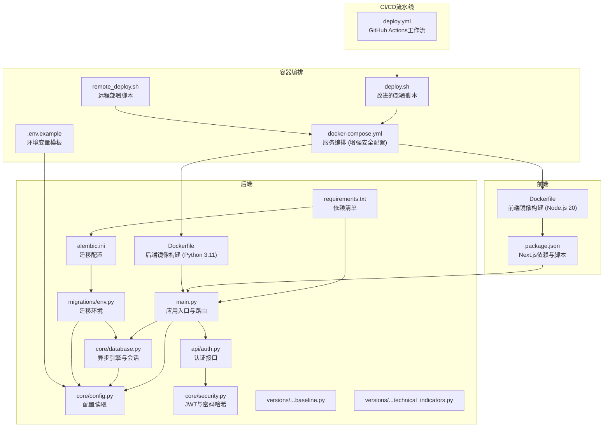
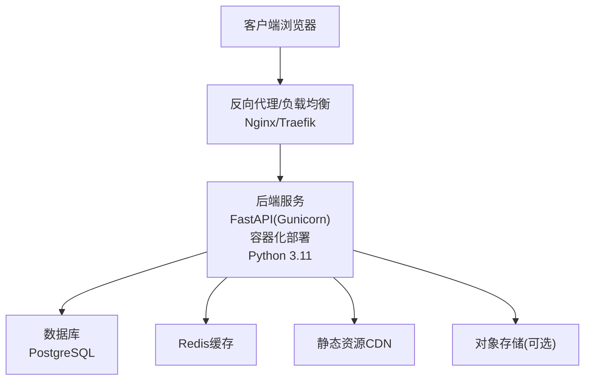
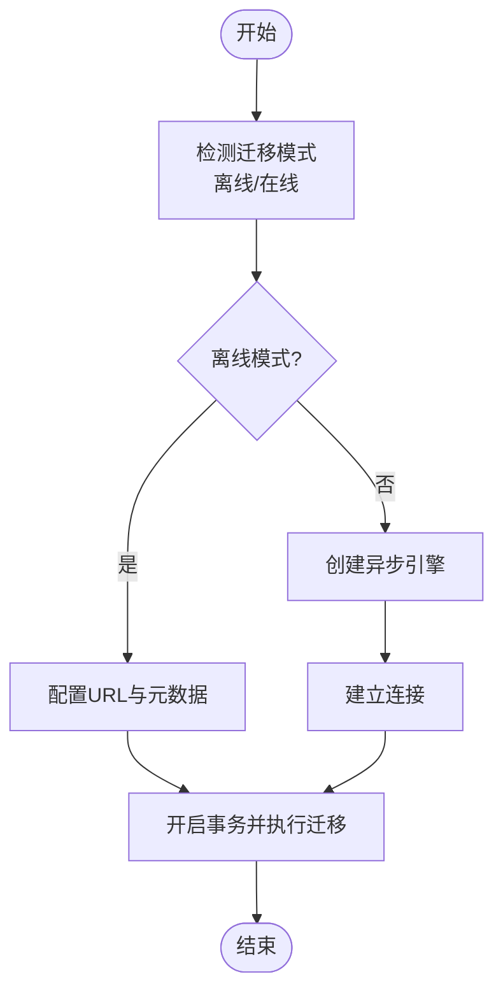
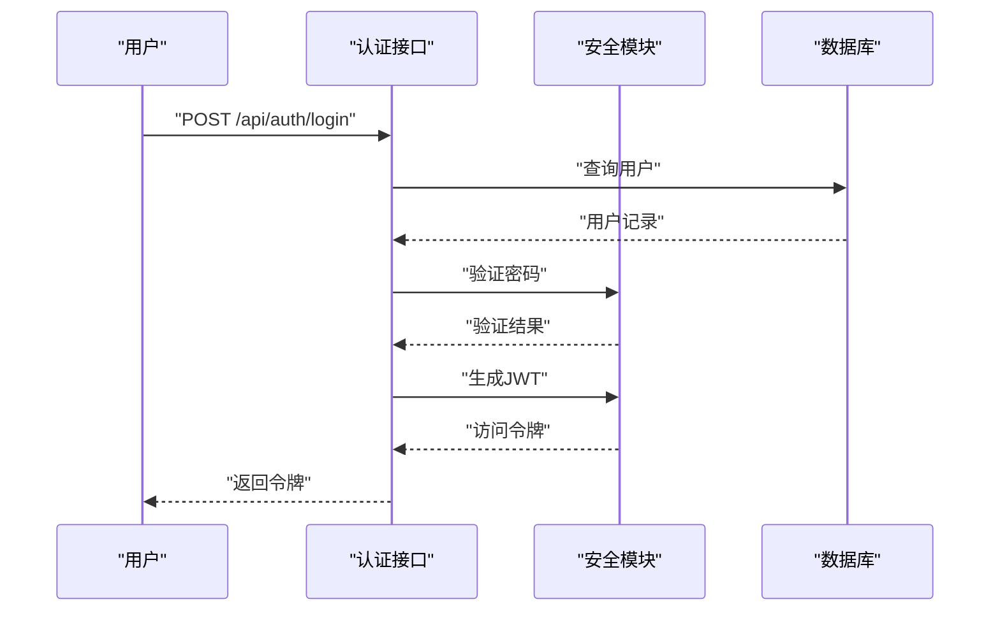
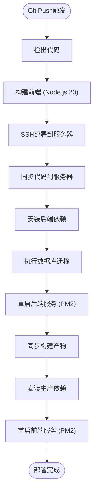
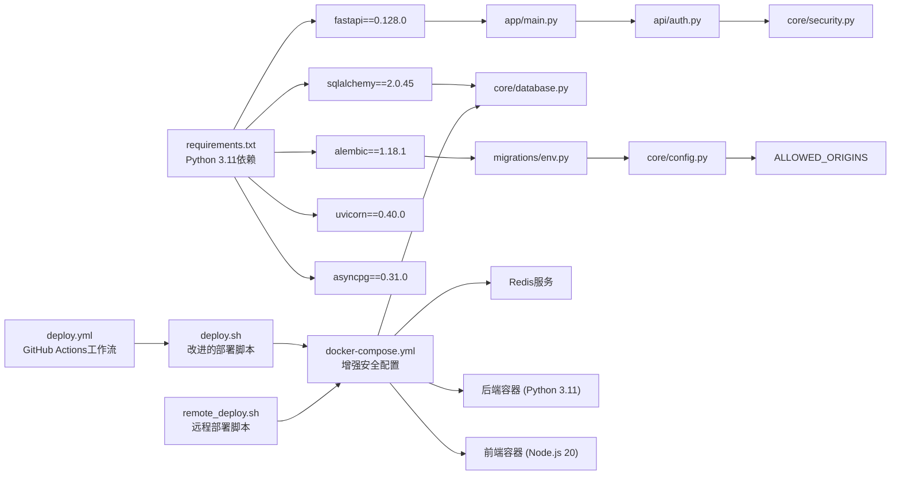

# 生产环境部署

<cite>
**本文引用的文件**
- [backend/app/main.py](file://backend/app/main.py)
- [backend/app/core/config.py](file://backend/app/core/config.py)
- [backend/app/core/database.py](file://backend/app/core/database.py)
- [backend/app/core/security.py](file://backend/app/core/security.py)
- [backend/app/api/auth.py](file://backend/app/api/auth.py)
- [backend/alembic.ini](file://backend/alembic.ini)
- [backend/migrations/env.py](file://backend/migrations/env.py)
- [backend/migrations/versions/35a834f440ba_baseline.py](file://backend/migrations/versions/35a834f440ba_baseline.py)
- [backend/migrations/versions/48d7355e90d6_add_more_technical_indicators.py](file://backend/migrations/versions/48d7355e90d6_add_more_technical_indicators.py)
- [backend/init_db.py](file://backend/init_db.py)
- [backend/check_db_v3.py](file://backend/check_db_v3.py)
- [backend/requirements.txt](file://backend/requirements.txt)
- [frontend/package.json](file://frontend/package.json)
- [start.sh](file://start.sh)
- [deploy.sh](file://deploy.sh)
- [remote_deploy.sh](file://remote_deploy.sh)
- [docker-compose.yml](file://docker-compose.yml)
- [backend/Dockerfile](file://backend/Dockerfile)
- [frontend/Dockerfile](file://frontend/Dockerfile)
- [.env.example](file://.env.example)
- [.github/workflows/deploy.yml](file://.github/workflows/deploy.yml)
</cite>

## 更新摘要
**变更内容**
- Python 3.11 和 Node.js 20 升级，提升性能和安全性
- Dockerfile 优化改进，增强容器化部署体验
- 增强的安全配置，移除外部端口映射，只允许Docker内部访问
- 改进的部署脚本，增加 set -e、服务启动验证和错误消息
- **新增** CI/CD流水线自动化数据库迁移，确保部署时自动应用数据库变更
- **新增** GitHub Actions工作流，支持阿里云部署和自动化迁移
- **新增** 远程部署脚本，支持rsync同步和容器化部署

## 目录
1. [简介](#简介)
2. [项目结构](#项目结构)
3. [核心组件](#核心组件)
4. [架构总览](#架构总览)
5. [详细组件分析](#详细组件分析)
6. [依赖关系分析](#依赖关系分析)
7. [性能考虑](#性能考虑)
8. [故障排查指南](#故障排查指南)
9. [结论](#结论)
10. [附录](#附录)

## 简介
本指南面向生产环境部署，围绕后端FastAPI服务与前端Next.js应用，提供从容器化到云平台部署、数据库迁移、静态资源与CDN、负载均衡与反向代理、SSL/TLS与HTTPS、性能优化（含Gunicorn与并发）、以及部署脚本与自动化工具的完整实践路径。内容基于仓库中现有配置与代码进行提炼与扩展，确保可操作性与可追溯性。

**更新** 新增Python 3.11和Node.js 20升级支持，Dockerfile优化改进，增强的安全配置（移除外部端口映射），改进的部署脚本（set -e，服务启动验证，错误消息），**新增** CI/CD流水线自动化数据库迁移功能，确保部署时自动应用数据库变更。

## 项目结构
- 后端采用FastAPI + SQLAlchemy异步ORM，使用Alembic进行数据库迁移；前端采用Next.js 16。
- 关键运行时依赖：FastAPI、uvicorn、SQLAlchemy、Alembic、asyncpg/aiosqlite等。
- 开发启动脚本用于本地联调，生产建议使用容器化与编排方案。
- **新增** Docker容器化支持，包含完整的Dockerfile和docker-compose.yml配置，现已升级到Python 3.11和Node.js 20。
- **新增** GitHub Actions CI/CD流水线，支持自动化部署和数据库迁移。
- **新增** 远程部署脚本，支持rsync同步和容器化部署。

**图表来源**
- [backend/app/main.py](file://backend/app/main.py#L1-L91)
- [backend/app/core/config.py](file://backend/app/core/config.py#L1-L28)
- [backend/app/core/database.py](file://backend/app/core/database.py#L1-L24)
- [backend/app/core/security.py](file://backend/app/core/security.py#L1-L26)
- [backend/app/api/auth.py](file://backend/app/api/auth.py#L1-L88)
- [backend/alembic.ini](file://backend/alembic.ini#L1-L148)
- [backend/migrations/env.py](file://backend/migrations/env.py#L1-L86)
- [backend/migrations/versions/35a834f440ba_baseline.py](file://backend/migrations/versions/35a834f440ba_baseline.py#L1-L128)
- [backend/migrations/versions/48d7355e90d6_add_more_technical_indicators.py](file://backend/migrations/versions/48d7355e90d6_add_more_technical_indicators.py#L1-L38)
- [backend/requirements.txt](file://backend/requirements.txt#L1-L76)
- [frontend/package.json](file://frontend/package.json#L1-L43)
- [backend/Dockerfile](file://backend/Dockerfile#L1-L29)
- [frontend/Dockerfile](file://frontend/Dockerfile#L1-L30)
- [docker-compose.yml](file://docker-compose.yml#L1-L53)
- [deploy.sh](file://deploy.sh#L1-L52)
- [remote_deploy.sh](file://remote_deploy.sh#L1-L80)
- [.env.example](file://.env.example#L1-L10)
- [.github/workflows/deploy.yml](file://.github/workflows/deploy.yml#L1-L80)

**章节来源**
- [backend/app/main.py](file://backend/app/main.py#L1-L91)
- [backend/requirements.txt](file://backend/requirements.txt#L1-L76)
- [frontend/package.json](file://frontend/package.json#L1-L43)
- [docker-compose.yml](file://docker-compose.yml#L1-L53)
- [deploy.sh](file://deploy.sh#L1-L52)
- [remote_deploy.sh](file://remote_deploy.sh#L1-L80)
- [.github/workflows/deploy.yml](file://.github/workflows/deploy.yml#L1-L80)

## 核心组件
- 应用入口与路由：定义FastAPI实例、CORS中间件、健康检查端点与业务路由挂载。
- 配置系统：通过Pydantic Settings加载环境变量，支持数据库URL、密钥、外部API密钥等，**新增** ALLOWED_ORIGINS多域名CORS配置。
- 数据库层：异步SQLAlchemy引擎与会话工厂，适配SQLite与PostgreSQL。
- 安全模块：JWT签名算法与密码哈希策略。
- 认证接口：登录与注册，返回JWT访问令牌。
- 迁移系统：Alembic配置与环境脚本，按版本目录管理数据库演进。
- 前端构建：Next.js开发、构建与运行脚本。
- **新增** 容器化部署：完整的Dockerfile和docker-compose.yml配置，支持多服务编排，现已升级到Python 3.11和Node.js 20。
- **新增** 改进的自动化部署：deploy.sh脚本提供一键部署功能，包含set -e、服务启动验证和错误消息。
- **新增** CI/CD流水线：GitHub Actions工作流，支持自动化部署、数据库迁移和前端构建。
- **新增** 远程部署：支持rsync同步和容器化部署，适用于生产环境远程部署。

**章节来源**
- [backend/app/main.py](file://backend/app/main.py#L1-L91)
- [backend/app/core/config.py](file://backend/app/core/config.py#L1-L28)
- [backend/app/core/database.py](file://backend/app/core/database.py#L1-L24)
- [backend/app/core/security.py](file://backend/app/core/security.py#L1-L26)
- [backend/app/api/auth.py](file://backend/app/api/auth.py#L1-L88)
- [backend/alembic.ini](file://backend/alembic.ini#L1-L148)
- [backend/migrations/env.py](file://backend/migrations/env.py#L1-L86)
- [frontend/package.json](file://frontend/package.json#L1-L43)
- [docker-compose.yml](file://docker-compose.yml#L1-L53)
- [deploy.sh](file://deploy.sh#L1-L52)
- [remote_deploy.sh](file://remote_deploy.sh#L1-L80)
- [.github/workflows/deploy.yml](file://.github/workflows/deploy.yml#L1-L80)

## 架构总览
下图展示生产环境典型拓扑：反向代理/负载均衡前置，后端服务通过容器编排运行，数据库与缓存/对象存储作为外部依赖，CDN分发静态资源。

**更新** 新增Python 3.11支持，增强容器化部署架构，支持Docker Compose多服务编排，**新增** CI/CD流水线自动化数据库迁移。

## 详细组件分析

### 应用入口与路由
- CORS策略在开发阶段允许多源，生产应限定为具体域名与端口。
- **新增** 支持多域名CORS配置：通过ALLOWED_ORIGINS环境变量动态添加额外域名。
- 路由前缀统一为/api，便于反向代理转发与微服务拆分。
- 健康检查端点用于容器探针与运维监控。

**章节来源**
- [backend/app/main.py](file://backend/app/main.py#L55-L75)
- [backend/app/core/config.py](file://backend/app/core/config.py#L12)

### 配置与安全
- 配置项涵盖数据库连接、JWT密钥与过期时间、外部API密钥、HTTP代理等。
- **新增** ALLOWED_ORIGINS环境变量：支持多域名CORS配置，默认为空数组。
- 安全模块提供JWT签发与密码哈希验证，建议生产环境使用强随机密钥与较短过期时间。

**章节来源**
- [backend/app/core/config.py](file://backend/app/core/config.py#L1-L28)
- [backend/app/core/security.py](file://backend/app/core/security.py#L1-L26)

### 数据库与迁移
- 异步引擎适配SQLite与PostgreSQL，开发默认SQLite，生产建议PostgreSQL。
- Alembic迁移脚本位于versions目录，包含基础表与技术指标列的增补。
- 迁移环境脚本从配置读取数据库URL，支持离线与在线迁移。

**图表来源**
- [backend/migrations/env.py](file://backend/migrations/env.py#L52-L85)
- [backend/alembic.ini](file://backend/alembic.ini#L84-L87)

**章节来源**
- [backend/app/core/database.py](file://backend/app/core/database.py#L1-L24)
- [backend/migrations/env.py](file://backend/migrations/env.py#L1-L86)
- [backend/migrations/versions/35a834f440ba_baseline.py](file://backend/migrations/versions/35a834f440ba_baseline.py#L21-L127)
- [backend/migrations/versions/48d7355e90d6_add_more_technical_indicators.py](file://backend/migrations/versions/48d7355e90d6_add_more_technical_indicators.py#L21-L37)

### 认证流程
- 登录：校验邮箱与密码，签发JWT。
- 注册：检查邮箱唯一性，加密密码后写入，随后签发JWT。

**图表来源**
- [backend/app/api/auth.py](file://backend/app/api/auth.py#L24-L50)
- [backend/app/core/security.py](file://backend/app/core/security.py#L11-L19)

**章节来源**
- [backend/app/api/auth.py](file://backend/app/api/auth.py#L1-L88)
- [backend/app/core/security.py](file://backend/app/core/security.py#L1-L26)

### 前端构建与运行
- Next.js提供开发、构建与运行脚本，生产建议先构建再运行。
- 静态资源与页面由Next.js生成，可接入CDN加速。
- **新增** Dockerfile支持多阶段构建，优化镜像大小和构建效率，现已升级到Node.js 20。

**章节来源**
- [frontend/package.json](file://frontend/package.json#L1-L43)
- [frontend/Dockerfile](file://frontend/Dockerfile#L1-L30)

### 容器化部署

#### Docker镜像构建
- **后端镜像**：基于Python 3.11 Slim，安装系统依赖和Python包，使用Gunicorn运行FastAPI应用。
- **前端镜像**：多阶段构建，第一阶段安装依赖和构建Next.js应用，第二阶段仅运行构建产物，现已升级到Node.js 20-slim。
- **环境变量**：通过.env文件管理，支持数据库URL、API密钥等配置。

#### Docker Compose编排
- **数据库服务**：PostgreSQL 15-alpine，持久化存储到postgres_data卷。
- **缓存服务**：Redis 7-alpine，提供会话和缓存支持。
- **后端服务**：依赖数据库和Redis，自动重启，**更新** 移除外部端口映射，只允许Docker内部访问。
- **前端服务**：依赖后端服务，**更新** 移除外部端口映射，只允许Docker内部访问，支持NEXT_PUBLIC_API_URL配置。

#### 改进的自动化部署脚本
- **deploy.sh**：提供一键部署功能，**更新** 增加set -e（任何命令失败就立即停止），包含环境检查、容器重建、数据库迁移、镜像清理等步骤。
- **remote_deploy.sh**：支持远程部署，使用rsync同步文件，然后在远程服务器上执行容器化部署和数据库迁移。
- **部署流程**：检查.env文件 → 停止旧容器 → 构建新镜像 → 启动服务 → **新增** 等待服务启动并验证 → 执行迁移 → 清理镜像。

**章节来源**
- [backend/Dockerfile](file://backend/Dockerfile#L1-L29)
- [frontend/Dockerfile](file://frontend/Dockerfile#L1-L30)
- [docker-compose.yml](file://docker-compose.yml#L1-L53)
- [deploy.sh](file://deploy.sh#L1-L52)
- [remote_deploy.sh](file://remote_deploy.sh#L1-L80)
- [.env.example](file://.env.example#L1-L10)

### CI/CD流水线自动化

#### GitHub Actions工作流
- **deploy.yml**：定义完整的部署流水线，支持阿里云部署模式。
- **前端构建**：在GitHub Actions环境中使用Node.js 20构建Next.js应用。
- **代码同步**：通过SSH将代码同步到远程服务器。
- **数据库迁移**：在服务器端执行数据库迁移，确保部署时自动应用数据库变更。
- **服务重启**：使用PM2管理后端和前端服务，支持优雅重启。

**图表来源**
- [.github/workflows/deploy.yml](file://.github/workflows/deploy.yml#L12-L79)

**章节来源**
- [.github/workflows/deploy.yml](file://.github/workflows/deploy.yml#L1-L80)

## 依赖关系分析
- 后端依赖：FastAPI、SQLAlchemy、Alembic、uvicorn、asyncpg/aiosqlite、pydantic-settings等。
- 前端依赖：Next.js、React、TailwindCSS及相关UI库。
- 运行时耦合：后端通过配置读取数据库URL；迁移脚本依赖配置与模型元数据；认证依赖安全模块与数据库。
- **新增** 容器化依赖：Docker Compose管理多服务依赖关系，环境变量传递和服务发现。
- **更新** 依赖版本：Python 3.11、Node.js 20、FastAPI 0.128.0、Next.js 16.1.2等。
- **新增** CI/CD依赖：GitHub Actions、SSH、rsync、PM2等工具链。

**图表来源**
- [backend/requirements.txt](file://backend/requirements.txt#L1-L76)
- [backend/app/main.py](file://backend/app/main.py#L1-L91)
- [backend/app/core/database.py](file://backend/app/core/database.py#L1-L24)
- [backend/migrations/env.py](file://backend/migrations/env.py#L1-L86)
- [backend/app/core/config.py](file://backend/app/core/config.py#L1-L28)
- [backend/app/api/auth.py](file://backend/app/api/auth.py#L1-L88)
- [backend/app/core/security.py](file://backend/app/core/security.py#L1-L26)
- [docker-compose.yml](file://docker-compose.yml#L1-L53)
- [deploy.sh](file://deploy.sh#L1-L52)
- [remote_deploy.sh](file://remote_deploy.sh#L1-L80)
- [.github/workflows/deploy.yml](file://.github/workflows/deploy.yml#L1-L80)

**章节来源**
- [backend/requirements.txt](file://backend/requirements.txt#L1-L76)
- [docker-compose.yml](file://docker-compose.yml#L1-L53)
- [deploy.sh](file://deploy.sh#L1-L52)
- [remote_deploy.sh](file://remote_deploy.sh#L1-L80)
- [.github/workflows/deploy.yml](file://.github/workflows/deploy.yml#L1-L80)

## 性能考虑
- 并发与进程：生产推荐使用Gunicorn或uvicorn多进程/多核部署，结合反向代理实现高可用。
- 数据库连接池：根据并发请求量调整连接数与超时，避免阻塞。
- 缓存策略：对热点市场数据与分析结果增加缓存层，减少重复计算。
- 前端静态资源：启用CDN与压缩，合理设置缓存头。
- 日志与监控：集中化日志与指标采集，配合容器探针与告警。
- **新增** 容器化性能：合理配置容器资源限制，使用多阶段构建优化镜像大小。
- **更新** 性能提升：Python 3.11和Node.js 20带来更好的性能表现和内存管理。
- **新增** CI/CD性能：GitHub Actions并行执行构建任务，减少整体部署时间。

## 故障排查指南
- 数据库连通性测试：使用独立脚本尝试连接并列出表，定位驱动与路径问题。
- 迁移失败：确认Alembic配置中的数据库URL与环境变量一致，检查版本文件完整性。
- 认证异常：核对密钥长度与算法一致性，检查用户密码哈希与JWT过期时间。
- 健康检查：通过根路径与健康检查端点判断服务状态。
- **新增** 容器化问题：检查Docker日志、网络连接、环境变量配置、卷挂载等问题。
- **新增** CORS配置：验证ALLOWED_ORIGINS环境变量格式，检查域名匹配规则。
- **新增** 部署脚本问题：使用set -e确保任何错误都能及时发现和报告。
- **新增** CI/CD问题：检查GitHub Actions日志，验证SSH连接、数据库迁移和PM2状态。
- **新增** 远程部署问题：使用rsync同步日志，检查远程服务器Docker服务状态。

**章节来源**
- [backend/check_db_v3.py](file://backend/check_db_v3.py#L1-L26)
- [backend/migrations/env.py](file://backend/migrations/env.py#L22-L23)
- [backend/app/main.py](file://backend/app/main.py#L84-L90)
- [deploy.sh](file://deploy.sh#L2-L27)
- [remote_deploy.sh](file://remote_deploy.sh#L38-L75)
- [.github/workflows/deploy.yml](file://.github/workflows/deploy.yml#L42-L79)

## 结论
本指南提供了从应用配置、数据库迁移、前后端构建到生产部署与运维的完整路径。**更新** 新增Python 3.11和Node.js 20升级支持，Dockerfile优化改进，增强的安全配置（移除外部端口映射），改进的部署脚本（set -e，服务启动验证，错误消息），**新增** CI/CD流水线自动化数据库迁移功能，确保部署时自动应用数据库变更，**新增** GitHub Actions工作流支持阿里云部署，**新增** 远程部署脚本支持rsync同步和容器化部署。这些改进显著简化了生产环境部署流程并提升了安全性与可靠性。建议在生产中严格区分配置与密钥、采用容器化与编排、启用CDN与负载均衡、完善监控与备份，并持续迭代迁移脚本以保障数据一致性。

## 附录

### A. 容器化与编排（策略建议）
- **镜像分层**：后端使用Python 3.11官方镜像，安装依赖后复制代码；前端使用Node.js 20构建产物镜像。
- **多阶段构建**：前端构建阶段产出静态文件，后端仅打包运行时依赖，减小镜像体积。
- **编排**：使用Compose/Kubernetes管理后端服务、数据库与CDN/对象存储；为后端配置健康检查与滚动更新。
- **环境变量**：通过Secrets管理数据库URL、JWT密钥与外部API密钥。
- **新增** **容器化最佳实践**：使用独立网络、数据卷持久化、健康检查、资源限制、日志聚合，**更新** 移除外部端口映射，只允许Docker内部访问。

**章节来源**
- [docker-compose.yml](file://docker-compose.yml#L1-L53)
- [backend/Dockerfile](file://backend/Dockerfile#L1-L29)
- [frontend/Dockerfile](file://frontend/Dockerfile#L1-L30)

### B. 云平台部署选项（策略建议）
- AWS：ECS/Fargate承载后端服务，RDS托管数据库，CloudFront分发静态资源，S3/MinIO存储对象。
- GCP：Cloud Run或GKE承载后端，Cloud SQL托管数据库，Cloud CDN分发静态资源，Cloud Storage存储对象。
- Azure：Container Apps或AKS承载后端，Azure Database for PostgreSQL托管数据库，Azure CDN分发静态资源，Blob存储对象。
- **新增** 阿里云：使用阿里云容器服务（ACK）或函数计算（FC），结合RDS和OSS实现容器化部署。

### C. 数据库迁移管理
- 执行迁移：在目标环境准备数据库URL，使用迁移命令执行升级/降级。
- 版本控制：每次变更提交对应的迁移脚本，遵循"不可回滚"的破坏性变更需配套降级脚本。
- 回滚策略：保留最近一次可回滚版本，确保回滚步骤清晰可测。
- **新增** 自动化迁移：CI/CD流水线中自动执行数据库迁移，确保部署时数据库结构与代码一致。
- **新增** 多环境支持：支持开发、测试、生产多环境的数据库迁移管理。

**章节来源**
- [backend/alembic.ini](file://backend/alembic.ini#L84-L87)
- [backend/migrations/env.py](file://backend/migrations/env.py#L52-L85)
- [backend/migrations/versions/35a834f440ba_baseline.py](file://backend/migrations/versions/35a834f440ba_baseline.py#L21-L127)
- [backend/migrations/versions/48d7355e90d6_add_more_technical_indicators.py](file://backend/migrations/versions/48d7355e90d6_add_more_technical_indicators.py#L21-L37)
- [.github/workflows/deploy.yml](file://.github/workflows/deploy.yml#L51-L55)

### D. 静态资源与CDN
- 构建产物：Next.js生产构建输出静态资源，上传至CDN或对象存储。
- 缓存策略：设置合理的Cache-Control与版本化命名，避免缓存污染。
- 回源配置：CDN回源至Web服务器或对象存储，确保动态接口不受影响。

### E. 负载均衡与反向代理
- Nginx：配置上游后端集群、健康检查、限流与压缩；将静态资源交由CDN。
- Traefik：通过注解或配置文件自动发现后端服务，简化TLS与路由规则。

### F. SSL/TLS与HTTPS
- 证书：使用Let's Encrypt或云平台托管证书；启用HTTP/2与现代加密套件。
- 强制HTTPS：重定向非加密流量至HTTPS；配置HSTS与安全响应头。

### G. 性能优化（Gunicorn与并发）
- 进程与线程：根据CPU核数与内存设定worker数量；对I/O密集型场景优先异步运行。
- 并发模型：uvicorn支持多进程/多线程，结合反向代理实现水平扩展。
- 资源限制：设置超时、队列长度与优雅退出，避免雪崩效应。

### H. 部署脚本与自动化
- 开发启动脚本：本地联调时一键启动前后端服务，生产不建议直接使用。
- **新增** CI/CD流水线：拉取代码、构建镜像、推送仓库、编排部署、运行迁移与健康检查。
- **新增** 健康检查：利用应用健康端点与容器探针，确保部署质量。
- **新增** 改进的自动化部署：deploy.sh脚本提供一键部署功能，**更新** 包含set -e、服务启动验证、错误消息等改进。
- **新增** 远程部署：支持rsync同步和容器化部署，适用于生产环境远程部署。
- **新增** GitHub Actions：自动化部署到阿里云，包含数据库迁移和前端构建。

**章节来源**
- [start.sh](file://start.sh#L1-L44)
- [deploy.sh](file://deploy.sh#L1-L52)
- [remote_deploy.sh](file://remote_deploy.sh#L1-L80)
- [.github/workflows/deploy.yml](file://.github/workflows/deploy.yml#L1-L80)

### I. 多域名CORS配置
- **新增** ALLOWED_ORIGINS环境变量：支持配置多个允许访问的域名列表。
- **新增** 动态配置：运行时从环境变量读取CORS配置，支持生产环境域名动态调整。
- **新增** 安全考虑：生产环境建议明确指定允许的域名，避免使用通配符。

**章节来源**
- [backend/app/core/config.py](file://backend/app/core/config.py#L12)
- [backend/app/main.py](file://backend/app/main.py#L64-L67)

### J. Python 3.11 和 Node.js 20 升级说明
- **Python 3.11升级**：后端Dockerfile已从Python 3.10升级到3.11，带来更好的性能和内存管理。
- **Node.js 20升级**：前端Dockerfile已从Node.js升级到20-slim，提供更好的开发体验和构建性能。
- **兼容性保证**：所有依赖库版本已更新以支持新的Python和Node.js版本。
- **性能提升**：Python 3.11和Node.js 20带来更快的启动时间和更好的运行时性能。

**章节来源**
- [backend/Dockerfile](file://backend/Dockerfile#L1)
- [frontend/Dockerfile](file://frontend/Dockerfile#L2)
- [backend/requirements.txt](file://backend/requirements.txt#L1-L76)
- [frontend/package.json](file://frontend/package.json#L1-L43)

### K. 增强的安全配置
- **移除外部端口映射**：docker-compose.yml中移除了数据库和Redis的外部端口映射，只允许Docker内部访问。
- **内部网络通信**：所有服务间通过Docker网络进行通信，提升安全性。
- **生产环境安全**：建议在生产环境中保持这种配置，避免直接暴露内部服务到外部网络。
- **日志监控**：通过docker-compose logs命令监控服务状态和错误信息。

**章节来源**
- [docker-compose.yml](file://docker-compose.yml#L13-L14)
- [docker-compose.yml](file://docker-compose.yml#L20)
- [docker-compose.yml](file://docker-compose.yml#L35-L36)
- [docker-compose.yml](file://docker-compose.yml#L48-L49)

### L. CI/CD流水线自动化数据库迁移
- **GitHub Actions工作流**：定义完整的部署流水线，支持自动化数据库迁移。
- **迁移执行**：在服务器端使用Alembic执行数据库迁移，确保部署时数据库结构与代码一致。
- **错误处理**：包含set -e确保任何错误都能及时发现和报告。
- **服务管理**：使用PM2管理后端和前端服务，支持优雅重启。
- **构建优化**：前端在GitHub Actions环境中构建，减少本地开发负担。

**章节来源**
- [.github/workflows/deploy.yml](file://.github/workflows/deploy.yml#L1-L80)
- [deploy.sh](file://deploy.sh#L40-L42)
- [remote_deploy.sh](file://remote_deploy.sh#L67-L71)

### M. 远程部署脚本详解
- **rsync同步**：使用rsync同步代码到远程服务器，排除不必要的文件。
- **容器化部署**：在远程服务器上执行docker-compose部署。
- **迁移执行**：自动执行数据库迁移，确保数据库结构更新。
- **镜像清理**：部署完成后清理无用镜像，释放磁盘空间。
- **版本检测**：自动检测docker compose版本，兼容不同环境。

**章节来源**
- [remote_deploy.sh](file://remote_deploy.sh#L1-L80)
- [docker-compose.yml](file://docker-compose.yml#L43-L44)