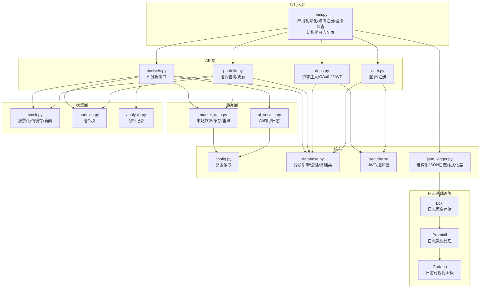
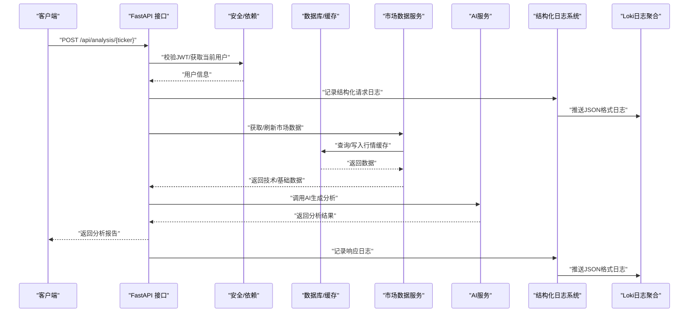
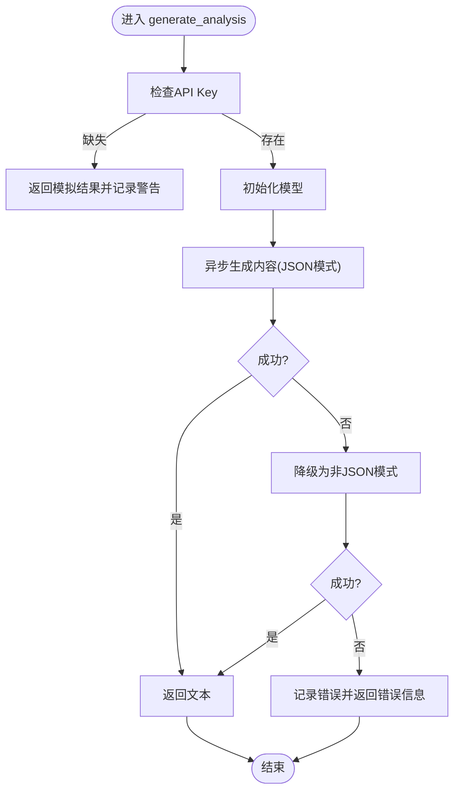
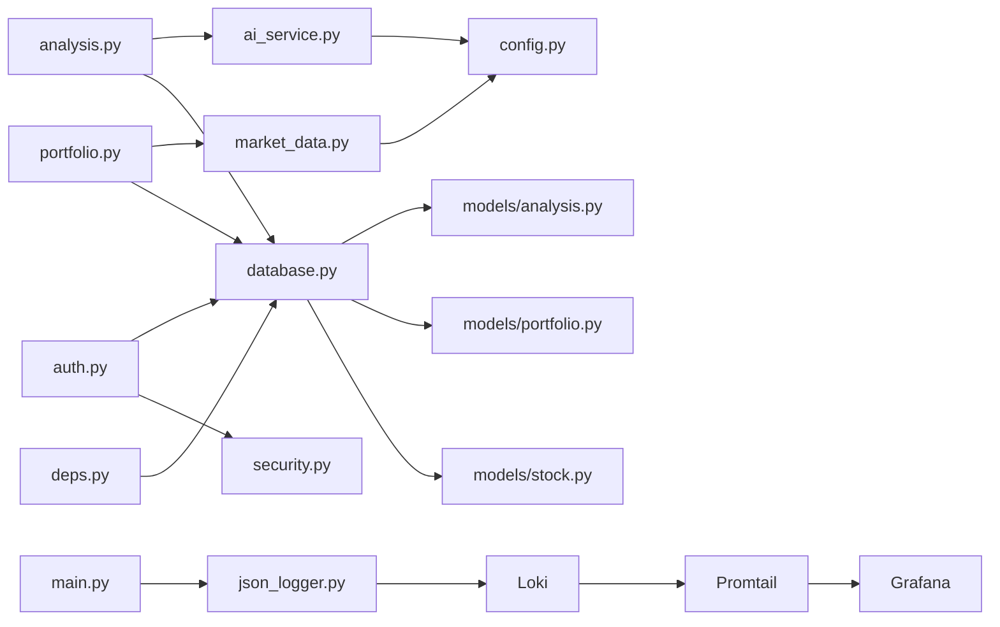

# 监控与日志管理

<cite>
**本文档引用的文件**
- [backend/app/main.py](file://backend/app/main.py)
- [backend/app/utils/json_logger.py](file://backend/app/utils/json_logger.py)
- [docker-compose.yml](file://docker-compose.yml)
- [monitoring/loki/loki-config.yaml](file://monitoring/loki/loki-config.yaml)
- [monitoring/promtail/promtail-config.yaml](file://monitoring/promtail/promtail-config.yaml)
- [monitoring/grafana/provisioning/datasources/datasources.yaml](file://monitoring/grafana/provisioning/datasources/datasources.yaml)
- [monitoring/grafana/provisioning/dashboards/dashboards.yaml](file://monitoring/grafana/provisioning/dashboards/dashboards.yaml)
- [monitoring/grafana/provisioning/dashboards/json/ai-stock-logs.json](file://monitoring/grafana/provisioning/dashboards/json/ai-stock-logs.json)
- [backend/app/api/v1/endpoints/analysis.py](file://backend/app/api/v1/endpoints/analysis.py)
- [backend/app/api/v1/endpoints/auth.py](file://backend/app/api/v1/endpoints/auth.py)
- [backend/app/services/ai_service.py](file://backend/app/services/ai_service.py)
- [backend/app/services/market_data.py](file://backend/app/services/market_data.py)
- [backend/app/core/config.py](file://backend/app/core/config.py)
- [backend/app/core/database.py](file://backend/app/core/database.py)
- [backend/app/core/security.py](file://backend/app/core/security.py)
- [backend/app/api/deps.py](file://backend/app/api/deps.py)
- [backend/app/models/stock.py](file://backend/app/models/stock.py)
- [backend/app/models/portfolio.py](file://backend/app/models/portfolio.py)
- [backend/app/models/analysis.py](file://backend/app/models/analysis.py)
</cite>

## 更新摘要
**所做更改**
- 新增完整的日志基础设施监控章节，包括Grafana Loki、Promtail、Grafana配置
- 更新日志管理策略，详细介绍结构化JSON日志系统
- 新增监控仪表板配置和关键指标定义
- 更新应用性能监控，包含新的日志聚合和分析能力
- 新增分布式追踪和日志分析工具章节

## 目录
1. [简介](#简介)
2. [项目结构](#项目结构)
3. [核心组件](#核心组件)
4. [架构总览](#架构总览)
5. [详细组件分析](#详细组件分析)
6. [日志基础设施监控](#日志基础设施监控)
7. [依赖分析](#依赖分析)
8. [性能考虑](#性能考虑)
9. [故障排查指南](#故障排查指南)
10. [结论](#结论)
11. [附录](#附录)

## 简介
本指南面向"AI股票顾问"项目的监控与日志管理，覆盖以下方面：
- 应用性能监控：指标采集与告警建议
- 日志管理策略：日志级别与轮转建议
- 数据库监控：查询性能与连接池监控
- AI服务调用监控：响应时间与错误率统计
- 系统资源监控：CPU、内存、磁盘使用
- 分布式追踪：OpenTelemetry集成建议
- 监控仪表板与关键指标定义
- 日志分析工具与故障诊断方法
- **新增**：完整的日志基础设施监控，包括Grafana Loki、Promtail、Grafana配置

本指南基于现有代码库进行分析与扩展建议，特别关注新增的监控和日志基础设施变更。

## 项目结构
后端采用FastAPI + SQLAlchemy异步ORM的分层架构：
- 应用入口与路由：在应用入口集中注册路由与健康检查
- 核心配置与数据库：统一读取环境变量与创建异步引擎
- API层：认证、用户、组合、分析等接口
- 服务层：AI服务与市场数据服务
- 模型层：数据库表结构与关系
- 安全与依赖：OAuth2令牌校验与数据库会话注入
- **新增**：日志基础设施：结构化JSON日志系统、Loki日志聚合、Promtail日志采集、Grafana可视化



**图表来源**
- [backend/app/main.py:1-170](file://backend/app/main.py#L1-L170)
- [backend/app/utils/json_logger.py:1-203](file://backend/app/utils/json_logger.py#L1-L203)
- [docker-compose.yml:74-131](file://docker-compose.yml#L74-L131)

**章节来源**
- [backend/app/main.py:1-170](file://backend/app/main.py#L1-L170)
- [backend/app/utils/json_logger.py:1-203](file://backend/app/utils/json_logger.py#L1-L203)
- [docker-compose.yml:1-138](file://docker-compose.yml#L1-L138)

## 核心组件
- 应用入口与健康检查：提供根路径与健康检查端点，便于外部监控系统探测
- 配置中心：集中读取数据库URL、API密钥、代理等配置
- 数据库层：异步SQLAlchemy引擎与会话工厂，支持SQLite/PostgreSQL等
- 安全模块：JWT生成与校验、密码哈希
- API层：认证、用户、组合、分析接口，统一依赖注入与JWT校验
- 服务层：AI服务与市场数据服务，包含重试、降级与缓存
- 模型层：股票、行情缓存、新闻、组合、分析记录等
- **新增**：结构化JSON日志系统：统一的日志格式化器，支持请求ID、用户ID、耗时等结构化字段
- **新增**：日志基础设施：Loki日志聚合、Promtail日志采集、Grafana可视化面板

**章节来源**
- [backend/app/main.py:15-27](file://backend/app/main.py#L15-L27)
- [backend/app/utils/json_logger.py:11-80](file://backend/app/utils/json_logger.py#L11-L80)
- [docker-compose.yml:74-131](file://docker-compose.yml#L74-L131)

## 架构总览
下图展示从客户端到AI与市场数据服务的调用链路，以及数据库交互、缓存策略和新增的日志基础设施。



**图表来源**
- [backend/app/api/v1/endpoints/analysis.py:44-51](file://backend/app/api/v1/endpoints/analysis.py#L44-L51)
- [backend/app/main.py:58-112](file://backend/app/main.py#L58-L112)
- [backend/app/utils/json_logger.py:37-80](file://backend/app/utils/json_logger.py#L37-L80)

## 详细组件分析

### 应用性能监控与告警
- 指标采集建议
  - 请求延迟：以接口维度统计P50/P90/P99延迟
  - 请求速率：每分钟/每小时请求数
  - 错误率：4xx/5xx错误占比
  - AI调用耗时：AI服务生成分析耗时分布
  - 市场数据获取耗时：yfinance/Alpha Vantage获取耗时
  - 数据库查询耗时：慢查询阈值与Top N SQL
  - **新增**：日志指标：ERROR/WARNING级别日志数量、日志总量统计
- 告警规则建议
  - 延迟超过阈值持续N分钟触发
  - 错误率超过阈值触发
  - AI/市场数据获取失败率上升触发
  - 数据库连接池耗尽或超时触发
  - **新增**：日志告警：ERROR日志量激增、特定错误类型告警
- 可观测性增强
  - 在关键函数入口/出口埋点，记录开始/结束时间与异常
  - 对外HTTP调用增加超时与重试策略并记录统计
  - **新增**：结构化日志记录，包含请求ID、用户ID、耗时等关键字段

**章节来源**
- [backend/app/api/v1/endpoints/analysis.py:44-51](file://backend/app/api/v1/endpoints/analysis.py#L44-L51)
- [backend/app/main.py:58-112](file://backend/app/main.py#L58-L112)
- [backend/app/utils/json_logger.py:37-80](file://backend/app/utils/json_logger.py#L37-L80)

### 日志管理策略
- 日志级别
  - 认证与安全：INFO记录成功登录；ERROR记录失败与异常
  - 市场数据：WARN记录外部API限流/失败；ERROR记录不可恢复错误
  - AI服务：ERROR记录外部模型调用异常；WARNING记录降级提示
  - 数据库：ERROR记录连接/事务异常；INFO记录慢查询阈值
- 日志轮转
  - 建议按大小轮转与按时间滚动，保留7-30天
  - 区分访问日志与应用日志，避免互相干扰
- 日志字段
  - 请求ID/TraceID、用户ID、接口名、参数摘要、耗时、状态码、错误信息
  - **新增**：结构化JSON字段：timestamp、level、logger、service、environment、file、line、function
- **新增**：结构化JSON日志系统
  - 统一的JSONFormatter类，输出标准化的JSON格式日志
  - 支持动态字段添加：request_id、user_id、duration_ms、status_code、method、path、ticker、error_type、stack_trace
  - 提供StandardFormatter用于开发环境的友好格式
  - 自动添加异常信息和堆栈跟踪

**章节来源**
- [backend/app/utils/json_logger.py:11-80](file://backend/app/utils/json_logger.py#L11-L80)
- [backend/app/utils/json_logger.py:111-166](file://backend/app/utils/json_logger.py#L111-L166)

### 数据库监控
- 连接池监控
  - 连接数上限、活跃连接、等待队列长度
  - 连接泄漏检测与超时回收
- 查询性能
  - 慢查询阈值与Top N SQL
  - 索引使用情况与执行计划分析
- 缓存策略
  - 行情缓存1分钟内命中优先，避免频繁外部调用
  - 缓存更新与一致性保障
- 关键表与索引
  - market_data_cache.last_updated建立索引以加速查询
  - stock_news.publish_time建立索引以加速新闻查询

```mermaid
erDiagram
STOCK {
string ticker PK
string name
string sector
string industry
float market_cap
float pe_ratio
float forward_pe
float eps
float dividend_yield
float beta
float fifty_two_week_high
float fifty_two_week_low
string currency
}
MARKET_DATA_CACHE {
string ticker PK,FK
float current_price
float change_percent
float rsi_14
float ma_20
float ma_50
float ma_200
float macd_val
float macd_signal
float macd_hist
float bb_upper
float bb_middle
float bb_lower
float atr_14
float k_line
float d_line
float j_line
float volume_ma_20
float volume_ratio
enum market_status
timestamp last_updated IDX
}
STOCK_NEWS {
string id PK
string ticker FK
string title
string publisher
string link
timestamp publish_time
string summary
string sentiment
}
PORTFOLIO {
string id PK
string user_id
string ticker FK
float quantity
float avg_cost
float target_price
float stop_loss_price
timestamp created_at
timestamp updated_at
}
ANALYSIS_REPORT {
string id PK
string user_id
string ticker FK
json input_context_snapshot
text ai_response_markdown
enum sentiment_score
string model_used
timestamp created_at IDX
}
STOCK ||--o{ MARKET_DATA_CACHE : "拥有"
STOCK ||--o{ STOCK_NEWS : "拥有"
STOCK ||--o{ PORTFOLIO : "被持有"
STOCK ||--o{ ANALYSIS_REPORT : "被分析"
```

**图表来源**
- [backend/app/models/stock.py:13-85](file://backend/app/models/stock.py#L13-L85)
- [backend/app/models/portfolio.py:7-26](file://backend/app/models/portfolio.py#L7-L26)
- [backend/app/models/analysis.py:12-25](file://backend/app/models/analysis.py#L12-L25)

**章节来源**
- [backend/app/core/database.py:5-23](file://backend/app/core/database.py#L5-L23)
- [backend/app/models/stock.py:33-67](file://backend/app/models/stock.py#L33-L67)
- [backend/app/api/portfolio.py:14-17](file://backend/app/api/portfolio.py#L14-L17)

### AI服务调用监控
- 指标
  - 响应时间：P50/P90/P99；JSON模式失败时的降级耗时
  - 错误率：外部模型调用异常、API Key缺失、降级失败
  - 使用量：按用户API Key维度统计调用量
- 建议
  - 对外部模型调用增加超时与指数退避重试
  - 记录输入上下文快照与输出摘要，便于审计与复现
  - 对免费用户添加配额与限流，防止滥用



**图表来源**
- [backend/app/services/ai_service.py:43-111](file://backend/app/services/ai_service.py#L43-L111)

**章节来源**
- [backend/app/services/ai_service.py:43-111](file://backend/app/services/ai_service.py#L43-L111)
- [backend/app/api/analysis.py:27-50](file://backend/app/api/analysis.py#L27-L50)

### 系统资源监控
- CPU
  - 进程CPU使用率、线程数、阻塞状态
- 内存
  - RSS/VMS、GC统计、内存峰值
- 磁盘
  - IO等待、队列长度、吞吐、空间使用
- 建议
  - 对外部HTTP调用设置合理超时与连接池大小
  - 对文件下载/缓存目录设置磁盘配额与清理策略

**章节来源**
- [backend/app/services/market_data.py:173-318](file://backend/app/services/market_data.py#L173-L318)

### 分布式追踪（OpenTelemetry）
- 建议
  - 在FastAPI中间件中注入TraceID与SpanID
  - 对外部HTTP调用（yfinance/Alpha Vantage）记录请求与响应
  - 对数据库操作记录SQL与参数摘要
  - 对AI服务调用记录模型名称与耗时
- 输出
  - TraceID/ParentID、服务名、接口名、耗时、状态码、错误栈

**章节来源**
- [backend/app/api/analysis.py:13-123](file://backend/app/api/analysis.py#L13-L123)
- [backend/app/services/market_data.py:14-170](file://backend/app/services/market_data.py#L14-L170)
- [backend/app/services/ai_service.py:43-111](file://backend/app/services/ai_service.py#L43-L111)

### 监控仪表板与关键指标
- 仪表板建议
  - 实时概览：请求速率、成功率、P99延迟、错误堆叠
  - AI服务：调用耗时分布、错误率、配额使用
  - 市场数据：外部API耗时分布、失败率、缓存命中率
  - 数据库：连接池使用、慢查询Top N、锁等待
  - **新增**：日志监控：日志级别分布、错误日志实时显示、日志总量统计
- 关键指标
  - SLA：P99延迟、可用性、错误率
  - 成本：外部API调用次数、存储增长
  - 安全：鉴权失败次数、异常登录
  - **新增**：日志质量：ERROR/WARNING级别日志比例、日志解析成功率

**章节来源**
- [backend/app/api/auth.py:24-50](file://backend/app/api/auth.py#L24-L50)
- [backend/app/api/analysis.py:27-50](file://backend/app/api/analysis.py#L27-L50)
- [backend/app/services/market_data.py:29-57](file://backend/app/services/market_data.py#L29-L57)
- [backend/app/services/ai_service.py:43-111](file://backend/app/services/ai_service.py#L43-L111)

## 日志基础设施监控

### Grafana Loki日志聚合系统
- **配置概述**
  - 轻量级日志聚合系统，专为云原生环境设计
  - 支持高基数标签查询和流式日志处理
  - 内置压缩与保留策略，支持7天内新样本拒绝
- **核心配置**
  - 服务器监听：HTTP 3100端口，gRPC 9096端口
  - 存储配置：本地文件系统存储chunks和rules
  - Schema配置：boltdb-shipper + v11 schema
  - 保留策略：744小时（31天）保留期，168小时（7天）旧样本拒绝
- **性能优化**
  - 结果缓存：嵌入式缓存，最大100MB
  - 并发查询：最大32个并行查询
  - Compactor：10分钟压缩间隔，启用31天保留

**章节来源**
- [monitoring/loki/loki-config.yaml:1-63](file://monitoring/loki/loki-config.yaml#L1-L63)

### Promtail日志采集代理
- **多源日志采集**
  - Docker容器日志：通过Docker Socket自动发现容器
  - 后端应用日志：静态配置收集JSON格式日志
  - 前端日志：收集Next.js应用日志
  - 系统日志：收集Linux syslog
  - 调度器任务日志：专门的后台任务日志管道
  - 数据库日志：PostgreSQL访问日志解析
- **日志管道处理**
  - JSON解析：自动解析timestamp、level、logger、message、request_id等字段
  - 标签设置：自动提取日志级别、请求ID、用户ID等标签
  - 时间戳处理：支持RFC3339Nano格式解析
  - 正则表达式：用于非JSON格式日志的结构化提取
- **标签体系**
  - job：日志作业名称（backend、frontend、system、scheduler、postgres）
  - service：服务名称（ai-stock-advisor）
  - container_name：容器名称
  - project：Docker Compose项目名
  - host：主机名
  - level：日志级别（ERROR、WARNING、INFO、DEBUG）

**章节来源**
- [monitoring/promtail/promtail-config.yaml:1-142](file://monitoring/promtail/promtail-config.yaml#L1-L142)

### Grafana日志可视化面板
- **数据源配置**
  - Loki数据源：默认数据源，URL指向http://loki:3100
  - 最大行数：1000行
  - 派生字段：支持TraceID关联到Jaeger（可选）
- **仪表板配置**
  - 自动配置：Grafana Dashboard Provisioning
  - 文件夹：AI-Stock-Advisor，UID：ai-stock-advisor
  - 更新间隔：30秒
  - 路径：/etc/grafana/provisioning/dashboards/json
- **核心面板**
  - 日志级别分布：按级别统计日志数量
  - 错误日志面板：实时显示ERROR级别日志
  - 警告日志面板：实时显示WARNING级别日志
  - 统计面板：ERROR/WARNING总数和日志总量
  - 调度任务日志：后台任务执行日志
  - 日志搜索：全文搜索功能，支持正则表达式

**章节来源**
- [monitoring/grafana/provisioning/datasources/datasources.yaml:1-21](file://monitoring/grafana/provisioning/datasources/datasources.yaml#L1-L21)
- [monitoring/grafana/provisioning/dashboards/dashboards.yaml:1-16](file://monitoring/grafana/provisioning/dashboards/dashboards.yaml#L1-L16)
- [monitoring/grafana/provisioning/dashboards/json/ai-stock-logs.json:1-367](file://monitoring/grafana/provisioning/dashboards/json/ai-stock-logs.json#L1-L367)

### 结构化JSON日志系统
- **JSONFormatter类**
  - 统一的JSON格式化器，输出标准化日志格式
  - 必需字段：timestamp、level、logger、message、service、environment
  - 动态字段：request_id、user_id、duration_ms、status_code、method、path、ticker、error_type、stack_trace
  - 位置信息：file、line、function
  - 异常处理：自动捕获异常信息和堆栈跟踪
- **日志上下文管理**
  - LogContext类：提供上下文管理器，自动添加额外字段
  - 支持info、warning、error、debug方法
  - 线程安全的日志记录
- **配置选项**
  - 支持JSON和标准两种格式
  - 可配置服务名称和环境标识
  - 自动降低第三方库日志级别
  - 支持文件和控制台双重输出

**章节来源**
- [backend/app/utils/json_logger.py:11-80](file://backend/app/utils/json_logger.py#L11-L80)
- [backend/app/utils/json_logger.py:169-203](file://backend/app/utils/json_logger.py#L169-L203)

### Docker Compose部署配置
- **服务编排**
  - Loki：日志聚合服务，端口3100映射
  - Promtail：日志采集代理，依赖Loki健康检查
  - Grafana：可视化面板，端口3001映射
  - 后端应用：通过json-file驱动记录日志
- **卷挂载**
  - Loki数据卷：/loki目录
  - Promtail位置文件：/tmp/positions.yaml
  - Grafana数据卷：/var/lib/grafana
  - 应用日志卷：/var/log/app
- **配置文件**
  - Loki配置：./monitoring/loki/loki-config.yaml
  - Promtail配置：./monitoring/promtail/promtail-config.yaml
  - Grafana配置：./monitoring/grafana/provisioning

**章节来源**
- [docker-compose.yml:74-131](file://docker-compose.yml#L74-L131)

## 依赖分析
- 组件耦合
  - API层依赖安全模块与数据库；服务层依赖配置与外部API
  - 模型层为数据契约，被API与服务层广泛使用
  - **新增**：日志基础设施独立部署，通过网络通信
- 外部依赖
  - Google Generative AI、yfinance、Alpha Vantage、SQLite/PostgreSQL
  - **新增**：Grafana、Loki、Promtail、Docker Compose
- 循环依赖
  - 未发现循环导入；各层职责清晰
  - **新增**：日志系统采用松耦合设计，通过网络协议通信



**图表来源**
- [backend/app/api/auth.py:1-88](file://backend/app/api/auth.py#L1-L88)
- [backend/app/api/deps.py:1-44](file://backend/app/api/deps.py#L1-L44)
- [backend/app/api/portfolio.py:1-297](file://backend/app/api/portfolio.py#L1-L297)
- [backend/app/api/analysis.py:1-124](file://backend/app/api/analysis.py#L1-L124)
- [backend/app/services/ai_service.py:1-516](file://backend/app/services/ai_service.py#L1-L516)
- [backend/app/services/market_data.py:1-370](file://backend/app/services/market_data.py#L1-L370)
- [backend/app/core/config.py:1-24](file://backend/app/core/config.py#L1-L24)
- [backend/app/core/database.py:1-24](file://backend/app/core/database.py#L1-L24)
- [backend/app/utils/json_logger.py:1-203](file://backend/app/utils/json_logger.py#L1-L203)
- [backend/app/main.py:1-170](file://backend/app/main.py#L1-L170)

**章节来源**
- [backend/app/api/auth.py:1-88](file://backend/app/api/auth.py#L1-L88)
- [backend/app/api/deps.py:1-44](file://backend/app/api/deps.py#L1-L44)
- [backend/app/api/portfolio.py:1-297](file://backend/app/api/portfolio.py#L1-L297)
- [backend/app/api/analysis.py:1-124](file://backend/app/api/analysis.py#L1-L124)
- [backend/app/services/ai_service.py:1-516](file://backend/app/services/ai_service.py#L1-L516)
- [backend/app/services/market_data.py:1-370](file://backend/app/services/market_data.py#L1-L370)
- [backend/app/core/config.py:1-24](file://backend/app/core/config.py#L1-L24)
- [backend/app/core/database.py:1-24](file://backend/app/core/database.py#L1-L24)
- [backend/app/utils/json_logger.py:1-203](file://backend/app/utils/json_logger.py#L1-L203)
- [backend/app/main.py:1-170](file://backend/app/main.py#L1-L170)

## 性能考虑
- 异步与并发
  - 使用异步SQLAlchemy与事件循环，减少阻塞
  - 对外部API调用使用超时与并发限制
- 缓存与降级
  - 行情缓存1分钟，避免重复拉取
  - 外部API失败时使用半真实模拟数据
- 数据库优化
  - 为高频查询字段建立索引（如last_updated、publish_time）
  - 批量写入与事务合并提交
- 外部API限流
  - yfinance遇到429时采用指数退避与随机抖动
  - Alpha Vantage注意频率限制与配额
- **新增**：日志系统性能优化
  - 结构化JSON日志减少解析开销
  - Promtail管道处理提升日志处理效率
  - Loki压缩策略减少存储占用
  - Grafana查询缓存提升面板加载速度

**章节来源**
- [backend/app/core/database.py:5-23](file://backend/app/core/database.py#L5-L23)
- [backend/app/services/market_data.py:22-23](file://backend/app/services/market_data.py#L22-L23)
- [backend/app/services/market_data.py:308-316](file://backend/app/services/market_data.py#L308-L316)
- [backend/app/models/stock.py:64-65](file://backend/app/models/stock.py#L64-L65)
- [monitoring/loki/loki-config.yaml:24-28](file://monitoring/loki/loki-config.yaml#L24-L28)

## 故障排查指南
- 健康检查
  - 访问根路径与健康检查端点确认服务存活
- 认证问题
  - 检查JWT签名算法与密钥；核对用户是否存在与密码正确
- 数据库问题
  - 检查连接字符串与驱动；确认迁移脚本执行
- 外部API问题
  - 核对API Key与代理配置；查看限流与错误日志
- AI服务问题
  - 检查API Key是否配置；关注降级路径与错误返回
- **新增**：日志系统故障排查
  - 检查Loki服务状态：curl http://localhost:3100/ready
  - 验证Promtail配置：查看日志采集是否正常
  - Grafana数据源连接：确认Loki数据源配置正确
  - 结构化日志格式：验证JSON日志格式是否正确
  - 日志搜索：使用Grafana面板进行日志检索和分析
- 日志定位
  - 使用TraceID关联请求链路；结合错误码与异常栈快速定位
  - **新增**：使用日志级别过滤：ERROR/WARNING/INFO/DEBUG
  - **新增**：使用请求ID关联：在日志中搜索特定request_id

**章节来源**
- [backend/app/main.py:31-37](file://backend/app/main.py#L31-L37)
- [backend/app/api/auth.py:38-43](file://backend/app/api/auth.py#L38-L43)
- [backend/app/api/deps.py:21-33](file://backend/app/api/deps.py#L21-L33)
- [backend/app/core/config.py:13-17](file://backend/app/core/config.py#L13-L17)
- [backend/app/services/ai_service.py:18-18](file://backend/app/services/ai_service.py#L18-L18)
- [backend/app/services/market_data.py:36-46](file://backend/app/services/market_data.py#L36-L46)
- [docker-compose.yml:87-91](file://docker-compose.yml#L87-L91)

## 结论
本项目具备良好的监控与日志管理基础：统一的配置中心、异步数据库、明确的API边界与服务层封装。**新增的完整日志基础设施**进一步增强了系统的可观测性：

- **结构化JSON日志系统**：统一的日志格式，便于后续分析和检索
- **Loki日志聚合**：轻量级、高性能的日志存储和查询系统
- **Promtail日志采集**：多源日志采集，支持Docker容器、应用文件、系统日志等
- **Grafana可视化**：直观的日志监控面板，支持实时日志查看和分析

建议在此基础上继续完善：
- 标准化日志与结构化字段
- OpenTelemetry分布式追踪
- 指标采集与告警规则
- 数据库慢查询与连接池监控
- 外部API调用的可观测性与降级策略
- **新增**：日志基础设施的监控和告警机制

## 附录
- 环境变量示例
  - 数据库URL、Gemini/DeepSeek API Key、Secret Key、前端API地址
  - **新增**：LOG_FORMAT=json、LOG_LEVEL=INFO、ENVIRONMENT=production
- 建议的监控项清单
  - 接口级延迟与错误率、AI调用耗时与失败率、外部API调用统计、数据库连接池与慢查询、系统资源使用
  - **新增**：日志级别分布、ERROR/WARNING日志统计、日志总量趋势、日志解析成功率
- **新增**：日志基础设施配置清单
  - Loki配置文件：monitoring/loki/loki-config.yaml
  - Promtail配置文件：monitoring/promtail/promtail-config.yaml
  - Grafana数据源配置：monitoring/grafana/provisioning/datasources/datasources.yaml
  - Grafana仪表板配置：monitoring/grafana/provisioning/dashboards/dashboards.yaml
  - 仪表板JSON：monitoring/grafana/provisioning/dashboards/json/ai-stock-logs.json

**章节来源**
- [.env.example:1-9](file://.env.example#L1-L9)
- [backend/app/core/config.py:4-23](file://backend/app/core/config.py#L4-L23)
- [backend/app/utils/json_logger.py:111-166](file://backend/app/utils/json_logger.py#L111-L166)
- [monitoring/loki/loki-config.yaml:1-63](file://monitoring/loki/loki-config.yaml#L1-L63)
- [monitoring/promtail/promtail-config.yaml:1-142](file://monitoring/promtail/promtail-config.yaml#L1-L142)
- [monitoring/grafana/provisioning/datasources/datasources.yaml:1-21](file://monitoring/grafana/provisioning/datasources/datasources.yaml#L1-L21)
- [monitoring/grafana/provisioning/dashboards/dashboards.yaml:1-16](file://monitoring/grafana/provisioning/dashboards/dashboards.yaml#L1-L16)
- [monitoring/grafana/provisioning/dashboards/json/ai-stock-logs.json:1-367](file://monitoring/grafana/provisioning/dashboards/json/ai-stock-logs.json#L1-L367)