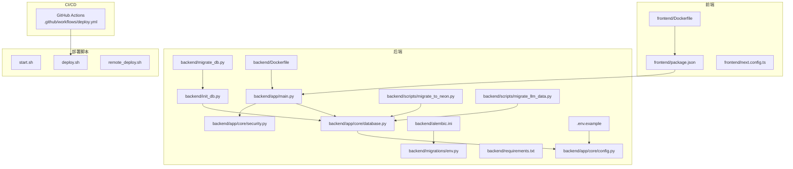
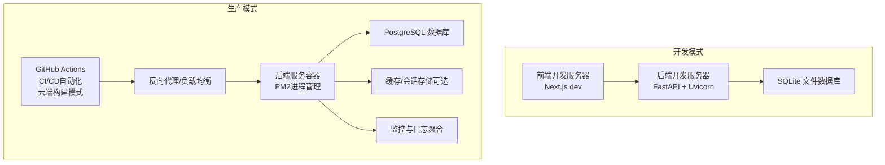
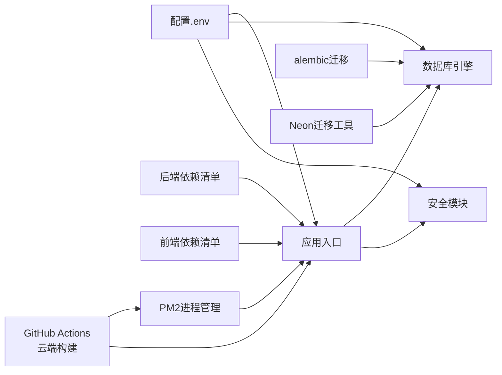

# 部署与运维

<cite>
**本文引用的文件**
- [README.md](file://README.md)
- [start.sh](file://start.sh)
- [deploy.sh](file://deploy.sh)
- [remote_deploy.sh](file://remote_deploy.sh)
- [.github/workflows/deploy.yml](file://.github/workflows/deploy.yml)
- [docker-compose.yml](file://docker-compose.yml)
- [backend/Dockerfile](file://backend/Dockerfile)
- [frontend/Dockerfile](file://frontend/Dockerfile)
- [backend/app/main.py](file://backend/app/main.py)
- [backend/app/core/config.py](file://backend/app/core/config.py)
- [backend/app/core/database.py](file://backend/app/core/database.py)
- [backend/app/core/security.py](file://backend/app/core/security.py)
- [backend/requirements.txt](file://backend/requirements.txt)
- [backend/.env](file://backend/.env)
- [.env.example](file://.env.example)
- [backend/init_db.py](file://backend/init_db.py)
- [backend/migrate_db.py](file://backend/migrate_db.py)
- [backend/alembic.ini](file://backend/alembic.ini)
- [backend/migrations/env.py](file://backend/migrations/env.py)
- [backend/scripts/migrate_to_neon.py](file://backend/scripts/migrate_to_neon.py)
- [backend/scripts/migrate_llm_data.py](file://backend/scripts/migrate_llm_data.py)
- [frontend/package.json](file://frontend/package.json)
- [frontend/next.config.ts](file://frontend/next.config.ts)
- [doc/tech_stack.md](file://doc/tech_stack.md)
</cite>

## 更新摘要
**所做更改**
- 更新GitHub Actions CI/CD自动化部署系统章节，反映新增的PostgreSQL部署步骤和alembic数据库迁移过程
- 新增数据库迁移与升级章节，详细说明alembic配置和迁移流程
- 更新部署流程章节，包含云端构建、文件同步和服务器端最终化的完整三阶段流程
- 新增数据库迁移脚本说明，包括Neon PostgreSQL迁移和LLM数据迁移
- 更新监控与日志管理章节，包含数据库连接监控

## 目录
1. [简介](#简介)
2. [项目结构](#项目结构)
3. [核心组件](#核心组件)
4. [架构总览](#架构总览)
5. [详细组件分析](#详细组件分析)
6. [依赖关系分析](#依赖关系分析)
7. [性能考虑](#性能考虑)
8. [故障排除指南](#故障排除指南)
9. [结论](#结论)
10. [附录](#附录)

## 简介
本指南面向部署与运维团队，覆盖从开发环境搭建到生产部署、CI/CD 设计、监控与日志、备份与灾备、扩展性与安全加固，以及故障排除与自动化运维工具使用。项目采用前后端分离架构：后端基于 FastAPI（Python），前端基于 Next.js（TypeScript）。数据库默认使用 SQLite（开发环境），支持通过环境变量切换到PostgreSQL（生产环境）。现已集成GitHub Actions自动化部署系统，支持多种部署方式和PM2进程管理。**重大更新**：GitHub Actions工作流已从直接服务器构建迁移到云端构建模式，采用三阶段部署流程以提升性能和可靠性，并集成了alembic数据库迁移功能。

## 项目结构
- 后端（FastAPI）：应用入口、路由、中间件、配置、数据库连接与会话、安全工具等。
- 前端（Next.js）：TypeScript 应用，开发与构建脚本，样式与 UI 组件。
- 文档：技术栈与开发规范说明。
- 脚本：一键启动脚本，数据库初始化与迁移脚本，多种部署脚本。
- GitHub Actions：自动化CI/CD流水线，支持云端部署。
- 数据库迁移：alembic配置与迁移脚本，支持PostgreSQL部署。

**图表来源**
- [backend/app/main.py](file://backend/app/main.py#L1-L131)
- [backend/app/core/config.py](file://backend/app/core/config.py#L1-L28)
- [backend/app/core/database.py](file://backend/app/core/database.py#L1-L69)
- [backend/app/core/security.py](file://backend/app/core/security.py#L1-L26)
- [backend/requirements.txt](file://backend/requirements.txt#L1-L77)
- [backend/init_db.py](file://backend/init_db.py#L1-L84)
- [backend/migrate_db.py](file://backend/migrate_db.py#L1-L30)
- [backend/alembic.ini](file://backend/alembic.ini#L1-L148)
- [backend/migrations/env.py](file://backend/migrations/env.py#L1-L86)
- [backend/scripts/migrate_to_neon.py](file://backend/scripts/migrate_to_neon.py#L1-L126)
- [backend/scripts/migrate_llm_data.py](file://backend/scripts/migrate_llm_data.py#L1-L59)
- [frontend/package.json](file://frontend/package.json#L1-L43)
- [frontend/next.config.ts](file://frontend/next.config.ts#L1-L8)
- [.env.example](file://.env.example#L1-L10)
- [start.sh](file://start.sh#L1-L61)
- [deploy.sh](file://deploy.sh#L1-L52)
- [remote_deploy.sh](file://remote_deploy.sh#L1-L80)
- [.github/workflows/deploy.yml](file://.github/workflows/deploy.yml#L1-L74)

**章节来源**
- [README.md](file://README.md#L1-L50)
- [doc/tech_stack.md](file://doc/tech_stack.md#L1-L51)

## 核心组件
- 应用入口与路由：定义 FastAPI 实例、CORS 中间件、健康检查端点与业务路由挂载。
- 配置系统：通过 Pydantic Settings 读取 .env 环境变量，支持数据库连接串、密钥、外部 API 密钥等。
- 数据库层：异步 SQLAlchemy 引擎与会话工厂，支持 SQLite（开发）与 PostgreSQL（生产）数据库。
- 安全模块：密码哈希、JWT 签发与校验，令牌过期时间配置。
- 前端构建与运行：Next.js 开发服务器与构建脚本，公共 API 地址通过环境变量注入。
- 初始化与迁移：自动建表与种子数据插入；历史数据库列迁移脚本；alembic数据库迁移。
- **新增** 数据库迁移：支持PostgreSQL部署，包含alembic配置、迁移脚本和Neon PostgreSQL迁移工具。
- **新增** PM2进程管理：生产环境使用PM2管理后端服务进程，支持进程监控、自动重启和负载均衡。
- **新增** GitHub Actions自动化：完整的CI/CD流水线，支持云端自动部署到阿里云服务器，采用三阶段部署模式。

**章节来源**
- [backend/app/main.py](file://backend/app/main.py#L1-L131)
- [backend/app/core/config.py](file://backend/app/core/config.py#L1-L28)
- [backend/app/core/database.py](file://backend/app/core/database.py#L1-L69)
- [backend/app/core/security.py](file://backend/app/core/security.py#L1-L26)
- [frontend/package.json](file://frontend/package.json#L1-L43)
- [backend/init_db.py](file://backend/init_db.py#L1-L84)
- [backend/migrate_db.py](file://backend/migrate_db.py#L1-L30)
- [backend/alembic.ini](file://backend/alembic.ini#L1-L148)
- [backend/migrations/env.py](file://backend/migrations/env.py#L1-L86)
- [backend/scripts/migrate_to_neon.py](file://backend/scripts/migrate_to_neon.py#L1-L126)
- [backend/scripts/migrate_llm_data.py](file://backend/scripts/migrate_llm_data.py#L1-L59)
- [.github/workflows/deploy.yml](file://.github/workflows/deploy.yml#L1-L74)

## 架构总览
下图展示开发与生产两种运行模式的关键差异：开发模式使用本地 SQLite 与本地前端服务，生产模式建议使用容器化部署、PostgreSQL数据库与反向代理，支持PM2进程管理和GitHub Actions自动化部署。**重大更新**：生产模式现采用云端构建的三阶段部署流程，显著提升部署效率和可靠性，并支持PostgreSQL数据库部署。

**图表来源**
- [backend/app/main.py](file://backend/app/main.py#L1-L131)
- [backend/app/core/config.py](file://backend/app/core/config.py#L1-L28)
- [backend/app/core/database.py](file://backend/app/core/database.py#L1-L69)
- [frontend/package.json](file://frontend/package.json#L1-L43)
- [.github/workflows/deploy.yml](file://.github/workflows/deploy.yml#L1-L74)

## 详细组件分析

### 开发环境搭建
- 依赖安装
  - 后端：使用虚拟环境安装 requirements.txt 中的依赖，包括alembic数据库迁移工具。
  - 前端：安装 Node.js 与 npm，执行依赖安装。
- 环境变量
  - 复制 .env.example 并根据需要填写数据库连接串、外部 API 密钥、JWT 密钥等。
  - 前端通过 NEXT_PUBLIC_API_URL 指定后端 API 地址。
  - 开发环境默认使用SQLite数据库，无需额外数据库服务。
- 本地数据库
  - 默认使用 SQLite（本地文件），无需额外数据库服务。
  - 可通过 DATABASE_URL 切换至PostgreSQL（需相应驱动）。
- 一键启动
  - 使用 start.sh 自动安装依赖并启动前后端服务，便于快速验证。

**章节来源**
- [README.md](file://README.md#L14-L44)
- [start.sh](file://start.sh#L1-L61)
- [.env.example](file://.env.example#L1-L10)
- [backend/requirements.txt](file://backend/requirements.txt#L1-L77)
- [frontend/package.json](file://frontend/package.json#L1-L43)

### 生产环境部署策略
- 容器化部署
  - 建议为后端与前端分别构建镜像，使用 Docker Compose 或 Kubernetes 编排。
  - 反向代理（如 Nginx）统一入口、静态资源分发与 SSL 终止。
  - **更新** PM2进程管理：后端使用PM2管理进程，支持进程监控、自动重启和负载均衡。
- 云平台配置
  - 数据库：使用托管PostgreSQL数据库（如Neon），开启SSL连接和备份策略。
  - 存储：对象存储用于静态资源或日志归档。
  - 安全：启用 WAF、DDoS 防护与网络 ACL；仅开放必要端口。
- 配置管理
  - 将敏感配置（数据库密码、API 密钥、JWT 密钥）置于密钥管理服务或环境变量注入。
  - 不将 .env 或配置文件提交到版本库。

**章节来源**
- [backend/app/core/config.py](file://backend/app/core/config.py#L1-L28)
- [backend/app/core/database.py](file://backend/app/core/database.py#L1-L69)
- [doc/tech_stack.md](file://doc/tech_stack.md#L31-L50)
- [backend/Dockerfile](file://backend/Dockerfile#L1-L29)

### CI/CD 流水线设计
- **重大更新** GitHub Actions自动化部署（云端构建模式）
  - **三阶段部署流程**：
    1. **云端构建阶段**：在GitHub Actions环境中构建前端（Node.js 20），使用npm镜像加速下载
    2. **文件同步阶段**：通过SSH将构建产物同步到阿里云服务器，仅传输必要的构建文件
    3. **服务器端最终化**：在服务器上安装后端依赖并启动PM2进程
  - **数据库迁移**：在服务器端执行alembic数据库迁移，确保数据库结构与代码同步
  - **部署目标**：阿里云服务器，使用SSH密钥认证。
  - **部署优势**：云端构建利用GitHub Actions的强大计算资源，避免服务器端构建压力；三阶段分离提升部署可靠性。
- 传统部署方式
  - 本地Docker Compose部署：使用deploy.sh脚本，支持容器化部署与数据库迁移。
  - 远程部署：使用remote_deploy.sh脚本，支持rsync文件同步和远程容器编排。
- 流水线步骤
  - 代码检查：类型检查、格式化与 Lint。
  - 单元与集成测试：后端单元测试、数据库迁移一致性检查。
  - 构建与打包：后端编译/打包、前端构建产物生成。
  - 安全扫描：依赖漏洞扫描、密钥泄露检测。
  - 部署：镜像推送、编排文件更新、滚动发布。
- 回滚策略
  - 版本化镜像与配置；支持灰度发布与快速回滚。

**章节来源**
- [.github/workflows/deploy.yml](file://.github/workflows/deploy.yml#L1-L74)
- [deploy.sh](file://deploy.sh#L1-L52)
- [remote_deploy.sh](file://remote_deploy.sh#L1-L80)
- [backend/requirements.txt](file://backend/requirements.txt#L1-L77)
- [frontend/package.json](file://frontend/package.json#L1-L43)
- [backend/init_db.py](file://backend/init_db.py#L1-L84)

### 数据库迁移与升级
- **新增** alembic数据库迁移
  - 配置文件：alembic.ini定义迁移脚本位置、日志配置和数据库URL模板
  - 环境配置：migrations/env.py集成应用配置和模型元数据
  - 支持PostgreSQL：自动检测数据库类型并配置SSL连接
  - 异步迁移：支持异步数据库连接和批量迁移操作
- **新增** Neon PostgreSQL迁移工具
  - migrate_to_neon.py提供从SQLite到PostgreSQL的完整数据迁移
  - 支持类型转换、数据验证和批量迁移
  - 包含详细的迁移报告和错误处理
- **新增** LLM数据迁移
  - migrate_llm_data.py处理LLM相关数据表的列结构更新
  - 支持浮点数类型的字段添加和现有数据兼容
- **新增** 数据库初始化
  - init_db.py提供完整的表结构创建和种子数据插入
  - init_db_tables.py专注于基础表结构初始化

**章节来源**
- [backend/alembic.ini](file://backend/alembic.ini#L1-L148)
- [backend/migrations/env.py](file://backend/migrations/env.py#L1-L86)
- [backend/scripts/migrate_to_neon.py](file://backend/scripts/migrate_to_neon.py#L1-L126)
- [backend/scripts/migrate_llm_data.py](file://backend/scripts/migrate_llm_data.py#L1-L59)
- [backend/init_db.py](file://backend/init_db.py#L1-L84)
- [backend/init_db_tables.py](file://backend/init_db_tables.py#L1-L16)

### 监控与日志管理
- 性能监控
  - 后端：暴露指标端点（Prometheus Exporter）、慢查询与错误率统计。
  - 前端：页面加载时长、错误上报（如 Sentry）。
  - **更新** PM2监控：使用PM2内置监控功能，实时查看CPU、内存使用情况和进程状态。
  - **新增** 数据库监控：监控数据库连接池状态、查询性能和SSL连接状态。
- 日志管理
  - 结构化日志输出到标准输出/标准错误，配合集中式日志收集（如 ELK/Vector/Fluent Bit）。
  - 区分访问日志与应用日志，设置轮转策略。
  - **更新** PM2日志：PM2自动管理应用日志，支持日志轮转和查询。
- 健康检查
  - 使用 /health 探针进行存活与就绪检查，结合反向代理与编排平台实现自动重启与扩缩容。

**章节来源**
- [backend/app/main.py](file://backend/app/main.py#L121-L125)
- [backend/app/core/database.py](file://backend/app/core/database.py#L18-L34)
- [.github/workflows/deploy.yml](file://.github/workflows/deploy.yml#L72-L73)

### 备份与灾难恢复
- 数据备份
  - 数据库：定时快照/逻辑备份；对PostgreSQL数据库开启增量备份与跨区复制。
  - 配置与静态资源：版本化存储，定期校验恢复演练。
  - **更新** PM2配置：PM2配置文件持久化，支持进程状态恢复。
- 灾难恢复
  - 定义 RPO/RTO 目标；多可用区部署；故障转移与数据同步机制。
  - 恢复流程文档化并定期演练。
  - **更新** 自动恢复：PM2自动重启失败进程，减少人工干预。
- **新增** 数据库备份策略
  - PostgreSQL：使用pg_dump进行逻辑备份，支持增量备份和恢复验证。
  - SQLite：支持WAL模式下的在线备份和恢复。

**章节来源**
- [backend/app/core/database.py](file://backend/app/core/database.py#L1-L69)
- [backend/migrate_db.py](file://backend/migrate_db.py#L1-L30)
- [backend/scripts/migrate_to_neon.py](file://backend/scripts/migrate_to_neon.py#L1-L126)
- [.github/workflows/deploy.yml](file://.github/workflows/deploy.yml#L72-L73)

### 扩展性配置
- 负载均衡
  - 反向代理分发请求至多个后端实例；启用会话亲和或无状态设计。
  - **更新** PM2集群：PM2支持多进程模式，自动实现负载均衡。
- 水平扩展
  - 无状态后端：通过容器编排实现弹性伸缩；共享数据库与缓存。
  - 缓存：引入 Redis 提升热点数据访问性能。
  - **更新** PM2进程池：配置工作进程数量，支持动态扩展。
- 数据库扩展
  - 主从复制、只读副本与读写分离；分库分表（按用户或时间维度）。
  - **新增** PostgreSQL扩展：支持连接池优化、SSL连接和异步操作。

**章节来源**
- [backend/app/main.py](file://backend/app/main.py#L1-L131)
- [backend/app/core/database.py](file://backend/app/core/database.py#L1-L69)
- [backend/Dockerfile](file://backend/Dockerfile#L25-L29)

### 安全加固
- 网络与访问控制
  - 仅开放 80/443 与管理端口；使用防火墙/安全组限制来源 IP。
- 传输安全
  - 强制 HTTPS，使用 Let's Encrypt 或商业证书；禁用弱加密套件。
  - **新增** 数据库SSL：PostgreSQL连接强制SSL，支持Neon等托管数据库。
- 应用安全
  - CORS 白名单收窄至生产域名；JWT 密钥随机化且定期轮换；最小权限原则。
- 外部 API 安全
  - 密钥注入与轮换；速率限制与熔断；日志脱敏。
- **新增** PM2安全配置
  - 进程权限管理，避免高权限运行。
  - 日志审计，记录进程启动/停止事件。

**章节来源**
- [backend/app/main.py](file://backend/app/main.py#L94-L113)
- [backend/app/core/security.py](file://backend/app/core/security.py#L1-L26)
- [backend/app/core/config.py](file://backend/app/core/config.py#L8-L22)
- [backend/app/core/database.py](file://backend/app/core/database.py#L18-L23)

### 运维工具与自动化脚本
- 启动脚本
  - start.sh：自动安装依赖、启动后端与前端，便于本地联调。
- 数据库初始化
  - init_db.py：自动建表与种子数据插入；适合首次部署或测试环境。
  - init_db_tables.py：仅初始化基础表结构。
  - migrate_db.py：历史数据库列迁移脚本，处理字段变更。
- **重大更新** GitHub Actions自动化（云端构建模式）
  - deploy.yml：完整的三阶段CI/CD流水线，支持云端自动部署。
  - 云端构建：在GitHub Actions环境中进行前端构建，利用云端资源。
  - 服务器端最终化：仅在服务器上安装依赖和启动进程。
  - **新增** 数据库迁移：自动执行alembic数据库迁移。
- **新增** 数据库迁移工具
  - migrate_to_neon.py：从SQLite到PostgreSQL的完整数据迁移工具。
  - migrate_llm_data.py：LLM相关数据表的列结构更新工具。
- **新增** PM2进程管理
  - 生产环境使用PM2管理后端服务，支持进程监控、自动重启和负载均衡。
- **新增** 多环境部署脚本
  - deploy.sh：本地Docker Compose部署脚本。
  - remote_deploy.sh：远程部署脚本，支持rsync文件同步。
- 其他建议
  - 编写部署脚本（Ansible/Chef/Puppet）或使用 GitOps 工具（Argo/Flux）。
  - 使用 Terraform/Helm 管理基础设施与应用清单。

**章节来源**
- [start.sh](file://start.sh#L1-L61)
- [deploy.sh](file://deploy.sh#L1-L52)
- [remote_deploy.sh](file://remote_deploy.sh#L1-L80)
- [.github/workflows/deploy.yml](file://.github/workflows/deploy.yml#L1-L74)
- [backend/init_db.py](file://backend/init_db.py#L1-L84)
- [backend/migrate_db.py](file://backend/migrate_db.py#L1-L30)
- [backend/scripts/migrate_to_neon.py](file://backend/scripts/migrate_to_neon.py#L1-L126)
- [backend/scripts/migrate_llm_data.py](file://backend/scripts/migrate_llm_data.py#L1-L59)

## 依赖关系分析
- 后端依赖
  - FastAPI、SQLAlchemy AsyncIO、Pydantic Settings、Uvicorn、Passlib、PyJWT 等。
  - 金融与 AI 相关库：yfinance、google-generativeai、openai 等。
  - **新增** 数据库迁移：alembic 1.18.1、asyncpg 0.31.0、SQLAlchemy 2.0.45。
  - **新增** PM2：生产环境进程管理工具。
- 前端依赖
  - Next.js、Axios、React Hooks、Tailwind CSS、Radix UI 等。
- 关键耦合点
  - 后端通过 .env 注入数据库与密钥；前端通过 NEXT_PUBLIC_API_URL 访问后端。
  - 数据库引擎与会话工厂在后端内部解耦，便于替换驱动。
  - **新增** alembic与数据库配置耦合，实现自动化迁移。
  - **新增** PM2与后端服务耦合，实现进程级别的监控与管理。
  - **重大更新** GitHub Actions与云端构建环境耦合，实现三阶段部署流程。

**图表来源**
- [backend/app/core/config.py](file://backend/app/core/config.py#L1-L28)
- [backend/app/main.py](file://backend/app/main.py#L1-L131)
- [backend/requirements.txt](file://backend/requirements.txt#L1-L77)
- [frontend/package.json](file://frontend/package.json#L1-L43)
- [backend/alembic.ini](file://backend/alembic.ini#L1-L148)
- [backend/scripts/migrate_to_neon.py](file://backend/scripts/migrate_to_neon.py#L1-L126)
- [.github/workflows/deploy.yml](file://.github/workflows/deploy.yml#L16-L73)

**章节来源**
- [backend/requirements.txt](file://backend/requirements.txt#L1-L77)
- [frontend/package.json](file://frontend/package.json#L1-L43)
- [backend/app/core/config.py](file://backend/app/core/config.py#L1-L28)
- [backend/alembic.ini](file://backend/alembic.ini#L1-L148)
- [.github/workflows/deploy.yml](file://.github/workflows/deploy.yml#L1-L74)

## 性能考虑
- 数据库性能
  - 使用异步 SQLAlchemy 减少阻塞；合理索引与查询优化；连接池参数调优。
  - 生产环境优先使用高性能PostgreSQL数据库与SSD存储。
  - **新增** PostgreSQL优化：连接池大小、SSL连接和异步操作支持。
- API 性能
  - 启用 gzip/HTTP/2；缓存热点数据；限流与熔断保护下游服务。
  - **更新** PM2性能：使用PM2多进程模式，提升并发处理能力。
- 前端性能
  - 代码分割、懒加载、静态资源 CDN；压缩与预加载策略。
- 监控与告警
  - 关键指标：响应时间、吞吐量、错误率、数据库连接数、缓存命中率。
  - **更新** PM2监控：实时CPU、内存使用情况，进程健康状态。
  - **新增** 数据库监控：连接池使用率、查询执行时间、SSL连接状态。
- **重大更新** 云端构建性能优化
  - 利用GitHub Actions的高性能计算资源进行前端构建，显著提升构建速度。
  - 三阶段部署分离构建与部署压力，提升整体部署效率。

**章节来源**
- [backend/app/core/database.py](file://backend/app/core/database.py#L18-L34)
- [doc/tech_stack.md](file://doc/tech_stack.md#L31-L50)
- [backend/Dockerfile](file://backend/Dockerfile#L25-L29)

## 故障排除指南
- 启动失败
  - 检查 Python 与 Node.js 是否安装；确认端口未被占用；查看依赖安装日志。
- 数据库连接异常
  - 校验 DATABASE_URL；确认数据库服务可达；检查SQLite文件权限或PostgreSQL凭据。
  - **新增** SSL连接问题：检查PostgreSQL SSL配置和证书有效性。
- CORS 错误
  - 核对后端允许的源列表；确保前端访问地址与白名单一致。
- 认证失败
  - 校验 SECRET_KEY 与算法配置；确认令牌未过期；检查密码哈希是否正确。
- 健康检查失败
  - 查看 /health 返回内容；检查依赖服务（数据库、外部 API）状态。
- 前端无法访问后端
  - 确认 NEXT_PUBLIC_API_URL 指向正确的后端地址；检查反向代理规则。
- **新增** 数据库迁移问题
  - alembic迁移失败：检查数据库连接、迁移脚本语法和权限。
  - Neon迁移中断：检查源数据库连接、目标数据库权限和网络连通性。
  - LLM数据迁移失败：检查目标表结构和数据类型兼容性。
- **新增** PM2相关问题
  - 进程无法启动：检查PM2配置文件和日志。
  - 进程崩溃：查看PM2日志，检查内存溢出或异常退出。
  - 进程不响应：重启PM2守护进程，重新加载配置。
- **重大更新** GitHub Actions部署问题（云端构建模式）
  - SSH连接失败：检查服务器IP、用户名、私钥配置。
  - 依赖安装超时：检查网络连接和镜像源配置。
  - PM2进程管理失败：确认PM2已安装，检查进程名称和配置。
  - 云端构建失败：检查Node.js版本兼容性和npm依赖安装。
  - 文件同步失败：检查rsync权限和目标路径存在性。
  - 服务器端最终化失败：检查后端依赖安装和Python环境。
  - **新增** 数据库迁移失败：检查alembic配置、数据库连接和迁移权限。
- **新增** 传统部署问题
  - Docker Compose部署失败：检查Docker服务状态和镜像构建。
  - 远程部署同步失败：检查rsync参数和网络连接。

**章节来源**
- [start.sh](file://start.sh#L8-L17)
- [backend/app/main.py](file://backend/app/main.py#L94-L113)
- [backend/app/core/config.py](file://backend/app/core/config.py#L1-L28)
- [backend/app/core/security.py](file://backend/app/core/security.py#L1-L26)
- [backend/alembic.ini](file://backend/alembic.ini#L84-L87)
- [backend/scripts/migrate_to_neon.py](file://backend/scripts/migrate_to_neon.py#L1-L126)
- [.github/workflows/deploy.yml](file://.github/workflows/deploy.yml#L35-L74)

## 结论
本指南提供了从开发到生产的完整运维路径：以 start.sh 快速起步，以 init_db.py 与 migrate_db.py 管理数据库生命周期，以 alembic 和迁移工具实现数据库结构演进，以 .env 与配置系统实现环境隔离，以CI/CD保障交付质量，以监控与日志实现可观测性，以安全加固与灾备提升韧性。**重大更新**：GitHub Actions自动化部署系统已升级为云端构建模式，采用三阶段部署流程，显著提升了部署效率和可靠性，并集成了alembic数据库迁移功能。**PM2进程管理**为生产环境提供了稳定的服务保障。建议在生产中采用容器化与编排、多可用区部署与自动化运维工具，持续优化性能与可靠性。

## 附录
- 快速对照表
  - 开发：使用 start.sh；SQLite；.env 示例；前端本地开发服务器。
  - 生产：容器化；反向代理；PostgreSQL数据库；密钥管理；监控与日志；备份与灾备；PM2进程管理；**云端构建的GitHub Actions自动化**；**alembic数据库迁移**。
- 参考文件
  - 技术栈与开发规范：doc/tech_stack.md
  - 一键启动脚本：start.sh
  - 数据库初始化与迁移：init_db.py、migrate_db.py、init_db_tables.py
  - **新增** 数据库迁移工具：migrate_to_neon.py、migrate_llm_data.py
  - 环境变量示例：.env.example
  - 后端依赖：backend/requirements.txt
  - 前端依赖：frontend/package.json
  - **重大更新** CI/CD自动化：.github/workflows/deploy.yml（云端构建模式）
  - **新增** 数据库迁移配置：backend/alembic.ini、backend/migrations/env.py
  - **新增** PM2进程管理：生产环境进程监控与管理
  - **新增** 多环境部署脚本：deploy.sh、remote_deploy.sh