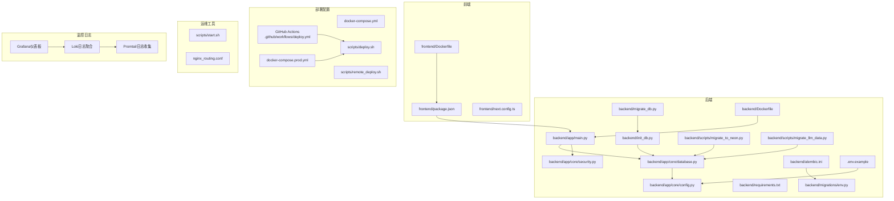
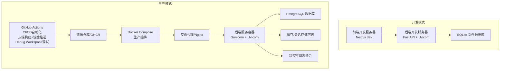
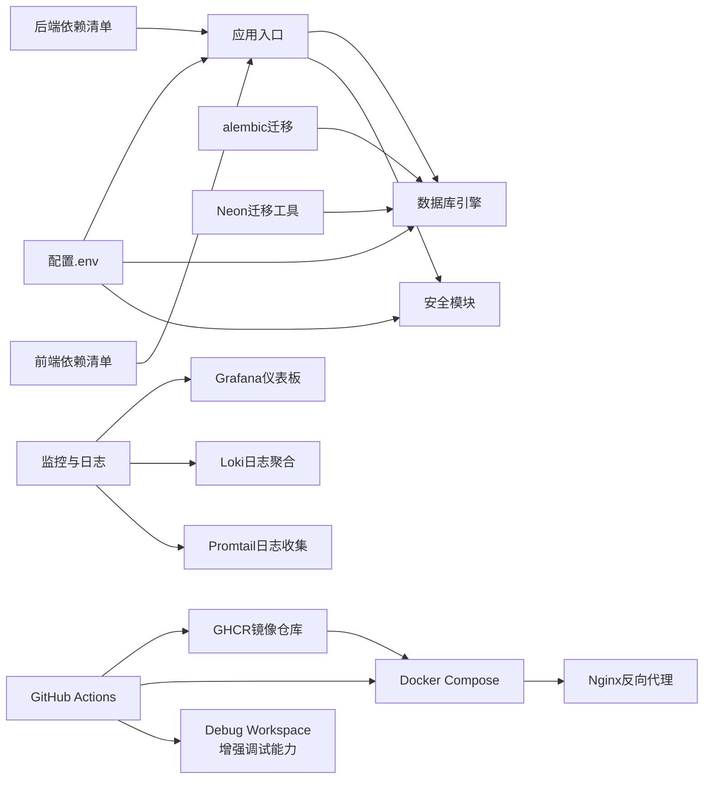

# 部署与运维

<cite>
**本文引用的文件**
- [README.md](file://README.md)
- [start.sh](file://scripts/start.sh)
- [deploy.sh](file://scripts/deploy.sh)
- [deploy_compose_prod.sh](file://scripts/deploy_compose_prod.sh)
- [remote_deploy.sh](file://scripts/remote_deploy.sh)
- [.github/workflows/deploy.yml](file://.github/workflows/deploy.yml)
- [docker-compose.yml](file://docker-compose.yml)
- [docker-compose.prod.yml](file://docker-compose.prod.yml)
- [backend/Dockerfile](file://backend/Dockerfile)
- [frontend/Dockerfile](file://frontend/Dockerfile)
- [backend/app/main.py](file://backend/app/main.py)
- [backend/app/core/config.py](file://backend/app/core/config.py)
- [backend/app/core/database.py](file://backend/app/core/database.py)
- [backend/app/core/security.py](file://backend/app/core/security.py)
- [backend/requirements.txt](file://backend/requirements.txt)
- [backend/.env](file://backend/.env)
- [.env.example](file://.env.example)
- [backend/init_db.py](file://backend/init_db.py)
- [backend/migrate_db.py](file://backend/migrate_db.py)
- [backend/alembic.ini](file://backend/alembic.ini)
- [backend/migrations/env.py](file://backend/migrations/env.py)
- [backend/scripts/migrate_to_neon.py](file://backend/scripts/migrate_to_neon.py)
- [backend/scripts/migrate_llm_data.py](file://backend/scripts/migrate_llm_data.py)
- [frontend/package.json](file://frontend/package.json)
- [frontend/next.config.ts](file://frontend/next.config.ts)
- [nginx_routing.conf](file://nginx_routing.conf)
- [docs/03_Mainland_Deployment_Guide.md](file://docs/03_Mainland_Deployment_Guide.md)
- [monitoring/grafana/provisioning/dashboards/json/ai-stock-logs.json](file://monitoring/grafana/provisioning/dashboards/json/ai-stock-logs.json)
- [monitoring/loki/loki-config.yaml](file://monitoring/loki/loki-config.yaml)
- [monitoring/promtail/promtail-config.yaml](file://monitoring/promtail/promtail-config.yaml)
</cite>

## 更新摘要
**所做更改**
- 增强GitHub Actions部署工作流的调试能力，添加Debug Workspace步骤
- 改进部署资产上传语法，提升部署过程的可观测性和可靠性
- 更新CI/CD自动化部署系统，采用云端构建+镜像拉取的轻量部署模式
- 新增docker-compose.prod.yml生产环境编排配置
- 更新部署脚本支持GHCR镜像拉取和数据库迁移

## 目录
1. [简介](#简介)
2. [项目结构](#项目结构)
3. [核心组件](#核心组件)
4. [架构总览](#架构总览)
5. [详细组件分析](#详细组件分析)
6. [依赖关系分析](#依赖关系分析)
7. [性能考虑](#性能考虑)
8. [故障排除指南](#故障排除指南)
9. [结论](#结论)
10. [附录](#附录)

## 简介
本指南面向部署与运维团队，覆盖从开发环境搭建到生产部署、CI/CD 设计、监控与日志、备份与灾备、扩展性与安全加固，以及故障排除与自动化运维工具使用。项目采用前后端分离架构：后端基于 FastAPI（Python），前端基于 Next.js（TypeScript）。数据库默认使用 SQLite（开发环境），支持通过环境变量切换到PostgreSQL（生产环境）。现已集成GitHub Actions自动化部署系统，支持GHCR镜像仓库和Docker Compose编排部署。**重大更新**：部署流程已从阿里云部署迁移到GHCR + Docker Compose模式，采用云端构建+服务器拉取镜像的轻量部署策略，显著提升部署效率和可靠性。**新增**：GitHub Actions工作流增强了调试能力，通过Debug Workspace步骤提供更好的部署过程可观测性。

## 项目结构
- 后端（FastAPI）：应用入口、路由、中间件、配置、数据库连接与会话、安全工具等。
- 前端（Next.js）：TypeScript 应用，开发与构建脚本，样式与 UI 组件。
- 文档：技术栈与开发规范说明，大陆环境部署指南。
- 脚本：一键启动脚本，数据库初始化与迁移脚本，Docker Compose部署脚本。
- GitHub Actions：自动化CI/CD流水线，支持GHCR镜像仓库和远程部署。
- Docker Compose：开发与生产环境编排配置，支持日志聚合栈。
- Nginx：反向代理配置，支持域名分流和SSL终止。
- **新增** 监控与日志：Grafana仪表板、Loki日志聚合、Promtail日志收集器。

**图表来源**
- [backend/app/main.py:1-131](file://backend/app/main.py#L1-L131)
- [backend/app/core/config.py:1-28](file://backend/app/core/config.py#L1-L28)
- [backend/app/core/database.py:1-69](file://backend/app/core/database.py#L1-L69)
- [backend/app/core/security.py:1-26](file://backend/app/core/security.py#L1-L26)
- [backend/requirements.txt:1-77](file://backend/requirements.txt#L1-L77)
- [backend/init_db.py:1-84](file://backend/init_db.py#L1-L84)
- [backend/migrate_db.py:1-30](file://backend/migrate_db.py#L1-L30)
- [backend/alembic.ini:1-148](file://backend/alembic.ini#L1-L148)
- [backend/migrations/env.py:1-86](file://backend/migrations/env.py#L1-L86)
- [backend/scripts/migrate_to_neon.py:1-126](file://backend/scripts/migrate_to_neon.py#L1-L126)
- [backend/scripts/migrate_llm_data.py:1-59](file://backend/scripts/migrate_llm_data.py#L1-L59)
- [frontend/package.json:1-43](file://frontend/package.json#L1-L43)
- [frontend/next.config.ts:1-8](file://frontend/next.config.ts#L1-L8)
- [.env.example:1-10](file://.env.example#L1-L10)
- [scripts/start.sh:1-61](file://scripts/start.sh#L1-L61)
- [scripts/deploy.sh:1-62](file://scripts/deploy.sh#L1-L62)
- [scripts/deploy_compose_prod.sh:1-40](file://scripts/deploy_compose_prod.sh#L1-L40)
- [scripts/remote_deploy.sh:1-80](file://scripts/remote_deploy.sh#L1-L80)
- [.github/workflows/deploy.yml:1-107](file://.github/workflows/deploy.yml#L1-L107)
- [docker-compose.yml:1-139](file://docker-compose.yml#L1-L139)
- [docker-compose.prod.yml:1-39](file://docker-compose.prod.yml#L1-L39)
- [nginx_routing.conf:1-42](file://nginx_routing.conf#L1-L42)
- [monitoring/grafana/provisioning/dashboards/json/ai-stock-logs.json:1-200](file://monitoring/grafana/provisioning/dashboards/json/ai-stock-logs.json#L1-L200)
- [monitoring/loki/loki-config.yaml:1-150](file://monitoring/loki/loki-config.yaml#L1-L150)
- [monitoring/promtail/promtail-config.yaml:1-120](file://monitoring/promtail/promtail-config.yaml#L1-L120)

**章节来源**
- [README.md:1-50](file://README.md#L1-L50)
- [docs/03_Mainland_Deployment_Guide.md:1-64](file://docs/03_Mainland_Deployment_Guide.md#L1-L64)

## 核心组件
- 应用入口与路由：定义 FastAPI 实例、CORS 中间件、健康检查端点与业务路由挂载。
- 配置系统：通过 Pydantic Settings 读取 .env 环境变量，支持数据库连接串、密钥、外部 API 密钥等。
- 数据库层：异步 SQLAlchemy 引擎与会话工厂，支持 SQLite（开发）与 PostgreSQL（生产）数据库。
- 安全模块：密码哈希、JWT 签发与校验，令牌过期时间配置。
- 前端构建与运行：Next.js 开发服务器与构建脚本，公共 API 地址通过环境变量注入。
- 初始化与迁移：自动建表与种子数据插入；历史数据库列迁移脚本；alembic数据库迁移。
- **新增** GHCR镜像仓库：GitHub Packages Container Registry，支持后端和前端镜像托管。
- **新增** Docker Compose编排：开发环境使用本地构建，生产环境使用GHCR镜像拉取。
- **新增** GitHub Actions自动化：完整的CI/CD流水线，支持云端构建、镜像推送和远程部署。
- **新增** 增强调试能力：GitHub Actions工作流中的Debug Workspace步骤，提供更好的部署过程可观测性。

**章节来源**
- [backend/app/main.py:1-131](file://backend/app/main.py#L1-L131)
- [backend/app/core/config.py:1-28](file://backend/app/core/config.py#L1-L28)
- [backend/app/core/database.py:1-69](file://backend/app/core/database.py#L1-L69)
- [backend/app/core/security.py:1-26](file://backend/app/core/security.py#L1-L26)
- [frontend/package.json:1-43](file://frontend/package.json#L1-L43)
- [backend/init_db.py:1-84](file://backend/init_db.py#L1-L84)
- [backend/migrate_db.py:1-30](file://backend/migrate_db.py#L1-L30)
- [backend/alembic.ini:1-148](file://backend/alembic.ini#L1-L148)
- [backend/migrations/env.py:1-86](file://backend/migrations/env.py#L1-L86)
- [backend/scripts/migrate_to_neon.py:1-126](file://backend/scripts/migrate_to_neon.py#L1-L126)
- [backend/scripts/migrate_llm_data.py:1-59](file://backend/scripts/migrate_llm_data.py#L1-L59)
- [.github/workflows/deploy.yml:74-75](file://.github/workflows/deploy.yml#L74-L75)
- [docker-compose.yml:1-139](file://docker-compose.yml#L1-L139)
- [docker-compose.prod.yml:1-39](file://docker-compose.prod.yml#L1-L39)

## 架构总览
下图展示开发与生产两种运行模式的关键差异：开发模式使用本地构建和SQLite数据库，生产模式采用GHCR镜像仓库和PostgreSQL数据库，支持Docker Compose编排和Nginx反向代理。**重大更新**：生产模式现采用GHCR镜像仓库和Docker Compose编排，通过GitHub Actions实现云端构建和远程部署，显著提升部署效率和可靠性。**新增**：增强的调试能力通过Debug Workspace步骤提供更好的部署过程可观测性。

**图表来源**
- [backend/app/main.py:1-131](file://backend/app/main.py#L1-L131)
- [backend/app/core/config.py:1-28](file://backend/app/core/config.py#L1-L28)
- [backend/app/core/database.py:1-69](file://backend/app/core/database.py#L1-L69)
- [frontend/package.json:1-43](file://frontend/package.json#L1-L43)
- [.github/workflows/deploy.yml:74-75](file://.github/workflows/deploy.yml#L74-L75)
- [docker-compose.prod.yml:1-39](file://docker-compose.prod.yml#L1-L39)
- [nginx_routing.conf:1-42](file://nginx_routing.conf#L1-L42)

## 详细组件分析

### 开发环境搭建
- 依赖安装
  - 后端：使用虚拟环境安装 requirements.txt 中的依赖，包括alembic数据库迁移工具。
  - 前端：安装 Node.js 与 npm，执行依赖安装。
- 环境变量
  - 复制 .env.example 并根据需要填写数据库连接串、外部 API 密钥、JWT 密钥等。
  - 前端通过 NEXT_PUBLIC_API_URL 指定后端 API 地址。
  - 开发环境默认使用SQLite数据库，无需额外数据库服务。
- 本地数据库
  - 默认使用 SQLite（本地文件），无需额外数据库服务。
  - 可通过 DATABASE_URL 切换至PostgreSQL（需相应驱动）。
- 一键启动
  - 使用 scripts/start.sh 自动安装依赖并启动前后端服务，支持dev和docker两种模式。

**章节来源**
- [README.md:40-106](file://README.md#L40-L106)
- [scripts/start.sh:1-61](file://scripts/start.sh#L1-L61)
- [.env.example:1-10](file://.env.example#L1-L10)
- [backend/requirements.txt:1-77](file://backend/requirements.txt#L1-L77)
- [frontend/package.json:1-43](file://frontend/package.json#L1-L43)

### 生产环境部署策略
- 镜像仓库与编排
  - 使用GHCR（GitHub Packages Container Registry）托管后端和前端镜像。
  - 生产环境使用 docker-compose.prod.yml 进行容器编排，支持镜像拉取和健康检查。
  - 反向代理（Nginx）统一入口、静态资源分发与 SSL 终止。
- 云平台配置
  - 数据库：使用托管PostgreSQL数据库（如Neon），开启SSL连接和备份策略。
  - 存储：对象存储用于静态资源或日志归档。
  - 安全：启用 WAF、DDoS 防护与网络 ACL；仅开放必要端口。
- 配置管理
  - 将敏感配置（数据库密码、API 密钥、JWT 密钥）置于密钥管理服务或环境变量注入。
  - 不将 .env 或配置文件提交到版本库。

**章节来源**
- [backend/app/core/config.py:1-28](file://backend/app/core/config.py#L1-L28)
- [backend/app/core/database.py:1-69](file://backend/app/core/database.py#L1-L69)
- [docs/03_Mainland_Deployment_Guide.md:1-64](file://docs/03_Mainland_Deployment_Guide.md#L1-L64)
- [backend/Dockerfile:1-29](file://backend/Dockerfile#L1-L29)
- [docker-compose.prod.yml:1-39](file://docker-compose.prod.yml#L1-L39)

### CI/CD 流水线设计
- **重大更新** GitHub Actions自动化部署（GHCR + Docker Compose模式）
  - **三阶段部署流程**：
    1. **云端构建阶段**：在GitHub Actions环境中构建后端和前端镜像，使用Buildx加速构建
    2. **镜像推送阶段**：将构建好的镜像推送到GHCR，支持latest和SHA标签
    3. **远程部署阶段**：通过SCP传输编排文件和部署脚本到服务器，使用SSH执行部署
  - **镜像管理**：后端和前端分别构建独立镜像，支持版本化标签管理
  - **部署自动化**：服务器端仅执行docker pull和compose up，避免本地构建压力
  - **部署优势**：云端构建利用GitHub Actions的强大计算资源，服务器端仅负责拉取和启动。
  - **新增** **增强调试能力**：在部署流程中添加Debug Workspace步骤，通过`ls -R`命令提供工作空间状态检查，显著提升部署过程的可观测性和可靠性。
  - **新增** **改进部署资产上传**：优化SCP上传语法，确保docker-compose.prod.yml和部署脚本正确传输到服务器。
- 传统部署方式
  - 本地Docker Compose部署：使用scripts/deploy.sh脚本，支持容器化部署与数据库迁移。
  - 远程部署：使用scripts/deploy_compose_prod.sh脚本，支持GHCR镜像拉取和数据库迁移。
  - **新增** **远程部署脚本**：scripts/remote_deploy.sh提供完整的远程部署流程，支持rsync文件同步和自动构建。
- 流水线步骤
  - 代码检查：类型检查、格式化与 Lint。
  - 单元与集成测试：后端单元测试、数据库迁移一致性检查。
  - 构建与打包：后端编译/打包、前端构建产物生成。
  - 安全扫描：依赖漏洞扫描、密钥泄露检测。
  - 镜像推送：镜像构建、标签管理、GHCR推送。
  - **新增** **调试检查**：Debug Workspace步骤提供工作空间状态检查。
  - **新增** **资产上传**：改进的SCP上传语法确保部署文件正确传输。
  - 远程部署：SCP文件传输、SSH远程执行、数据库迁移。
- 回滚策略
  - 版本化镜像与配置；支持灰度发布与快速回滚。

**章节来源**
- [.github/workflows/deploy.yml:1-107](file://.github/workflows/deploy.yml#L1-L107)
- [scripts/deploy.sh:1-62](file://scripts/deploy.sh#L1-L62)
- [scripts/deploy_compose_prod.sh:1-40](file://scripts/deploy_compose_prod.sh#L1-L40)
- [scripts/remote_deploy.sh:1-80](file://scripts/remote_deploy.sh#L1-L80)
- [backend/requirements.txt:1-77](file://backend/requirements.txt#L1-L77)
- [frontend/package.json:1-43](file://frontend/package.json#L1-L43)
- [backend/init_db.py:1-84](file://backend/init_db.py#L1-L84)

### 数据库迁移与升级
- **新增** alembic数据库迁移
  - 配置文件：alembic.ini定义迁移脚本位置、日志配置和数据库URL模板
  - 环境配置：migrations/env.py集成应用配置和模型元数据
  - 支持PostgreSQL：自动检测数据库类型并配置SSL连接
  - 异步迁移：支持异步数据库连接和批量迁移操作
- **新增** Neon PostgreSQL迁移工具
  - migrate_to_neon.py提供从SQLite到PostgreSQL的完整数据迁移
  - 支持类型转换、数据验证和批量迁移
  - 包含详细的迁移报告和错误处理
- **新增** LLM数据迁移
  - migrate_llm_data.py处理LLM相关数据表的列结构更新
  - 支持浮点数类型的字段添加和现有数据兼容
- **新增** 数据库初始化
  - init_db.py提供完整的表结构创建和种子数据插入
  - init_db_tables.py专注于基础表结构初始化

**章节来源**
- [backend/alembic.ini:1-148](file://backend/alembic.ini#L1-L148)
- [backend/migrations/env.py:1-86](file://backend/migrations/env.py#L1-L86)
- [backend/scripts/migrate_to_neon.py:1-126](file://backend/scripts/migrate_to_neon.py#L1-L126)
- [backend/scripts/migrate_llm_data.py:1-59](file://backend/scripts/migrate_llm_data.py#L1-L59)
- [backend/init_db.py:1-84](file://backend/init_db.py#L1-L84)
- [backend/init_db_tables.py:1-16](file://backend/init_db_tables.py#L1-L16)

### 监控与日志管理
- 性能监控
  - 后端：暴露指标端点（Prometheus Exporter）、慢查询与错误率统计。
  - 前端：页面加载时长、错误上报（如 Sentry）。
  - **新增** Docker监控：使用Compose健康检查和日志驱动配置。
  - **新增** 数据库监控：监控数据库连接池状态、查询性能和SSL连接状态。
  - **新增** Grafana仪表板：提供AI股票分析系统的可视化监控面板。
- 日志管理
  - 结构化日志输出到标准输出/标准错误，配合集中式日志收集（如 ELK/Vector/Fluent Bit）。
  - 区分访问日志与应用日志，设置轮转策略。
  - **新增** Docker日志：使用json-file驱动和轮转配置。
  - **新增** Loki日志聚合：支持大规模日志收集和查询。
  - **新增** Promtail日志收集：提供高效的日志采集和转发功能。
- 健康检查
  - 使用 /health 探针进行存活与就绪检查，结合反向代理与编排平台实现自动重启与扩缩容。

**章节来源**
- [backend/app/main.py:121-125](file://backend/app/main.py#L121-L125)
- [backend/app/core/database.py:18-34](file://backend/app/core/database.py#L18-L34)
- [.github/workflows/deploy.yml:105-107](file://.github/workflows/deploy.yml#L105-L107)
- [docker-compose.prod.yml:20-26](file://docker-compose.prod.yml#L20-L26)
- [monitoring/grafana/provisioning/dashboards/json/ai-stock-logs.json:1-200](file://monitoring/grafana/provisioning/dashboards/json/ai-stock-logs.json#L1-L200)
- [monitoring/loki/loki-config.yaml:1-150](file://monitoring/loki/loki-config.yaml#L1-L150)
- [monitoring/promtail/promtail-config.yaml:1-120](file://monitoring/promtail/promtail-config.yaml#L1-L120)

### 备份与灾难恢复
- 数据备份
  - 数据库：定时快照/逻辑备份；对PostgreSQL数据库开启增量备份与跨区复制。
  - 配置与静态资源：版本化存储，定期校验恢复演练。
- 灾难恢复
  - 定义 RPO/RTO 目标；多可用区部署；故障转移与数据同步机制。
  - 恢复流程文档化并定期演练。
- **新增** 数据库备份策略
  - PostgreSQL：使用pg_dump进行逻辑备份，支持增量备份和恢复验证。
  - SQLite：支持WAL模式下的在线备份和恢复。

**章节来源**
- [backend/app/core/database.py:1-69](file://backend/app/core/database.py#L1-L69)
- [backend/migrate_db.py:1-30](file://backend/migrate_db.py#L1-L30)
- [backend/scripts/migrate_to_neon.py:1-126](file://backend/scripts/migrate_to_neon.py#L1-L126)
- [.github/workflows/deploy.yml:105-107](file://.github/workflows/deploy.yml#L105-L107)

### 扩展性配置
- 负载均衡
  - 反向代理分发请求至多个后端实例；启用会话亲和或无状态设计。
  - **新增** Docker Compose扩展：支持服务副本数配置和资源限制。
- 水平扩展
  - 无状态后端：通过容器编排实现弹性伸缩；共享数据库与缓存。
  - 缓存：引入 Redis 提升热点数据访问性能。
  - **新增** 资源限制：配置内存、CPU和PID限制，确保服务稳定性。
- 数据库扩展
  - 主从复制、只读副本与读写分离；分库分表（按用户或时间维度）。
  - **新增** PostgreSQL扩展：支持连接池优化、SSL连接和异步操作。

**章节来源**
- [backend/app/main.py:1-131](file://backend/app/main.py#L1-L131)
- [backend/app/core/database.py:1-69](file://backend/app/core/database.py#L1-L69)
- [backend/Dockerfile:25-29](file://backend/Dockerfile#L25-L29)
- [docker-compose.prod.yml:17-39](file://docker-compose.prod.yml#L17-L39)

### 安全加固
- 网络与访问控制
  - 仅开放 80/443 与管理端口；使用防火墙/安全组限制来源 IP。
- 传输安全
  - 强制 HTTPS，使用 Let's Encrypt 或商业证书；禁用弱加密套件。
  - **新增** 数据库SSL：PostgreSQL连接强制SSL，支持Neon等托管数据库。
- 应用安全
  - CORS 白名单收窄至生产域名；JWT 密钥随机化且定期轮换；最小权限原则。
- 外部 API 安全
  - 密钥注入与轮换；速率限制与熔断；日志脱敏。
- **新增** 镜像安全**
  - GHCR镜像访问控制，使用GITHUB_TOKEN进行认证。
  - 镜像扫描和漏洞检测集成到CI/CD流程。

**章节来源**
- [backend/app/main.py:94-113](file://backend/app/main.py#L94-L113)
- [backend/app/core/security.py:1-26](file://backend/app/core/security.py#L1-L26)
- [backend/app/core/config.py:8-22](file://backend/app/core/config.py#L8-L22)
- [backend/app/core/database.py:18-23](file://backend/app/core/database.py#L18-L23)
- [.github/workflows/deploy.yml:34-40](file://.github/workflows/deploy.yml#L34-L40)

### 运维工具与自动化脚本
- 启动脚本
  - scripts/start.sh：自动安装依赖、启动后端与前端，支持dev和docker两种模式。
- 数据库初始化
  - init_db.py：自动建表与种子数据插入；适合首次部署或测试环境。
  - init_db_tables.py：仅初始化基础表结构。
  - migrate_db.py：历史数据库列迁移脚本，处理字段变更。
- **重大更新** GitHub Actions自动化（GHCR + Docker Compose模式）
  - deploy.yml：完整的三阶段CI/CD流水线，支持GHCR镜像仓库和远程部署。
  - 云端构建：在GitHub Actions环境中进行镜像构建，利用云端资源。
  - 镜像管理：支持latest和SHA标签，便于版本控制和回滚。
  - **新增** 增强调试能力：Debug Workspace步骤提供工作空间状态检查，通过`ls -R`命令列出所有文件和目录结构。
  - **新增** 改进部署资产上传：优化SCP上传语法，确保docker-compose.prod.yml和deploy_compose_prod.sh正确传输到服务器。
  - **新增** 远程部署：通过SCP传输编排文件和部署脚本，SSH执行部署。
- **新增** 数据库迁移工具
  - migrate_to_neon.py：从SQLite到PostgreSQL的完整数据迁移工具。
  - migrate_llm_data.py：LLM相关数据表的列结构更新工具。
- **新增** Docker Compose部署脚本
  - deploy_compose_prod.sh：生产环境部署脚本，支持GHCR镜像拉取和数据库迁移。
  - deploy.sh：本地Docker Compose部署脚本。
  - **新增** remote_deploy.sh：完整的远程部署脚本，支持rsync文件同步和自动构建。
- **新增** 多环境部署配置
  - docker-compose.yml：开发环境本地构建配置。
  - docker-compose.prod.yml：生产环境GHCR镜像配置。
- **新增** 监控与日志配置
  - Grafana仪表板：提供AI股票分析系统的可视化监控面板。
  - Loki日志聚合：支持大规模日志收集和查询。
  - Promtail日志收集：提供高效的日志采集和转发功能。
- 其他建议
  - 编写部署脚本（Ansible/Chef/Puppet）或使用 GitOps 工具（Argo/Flux）。
  - 使用 Terraform/Helm 管理基础设施与应用清单。

**章节来源**
- [scripts/start.sh:1-61](file://scripts/start.sh#L1-L61)
- [scripts/deploy.sh:1-62](file://scripts/deploy.sh#L1-L62)
- [scripts/deploy_compose_prod.sh:1-40](file://scripts/deploy_compose_prod.sh#L1-L40)
- [scripts/remote_deploy.sh:1-80](file://scripts/remote_deploy.sh#L1-L80)
- [.github/workflows/deploy.yml:74-75](file://.github/workflows/deploy.yml#L74-L75)
- [backend/init_db.py:1-84](file://backend/init_db.py#L1-L84)
- [backend/migrate_db.py:1-30](file://backend/migrate_db.py#L1-L30)
- [backend/scripts/migrate_to_neon.py:1-126](file://backend/scripts/migrate_to_neon.py#L1-L126)
- [backend/scripts/migrate_llm_data.py:1-59](file://backend/scripts/migrate_llm_data.py#L1-L59)
- [docker-compose.yml:1-139](file://docker-compose.yml#L1-L139)
- [docker-compose.prod.yml:1-39](file://docker-compose.prod.yml#L1-L39)
- [monitoring/grafana/provisioning/dashboards/json/ai-stock-logs.json:1-200](file://monitoring/grafana/provisioning/dashboards/json/ai-stock-logs.json#L1-L200)
- [monitoring/loki/loki-config.yaml:1-150](file://monitoring/loki/loki-config.yaml#L1-L150)
- [monitoring/promtail/promtail-config.yaml:1-120](file://monitoring/promtail/promtail-config.yaml#L1-L120)

## 依赖关系分析
- 后端依赖
  - FastAPI、SQLAlchemy AsyncIO、Pydantic Settings、Uvicorn、Passlib、PyJWT 等。
  - 金融与 AI 相关库：yfinance、google-generativeai、openai 等。
  - **新增** 数据库迁移：alembic 1.18.1、asyncpg 0.31.0、SQLAlchemy 2.0.45。
- 前端依赖
  - Next.js、Axios、React Hooks、Tailwind CSS、Radix UI 等。
- 关键耦合点
  - 后端通过 .env 注入数据库与密钥；前端通过 NEXT_PUBLIC_API_URL 访问后端。
  - 数据库引擎与会话工厂在后端内部解耦，便于替换驱动。
  - **新增** GHCR镜像仓库与CI/CD流程耦合，实现自动化镜像管理。
  - **新增** Docker Compose与生产环境耦合，实现服务编排和资源管理。
  - **重大更新** GitHub Actions与GHCR镜像仓库耦合，实现云端构建和远程部署。
  - **新增** 增强调试能力与部署流程耦合，提供更好的可观测性。

**图表来源**
- [backend/app/core/config.py:1-28](file://backend/app/core/config.py#L1-L28)
- [backend/app/main.py:1-131](file://backend/app/main.py#L1-L131)
- [backend/requirements.txt:1-77](file://backend/requirements.txt#L1-L77)
- [frontend/package.json:1-43](file://frontend/package.json#L1-L43)
- [backend/alembic.ini:1-148](file://backend/alembic.ini#L1-L148)
- [backend/scripts/migrate_to_neon.py:1-126](file://backend/scripts/migrate_to_neon.py#L1-L126)
- [.github/workflows/deploy.yml:74-75](file://.github/workflows/deploy.yml#L74-L75)
- [docker-compose.prod.yml:1-39](file://docker-compose.prod.yml#L1-L39)
- [nginx_routing.conf:1-42](file://nginx_routing.conf#L1-L42)
- [monitoring/grafana/provisioning/dashboards/json/ai-stock-logs.json:1-200](file://monitoring/grafana/provisioning/dashboards/json/ai-stock-logs.json#L1-L200)
- [monitoring/loki/loki-config.yaml:1-150](file://monitoring/loki/loki-config.yaml#L1-L150)
- [monitoring/promtail/promtail-config.yaml:1-120](file://monitoring/promtail/promtail-config.yaml#L1-L120)

**章节来源**
- [backend/requirements.txt:1-77](file://backend/requirements.txt#L1-L77)
- [frontend/package.json:1-43](file://frontend/package.json#L1-L43)
- [backend/app/core/config.py:1-28](file://backend/app/core/config.py#L1-L28)
- [backend/alembic.ini:1-148](file://backend/alembic.ini#L1-L148)
- [.github/workflows/deploy.yml:74-75](file://.github/workflows/deploy.yml#L74-L75)

## 性能考虑
- 数据库性能
  - 使用异步 SQLAlchemy 减少阻塞；合理索引与查询优化；连接池参数调优。
  - 生产环境优先使用高性能PostgreSQL数据库与SSD存储。
  - **新增** PostgreSQL优化：连接池大小、SSL连接和异步操作支持。
- API 性能
  - 后端使用Gunicorn + Uvicorn组合，支持多worker模式和异步处理；启用gzip/HTTP/2；缓存热点数据；限流与熔断保护下游服务。
- 前端性能
  - 代码分割、懒加载、静态资源 CDN；压缩与预加载策略。
- 监控与告警
  - 关键指标：响应时间、吞吐量、错误率、数据库连接数、缓存命中率。
  - **新增** Docker监控：Compose健康检查、日志轮转和资源限制。
  - **新增** 数据库监控：连接池使用率、查询执行时间、SSL连接状态。
  - **新增** Grafana监控：提供AI股票分析系统的可视化监控面板。
- **重大更新** GHCR部署性能优化
  - 利用GitHub Actions的高性能计算资源进行镜像构建，显著提升构建速度。
  - 服务器端仅负责拉取镜像和启动服务，避免本地构建压力。
  - 镜像缓存和分层优化，减少传输时间和存储空间。
  - **新增** 增强调试能力：Debug Workspace步骤提供实时工作空间检查，帮助快速定位部署问题。

**章节来源**
- [backend/app/core/database.py:18-34](file://backend/app/core/database.py#L18-L34)
- [docs/03_Mainland_Deployment_Guide.md:1-64](file://docs/03_Mainland_Deployment_Guide.md#L1-L64)
- [backend/Dockerfile:25-29](file://backend/Dockerfile#L25-L29)
- [docker-compose.prod.yml:17-39](file://docker-compose.prod.yml#L17-L39)
- [monitoring/grafana/provisioning/dashboards/json/ai-stock-logs.json:1-200](file://monitoring/grafana/provisioning/dashboards/json/ai-stock-logs.json#L1-L200)

## 故障排除指南
- 启动失败
  - 检查 Python 与 Node.js 是否安装；确认端口未被占用；查看依赖安装日志。
- 数据库连接异常
  - 校验 DATABASE_URL；确认数据库服务可达；检查SQLite文件权限或PostgreSQL凭据。
  - **新增** SSL连接问题：检查PostgreSQL SSL配置和证书有效性。
- CORS 错误
  - 核对后端允许的源列表；确保前端访问地址与白名单一致。
- 认证失败
  - 校验 SECRET_KEY 与算法配置；确认令牌未过期；检查密码哈希是否正确。
- 健康检查失败
  - 查看 /health 返回内容；检查依赖服务（数据库、外部 API）状态。
- 前端无法访问后端
  - 确认 NEXT_PUBLIC_API_URL 指向正确的后端地址；检查反向代理规则。
- **新增** GHCR镜像拉取问题
  - 镜像不存在：检查GHCR仓库权限和镜像标签。
  - 认证失败：检查GITHUB_TOKEN和GHCR_USERNAME配置。
  - 网络超时：检查网络连通性和镜像仓库可用性。
- **新增** Docker Compose部署问题
  - 服务启动失败：检查容器日志和依赖服务状态。
  - 端口冲突：确认宿主机端口未被占用。
  - 环境变量缺失：检查.env文件和环境变量注入。
- **新增** 数据库迁移问题
  - alembic迁移失败：检查数据库连接、迁移脚本语法和权限。
  - Neon迁移中断：检查源数据库连接、目标数据库权限和网络连通性。
  - LLM数据迁移失败：检查目标表结构和数据类型兼容性。
- **重大更新** GitHub Actions部署问题（GHCR模式）
  - 镜像构建失败：检查Dockerfile和依赖安装。
  - GHCR推送失败：检查GITHUB_TOKEN权限和仓库可见性。
  - SCP传输失败：检查服务器SSH密钥和目标路径权限。
  - SSH连接失败：检查服务器IP、用户名、私钥配置。
  - 依赖安装超时：检查网络连接和镜像源配置。
  - 服务器端最终化失败：检查后端依赖安装和Python环境。
  - **新增** 增强调试能力问题：Debug Workspace步骤无法执行时，检查GitHub Actions权限和工作空间状态。
  - **新增** 改进部署资产上传问题：SCP上传语法错误时，检查source参数格式和文件路径。
  - **新增** 数据库迁移失败：检查alembic配置、数据库连接和迁移权限。
- **新增** 传统部署问题
  - Docker Compose部署失败：检查Docker服务状态和镜像构建。
  - 远程部署同步失败：检查rsync参数和网络连接。
  - **新增** 远程部署脚本问题：remote_deploy.sh脚本执行失败时，检查rsync选项和远程命令权限。

**章节来源**
- [scripts/start.sh:8-17](file://scripts/start.sh#L8-L17)
- [backend/app/main.py:94-113](file://backend/app/main.py#L94-L113)
- [backend/app/core/config.py:1-28](file://backend/app/core/config.py#L1-L28)
- [backend/app/core/security.py:1-26](file://backend/app/core/security.py#L1-L26)
- [backend/alembic.ini:84-87](file://backend/alembic.ini#L84-L87)
- [backend/scripts/migrate_to_neon.py:1-126](file://backend/scripts/migrate_to_neon.py#L1-L126)
- [.github/workflows/deploy.yml:74-75](file://.github/workflows/deploy.yml#L74-L75)
- [scripts/remote_deploy.sh:1-80](file://scripts/remote_deploy.sh#L1-L80)

## 结论
本指南提供了从开发到生产的完整运维路径：以 scripts/start.sh 快速起步，以 init_db.py 与 migrate_db.py 管理数据库生命周期，以 alembic 和迁移工具实现数据库结构演进，以 .env 与配置系统实现环境隔离，以CI/CD保障交付质量，以监控与日志实现可观测性，以安全加固与灾备提升韧性。**重大更新**：部署流程已从阿里云迁移到GHCR + Docker Compose模式，采用云端构建+镜像拉取的轻量部署策略，显著提升了部署效率和可靠性。**新增**：GitHub Actions工作流增强了调试能力，通过Debug Workspace步骤提供更好的部署过程可观测性。**Docker Compose编排**为生产环境提供了稳定的服务管理。**新增**：完整的监控与日志系统，包括Grafana仪表板、Loki日志聚合和Promtail日志收集器。建议在生产中采用GHCR镜像仓库、Docker Compose编排、多可用区部署与自动化运维工具，持续优化性能与可靠性。

## 附录
- 快速对照表
  - 开发：使用 scripts/start.sh；SQLite；.env 示例；前端本地开发服务器。
  - 生产：GHCR镜像仓库；Docker Compose编排；PostgreSQL数据库；密钥管理；监控与日志；备份与灾备；**GHCR + Docker Compose部署**；**alembic数据库迁移**；**增强调试能力**。
- 参考文件
  - 技术栈与开发规范：README.md
  - 一键启动脚本：scripts/start.sh
  - 数据库初始化与迁移：init_db.py、migrate_db.py、init_db_tables.py
  - **新增** 数据库迁移工具：migrate_to_neon.py、migrate_llm_data.py
  - 环境变量示例：.env.example
  - 后端依赖：backend/requirements.txt
  - 前端依赖：frontend/package.json
  - **重大更新** CI/CD自动化：.github/workflows/deploy.yml（GHCR模式）
  - **新增** 增强调试能力：Debug Workspace步骤（第74-75行）
  - **新增** 改进部署资产上传：优化SCP上传语法（第83行）
  - **新增** 数据库迁移配置：backend/alembic.ini、backend/migrations/env.py
  - **新增** Docker Compose配置：docker-compose.yml、docker-compose.prod.yml
  - **新增** 运维脚本：scripts/deploy.sh、scripts/deploy_compose_prod.sh、scripts/remote_deploy.sh
  - **新增** 反向代理配置：nginx_routing.conf
  - **新增** 大陆环境部署：docs/03_Mainland_Deployment_Guide.md
  - **新增** 监控与日志配置：monitoring/grafana/provisioning/dashboards/json/ai-stock-logs.json、monitoring/loki/loki-config.yaml、monitoring/promtail/promtail-config.yaml