# 学习资源指南

<cite>
**本文档引用的文件**
- [README.md](file://README.md)
- [source_learning_guide.md](file://doc/source_learning_guide.md)
- [PRD.md](file://doc/PRD.md)
- [main.py](file://backend/app/main.py)
- [api.py](file://backend/app/api/v1/api.py)
- [stock.py](file://backend/app/models/stock.py)
- [indicators.py](file://backend/app/services/indicators.py)
- [market_data.py](file://backend/app/services/market_data.py)
- [analysis.py](file://backend/app/api/v1/endpoints/analysis.py)
- [api.ts](file://frontend/lib/api.ts)
- [StockDetail.tsx](file://frontend/components/features/StockDetail.tsx)
- [layout.tsx](file://frontend/app/layout.tsx)
- [config.py](file://backend/app/core/config.py)
</cite>

## 目录
1. [简介](#简介)
2. [项目结构](#项目结构)
3. [核心组件](#核心组件)
4. [架构总览](#架构总览)
5. [详细组件分析](#详细组件分析)
6. [依赖关系分析](#依赖关系分析)
7. [性能考虑](#性能考虑)
8. [故障排除指南](#故障排除指南)
9. [结论](#结论)

## 简介
本项目是一个基于实时数据与大模型的智能投资顾问平台，通过“RAG 数据流 + LLM 深度解读 + 严格风控逻辑”的模式，帮助个人投资者做出更明智的投资决策。系统包含前后端分离的架构，后端采用 FastAPI 提供 RESTful API，前端使用 Next.js 构建交互界面，数据库采用 SQLite（生产环境可迁移至 PostgreSQL），并通过异步任务维持数据新鲜度。

## 项目结构
项目采用模块化分层设计，后端按功能划分 API、服务、模型、核心配置等目录；前端按页面路由与可复用组件组织；文档提供系统流程、技术栈与部署指南。

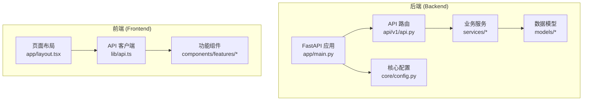

**图表来源**
- [main.py](file://backend/app/main.py#L1-L131)
- [api.py](file://backend/app/api/v1/api.py#L1-L25)
- [config.py](file://backend/app/core/config.py#L1-L28)
- [layout.tsx](file://frontend/app/layout.tsx#L1-L42)
- [api.ts](file://frontend/lib/api.ts#L1-L205)

**章节来源**
- [README.md](file://README.md#L45-L60)
- [source_learning_guide.md](file://doc/source_learning_guide.md#L1-L89)

## 核心组件
- 应用入口与中间件：全局日志、CORS、异常处理、请求拦截与耗时统计。
- API 路由：认证、投资组合、股票、分析、用户设置等模块化路由。
- 数据模型：股票基础信息、市场数据缓存、新闻、分析报告等。
- 技术指标引擎：RSI、MACD、布林带、KDJ 等指标计算。
- 市场数据服务：多源数据抓取、并行请求、缓存与数据库持久化。
- AI 分析接口：结构化 Prompt、JSON 解析、风控同步、缓存回写。
- 前端 API 客户端：Axios 封装、鉴权拦截、错误重试、响应解析。
- 股票详情组件：图表渲染、交易轴可视化、AI 报告展示。

**章节来源**
- [main.py](file://backend/app/main.py#L1-L131)
- [api.py](file://backend/app/api/v1/api.py#L1-L25)
- [stock.py](file://backend/app/models/stock.py#L1-L116)
- [indicators.py](file://backend/app/services/indicators.py#L1-L125)
- [market_data.py](file://backend/app/services/market_data.py#L1-L301)
- [analysis.py](file://backend/app/api/v1/endpoints/analysis.py#L1-L657)
- [api.ts](file://frontend/lib/api.ts#L1-L205)
- [StockDetail.tsx](file://frontend/components/features/StockDetail.tsx#L1-L964)

## 架构总览
系统采用前后端分离架构，后端提供 RESTful API，前端通过 Axios 客户端与后端交互。数据流包括：用户请求 → API 路由 → 业务服务 → 数据库/外部数据源 → 结构化响应 → 前端渲染。

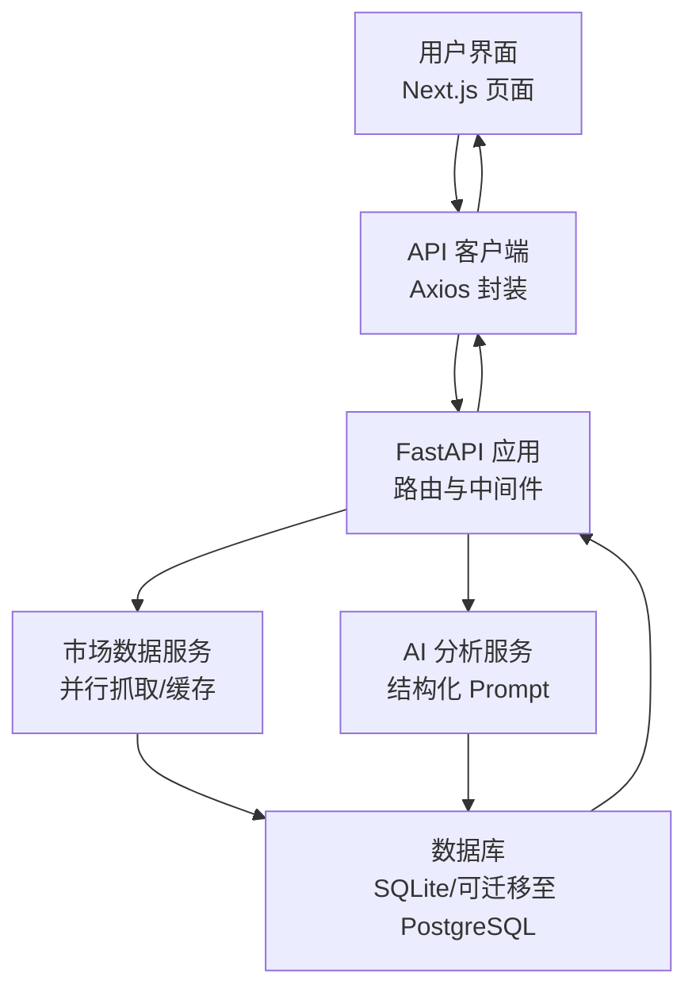

**图表来源**
- [main.py](file://backend/app/main.py#L1-L131)
- [api.py](file://backend/app/api/v1/api.py#L1-L25)
- [market_data.py](file://backend/app/services/market_data.py#L1-L301)
- [analysis.py](file://backend/app/api/v1/endpoints/analysis.py#L1-L657)
- [api.ts](file://frontend/lib/api.ts#L1-L205)

## 详细组件分析

### 后端应用入口与中间件
- 全局日志配置：将 SQLAlchemy 日志级别降低，减少噪声。
- 全局异常处理器：捕获未处理异常，返回结构化错误信息。
- 请求拦截中间件：解析 JWT 提取用户 ID，记录请求耗时与状态码，设置响应头。
- CORS 配置：支持本地与指定域名访问。
- 路由挂载：include_router 挂载 v1 版本的各模块路由。
- 健康检查与根路径：提供服务可用性检测与欢迎信息。

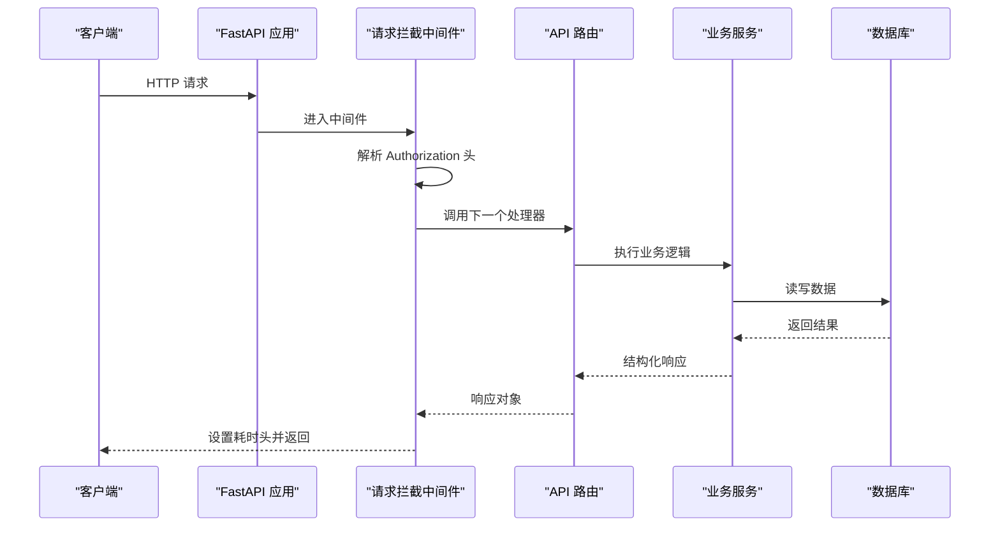

**图表来源**
- [main.py](file://backend/app/main.py#L33-L91)

**章节来源**
- [main.py](file://backend/app/main.py#L1-L131)

### API 路由与模块化设计
- 版本化路由：APIRouter 创建 v1 总路由，按模块挂载子路由。
- 标签分类：Swagger UI 中按模块标签展示，便于导航。
- 模块职责：认证、投资组合、股票、分析、用户设置。

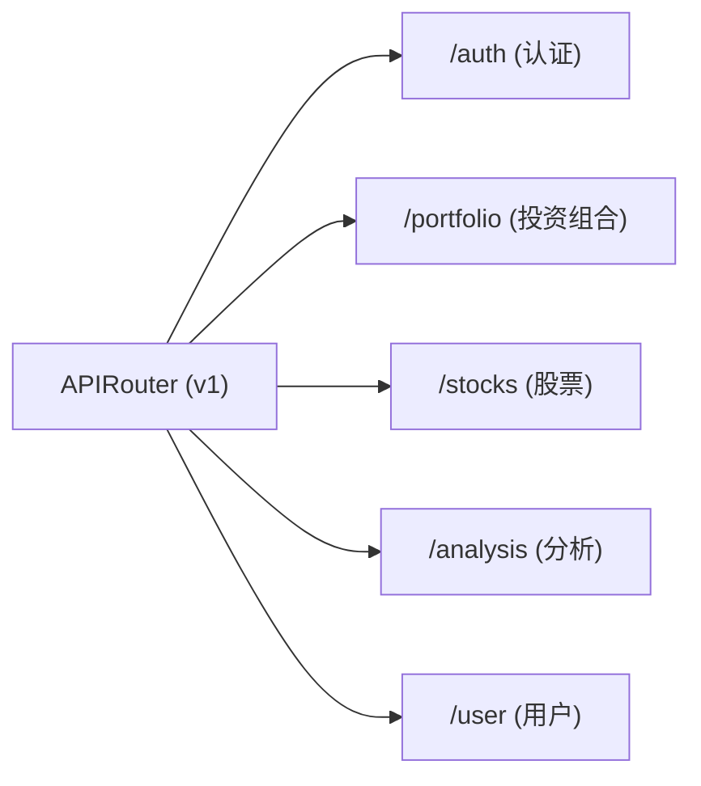

**图表来源**
- [api.py](file://backend/app/api/v1/api.py#L1-L25)

**章节来源**
- [api.py](file://backend/app/api/v1/api.py#L1-L25)

### 数据模型与 ER 关系
- 股票基础信息：包含行业、市值、PE、Beta 等静态数据。
- 市场数据缓存：实时价格、涨跌幅、RSI、MA、MACD、布林带、KDJ、成交量、ADX、枢轴点、盈亏比等。
- 新闻表：标题、发布媒体、链接、摘要、情绪倾向。
- 关系映射：一对一/一对多关系，支持投资组合与分析报告的关联。

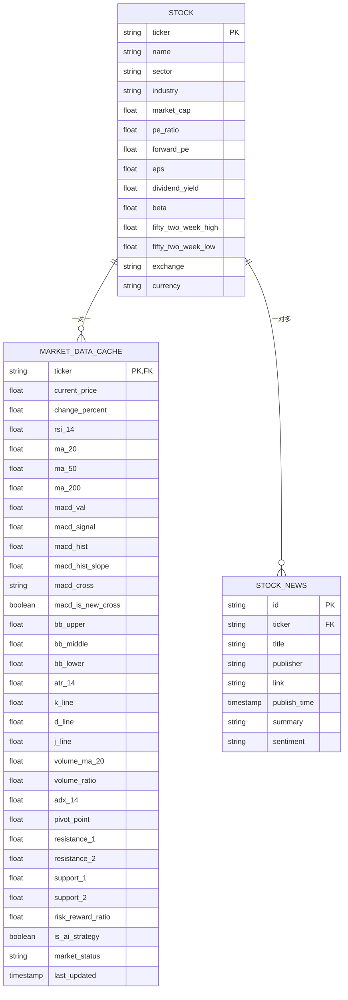

**图表来源**
- [stock.py](file://backend/app/models/stock.py#L21-L116)

**章节来源**
- [stock.py](file://backend/app/models/stock.py#L1-L116)

### 技术指标引擎
- 历史指标批量计算：MACD、RSI、布林带等，用于图表渲染。
- 全量指标快照：提取最新一天的指标值，作为 AI 上下文输入。
- 核心逻辑：盈亏比（RRR）的机器估算，基于阻力/支撑位与当前价格计算。

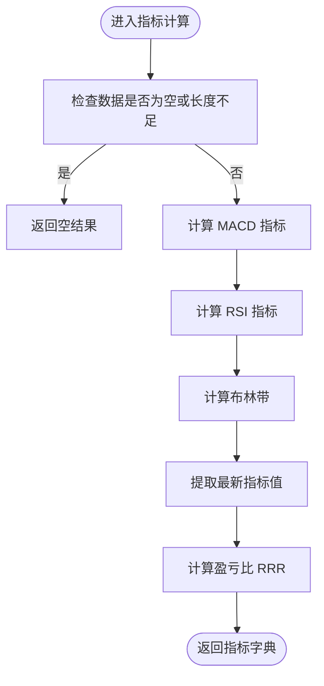

**图表来源**
- [indicators.py](file://backend/app/services/indicators.py#L10-L124)

**章节来源**
- [indicators.py](file://backend/app/services/indicators.py#L1-L125)

### 市场数据服务与缓存
- 实时数据获取：查询本地缓存，若未强制刷新且缓存小于 1 分钟则直接返回。
- 多源并行抓取：使用 asyncio.gather 并行获取报价、基本面、历史数据与新闻，设置 15 秒超时保护。
- 故障转移：首选源失败时自动切换到 YFinance。
- 数据库持久化：同步 Stock 基础信息、MarketDataCache 技术指标、新闻去重入库。
- 模拟模式：网络异常时基于历史数据生成微小波动的模拟数据，保证 UI 不中断。
- 核心逻辑同步：当 AI 锁定策略时，动态重算并同步 RRR、支撑/阻力位。

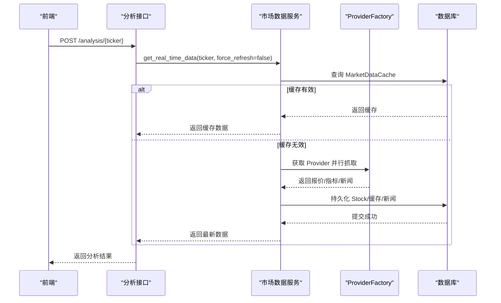

**图表来源**
- [market_data.py](file://backend/app/services/market_data.py#L18-L270)
- [analysis.py](file://backend/app/api/v1/endpoints/analysis.py#L202-L282)

**章节来源**
- [market_data.py](file://backend/app/services/market_data.py#L1-L301)

### AI 分析接口与风控同步
- 权限与配额：免费用户每日限制 3 次，未配置 API Key 时启用。
- 数据准备：获取市场数据、新闻、用户持仓、基本面信息、历史分析上下文。
- Prompt 构建：注入“专业交易员”角色，要求输出结构化 JSON。
- JSON 解析：增强型正则提取与兜底解析，确保鲁棒性。
- 风控同步：将 AI 生成的目标价/止损价同步到 MarketDataCache，标记 is_ai_strategy 并锁定 RRR。
- 缓存回写：AnalysisReport 持久化结构化字段，支持历史查询与补全。

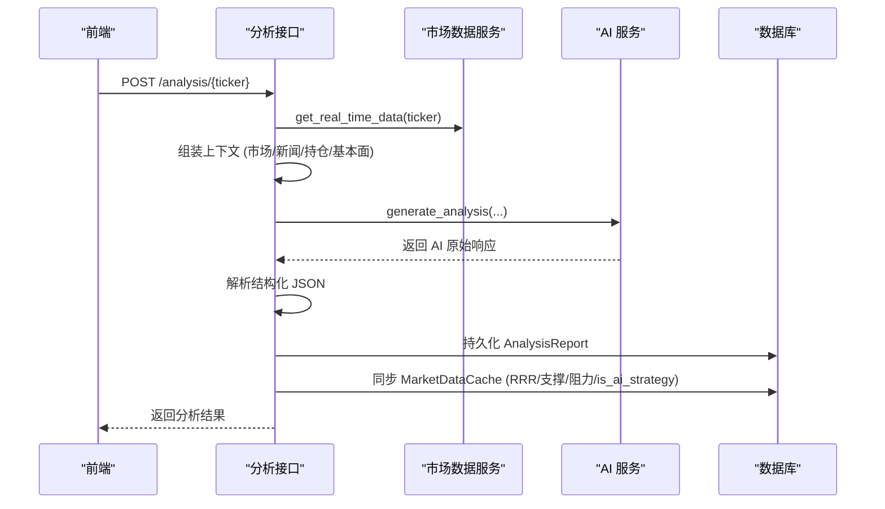

**图表来源**
- [analysis.py](file://backend/app/api/v1/endpoints/analysis.py#L202-L594)

**章节来源**
- [analysis.py](file://backend/app/api/v1/endpoints/analysis.py#L1-L657)

### 前端 API 客户端与错误处理
- 基础配置：baseURL、超时、Content-Type。
- 请求拦截：自动注入 Authorization Bearer Token。
- 响应拦截：401/403 清理本地 token 并跳转登录；5xx/网络错误自动重试（最多 2 次，指数退避）。
- 接口封装：投资组合、AI 分析、用户设置、市场数据等常用 API 方法。

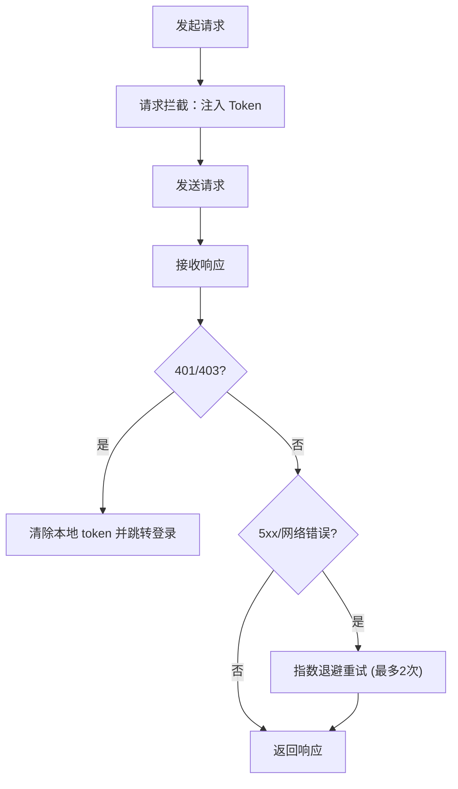

**图表来源**
- [api.ts](file://frontend/lib/api.ts#L17-L87)

**章节来源**
- [api.ts](file://frontend/lib/api.ts#L1-L205)

### 股票详情组件与交易轴可视化
- 状态管理：刷新状态、历史数据加载、技术指标图层切换（布林带、RSI、MACD）。
- 历史数据：首次渲染时拉取 K 线数据，支持加载状态与错误处理。
- 交易轴算法：将止损、建仓区间、目标止盈映射到线性坐标轴，计算当前价格在轴上的百分比位置，动态高亮区域。
- AI 报告展示：Markdown 渲染技术面分析、行动建议、情绪偏差、风险等级、盈亏比等。
- 持仓联动：当用户持有该股票时，止损区颜色区分，显示浮动盈亏与盈亏百分比。

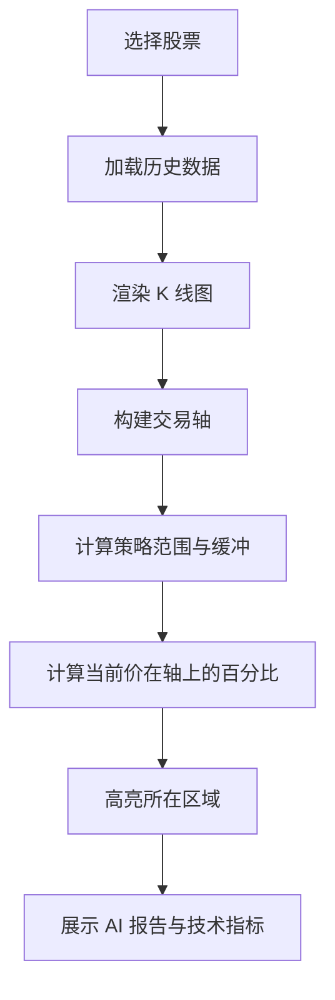

**图表来源**
- [StockDetail.tsx](file://frontend/components/features/StockDetail.tsx#L340-L640)

**章节来源**
- [StockDetail.tsx](file://frontend/components/features/StockDetail.tsx#L1-L964)

## 依赖关系分析
- 后端依赖：FastAPI、SQLAlchemy（异步）、Pydantic、JWKS、Pandas、Axios（前端）。
- 配置管理：Settings 类集中管理数据库、安全、加密、API Key、代理等配置。
- 文档与流程：PRD 描述产品目标、用户画像、功能需求与技术架构；source_learning_guide 提供阶段性学习路线与核心代码定位。

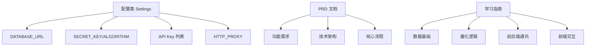

**图表来源**
- [config.py](file://backend/app/core/config.py#L1-L28)
- [PRD.md](file://doc/PRD.md#L1-L114)
- [source_learning_guide.md](file://doc/source_learning_guide.md#L1-L89)

**章节来源**
- [config.py](file://backend/app/core/config.py#L1-L28)
- [PRD.md](file://doc/PRD.md#L1-L114)
- [source_learning_guide.md](file://doc/source_learning_guide.md#L1-L89)

## 性能考虑
- 异步与并发：后端使用 SQLAlchemy AsyncSession 与 asyncio.gather 并行抓取，缩短响应时间。
- 缓存策略：1 分钟内缓存有效，避免频繁外部请求；模拟模式保证网络异常时 UI 不中断。
- 数据库优化：索引 last_updated 字段，SQLite 适合开发测试；生产建议迁移到 PostgreSQL 以支持更高并发。
- 前端性能：图表按需渲染、图层开关控制，减少不必要的重绘；Axios 自动重试与超时保护提升稳定性。

## 故障排除指南
- 后端异常：全局异常处理器记录堆栈并返回结构化错误，前端响应拦截器处理 401/403 并跳转登录。
- 网络错误：前端自动重试（最多 2 次），指数退避；后端 ProviderFactory 故障转移至 YFinance。
- 数据缺失：技术指标缺失时记录警告，AI 解析失败时降级填充默认值，保证前端不空白。
- 配额限制：免费用户每日 3 次限制，建议在设置中配置自有 API Key。

**章节来源**
- [main.py](file://backend/app/main.py#L33-L76)
- [api.ts](file://frontend/lib/api.ts#L44-L87)
- [analysis.py](file://backend/app/api/v1/endpoints/analysis.py#L217-L237)

## 结论
本项目通过清晰的分层架构与模块化设计，实现了从数据抓取、技术指标计算、AI 结构化分析到前端可视化的完整闭环。建议学习者按照阶段性路线图逐步深入：先掌握数据模型与数据库设计，再理解量化逻辑与指标计算，然后贯通前后端通讯与前端交互，最终形成对系统整体的理解与实践能力。