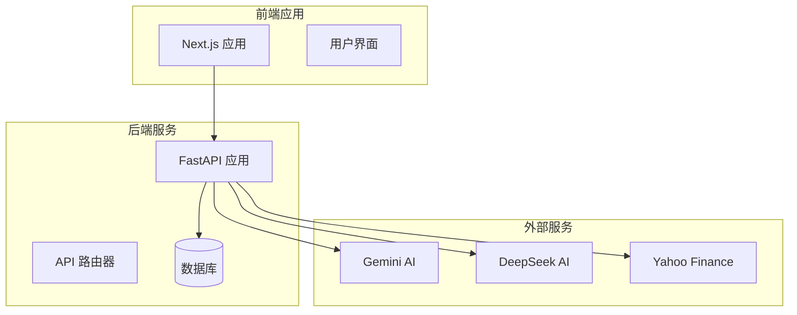
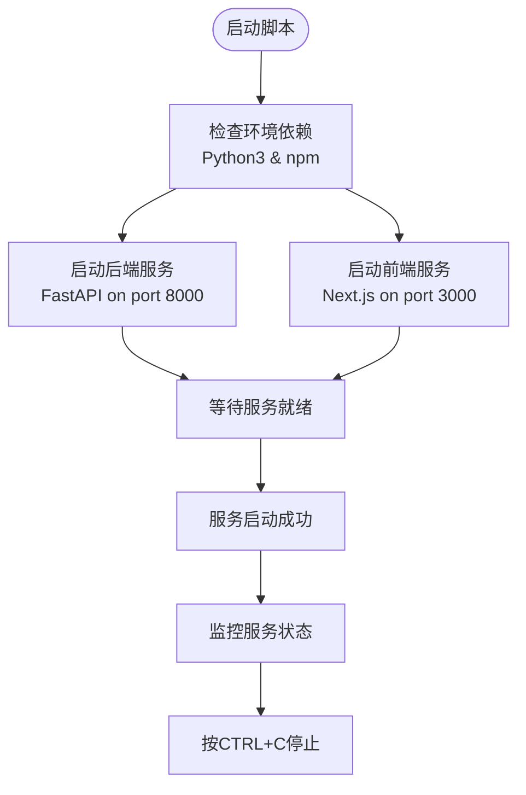
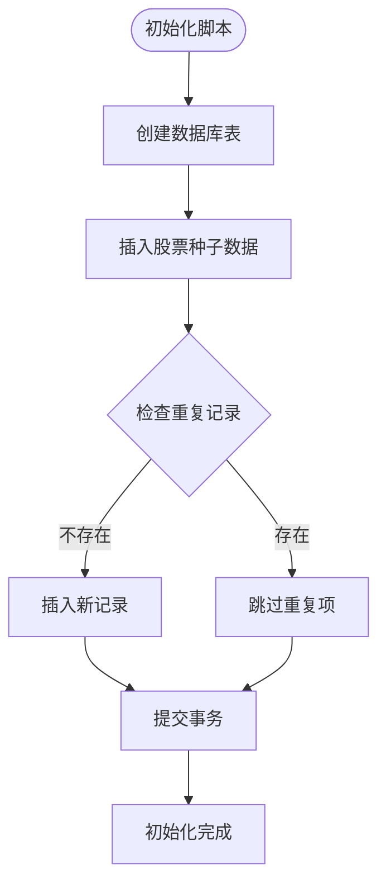
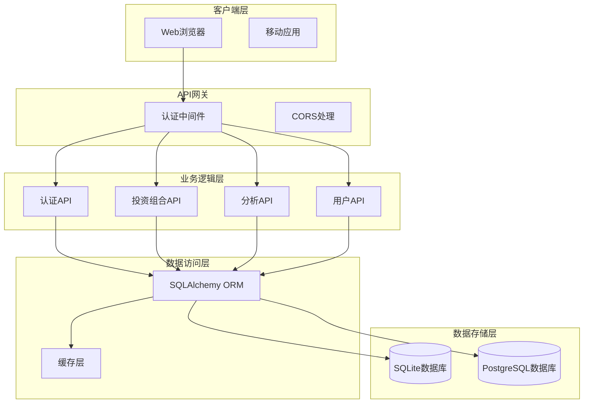
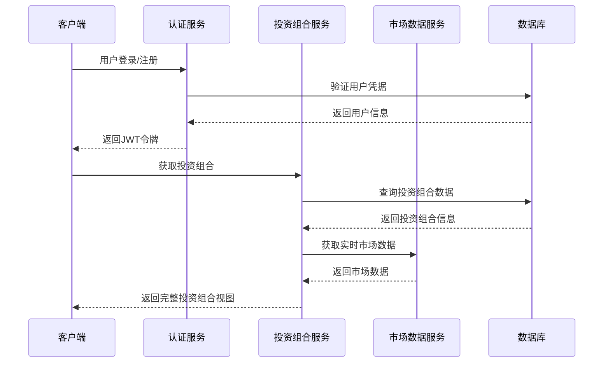

# 快速开始

<cite>
**本文引用的文件**
- [README.md](file://README.md)
- [start.sh](file://start.sh)
- [.env.example](file://.env.example)
- [backend/requirements.txt](file://backend/requirements.txt)
- [frontend/package.json](file://frontend/package.json)
- [backend/app/main.py](file://backend/app/main.py)
- [backend/app/core/config.py](file://backend/app/core/config.py)
- [backend/app/core/database.py](file://backend/app/core/database.py)
- [backend/init_db.py](file://backend/init_db.py)
- [frontend/next.config.ts](file://frontend/next.config.ts)
- [frontend/app/layout.tsx](file://frontend/app/layout.tsx)
- [backend/app/api/auth.py](file://backend/app/api/auth.py)
- [backend/app/api/portfolio.py](file://backend/app/api/portfolio.py)
</cite>

## 目录
1. [简介](#简介)
2. [项目结构](#项目结构)
3. [前置条件与环境准备](#前置条件与环境准备)
4. [一键启动脚本使用指南](#一键启动脚本使用指南)
5. [手动安装与配置步骤](#手动安装与配置步骤)
6. [关键配置项说明](#关键配置项说明)
7. [数据库初始化与种子数据](#数据库初始化与种子数据)
8. [验证安装成功](#验证安装成功)
9. [常见问题与故障排除](#常见问题与故障排除)
10. [架构概览](#架构概览)
11. [结论](#结论)

## 简介
AI智能投资顾问是一个基于人工智能的股票分析平台，帮助投资者做出数据驱动的投资决策。该项目采用前后端分离架构：后端使用FastAPI提供REST API，前端使用Next.js构建交互式仪表盘。

## 项目结构
项目采用模块化设计，主要包含以下组件：
- 后端（FastAPI）：提供用户认证、投资组合管理、市场数据分析等API服务
- 前端（Next.js）：提供用户界面和交互体验
- 数据库：支持SQLite和PostgreSQL，用于存储用户信息、投资组合和市场数据
- 配置系统：通过.env文件管理环境变量和API密钥



**图表来源**
- [backend/app/main.py](file://backend/app/main.py#L1-L38)
- [frontend/app/layout.tsx](file://frontend/app/layout.tsx#L1-L39)

**章节来源**
- [README.md](file://README.md#L45-L50)

## 前置条件与环境准备
在开始之前，请确保系统满足以下要求：

### Python环境
- Python 3.10或更高版本
- pip包管理器
- 推荐使用虚拟环境进行隔离

### Node.js环境
- Node.js 16或更高版本
- npm包管理器

### 数据库支持
- SQLite（默认，无需额外安装）
- PostgreSQL（可选，需要PostgreSQL服务器）

### 外部API密钥
- Gemini API密钥（用于AI分析）
- DeepSeek API密钥（备用AI服务）
- 可选：Alpha Vantage API密钥（市场数据）

**章节来源**
- [start.sh](file://start.sh#L8-L17)
- [backend/requirements.txt](file://backend/requirements.txt#L1-L75)
- [frontend/package.json](file://frontend/package.json#L1-L43)

## 一键启动脚本使用指南
项目提供了便捷的启动脚本，可以同时启动前后端服务。

### 脚本功能概述
- 自动检测Python3和npm环境
- 后端：自动创建/激活虚拟环境，安装依赖，启动FastAPI服务
- 前端：自动安装依赖，启动Next.js开发服务器
- 支持优雅关闭，清理子进程

### 执行步骤
1. 给脚本添加执行权限：
```bash
chmod +x start.sh
```

2. 运行启动脚本：
```bash
./start.sh
```

3. 等待服务启动完成，查看控制台输出的访问地址

### 启动流程图


**图表来源**
- [start.sh](file://start.sh#L1-L44)

**章节来源**
- [README.md](file://README.md#L5-L12)
- [start.sh](file://start.sh#L1-L44)

## 手动安装与配置步骤

### 后端服务安装
1. 进入后端目录并创建虚拟环境：
```bash
cd backend
python3 -m venv venv
source venv/bin/activate  # Linux/Mac
# 或 venv\Scripts\activate  # Windows
```

2. 安装Python依赖：
```bash
pip install -r requirements.txt
```

3. 启动后端服务：
```bash
uvicorn app.main:app --reload
```

### 前端服务安装
1. 进入前端目录：
```bash
cd frontend
```

2. 安装Node.js依赖：
```bash
npm install
```

3. 启动开发服务器：
```bash
npm run dev
```

### 服务访问地址
- 后端API：http://localhost:8000
- API文档：http://localhost:8000/docs
- 前端应用：http://localhost:3000

**章节来源**
- [README.md](file://README.md#L14-L43)

## 关键配置项说明

### 环境变量配置
项目使用.env文件管理配置，以下是关键配置项：

#### 后端配置
- `DATABASE_URL`：数据库连接字符串（默认SQLite）
- `GEMINI_API_KEY`：Gemini AI API密钥
- `DEEPSEEK_API_KEY`：DeepSeek AI API密钥
- `SECRET_KEY`：JWT令牌加密密钥
- `ALPHA_VANTAGE_API_KEY`：可选的Alpha Vantage API密钥

#### 前端配置
- `NEXT_PUBLIC_API_URL`：后端API的基础URL

### 配置加载机制
后端通过Pydantic设置类自动从.env文件加载配置，并提供默认值。

**章节来源**
- [.env.example](file://.env.example#L1-L9)
- [backend/app/core/config.py](file://backend/app/core/config.py#L1-L24)

## 数据库初始化与种子数据

### 默认数据库设置
项目默认使用SQLite数据库，文件名为`ai_advisor.db`，位于项目根目录。

### 数据库初始化流程
1. 创建所有表结构
2. 插入预定义的股票种子数据
3. 初始化基础数据结构

### 种子数据内容
系统包含美国主要上市公司列表，涵盖多个行业领域，包括：
- 科技股：AAPL, MSFT, NVDA, AMD等
- 金融股：JPM, BAC, WFC等
- 消费股：KO, PEP, MCD等
- 医疗股：JNJ, MRK, UNH等

### 初始化脚本功能


**图表来源**
- [backend/init_db.py](file://backend/init_db.py#L61-L82)

**章节来源**
- [backend/init_db.py](file://backend/init_db.py#L1-L85)
- [backend/app/core/database.py](file://backend/app/core/database.py#L1-L24)

## 验证安装成功

### 健康检查
1. 访问后端健康检查端点：
```bash
curl http://localhost:8000/health
```

2. 预期响应：
```json
{
  "status": "ok",
  "message": "Service is healthy"
}
```

### API文档验证
1. 访问API文档页面：http://localhost:8000/docs
2. 查看可用的API端点
3. 测试基本的GET请求

### 前端应用验证
1. 访问前端应用：http://localhost:3000
2. 检查页面加载是否正常
3. 验证UI组件显示

### 数据库连接验证
1. 启动后端服务
2. 观察控制台输出的数据库连接信息
3. 确认没有数据库连接错误

**章节来源**
- [backend/app/main.py](file://backend/app/main.py#L31-L37)

## 常见问题与故障排除

### 环境依赖问题
**问题**：脚本无法找到Python3或npm
**解决**：
- 确保Python3.10+已正确安装
- 确保Node.js和npm已正确安装
- 检查PATH环境变量配置

**问题**：虚拟环境激活失败
**解决**：
- 使用正确的激活命令
- 确保Python3指向正确的解释器
- 检查虚拟环境目录权限

### 端口占用问题
**问题**：端口8000或3000被占用
**解决**：
- 使用其他端口启动服务
- 关闭占用端口的进程
- 检查防火墙设置

### 数据库连接问题
**问题**：数据库连接失败
**解决**：
- 检查DATABASE_URL配置
- 确保数据库服务正在运行
- 验证文件权限（SQLite）

### API密钥问题
**问题**：AI服务调用失败
**解决**：
- 确认API密钥格式正确
- 检查API配额限制
- 验证网络连接

### CORS跨域问题
**问题**：前端无法访问后端API
**解决**：
- 检查CORS配置
- 确保前端和后端端口匹配
- 验证代理设置

**章节来源**
- [start.sh](file://start.sh#L8-L17)
- [backend/app/main.py](file://backend/app/main.py#L6-L22)

## 架构概览

### 系统架构图


**图表来源**
- [backend/app/main.py](file://backend/app/main.py#L24-L29)
- [backend/app/core/database.py](file://backend/app/core/database.py#L1-L24)

### 数据流图


**图表来源**
- [backend/app/api/auth.py](file://backend/app/api/auth.py#L24-L50)
- [backend/app/api/portfolio.py](file://backend/app/api/portfolio.py#L143-L224)

## 结论
通过本快速开始指南，您应该能够：
1. 成功安装和配置AI智能投资顾问项目
2. 理解项目的整体架构和组件关系
3. 掌握一键启动和手动安装两种部署方式
4. 解决常见的安装和配置问题
5. 验证系统的正常运行状态

项目提供了灵活的部署选项，既适合快速体验，也适合深入开发和定制。建议在开始使用前先熟悉项目结构和配置选项，以便更好地利用平台的各项功能。