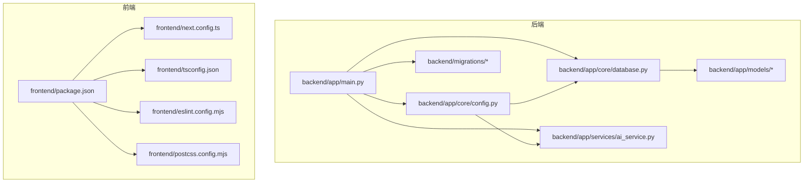
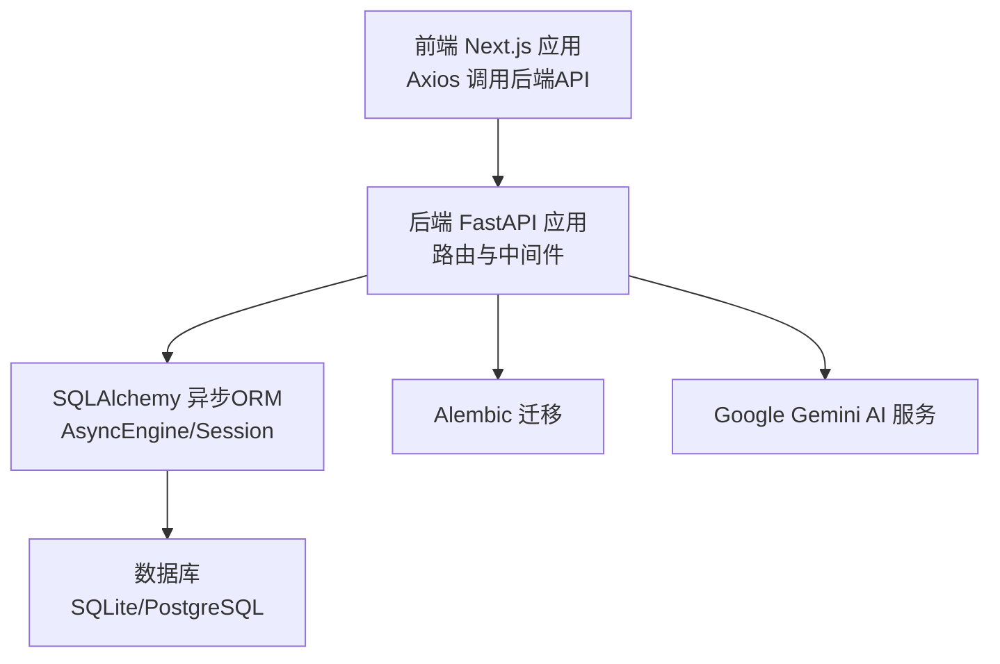
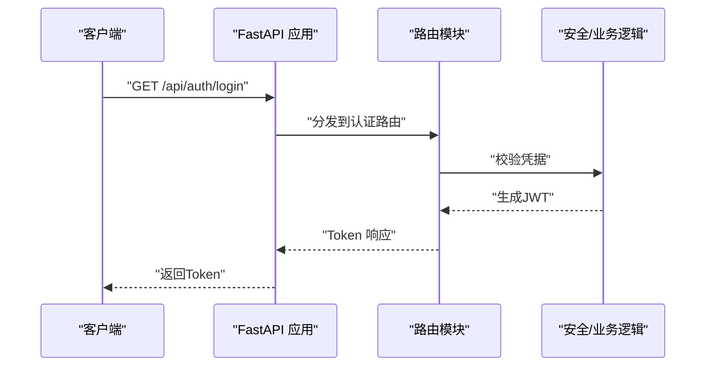
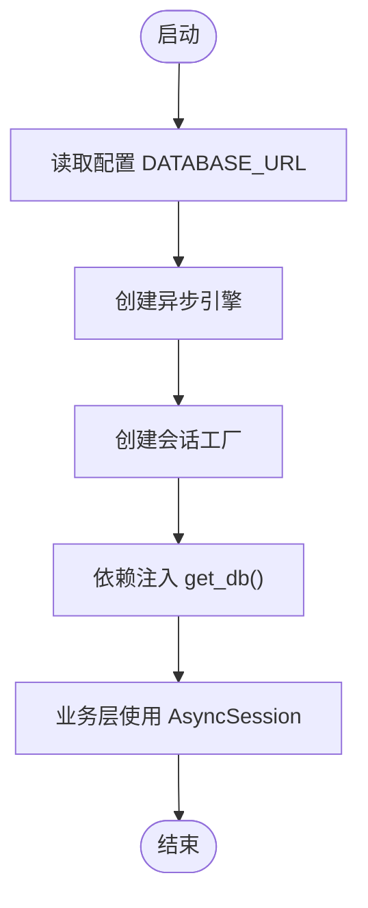
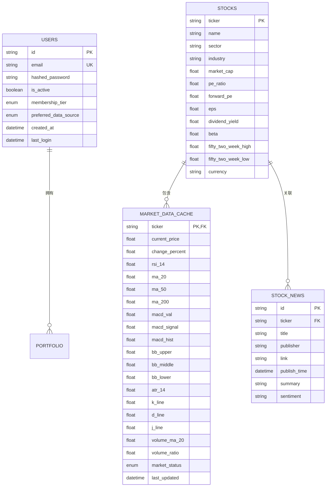
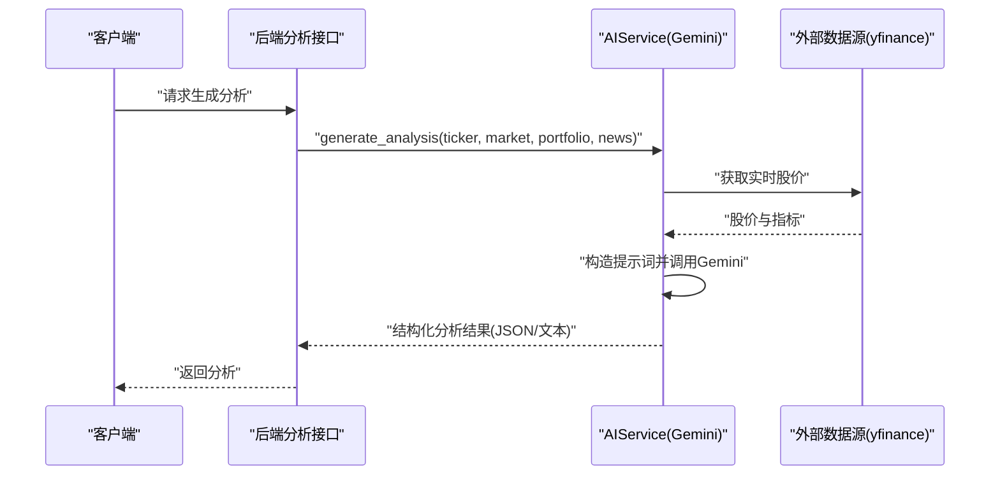
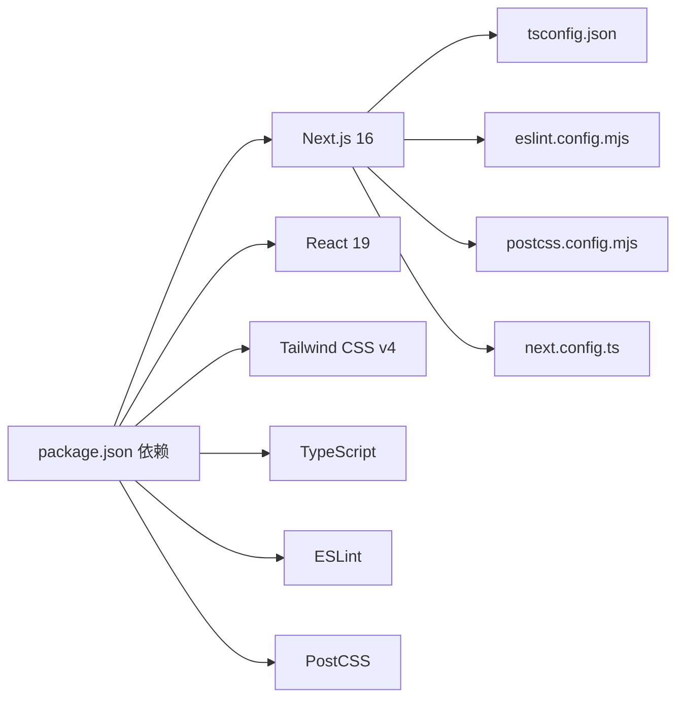
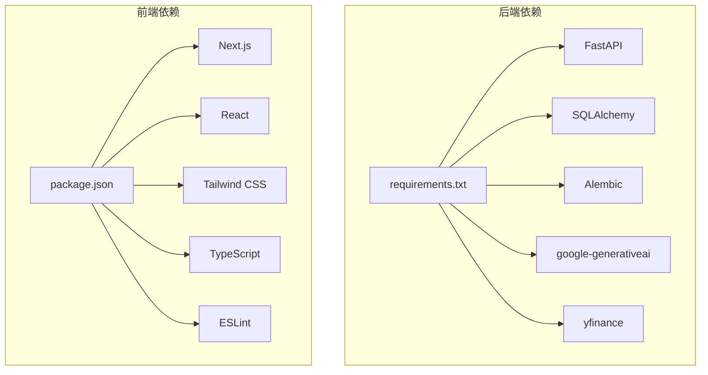

# 技术栈

<cite>
**本文引用的文件**
- [backend/app/main.py](file://backend/app/main.py)
- [backend/requirements.txt](file://backend/requirements.txt)
- [backend/app/core/config.py](file://backend/app/core/config.py)
- [backend/app/core/database.py](file://backend/app/core/database.py)
- [backend/alembic.ini](file://backend/alembic.ini)
- [backend/migrations/versions/35a834f440ba_baseline.py](file://backend/migrations/versions/35a834f440ba_baseline.py)
- [backend/app/services/ai_service.py](file://backend/app/services/ai_service.py)
- [backend/app/models/user.py](file://backend/app/models/user.py)
- [backend/app/models/stock.py](file://backend/app/models/stock.py)
- [backend/app/api/auth.py](file://backend/app/api/auth.py)
- [frontend/package.json](file://frontend/package.json)
- [frontend/tsconfig.json](file://frontend/tsconfig.json)
- [frontend/eslint.config.mjs](file://frontend/eslint.config.mjs)
- [frontend/postcss.config.mjs](file://frontend/postcss.config.mjs)
- [frontend/next.config.ts](file://frontend/next.config.ts)
- [.env.example](file://.env.example)
</cite>

## 目录
1. [引言](#引言)
2. [项目结构](#项目结构)
3. [核心组件](#核心组件)
4. [架构总览](#架构总览)
5. [详细组件分析](#详细组件分析)
6. [依赖分析](#依赖分析)
7. [性能考量](#性能考量)
8. [故障排查指南](#故障排查指南)
9. [结论](#结论)
10. [附录](#附录)

## 引言
本技术栈文档聚焦于“AI股票顾问”项目的后端、前端、AI集成与数据库技术选型与协作关系。后端采用异步FastAPI + SQLAlchemy异步ORM + Alembic迁移；前端采用Next.js 16 + React 19 + Tailwind CSS；AI集成以Google Gemini为主；数据库支持SQLite与PostgreSQL；开发工具链包含TypeScript、ESLint、Prettier风格规范等。本文将从架构、组件、数据流、错误处理与性能等方面进行系统化说明。

## 项目结构
项目采用前后端分离的目录组织方式：
- 后端位于 backend/，包含API路由、核心配置、数据库层、服务层与迁移脚本
- 前端位于 frontend/，包含页面、UI组件、上下文、构建与开发配置
- 顶层示例环境变量文件用于配置数据库与外部API密钥

图表来源
- [backend/app/main.py](file://backend/app/main.py#L1-L38)
- [backend/app/core/config.py](file://backend/app/core/config.py#L1-L24)
- [backend/app/core/database.py](file://backend/app/core/database.py#L1-L24)
- [backend/app/services/ai_service.py](file://backend/app/services/ai_service.py#L1-L112)
- [backend/app/models/user.py](file://backend/app/models/user.py#L1-L31)
- [backend/app/models/stock.py](file://backend/app/models/stock.py#L1-L85)
- [backend/alembic.ini](file://backend/alembic.ini#L1-L148)
- [frontend/next.config.ts](file://frontend/next.config.ts#L1-L8)
- [frontend/tsconfig.json](file://frontend/tsconfig.json#L1-L43)
- [frontend/eslint.config.mjs](file://frontend/eslint.config.mjs#L1-L19)
- [frontend/postcss.config.mjs](file://frontend/postcss.config.mjs#L1-L8)
- [frontend/package.json](file://frontend/package.json#L1-L43)

章节来源
- [backend/app/main.py](file://backend/app/main.py#L1-L38)
- [frontend/package.json](file://frontend/package.json#L1-L43)

## 核心组件
- 后端框架与路由
  - FastAPI作为ASGI框架，启用CORS中间件，统一挂载认证、用户、组合投资、分析等路由模块，提供健康检查与根路径响应
- 数据库与ORM
  - SQLAlchemy 2.x异步引擎与会话工厂，支持SQLite与PostgreSQL；通过配置类动态设置连接URL
- 迁移工具
  - Alembic管理数据库版本演进，支持脚手架生成、日志级别与钩子配置
- AI服务
  - 基于Google Generative AI SDK封装，提供异步内容生成能力，具备JSON模式与降级回退策略
- 前端框架与工具链
  - Next.js 16、React 19、Tailwind CSS v4，配合TypeScript、ESLint、PostCSS与Tailwind插件

章节来源
- [backend/app/main.py](file://backend/app/main.py#L1-L38)
- [backend/app/core/database.py](file://backend/app/core/database.py#L1-L24)
- [backend/alembic.ini](file://backend/alembic.ini#L1-L148)
- [backend/app/services/ai_service.py](file://backend/app/services/ai_service.py#L1-L112)
- [frontend/package.json](file://frontend/package.json#L1-L43)
- [frontend/tsconfig.json](file://frontend/tsconfig.json#L1-L43)
- [frontend/eslint.config.mjs](file://frontend/eslint.config.mjs#L1-L19)
- [frontend/postcss.config.mjs](file://frontend/postcss.config.mjs#L1-L8)

## 架构总览
后端通过FastAPI提供REST接口，使用异步SQLAlchemy访问数据库；AI分析由Gemini完成，返回结构化结果；前端Next.js负责页面渲染与交互，通过Axios调用后端API。

图表来源
- [backend/app/main.py](file://backend/app/main.py#L1-L38)
- [backend/app/core/database.py](file://backend/app/core/database.py#L1-L24)
- [backend/alembic.ini](file://backend/alembic.ini#L1-L148)
- [backend/app/services/ai_service.py](file://backend/app/services/ai_service.py#L1-L112)
- [frontend/package.json](file://frontend/package.json#L1-L43)

## 详细组件分析

### 后端：FastAPI 与路由
- 作用
  - 提供认证、用户、组合投资、分析等API端点，统一CORS策略，暴露健康检查
- 关键点
  - 路由前缀与标签规范化，便于OpenAPI文档与客户端分组
  - 开发阶段允许多源跨域，生产应收紧为具体域名

图表来源
- [backend/app/main.py](file://backend/app/main.py#L24-L29)
- [backend/app/api/auth.py](file://backend/app/api/auth.py#L24-L50)

章节来源
- [backend/app/main.py](file://backend/app/main.py#L1-L38)
- [backend/app/api/auth.py](file://backend/app/api/auth.py#L1-L88)

### 数据库与ORM：SQLAlchemy 异步
- 作用
  - 提供异步连接、会话与声明式基类，支持SQLite与PostgreSQL
- 关键点
  - 动态数据库URL，SQLite时适配线程检查参数
  - 会话工厂配置为异步会话，避免过期提交

图表来源
- [backend/app/core/database.py](file://backend/app/core/database.py#L1-L24)
- [backend/app/core/config.py](file://backend/app/core/config.py#L6-L6)

章节来源
- [backend/app/core/database.py](file://backend/app/core/database.py#L1-L24)
- [backend/app/core/config.py](file://backend/app/core/config.py#L1-L24)

### 数据模型：用户与股票
- 用户模型
  - 包含邮箱、哈希密码、激活状态、会员等级、外部API密钥字段与偏好数据源枚举
- 股票与行情缓存
  - 股票表与市场数据缓存表，包含技术指标（RSI、MACD、布林带、ATR、KDJ）、成交量与状态
  - 新闻表支持未来情感标注扩展

图表来源
- [backend/app/models/user.py](file://backend/app/models/user.py#L1-L31)
- [backend/app/models/stock.py](file://backend/app/models/stock.py#L1-L85)

章节来源
- [backend/app/models/user.py](file://backend/app/models/user.py#L1-L31)
- [backend/app/models/stock.py](file://backend/app/models/stock.py#L1-L85)

### AI集成：Google Gemini
- 作用
  - 将用户持仓、实时技术面与消息面整合为提示词，调用Gemini生成结构化分析
- 关键点
  - 支持JSON响应模式与降级文本模式
  - 缺失API Key时返回提示并禁用AI功能
  - 内置工具函数用于获取实时股价信息

图表来源
- [backend/app/services/ai_service.py](file://backend/app/services/ai_service.py#L43-L112)

章节来源
- [backend/app/services/ai_service.py](file://backend/app/services/ai_service.py#L1-L112)

### 前端：Next.js 16、React 19、Tailwind CSS
- 作用
  - 页面与UI组件、上下文、类型与样式体系
- 关键点
  - Next.js 16、React 19、Tailwind CSS v4
  - TypeScript严格模式、ESLint Next配置、PostCSS集成Tailwind
  - 环境变量通过Next公开配置API地址

图表来源
- [frontend/package.json](file://frontend/package.json#L1-L43)
- [frontend/tsconfig.json](file://frontend/tsconfig.json#L1-L43)
- [frontend/eslint.config.mjs](file://frontend/eslint.config.mjs#L1-L19)
- [frontend/postcss.config.mjs](file://frontend/postcss.config.mjs#L1-L8)
- [frontend/next.config.ts](file://frontend/next.config.ts#L1-L8)

章节来源
- [frontend/package.json](file://frontend/package.json#L1-L43)
- [frontend/tsconfig.json](file://frontend/tsconfig.json#L1-L43)
- [frontend/eslint.config.mjs](file://frontend/eslint.config.mjs#L1-L19)
- [frontend/postcss.config.mjs](file://frontend/postcss.config.mjs#L1-L8)
- [frontend/next.config.ts](file://frontend/next.config.ts#L1-L8)

### 开发工具链：TypeScript、ESLint、Prettier
- TypeScript
  - 严格模式、ESNext模块解析、React JSX、路径别名
- ESLint
  - 基于Next官方规则集，覆盖Web Vitals与TypeScript检查
- Prettier
  - 通过ESLint与Next规则集间接生效，保证一致风格

章节来源
- [frontend/tsconfig.json](file://frontend/tsconfig.json#L1-L43)
- [frontend/eslint.config.mjs](file://frontend/eslint.config.mjs#L1-L19)

### 数据库迁移：Alembic
- 作用
  - 管理数据库版本演进，生成迁移脚本，支持日志与钩子
- 关键点
  - 配置脚本位置、日志级别、路径分隔符等

章节来源
- [backend/alembic.ini](file://backend/alembic.ini#L1-L148)
- [backend/migrations/versions/35a834f440ba_baseline.py](file://backend/migrations/versions/35a834f440ba_baseline.py#L1-L33)

## 依赖分析
后端依赖清单展示了核心组件：FastAPI、SQLAlchemy、Alembic、Google Generative AI SDK、yfinance等；前端依赖Next.js、React、Tailwind CSS、TypeScript与ESLint。

图表来源
- [backend/requirements.txt](file://backend/requirements.txt#L1-L75)
- [frontend/package.json](file://frontend/package.json#L1-L43)

章节来源
- [backend/requirements.txt](file://backend/requirements.txt#L1-L75)
- [frontend/package.json](file://frontend/package.json#L1-L43)

## 性能考量
- 异步数据库访问
  - 使用SQLAlchemy异步引擎与会话，降低I/O阻塞，提升并发吞吐
- AI响应模式
  - 优先JSON模式，失败时回退文本模式，兼顾稳定性与可解析性
- 前端构建优化
  - Next.js 16默认优化、TypeScript严格模式减少运行时错误
- 数据库连接
  - SQLite适用于开发与轻量场景；生产建议PostgreSQL以获得更强事务与并发能力

## 故障排查指南
- CORS问题
  - 确认开发环境允许的源列表，生产需精确限定域名与端口
- 数据库连接
  - 检查DATABASE_URL格式与驱动；SQLite需适配线程参数
- AI服务
  - 确认GEMINI_API_KEY有效；缺失时AI功能将降级为提示信息
- 外部数据源
  - yfinance可能临时不可用，AI服务内置异常捕获与降级返回

章节来源
- [backend/app/main.py](file://backend/app/main.py#L8-L22)
- [backend/app/core/config.py](file://backend/app/core/config.py#L6-L16)
- [backend/app/services/ai_service.py](file://backend/app/services/ai_service.py#L14-L18)
- [backend/app/core/database.py](file://backend/app/core/database.py#L5-L9)

## 结论
本项目在后端采用异步FastAPI + SQLAlchemy + Alembic，在前端采用Next.js 16 + React 19 + Tailwind CSS，并通过Google Gemini实现AI增强分析。技术栈在开发体验、性能与可维护性之间取得平衡：SQLite适合本地开发，PostgreSQL适合生产；TypeScript与ESLint保障类型安全与代码质量；AI集成提供结构化输出与稳健回退机制。

## 附录
- 环境变量示例
  - 后端：DATABASE_URL、GEMINI_API_KEY、DEEPSEEK_API_KEY、SECRET_KEY
  - 前端：NEXT_PUBLIC_API_URL

章节来源
- [.env.example](file://.env.example#L1-L9)