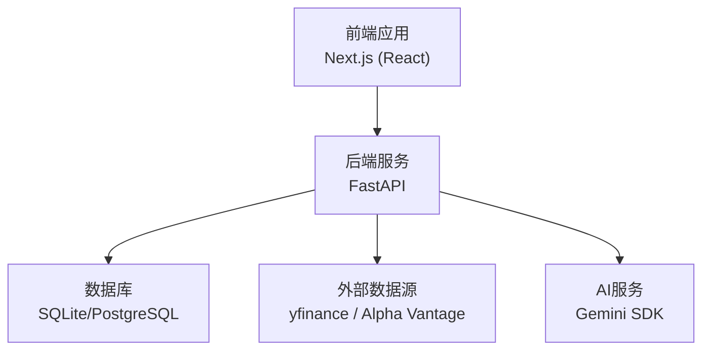
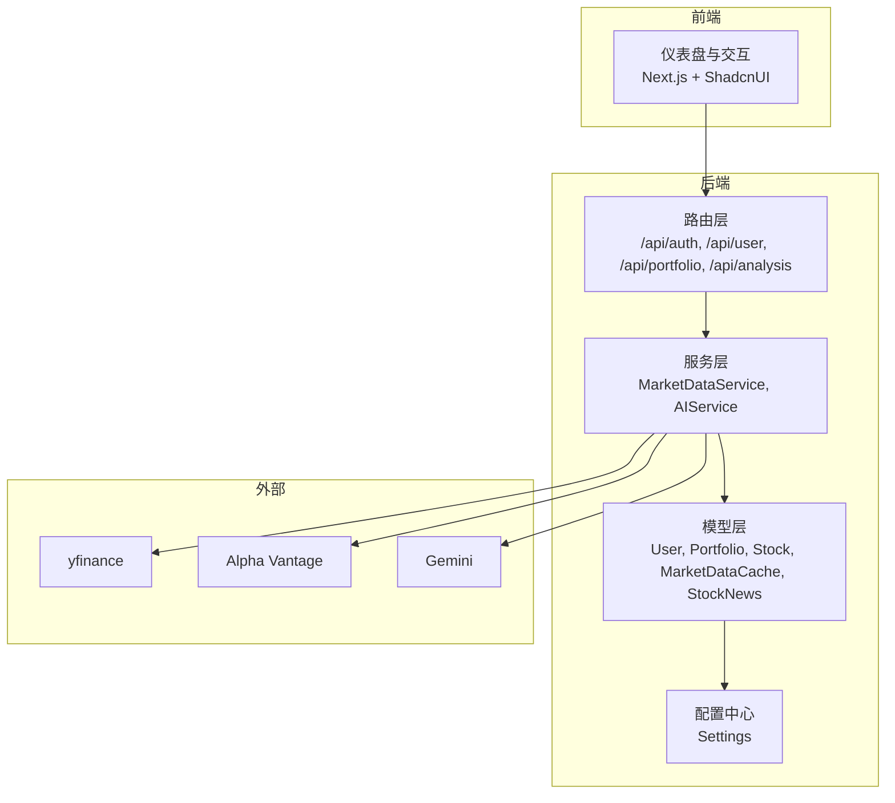
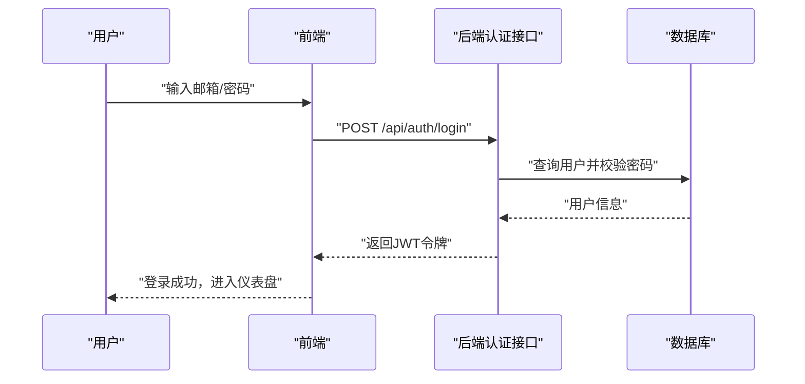
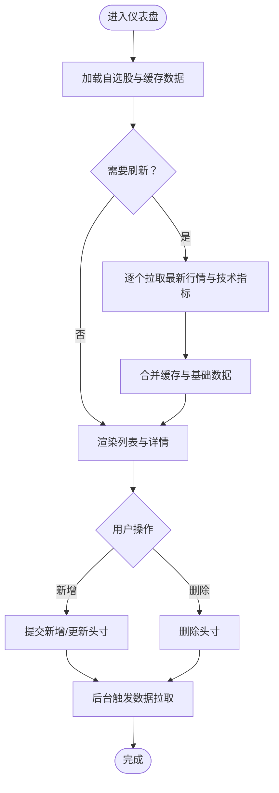
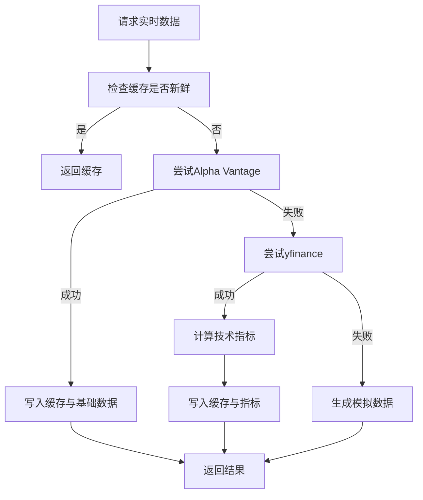
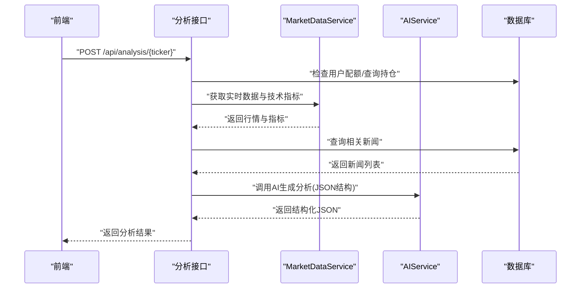
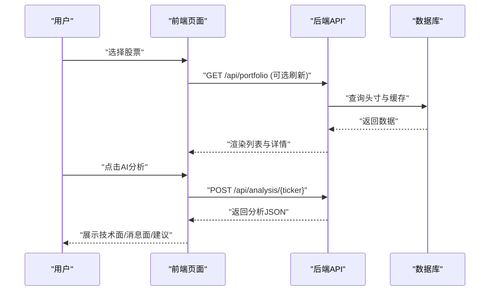
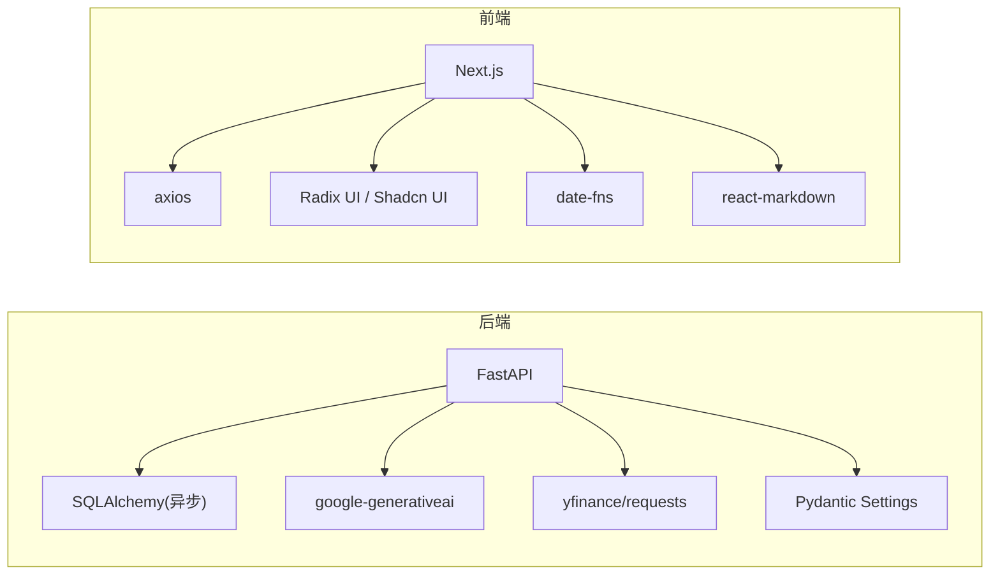

# 项目介绍

<cite>
**本文引用的文件**
- [README.md](file://README.md)
- [backend/app/main.py](file://backend/app/main.py)
- [backend/app/api/analysis.py](file://backend/app/api/analysis.py)
- [backend/app/services/ai_service.py](file://backend/app/services/ai_service.py)
- [backend/app/services/market_data.py](file://backend/app/services/market_data.py)
- [backend/app/models/stock.py](file://backend/app/models/stock.py)
- [backend/app/models/portfolio.py](file://backend/app/models/portfolio.py)
- [backend/app/models/user.py](file://backend/app/models/user.py)
- [backend/app/api/portfolio.py](file://backend/app/api/portfolio.py)
- [backend/app/api/auth.py](file://backend/app/api/auth.py)
- [backend/app/core/config.py](file://backend/app/core/config.py)
- [doc/PRD.md](file://doc/PRD.md)
- [frontend/app/layout.tsx](file://frontend/app/layout.tsx)
- [frontend/app/page.tsx](file://frontend/app/page.tsx)
- [frontend/context/AuthContext.tsx](file://frontend/context/AuthContext.tsx)
- [frontend/package.json](file://frontend/package.json)
</cite>

## 目录
1. [引言](#引言)
2. [项目结构](#项目结构)
3. [核心组件](#核心组件)
4. [架构总览](#架构总览)
5. [详细组件分析](#详细组件分析)
6. [依赖分析](#依赖分析)
7. [性能考量](#性能考量)
8. [故障排查指南](#故障排查指南)
9. [结论](#结论)
10. [附录](#附录)

## 引言
AI智能投顾助手是一个面向个人投资者与财经从业者的AI驱动股票分析平台。项目以“数据即服务”的理念，将实时市场数据、技术指标与AI智能分析相结合，帮助用户在有限时间内获得高质量的投资决策参考。平台通过前后端分离架构，后端提供高性能的异步API与数据处理能力，前端提供直观的仪表盘与交互体验，形成“手动触发 + 个性化上下文 + 多源数据融合”的分析闭环。

本项目的核心价值在于：
- 省时：一站式聚合行情、技术指标与新闻，避免在多个平台间切换
- 降本：用户自主API Key + 手动触发机制，有效控制Token消耗
- 易懂：将复杂的技术指标与消息面转化为可执行的建议与风险提示

## 项目结构
项目采用前后端分离的典型组织方式：
- 后端（FastAPI）：负责认证授权、用户与资产数据、实时行情与技术指标计算、AI分析调度与限流策略
- 前端（Next.js）：提供仪表盘、自选股管理、个股详情与AI分析结果展示
- 文档（doc）：包含PRD、技术栈说明与数据库规范

图表来源
- [backend/app/main.py](file://backend/app/main.py#L1-L38)
- [frontend/app/layout.tsx](file://frontend/app/layout.tsx#L1-L39)

章节来源
- [README.md](file://README.md#L45-L50)
- [backend/app/main.py](file://backend/app/main.py#L1-L38)
- [frontend/app/layout.tsx](file://frontend/app/layout.tsx#L1-L39)

## 核心组件
- 认证与用户中心：提供邮箱注册/登录、JWT令牌签发与用户偏好（API Key、数据源偏好）
- 资产与头寸管理：支持自选股录入、编辑与删除；按用户维度维护持仓成本与数量
- 实时行情与技术分析：统一缓存与计算RSI、MACD、布林带、KDJ、ATR等指标；支持新闻抓取与去重入库
- AI智能分析：以“技术面 + 消息面 + 持仓背景”为上下文，生成结构化分析建议
- 业务限制与SaaS能力：免费用户每日额度限制，Pro会员解锁更多能力

章节来源
- [backend/app/api/auth.py](file://backend/app/api/auth.py#L1-L88)
- [backend/app/api/portfolio.py](file://backend/app/api/portfolio.py#L1-L297)
- [backend/app/services/market_data.py](file://backend/app/services/market_data.py#L1-L370)
- [backend/app/services/ai_service.py](file://backend/app/services/ai_service.py#L1-L112)
- [backend/app/api/analysis.py](file://backend/app/api/analysis.py#L1-L124)

## 架构总览
后端通过FastAPI提供REST接口，路由统一挂载在根路径下；数据库采用异步SQLAlchemy模型；外部数据通过yfinance与Alpha Vantage进行补充；AI分析由Gemini SDK完成，支持结构化输出与降级回退。

图表来源
- [backend/app/main.py](file://backend/app/main.py#L24-L29)
- [backend/app/api/analysis.py](file://backend/app/api/analysis.py#L13-L124)
- [backend/app/services/market_data.py](file://backend/app/services/market_data.py#L13-L170)
- [backend/app/services/ai_service.py](file://backend/app/services/ai_service.py#L43-L112)
- [backend/app/core/config.py](file://backend/app/core/config.py#L4-L24)

## 详细组件分析

### 认证与用户中心
- 登录/注册：邮箱+密码验证，签发JWT访问令牌
- 用户偏好：保存Gemini/DeepSeek API Key、首选数据源（yfinance/Alpha Vantage）
- 会话与权限：基于依赖注入获取当前用户，贯穿分析与资产接口

图表来源
- [backend/app/api/auth.py](file://backend/app/api/auth.py#L24-L50)
- [backend/app/core/config.py](file://backend/app/core/config.py#L9-L11)

章节来源
- [backend/app/api/auth.py](file://backend/app/api/auth.py#L1-L88)
- [backend/app/models/user.py](file://backend/app/models/user.py#L15-L31)
- [backend/app/core/config.py](file://backend/app/core/config.py#L4-L24)

### 资产与头寸管理
- 自选股搜索：本地优先，远程兜底（yfinance）
- 头寸录入/编辑/删除：支持按用户维度唯一约束
- 仪表盘汇总：实时计算市值、未实现盈亏与盈亏百分比，并联动技术指标与基本面字段

图表来源
- [backend/app/api/portfolio.py](file://backend/app/api/portfolio.py#L143-L224)
- [backend/app/api/portfolio.py](file://backend/app/api/portfolio.py#L231-L271)
- [backend/app/models/portfolio.py](file://backend/app/models/portfolio.py#L7-L26)
- [backend/app/models/stock.py](file://backend/app/models/stock.py#L13-L85)

章节来源
- [backend/app/api/portfolio.py](file://backend/app/api/portfolio.py#L1-L297)
- [backend/app/models/portfolio.py](file://backend/app/models/portfolio.py#L1-L26)
- [backend/app/models/stock.py](file://backend/app/models/stock.py#L1-L85)

### 实时行情与技术分析
- 缓存策略：1分钟内命中缓存，避免频繁请求外部API
- 多源回退：优先Alpha Vantage，失败则回退yfinance；若仍失败，使用模拟数据维持体验
- 指标计算：基于yfinance历史数据计算RSI、MACD、布林带、KDJ、ATR、量比等
- 新闻入库：去重插入，便于后续消息面分析

图表来源
- [backend/app/services/market_data.py](file://backend/app/services/market_data.py#L15-L170)
- [backend/app/services/market_data.py](file://backend/app/services/market_data.py#L173-L318)
- [backend/app/services/market_data.py](file://backend/app/services/market_data.py#L321-L370)

章节来源
- [backend/app/services/market_data.py](file://backend/app/services/market_data.py#L1-L370)
- [backend/app/models/stock.py](file://backend/app/models/stock.py#L33-L67)

### AI智能分析
- 上下文组装：技术面（价格、涨跌幅、RSI、MACD、布林带、KDJ、ATR）、消息面（最近5条新闻）、持仓背景（成本、数量、未实现盈亏）
- 限流策略：免费用户每日最多3次分析；Pro会员可提升额度
- 输出结构：技术分析、消息面解读、可执行操作建议（买入/卖出/持有）

图表来源
- [backend/app/api/analysis.py](file://backend/app/api/analysis.py#L13-L124)
- [backend/app/services/ai_service.py](file://backend/app/services/ai_service.py#L43-L112)

章节来源
- [backend/app/api/analysis.py](file://backend/app/api/analysis.py#L1-L124)
- [backend/app/services/ai_service.py](file://backend/app/services/ai_service.py#L1-L112)

### 前端交互与用户体验
- 仪表盘：左侧自选股列表，右侧个股详情；支持筛选、排序、编辑与添加
- 市场状态：纽约时间盘前/盘中/盘后/休市状态与倒计时
- AI分析：点击“AI深度分析”按钮，解析AI返回的结构化JSON并渲染
- 认证上下文：全局登录态管理，未登录自动跳转登录页

图表来源
- [frontend/app/page.tsx](file://frontend/app/page.tsx#L30-L240)
- [frontend/context/AuthContext.tsx](file://frontend/context/AuthContext.tsx#L15-L60)

章节来源
- [frontend/app/page.tsx](file://frontend/app/page.tsx#L1-L686)
- [frontend/context/AuthContext.tsx](file://frontend/context/AuthContext.tsx#L1-L60)

## 依赖分析
- 后端依赖
  - FastAPI：提供高性能异步API与自动文档
  - SQLAlchemy（异步）：ORM与数据库模型
  - yfinance/requests：美股数据与新闻抓取
  - google-generativeai：Gemini模型调用
  - Pydantic Settings：环境变量与配置读取
- 前端依赖
  - Next.js：SSR/CSR框架
  - Radix UI + Shadcn UI：组件库
  - axios：HTTP客户端
  - date-fns：时间格式化
  - react-markdown：AI输出渲染

图表来源
- [backend/app/main.py](file://backend/app/main.py#L1-L38)
- [backend/app/core/config.py](file://backend/app/core/config.py#L4-L24)
- [frontend/package.json](file://frontend/package.json#L11-L42)

章节来源
- [backend/app/main.py](file://backend/app/main.py#L1-L38)
- [backend/app/core/config.py](file://backend/app/core/config.py#L1-L24)
- [frontend/package.json](file://frontend/package.json#L1-L43)

## 性能考量
- 缓存与回退：1分钟内缓存命中，多源回退与模拟数据保障可用性
- 并发与超时：yfinance异步执行与超时控制，避免阻塞主流程
- 数据库连接：异步会话减少锁等待，批量查询与一次性刷新降低IO
- 前端渲染：按需解析AI JSON，Markdown渲染优化长文本展示

## 故障排查指南
- 登录失败：检查邮箱/密码是否正确，确认用户已存在且密码哈希匹配
- 分析额度限制：免费用户达到每日上限（默认3次），需在设置中绑定自有API Key
- 数据拉取异常：关注yfinance 429限流与Alpha Vantage配额，必要时切换数据源或增加延时
- AI输出解析失败：AI可能返回纯文本或包裹Markdown，前端已做降级处理，建议在设置中填写API Key以获得稳定结构化输出

章节来源
- [backend/app/api/auth.py](file://backend/app/api/auth.py#L24-L50)
- [backend/app/api/analysis.py](file://backend/app/api/analysis.py#L46-L50)
- [backend/app/services/market_data.py](file://backend/app/services/market_data.py#L303-L318)
- [frontend/app/page.tsx](file://frontend/app/page.tsx#L206-L240)

## 结论
AI智能投顾助手通过“数据 + 指标 + 消息面 + 持仓背景”的多维上下文，结合AI模型生成可执行的分析建议，帮助用户在碎片时间做出更明智的投资决策。项目具备清晰的功能边界、稳健的后端架构与现代化的前端体验，适合个人投资者与入门级分析师使用。随着后续接入更多模型与指标，平台将逐步演进为SaaS化产品，提供更丰富的订阅服务与企业级能力。

## 附录
- 快速启动：后端使用uvicorn运行，前端使用npm run dev启动，支持一键脚本
- 项目文档：PRD、技术栈与数据库规范位于doc目录

章节来源
- [README.md](file://README.md#L5-L44)
- [doc/PRD.md](file://doc/PRD.md#L1-L134)