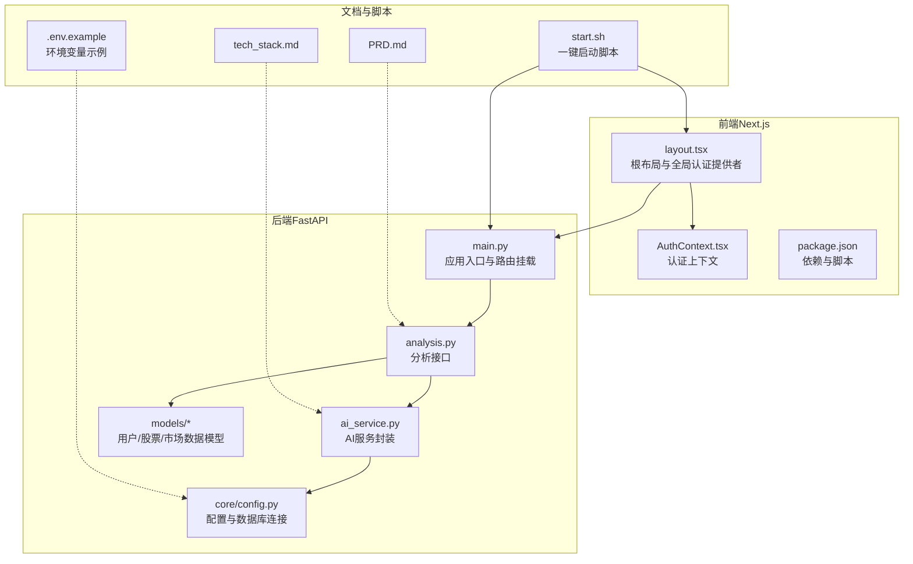
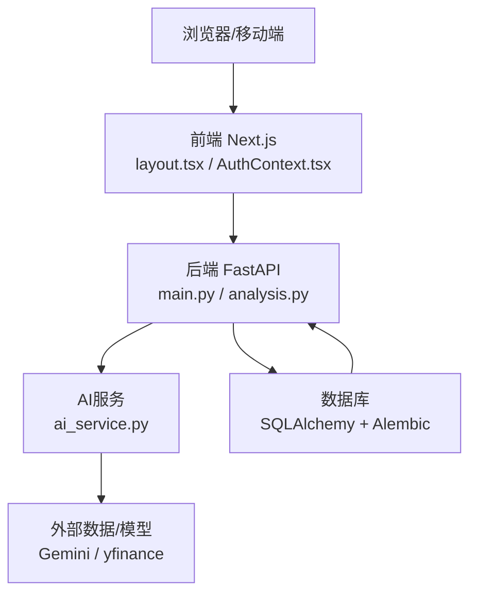
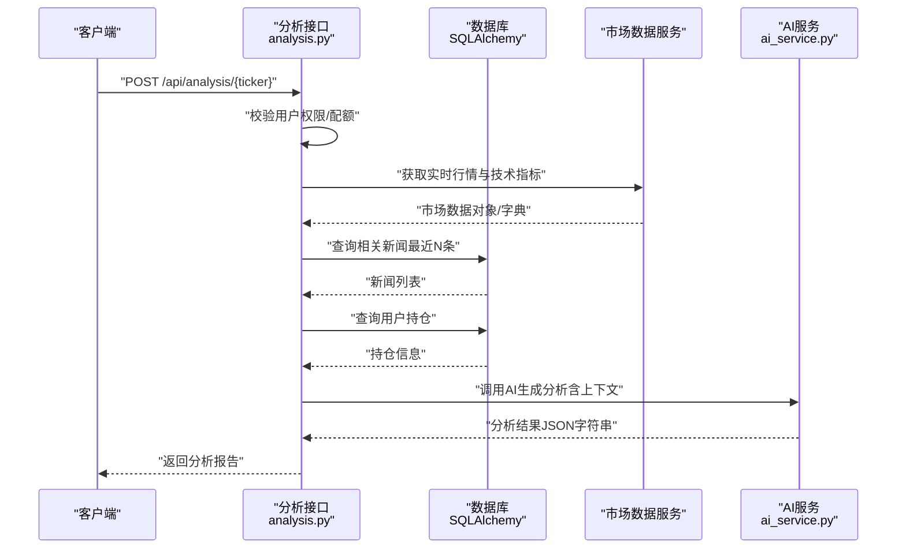
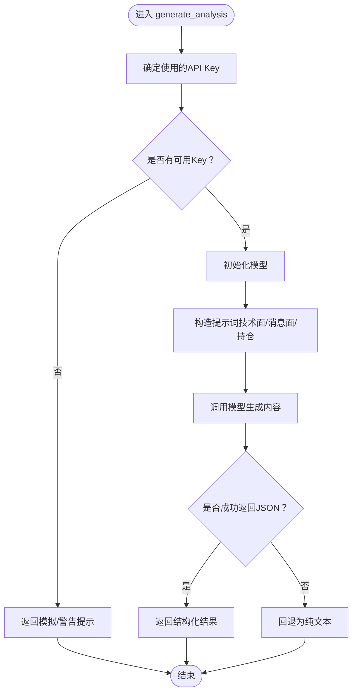
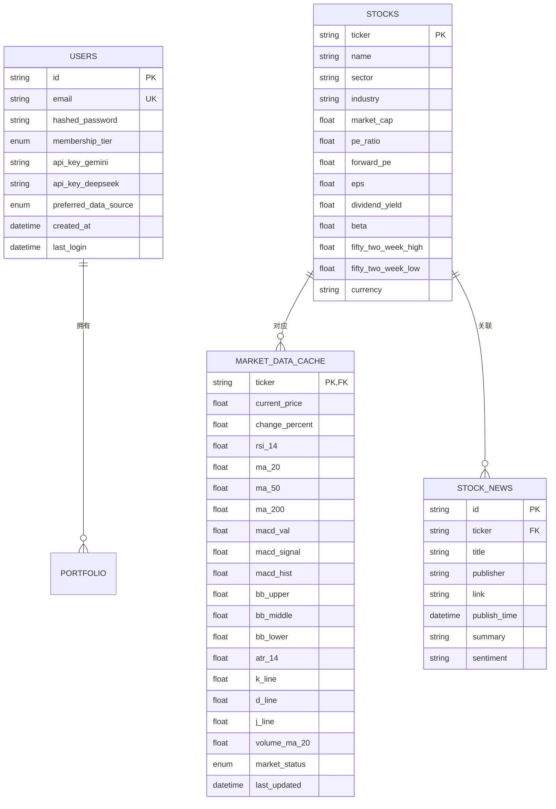
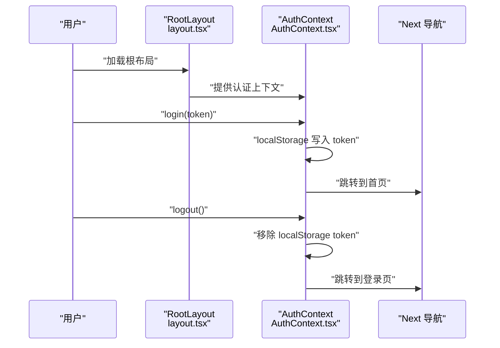
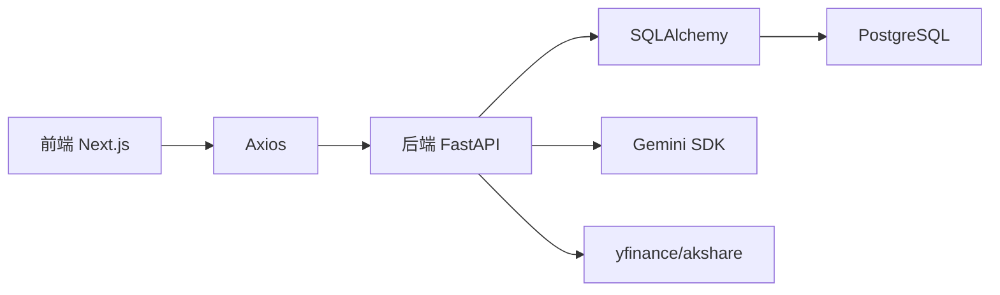

# 项目概述

<cite>
**本文引用的文件**
- [README.md](file://README.md)
- [PRD.md](file://doc/PRD.md)
- [tech_stack.md](file://doc/tech_stack.md)
- [start.sh](file://start.sh)
- [.env.example](file://.env.example)
- [backend/app/main.py](file://backend/app/main.py)
- [backend/app/api/analysis.py](file://backend/app/api/analysis.py)
- [backend/app/services/ai_service.py](file://backend/app/services/ai_service.py)
- [backend/app/models/stock.py](file://backend/app/models/stock.py)
- [backend/app/models/user.py](file://backend/app/models/user.py)
- [backend/app/core/config.py](file://backend/app/core/config.py)
- [frontend/app/layout.tsx](file://frontend/app/layout.tsx)
- [frontend/context/AuthContext.tsx](file://frontend/context/AuthContext.tsx)
- [frontend/package.json](file://frontend/package.json)
- [backend/migrations/versions/35a834f440ba_baseline.py](file://backend/migrations/versions/35a834f440ba_baseline.py)
- [backend/migrations/versions/48d7355e90d6_add_more_technical_indicators.py](file://backend/migrations/versions/48d7355e90d6_add_more_technical_indicators.py)
</cite>

## 目录
1. [引言](#引言)
2. [项目结构](#项目结构)
3. [核心组件](#核心组件)
4. [架构总览](#架构总览)
5. [详细组件分析](#详细组件分析)
6. [依赖分析](#依赖分析)
7. [性能考量](#性能考量)
8. [故障排查指南](#故障排查指南)
9. [结论](#结论)
10. [附录](#附录)

## 引言
本项目旨在打造一个“AI驱动的智能投顾平台”，帮助个人投资者以更高效的方式做出数据驱动的投资决策。平台采用前后端分离架构，后端基于FastAPI提供高性能API服务，前端采用Next.js构建现代化仪表盘与交互界面；AI分析能力通过Gemini等外部模型提供，结合实时行情、技术指标与消息面，输出面向普通用户的可执行建议。项目强调“省时、降本、易懂”的价值主张：自动聚合数据、按需触发AI分析以控制成本、将复杂指标转化为通俗易懂的建议。

## 项目结构
项目采用双栈分离设计：
- 后端（Python/FastAPI）：负责认证授权、用户与持仓管理、市场数据拉取与缓存、AI分析编排与限流策略。
- 前端（Next.js）：负责用户认证态管理、仪表盘与个股详情页、图表与交互组件。
- 文档（doc）：包含PRD、技术栈说明与数据库与数据流规范。
- 运维脚本：一键启动前后端服务，便于本地开发与演示。

**图表来源**
- [backend/app/main.py](file://backend/app/main.py#L1-L38)
- [backend/app/api/analysis.py](file://backend/app/api/analysis.py#L1-L124)
- [backend/app/services/ai_service.py](file://backend/app/services/ai_service.py#L1-L112)
- [backend/app/models/stock.py](file://backend/app/models/stock.py#L1-L85)
- [backend/app/models/user.py](file://backend/app/models/user.py#L1-L31)
- [backend/app/core/config.py](file://backend/app/core/config.py#L1-L24)
- [frontend/app/layout.tsx](file://frontend/app/layout.tsx#L1-L39)
- [frontend/context/AuthContext.tsx](file://frontend/context/AuthContext.tsx#L1-L60)
- [frontend/package.json](file://frontend/package.json#L1-L43)
- [start.sh](file://start.sh#L1-L44)
- [.env.example](file://.env.example#L1-L9)

**章节来源**
- [README.md](file://README.md#L45-L50)
- [start.sh](file://start.sh#L1-L44)
- [frontend/package.json](file://frontend/package.json#L1-L43)

## 核心组件
- 应用入口与路由
  - 后端应用通过统一入口挂载认证、用户、组合与分析四个模块的路由，启用CORS以便前端访问。
- 分析接口
  - 提供个股分析能力，整合用户权限校验、市场数据获取、新闻上下文与持仓信息，调用AI服务生成分析报告。
- AI服务
  - 封装Gemini调用，支持按用户API Key优先、回退到项目配置Key；内置JSON响应约束与错误降级处理。
- 数据模型
  - 用户模型包含会员等级与外部API Key字段；股票与市场数据缓存模型覆盖常用技术指标与市场状态。
- 前端布局与认证
  - 根布局注入全局认证上下文，前端通过本地存储维护登录态并进行路由跳转。

**章节来源**
- [backend/app/main.py](file://backend/app/main.py#L1-L38)
- [backend/app/api/analysis.py](file://backend/app/api/analysis.py#L1-L124)
- [backend/app/services/ai_service.py](file://backend/app/services/ai_service.py#L1-L112)
- [backend/app/models/user.py](file://backend/app/models/user.py#L1-L31)
- [backend/app/models/stock.py](file://backend/app/models/stock.py#L1-L85)
- [frontend/app/layout.tsx](file://frontend/app/layout.tsx#L1-L39)
- [frontend/context/AuthContext.tsx](file://frontend/context/AuthContext.tsx#L1-L60)

## 架构总览
系统采用“前后端分离 + AI外部化”的架构理念：
- 前端Next.js负责UI与交互，通过Axios调用后端REST API。
- 后端FastAPI提供认证、业务编排与AI分析服务，内部通过服务层对接外部数据源与AI模型。
- 数据层采用SQLAlchemy ORM与异步IO，配合Alembic迁移管理数据库演进。
- 配置集中于Pydantic Settings，支持环境变量注入与敏感信息隔离。

**图表来源**
- [backend/app/main.py](file://backend/app/main.py#L1-L38)
- [backend/app/api/analysis.py](file://backend/app/api/analysis.py#L1-L124)
- [backend/app/services/ai_service.py](file://backend/app/services/ai_service.py#L1-L112)
- [backend/app/core/config.py](file://backend/app/core/config.py#L1-L24)
- [frontend/app/layout.tsx](file://frontend/app/layout.tsx#L1-L39)
- [frontend/context/AuthContext.tsx](file://frontend/context/AuthContext.tsx#L1-L60)

## 详细组件分析

### 分析接口流程（API）
分析接口承担“权限校验 → 市场数据获取 → 新闻上下文 → 持仓信息 → AI生成报告”的完整链路，体现“MCP（模型上下文协议）”思想：将多源数据打包为LLM可理解的上下文，输出结构化建议。

**图表来源**
- [backend/app/api/analysis.py](file://backend/app/api/analysis.py#L13-L124)
- [backend/app/services/ai_service.py](file://backend/app/services/ai_service.py#L43-L112)

**章节来源**
- [backend/app/api/analysis.py](file://backend/app/api/analysis.py#L1-L124)

### AI服务封装（AI集成方案）
AI服务负责：
- Key优先级：优先使用用户设置的API Key，其次使用项目配置Key。
- 模型选择：指定具体模型名称，确保稳定性。
- 上下文构造：将技术面、消息面与持仓信息拼装为提示词。
- 响应处理：强制JSON输出，失败时回退为纯文本。

**图表来源**
- [backend/app/services/ai_service.py](file://backend/app/services/ai_service.py#L43-L112)

**章节来源**
- [backend/app/services/ai_service.py](file://backend/app/services/ai_service.py#L1-L112)

### 数据模型与技术指标
数据模型围绕“用户、股票、市场数据缓存、新闻”展开，覆盖常用技术指标（RSI、MACD、布林带、ATR、KDJ等）与市场状态枚举，便于前端直观呈现与AI消费。

**图表来源**
- [backend/app/models/user.py](file://backend/app/models/user.py#L1-L31)
- [backend/app/models/stock.py](file://backend/app/models/stock.py#L13-L85)

**章节来源**
- [backend/app/models/user.py](file://backend/app/models/user.py#L1-L31)
- [backend/app/models/stock.py](file://backend/app/models/stock.py#L1-L85)

### 前端认证与布局
前端通过根布局注入认证上下文，使用本地存储保存令牌并在登录/登出时更新状态与路由，保证跨页面的认证一致性。

**图表来源**
- [frontend/app/layout.tsx](file://frontend/app/layout.tsx#L20-L38)
- [frontend/context/AuthContext.tsx](file://frontend/context/AuthContext.tsx#L15-L51)

**章节来源**
- [frontend/app/layout.tsx](file://frontend/app/layout.tsx#L1-L39)
- [frontend/context/AuthContext.tsx](file://frontend/context/AuthContext.tsx#L1-L60)

## 依赖分析
- 技术栈选择与优势
  - 前端：Next.js（App Router）、TypeScript、Tailwind CSS、Shadcn/UI、Recharts、Axios、React Hook Form/Zod，适合快速构建现代UI与表单校验。
  - 后端：FastAPI（高性能、原生异步、OpenAPI）、SQLAlchemy AsyncIO、Alembic、Pydantic V2、Uvicorn，适合高并发API与数据验证。
  - AI集成：Google Generative AI SDK、兼容DeepSeek等模型，支持结构化输出与错误降级。
  - 数据与缓存：yfinance/akshare（金融数据）、pandas/pandas-ta（技术指标）、PostgreSQL（持久化）。
- 外部依赖与集成点
  - 前端Axios调用后端API；后端通过Gemini SDK调用外部模型；数据库通过SQLAlchemy ORM访问。
- 配置与环境
  - 通过Pydantic Settings读取.env中的数据库URL、API Key与密钥；前端通过NEXT_PUBLIC_API_URL指向后端地址。

**图表来源**
- [frontend/package.json](file://frontend/package.json#L11-L29)
- [backend/app/services/ai_service.py](file://backend/app/services/ai_service.py#L1-L112)
- [backend/app/core/config.py](file://backend/app/core/config.py#L1-L24)

**章节来源**
- [tech_stack.md](file://doc/tech_stack.md#L11-L50)
- [frontend/package.json](file://frontend/package.json#L1-L43)
- [backend/app/core/config.py](file://backend/app/core/config.py#L1-L24)

## 性能考量
- 异步与并发
  - 后端使用异步数据库会话与异步AI调用，提升并发处理能力与响应速度。
- 缓存与限流
  - 市场数据缓存表存储技术指标与状态，减少重复计算与外部请求压力；分析接口对免费用户实施每日次数限制，避免滥用。
- 前端优化
  - 使用SWR/TanStack Query进行缓存与去重请求，减少不必要的网络开销。
- 数据库演进
  - 通过Alembic迁移逐步增加技术指标列，保持Schema演进的可控性与可追溯性。

**章节来源**
- [backend/app/api/analysis.py](file://backend/app/api/analysis.py#L27-L50)
- [backend/migrations/versions/48d7355e90d6_add_more_technical_indicators.py](file://backend/migrations/versions/48d7355e90d6_add_more_technical_indicators.py#L21-L46)

## 故障排查指南
- 启动问题
  - 若一键脚本报错，请确认已安装Python与Node.js；脚本会自动安装依赖并启动前后端服务。
- 认证与登录
  - 前端通过本地存储维护token；如无法跳转，请检查登录回调是否写入token并正确路由。
- AI分析不可用
  - 若返回模拟/警告提示，表示缺少API Key；请在设置页填写有效Key并保存。
- 数据库与迁移
  - 如出现表结构不匹配，请运行迁移脚本；Baseline与新增指标迁移文件已提供。
- 环境变量
  - 确保.DOTENV中包含数据库URL与API Key；前端NEXT_PUBLIC_API_URL需指向后端地址。

**章节来源**
- [start.sh](file://start.sh#L8-L17)
- [frontend/context/AuthContext.tsx](file://frontend/context/AuthContext.tsx#L27-L37)
- [backend/app/services/ai_service.py](file://backend/app/services/ai_service.py#L47-L48)
- [backend/migrations/versions/35a834f440ba_baseline.py](file://backend/migrations/versions/35a834f440ba_baseline.py#L21-L25)
- [.env.example](file://.env.example#L1-L9)

## 结论
本项目以“MCP上下文 + LLM解读”的思路，将实时行情、技术指标与消息面整合为可执行建议，满足初学者与上班族对“省时、降本、易懂”的核心诉求。通过前后端分离与清晰的服务边界，系统具备良好的扩展性与可维护性；结合数据库迁移与异步架构，能够支撑未来SaaS化与商业化演进。

## 附录
- 快速开始
  - 使用一键脚本启动：赋予执行权限并运行脚本，自动安装依赖并分别启动前端与后端。
  - 手动启动：后端进入backend目录安装依赖并启动Uvicorn；前端进入frontend目录安装依赖并启动开发服务器。
- 环境准备
  - 安装Python与Node.js；准备数据库URL与外部API Key；前端NEXT_PUBLIC_API_URL指向后端地址。
- 业务场景与目标用户
  - 面向初级/中级投资者与上班族，提供早报摘要、个股深度分析与头寸管理能力，降低投研门槛。

**章节来源**
- [README.md](file://README.md#L5-L44)
- [start.sh](file://start.sh#L1-L44)
- [PRD.md](file://doc/PRD.md#L21-L25)
- [.env.example](file://.env.example#L1-L9)