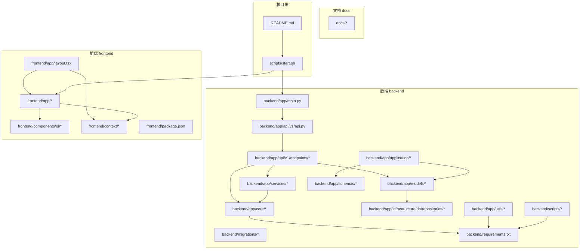
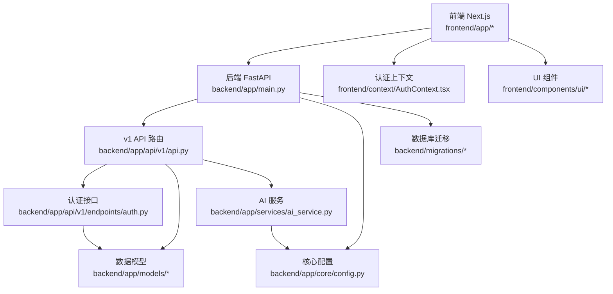
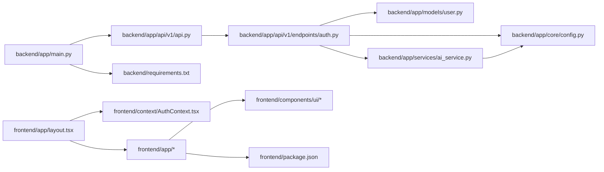

# 项目结构

<cite>
**本文引用的文件**
- [README.md](file://README.md)
- [backend/app/main.py](file://backend/app/main.py)
- [backend/app/api/v1/api.py](file://backend/app/api/v1/api.py)
- [backend/app/api/v1/endpoints/auth.py](file://backend/app/api/v1/endpoints/auth.py)
- [backend/app/models/user.py](file://backend/app/models/user.py)
- [backend/app/services/ai_service.py](file://backend/app/services/ai_service.py)
- [backend/app/core/config.py](file://backend/app/core/config.py)
- [backend/requirements.txt](file://backend/requirements.txt)
- [frontend/app/layout.tsx](file://frontend/app/layout.tsx)
- [frontend/context/AuthContext.tsx](file://frontend/context/AuthContext.tsx)
- [frontend/components/ui/button.tsx](file://frontend/components/ui/button.tsx)
- [frontend/package.json](file://frontend/package.json)
- [scripts/start.sh](file://scripts/start.sh)
- [docs/04_Database_Design.md](file://docs/04_Database_Design.md)
</cite>

## 目录索引
1. [简介](#简介)
2. [项目结构](#项目结构)
3. [核心组件](#核心组件)
4. [架构总览](#架构总览)
5. [详细组件分析](#详细组件分析)
6. [依赖关系分析](#依赖关系分析)
7. [性能考量](#性能考量)
8. [故障排查指南](#故障排查指南)
9. [结论](#结论)
10. [附录](#附录)

## 简介
本项目是一个"AI股票顾问"全栈应用，采用前后端分离架构：后端使用 FastAPI 提供 REST API，前端使用 Next.js 构建交互界面。项目旨在为用户提供基于实时数据与大模型的智能分析辅助，帮助做出更明智的投资决策。本文档聚焦于项目目录组织原则、分层架构设计、模块职责划分以及模块间依赖关系与数据流，帮助新加入的开发者快速理解整体布局并高效上手。

## 项目结构
项目采用"按层与按功能混合"的组织方式：
- 后端 backend：以 FastAPI 应用为核心，按功能域拆分 app/api、app/application、app/core、app/infrastructure、app/models、app/schemas、app/services、app/utils 等子目录；数据库迁移脚本位于 migrations；数据采集脚本位于 scripts；依赖清单 requirements.txt。
- 前端 frontend：Next.js 应用，采用 app 目录路由风格，页面位于 app 下，通用 UI 组件位于 components/ui，全局上下文位于 context；依赖清单 package.json。
- 文档 docs：存放数据库设计与数据契约等技术文档。
- 根目录：启动脚本 scripts/start.sh、环境变量示例 .env、仓库级 README.md 与 .gitignore。

**图表来源**
- [backend/app/main.py:1-170](file://backend/app/main.py#L1-L170)
- [backend/app/api/v1/api.py:1-33](file://backend/app/api/v1/api.py#L1-L33)
- [frontend/app/layout.tsx:1-52](file://frontend/app/layout.tsx#L1-L52)
- [frontend/package.json:1-52](file://frontend/package.json#L1-L52)
- [scripts/start.sh:1-157](file://scripts/start.sh#L1-L157)

**章节来源**
- [README.md:126-143](file://README.md#L126-L143)
- [scripts/start.sh:1-157](file://scripts/start.sh#L1-L157)

## 核心组件
- 后端入口与路由
  - 后端主程序在 backend/app/main.py 中定义 FastAPI 应用，配置全局日志、异常处理、CORS 中间件，并注册 v1 版本 API 路由。
- API 路由组织
  - v1 API 路由在 backend/app/api/v1/api.py 中统一管理，按模块挂载认证、组合、股票、分析、宏观、用户、通知、模拟交易等路由。
- 认证与用户模型
  - 认证接口在 backend/app/api/v1/endpoints/auth.py 中实现登录与注册，使用数据库查询与密码校验，返回 JWT Token。
  - 用户模型在 backend/app/models/user.py 中定义，包含邮箱、加密密码、会员等级、API Key 存储字段等。
- AI 服务
  - AI 服务在 backend/app/services/ai_service.py 中封装，负责调用多种 AI 提供商 API 进行分析，具备用户模型管理、统一密钥解析、缓存机制等。
- 配置中心
  - 配置在 backend/app/core/config.py 中集中管理，包括数据库连接、安全参数、外部 API Key 等。
- 前端布局与上下文
  - 前端根布局在 frontend/app/layout.tsx 中定义，注入全局样式与 AuthProvider 上下文。
  - 认证上下文在 frontend/context/AuthContext.tsx 中实现，提供 token 管理与登录登出逻辑。
- UI 组件
  - 前端 UI 组件位于 frontend/components/ui，例如按钮组件 button.tsx，采用变体与尺寸系统，便于复用。
- 依赖与运行
  - 后端依赖在 backend/requirements.txt，前端依赖在 frontend/package.json。
  - 启动脚本 scripts/start.sh 支持本地开发和容器化部署两种模式。

**章节来源**
- [backend/app/main.py:1-170](file://backend/app/main.py#L1-L170)
- [backend/app/api/v1/api.py:1-33](file://backend/app/api/v1/api.py#L1-L33)
- [backend/app/api/v1/endpoints/auth.py](file://backend/app/api/v1/endpoints/auth.py)
- [backend/app/models/user.py:1-80](file://backend/app/models/user.py#L1-L80)
- [backend/app/services/ai_service.py:1-200](file://backend/app/services/ai_service.py#L1-L200)
- [backend/app/core/config.py](file://backend/app/core/config.py)
- [frontend/app/layout.tsx:1-52](file://frontend/app/layout.tsx#L1-L52)
- [frontend/context/AuthContext.tsx:1-115](file://frontend/context/AuthContext.tsx#L1-L115)
- [frontend/components/ui/button.tsx:1-63](file://frontend/components/ui/button.tsx#L1-L63)
- [backend/requirements.txt:1-77](file://backend/requirements.txt#L1-L77)
- [frontend/package.json:1-52](file://frontend/package.json#L1-L52)
- [scripts/start.sh:1-157](file://scripts/start.sh#L1-L157)

## 架构总览
系统采用前后端分离架构，后端提供 REST API，前端通过 Next.js 渲染页面并调用后端接口。认证采用 JWT Token，用户登录后由后端签发令牌，前端保存在本地并在后续请求中携带。

**图表来源**
- [backend/app/main.py:1-170](file://backend/app/main.py#L1-L170)
- [backend/app/api/v1/api.py:1-33](file://backend/app/api/v1/api.py#L1-L33)
- [backend/app/api/v1/endpoints/auth.py](file://backend/app/api/v1/endpoints/auth.py)
- [backend/app/models/user.py:1-80](file://backend/app/models/user.py#L1-L80)
- [backend/app/services/ai_service.py:1-200](file://backend/app/services/ai_service.py#L1-L200)
- [backend/app/core/config.py](file://backend/app/core/config.py)
- [frontend/app/layout.tsx:1-52](file://frontend/app/layout.tsx#L1-L52)
- [frontend/context/AuthContext.tsx:1-115](file://frontend/context/AuthContext.tsx#L1-L115)
- [frontend/components/ui/button.tsx:1-63](file://frontend/components/ui/button.tsx#L1-L63)

## 详细组件分析

### 后端目录与职责
- app/main.py
  - 职责：初始化 FastAPI 应用、配置全局日志、添加中间件、挂载路由、启动后台任务。
  - 关键功能：全局异常处理器、HTTP 请求拦截中间件、CORS 配置、健康检查接口、后台调度器启动。
- app/api/v1/api.py
  - 职责：统一管理 v1 版本 API 路由，按模块挂载各业务路由。
  - 关键路由：/api/v1/auth、/api/v1/portfolio、/api/v1/stocks、/api/v1/analysis、/api/v1/macro、/api/v1/user、/api/v1/notifications、/api/v1/paper-trading。
- app/api/v1/endpoints/*
  - 职责：实现具体业务接口，处理认证、用户管理、组合管理、股票查询、AI 分析、宏观数据、通知历史、模拟交易等功能。
- app/application/*
  - 职责：应用层服务，封装业务逻辑，如 analyze_stock.py、analyze_portfolio.py、manage_portfolio.py、query_portfolio.py 等。
- app/models/*
  - 职责：定义 SQLAlchemy ORM 模型，描述数据库表结构。
  - 关键模型：User、Stock、Portfolio、AnalysisReport、MacroEvent 等。
- app/services/*
  - 职责：封装业务服务，如 AI 分析、市场数据拉取、宏观事件处理、通知推送、调度任务等。
  - 关键服务：ai_service.py、macro_service.py、notification_service.py、scheduler.py、market_data.py 等。
- app/core/*
  - 职责：核心配置、数据库连接、安全工具等。
  - 关键文件：config.py（配置）、database.py（数据库）、security.py（密码与 JWT 工具）、prompts.py（AI 提示词）。
- app/infrastructure/db/repositories/*
  - 职责：数据访问层，封装数据库操作。
  - 关键仓库：user_repository.py、stock_repository.py、portfolio_repository.py、analysis_repository.py 等。
- app/schemas/*
  - 职责：Pydantic 模型，用于请求/响应的数据验证与序列化。
- app/utils/*
  - 职责：工具类，如 AI 响应解析、JSON 日志记录等。
- migrations
  - 职责：Alembic 数据库迁移脚本，管理数据库版本演进。
- scripts
  - 职责：数据采集与批处理脚本。
- 入口与配置
  - backend/app/main.py：FastAPI 应用入口，注册路由与中间件。
  - backend/requirements.txt：后端依赖清单。

**章节来源**
- [backend/app/main.py:1-170](file://backend/app/main.py#L1-L170)
- [backend/app/api/v1/api.py:1-33](file://backend/app/api/v1/api.py#L1-L33)
- [backend/app/models/user.py:1-80](file://backend/app/models/user.py#L1-L80)
- [backend/app/services/ai_service.py:1-200](file://backend/app/services/ai_service.py#L1-L200)
- [backend/requirements.txt:1-77](file://backend/requirements.txt#L1-L77)

### 前端目录与职责
- app
  - 职责：Next.js 路由页面，包含登录、注册、设置、主页等页面。
  - 关键页面：layout.tsx（根布局）、page.tsx（主页）、login/page.tsx、register/page.tsx、settings/page.tsx、portfolio/page.tsx、profile/page.tsx、paper-trading/page.tsx。
- components/ui
  - 职责：通用 UI 组件，遵循变体与尺寸系统，便于主题化与复用。
  - 关键组件：button.tsx、card.tsx、dialog.tsx、form.tsx、input.tsx、label.tsx、scroll-area.tsx、table.tsx、tooltip.tsx。
- context
  - 职责：全局状态上下文，提供认证状态与登录登出能力。
  - 关键文件：AuthContext.tsx。
- features/*
  - 职责：按领域拆分的前端功能模块，包含 API 层、hooks、组件等。
- shared/api
  - 职责：共享的 API 客户端配置。
- types
  - 职责：类型定义，基于后端 OpenAPI 生成。
- 依赖与配置
  - frontend/package.json：前端依赖与脚本命令。
  - frontend/app/layout.tsx：全局样式注入与 AuthProvider 包裹。

**章节来源**
- [frontend/app/layout.tsx:1-52](file://frontend/app/layout.tsx#L1-L52)
- [frontend/context/AuthContext.tsx:1-115](file://frontend/context/AuthContext.tsx#L1-L115)
- [frontend/components/ui/button.tsx:1-63](file://frontend/components/ui/button.tsx#L1-L63)
- [frontend/package.json:1-52](file://frontend/package.json#L1-L52)

### 文档目录与用途
- docs/04_Database_Design.md：数据库设计与数据契约，包含实体关系图、关键表设计深度剖析、并发锁优化等内容。

**章节来源**
- [docs/04_Database_Design.md:1-98](file://docs/04_Database_Design.md#L1-L98)

### 启动与运行
- scripts/start.sh：支持本地开发和容器化部署两种模式，自动检查端口占用、安装依赖并启动服务。
- README.md：项目说明与快速开始指南。

**章节来源**
- [scripts/start.sh:1-157](file://scripts/start.sh#L1-L157)
- [README.md:40-106](file://README.md#L40-L106)

## 依赖关系分析
- 后端模块耦合
  - app/main.py 依赖 app/api/v1/api.py 路由模块，通过 include_router 注册。
  - app/api/v1/api.py 依赖 app/api/v1/endpoints/* 路由模块，按功能域挂载。
  - app/api/v1/endpoints/* 依赖 app/models/*（数据访问）、app/services/*（业务服务）、app/core/*（配置与安全）。
  - app/services/* 依赖 app/core/config.py（外部 API Key、数据库配置）。
  - app/models/* 依赖 app/infrastructure/db/repositories/*（数据访问层）。
- 前后端依赖
  - 前端通过 axios 或 fetch 调用后端 API（如 /api/v1/auth/login、/api/v1/user/me 等）。
  - 前端认证上下文 AuthContext.tsx 与后端 JWT Token 生命周期配合。
- 外部依赖
  - 后端依赖：FastAPI、SQLAlchemy、Alembic、Pydantic、uvicorn、google-generativeai、akshare、ib_async 等。
  - 前端依赖：Next.js、Radix UI、Tailwind CSS、Axios、Zod、lightweight-charts 等。

**图表来源**
- [backend/app/main.py:1-170](file://backend/app/main.py#L1-L170)
- [backend/app/api/v1/api.py:1-33](file://backend/app/api/v1/api.py#L1-L33)
- [backend/app/api/v1/endpoints/auth.py](file://backend/app/api/v1/endpoints/auth.py)
- [backend/app/models/user.py:1-80](file://backend/app/models/user.py#L1-L80)
- [backend/app/services/ai_service.py:1-200](file://backend/app/services/ai_service.py#L1-L200)
- [backend/app/core/config.py](file://backend/app/core/config.py)
- [backend/requirements.txt:1-77](file://backend/requirements.txt#L1-L77)
- [frontend/app/layout.tsx:1-52](file://frontend/app/layout.tsx#L1-L52)
- [frontend/context/AuthContext.tsx:1-115](file://frontend/context/AuthContext.tsx#L1-L115)
- [frontend/package.json:1-52](file://frontend/package.json#L1-L52)

## 性能考量
- 后端
  - 异步数据库访问：使用 SQLAlchemy 异步引擎，减少阻塞，提升并发处理能力。
  - 缓存策略：AI 服务具备模型配置缓存机制，减少数据库查询开销。
  - AI 调用：统一 API Key 解析器，支持用户级加密 Key 与系统级 Key 的优先级处理。
- 前端
  - 组件复用：通过 UI 组件库与变体系统减少重复代码。
  - 路由与懒加载：利用 Next.js 的路由与动态导入优化首屏加载。
  - 状态管理：使用 Context 管理认证状态，避免不必要的重渲染。

## 故障排查指南
- 后端
  - CORS 问题：检查 backend/app/main.py 中的 origins 配置，确保前端域名正确。
  - 数据库连接：确认 DATABASE_URL 与数据库可用性，必要时检查 migrations 是否执行。
  - AI Key 缺失：查看 backend/app/core/config.py 中的 API Key 配置，确保已设置。
- 前端
  - 登录后无法跳转：检查 frontend/context/AuthContext.tsx 的登录逻辑与路由跳转。
  - 组件样式异常：确认 Tailwind CSS 与 shadcn/ui 组件库版本兼容性。
- 启动问题
  - 后端端口占用：修改 scripts/start.sh 中的端口或关闭占用进程。
  - 依赖缺失：确保 Python 与 Node.js 版本满足 requirements.txt 与 package.json 要求。

**章节来源**
- [backend/app/main.py:114-134](file://backend/app/main.py#L114-L134)
- [backend/app/core/config.py](file://backend/app/core/config.py)
- [frontend/context/AuthContext.tsx:1-115](file://frontend/context/AuthContext.tsx#L1-L115)
- [scripts/start.sh:1-157](file://scripts/start.sh#L1-L157)

## 结论
本项目采用清晰的分层与按功能域划分的目录结构，后端以 FastAPI 为核心，前端以 Next.js 为基础，两者通过 REST API 与 JWT 认证进行协作。通过统一的配置中心与数据库迁移机制，项目具备良好的扩展性与维护性。建议新成员从 backend/app/main.py 与 frontend/app/layout.tsx 入手，逐步熟悉路由、模型与服务层的职责划分，再深入到具体功能模块。

## 附录
- 快速启动
  - 使用 scripts/start.sh 支持 dev 和 docker 两种模式启动后端与前端，或分别进入 backend 与 frontend 目录按 README 步骤安装依赖并运行。
- 新人导航
  - 后端：先看 app/main.py 了解应用初始化，再看 app/api/v1/api.py 了解路由设计，最后看 app/services/* 与 app/models/* 了解业务与数据层。
  - 前端：先看 app/layout.tsx 与 context/AuthContext.tsx 了解认证与布局，再看 pages 下的页面与 components/ui 组件。

**章节来源**
- [README.md:40-106](file://README.md#L40-L106)
- [scripts/start.sh:1-157](file://scripts/start.sh#L1-L157)