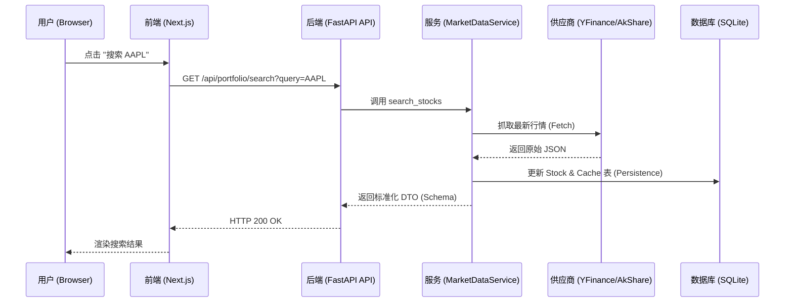

# 🏗 AI Smart Investment Advisor: 软件工程架构与深度学习指南

这份文档旨在帮助你通过本项目理解现代 **全 Stack (Full-stack)** 应用的架构设计。我们将从宏观架构、分层设计、设计模式以及数据流向四个维度进行剖析。

---

## 一、 宏观架构：分层与解耦

本项目采用了典型的 **前后端分离 (Decoupled)** 架构。这种设计允许前端和后端独立开发、测试和部署。

### 1. 前端 (Frontend): Next.js 14 (App Router)
*   **角色**：视图层 (View Layer)。专注于 UI 交互、状态管理和路由。
*   **技术栈**：TypeScript, React, Tailwind CSS, Lucide Icons.

### 2. 后端 (Backend): FastAPI (Python)
*   **角色**：逻辑与数据层 (Business & Data Layer)。专注于 API 暴露、业务计算、第三方数据集成和数据库持久化。
*   **架构风格**：典型的 **分层架构 (Layered Architecture)**。

---

## 二、 后端深度剖析 (`backend/app/`)

后端遵循“关注点分离”原则，将代码划分为多个职责清晰的层。

### 1. Controller 层: `app/api/`
*   **功能**：入口点。接收请求，验证权限，调用 Service 层，最后将结果返回。
*   **核心文件**：
    *   `v1/api.py`: 路由总汇，将不同的模块挂载到主 App。
    *   `v1/endpoints/portfolio.py`: 自选股 API，负责增删改查。
    *   `v1/endpoints/analysis.py`: 分析接口。实现 **结论持久化 (Persistence)**：优先命中数据库缓存，降低 API 调用成本。
    *   `deps.py`: **依赖注入 (Dependency Injection)** 模块，负责分配数据库会话和验证 Token。

### 2. Schema 层: `app/schemas/`
*   **功能**：**数据传输对象 (DTO)**。定义了 API 进出的 JSON 数据结构，确保前后端协议一致。
*   **核心文件**：
    *   `market_data.py`: 行情数据的标准化格式。
    *   `portfolio.py`: 账户持仓的数据格式。

### 3. Service 层: `app/services/`
*   **功能**：**业务逻辑核心**。这里不关心数据是怎么传来的，也不关心数据库是怎么存的，只关心“怎么算”和“怎么拿”。
*   **核心文件**：
    *   `market_data.py`: 核心调度者。判断是读缓存还是去网上抓。
    *   `ai_service.py`: 封装 LLM 调用逻辑。集成 Google Gemini 和 SiliconFlow (DeepSeek/Qwen3)，支持思维链推理 (Reasoning)。
    *   **设计模式应用**：
        *   `market_providers/base.py`: **抽象基类 (Interface)**，定义了所有采购员必须具备的功能。
        *   `market_providers/factory.py`: **工厂模式 (Factory Pattern)**，根据输入的 Ticker 自动决定用 YFinance 还是 AkShare。

### 4. Model/Database 层: `app/models/` & `app/core/`
*   **功能**：数据持久化。
*   **核心文件**：
    *   `models/stock.py`: 定义数据库表结构（利用 SQLAlchemy ORM）。
    *   `core/database.py`: 数据库连接引擎配置。

---

## 三、 数据流演化 (Data Flow)

以下是一个完整的“数据生命周期”示意图：

---

## 四、 关键设计决策：为什么这么写？

### 1. 为什么用 DTO (Schemas) 而不直接返回数据库 Model？
*   **安全性**：避免无意中泄露数据库中的敏感字段（如敏感 ID）。
*   **灵活性**：你可以根据前端需求合并多个表的数据到一个 Schema 中，而不必改动数据库结构。

### 2. 工厂模式 (Provider Factory) 的好处？
*   **扩展性**：如果你想增加加密货币支持，只需在 `providers/` 下新建一个文件并注册到 `factory.py`，无需修改现有的业务逻辑。

### 3. 并行异步 (Asyncio.gather)
*   **性能**：在 `get_portfolio` 中，我们并行请求 10 个股票的数据，时间仅取决于最慢的那个，而不是累加，这在涉及网络 IO 时至关重要。

### 4. AI 分析持久化 (AI Persistence & Caching)
*   **效率与成本**：通过 `AnalysisReport` 模型将 AI 生成的分析结论存入数据库。
*   **缓存策略**：同一用户对同一股票的相同模型分析在 4 小时内（或交易日内）将直接读取数据库，避免重复消耗 Token 并提升响应速度。

---

## 五、 如何通过本项目学习？

1.  **修改字段**：尝试在 `models/stock.py` 加一个字段，运行迁移，然后在 `schemas/` 里加上它，最后在前端显示出来。你会经历完整的**全栈开发闭环**。
2.  **增加逻辑**：在 `services/indicators.py` 加一个新的技术指标（如布林带），看它如何流入 `MarketDataService` 并存入数据库。
3.  **更换 AI**：在 `services/ai_service.py` 里尝试把 Gemini 智库换成 DeepSeek，体验 **策略抽象** 的威力。

---

### 项目文件地图 (File Map)

| 文件路径 | 职责类型 | 学习重点 |
| :--- | :--- | :--- |
| `backend/app/main.py` | 应用入口 | FastAPI 启动配置 & 中间件 |
| `backend/app/api/deps.py` | 依赖注入 | 权限验证 & DB 会话生命周期管理 |
| `backend/app/models/stock.py` | 实体定义 | 数据库关系映射 (ORM) |
| `backend/app/services/market_data.py` | 业务中台 | 缓存失效策略 & 多源编排 |
| `frontend/lib/api.ts` | 客户端 | Axios 封装 & 统一异常处理 |
| `frontend/components/features/` | UI 组件 | 组件复用 & 响应式逻辑实现 |
