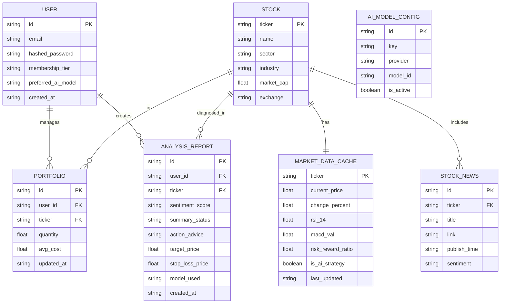

# 数据库 ER 图 (Entity Relationship Diagram)

本项目采用分层架构，将静态股票信息、实时行情缓存、用户自选/持仓以及 AI 诊断报告进行了解耦。

## 1. 实体关系图

## 2. 核心架构设计

1. **读写分离/动静分离**：
    * `stocks` 表存储几乎不怎么变的属性（行业、名称）。
    * `market_data_cache` 存储每分钟都在跳变的价格和技术指标，以便快速刷新而不加重主表负担。
2. **Portfolio 多态性**：
    * `quantity` 字段区分功能：正数代表真实持仓，0 代表仅加入观察名单（自选股）。
3. **AI 策略锁定机制**：
    * `market_data_cache.is_ai_strategy` 字段用于标记当前股票是否正在按照 AI 给出的 Target/Stop 运行，防止被通用技术算法（如枢轴点）误覆盖。
4. **历史留痕**：
    * `analysis_reports` 不只是覆盖更新，而是以日志形式保存，不仅方便用户查看历史预测，也为未来微调模型提供了数据样本。
