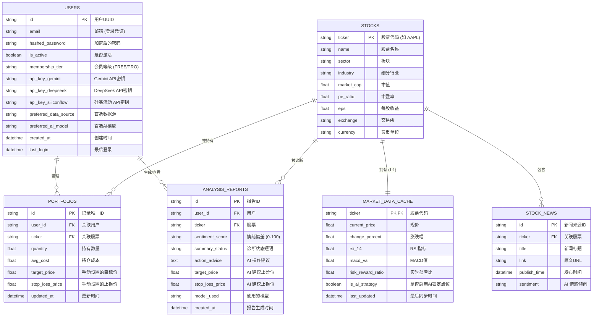

# 数据库 ER 图与数据字典 (ER Diagram & Data Dictionary)

本项目后端使用 SQLite (本地开发) 或 PostgreSQL (生产) 数据库。以下是核心实体关系图及详尽的数据字典。

## 1. 实体关系图 (ER Diagram)

## 2. 详尽数据字典 (Data Dictionary)

### 2.1 用户表 (Users)

| 字段名 | 类型 | 描述 | 数据来源 | 数据去向 |
| :--- | :--- | :--- | :--- | :--- |
| `id` | UUID | 唯一标识 | 系统生成 | 各关联表外键 |
| `email` | String | 登录邮箱 | 用户注册 | 身份认证 |
| `hashed_password` | String | 加密密码 | 用户注册 | 登录验证 |
| `api_key_siliconflow` | String | 硅基流动密钥 | 用户设置 | 后端 AI 调用 |
| `preferred_ai_model` | String | 默认 AI 模型 | 用户设置 | 触发诊断请求 |

### 2.2 股票基础信息表 (Stocks)

| 字段名 | 类型 | 描述 | 数据来源 | 数据去向 |
| :--- | :--- | :--- | :--- | :--- |
| `ticker` | String | 股票代码 | 交易所/yfinance | 全局搜索与索引 |
| `name` | String | 股票全称 | yfinance/API | 前端显示 |
| `sector` | String | 行业板块 | yfinance | 组合风险分析 |
| `market_cap` | Float | 市值 | yfinance | AI 提示词上下文 |

### 2.3 行情与指标缓存表 (Market_Data_Cache)

| 字段名 | 类型 | 描述 | 数据来源 | 数据去向 |
| :--- | :--- | :--- | :--- | :--- |
| `current_price` | Float | 当前成交价 | 实时 API (yfinance) | 盈亏计算/图标显示 |
| `risk_reward_ratio` | Float | 盈亏比 | 算法计算 | 侧边栏 R/R 标签 |
| `resistance_1` | Float | 压力位 (R1/Target) | 技术算法 / AI 诊断 | 交易中轴线渲染 |
| `support_1` | Float | 支撑位 (S1/Stop) | 技术算法 / AI 诊断 | 交易中轴线渲染 |
| `is_ai_strategy` | Boolean | AI 策略锁定标识 | 系统状态 | 防止通用算法覆盖 AI 点位 |

### 2.4 持仓/自选表 (Portfolios)

| 字段名 | 类型 | 描述 | 数据来源 | 数据去向 |
| :--- | :--- | :--- | :--- | :--- |
| `user_id` | UUID/String | 所属用户 | 会话/Token | 权限校验 |
| `quantity` | Float | 持有股数 | 用户输入 | 盈亏计算 |
| `avg_cost` | Float | 持仓成本价 | 用户输入 | 盈亏率计算 |

### 2.5 AI 分析报告表 (Analysis_Reports)

| 字段名 | 类型 | 描述 | 数据来源 | 数据去向 |
| :--- | :--- | :--- | :--- | :--- |
| `sentiment_score` | String | 情绪偏好得分 | SiliconFlow AI 结果 | 情绪偏差仪表盘 |
| `action_advice` | Text | AI 核心操作建议 | SiliconFlow AI 结果 | 诊断详情主要文案 |
| `target_price` | Float | AI 建议止盈价 | AI 结构化输出 | 更新 `market_data_cache` |
| `stop_loss_price` | Float | AI 建议止盈价 | AI 结构化输出 | 更新 `market_data_cache` |
| `model_used` | String | 所用模型 ID | 请求参数 | 历史记录追溯 |

## 3. 业务逻辑流转 (Data Flow Hints)

1. **行情流**：`yfinance/API` -> `market_data_cache` -> `Frontend (实时更新)`。
2. **诊断流**：`market_data_cache` + `Stocks (上下文)` -> `SiliconFlow API` -> `Analysis_Reports` -> `market_data_cache (反向更新点位)`。
3. **资产流**：`Portfolio` + `market_data_cache (current_price)` -> `Frontend (持仓总资产对比)`。
