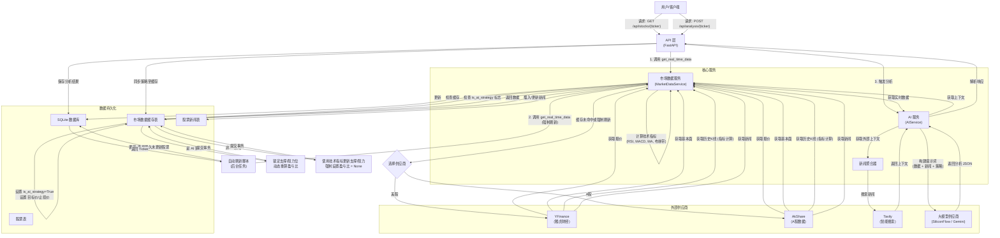

# 系统架构：数据处理流程

本文档详细说明了 AI 智能投顾系统内的数据流转，涵盖市场数据摄入、AI 分析以及自动刷新周期。

## 流程说明

1.  **触发机制 (Triggers)**:
    *   **用户请求**: 通过前端进行直接交互（查看个股或请求 AI 诊断）。
    *   **自动刷新脚本**: 一个后台常驻进程，每 5 分钟轮询一次“最陈旧”（`last_updated` 时间最早）的股票，强制刷新数据。

2.  **市场数据获取 (`MarketDataService`)**:
    *   **缓存优先**: 始终先检查 `MarketDataCache` 表，最小化 API 调用。
    *   **供应商路由**: 根据股票代码格式，自动路由至 `YFinance` (美股) 或 `AkShare` (A股)。
    *   **并发抓取**: 使用 `asyncio.gather` 并行获取报价、基本面、历史K线（用于计算指标）和新闻。

3.  **严格逻辑执行 (Strict Logic Enforcement)**:
    *   **盈亏比 (RRR)**: 系统强制执行“单一真实数据源”原则。
        *   如果 `is_ai_strategy` 为 **True**，则忽略技术指标计算的盈亏比。系统锁定 AI 提供的目标价和止损价，纯粹基于当前实时价格动态重算比例。
        *   如果 `is_ai_strategy` 为 **False**，强制将盈亏比设为 `None`，防止通用技术算法产生的数值误导用户。

4.  **AI 智能分析 (`AIService`)**:
    *   **上下文聚合**: 组合实时市场数据与外部新闻（通过 `Tavily` 或供应商新闻）。
    *   **LLM 推理**: 发送结构化 Prompt 给大模型 (DeepSeek/Qwen) 以生成交易计划。
    *   **反馈闭环**: 经用户批准的 AI 计划（目标价/止损价）会被回写到 `MarketDataCache`，并将 `is_ai_strategy` 标记为 `True`，从而影响未来的数据更新逻辑。
