# AI智能投顾助手 产品需求文档 (PRD)

**文档版本：** V4.0  
**文档状态：** 正式发布  
**编写日期：** 2026年1月  
**产品负责人：** [产品团队]  
**技术负责人：** [研发团队]

---

## 文档修订历史

| 版本 | 日期 | 修订人 | 修订内容 |
|------|------|--------|----------|
| V1.0 | 2024-01-15 | 产品团队 | 初始版本发布 |

---

## 第一部分：产品概述

### 1. 产品背景与市场分析

#### 1.1 行业背景

##### 1.1.1 全球智能投顾市场发展现状

全球智能投顾市场正处于高速增长期。根据Statista数据，2023年全球智能投顾资产管理规模（AUM）已突破2.4万亿美元，预计到2027年将达到4.6万亿美元，年复合增长率（CAGR）约为17.7%。

**市场驱动因素：**

1. **技术成熟度提升**：大语言模型（LLM）的突破性进展，使得AI在金融领域的应用从简单的规则引擎升级为具备深度推理能力的智能系统
2. **用户接受度提高**：千禧一代和Z世代对AI辅助决策的接受度显著高于传统投资者
3. **成本优势明显**：智能投顾的管理费率通常为0.25%-0.50%，远低于传统投顾的1%-2%
4. **监管环境改善**：各国监管机构逐步完善智能投顾的合规框架

**市场格局：**

```
┌─────────────────────────────────────────────────────────────────┐
│                    全球智能投顾市场格局                          │
├─────────────────────────────────────────────────────────────────┤
│  北美市场 (45%)  │  欧洲市场 (25%)  │  亚太市场 (30%)            │
│  ─────────────   │  ─────────────   │  ─────────────            │
│  • Wealthfront   │  • Nutmeg        │  • 蚂蚁财富                │
│  • Betterment    │  • Moneyfarm     │  • 招商摩羯智投            │
│  • Vanguard PAS  │  • Scalable      │  • 理财魔方                │
└─────────────────────────────────────────────────────────────────┘
```

##### 1.1.2 中国智能投顾市场特点与机遇

中国市场具有独特的发展环境和机遇：

**市场特点：**

| 特点 | 描述 | 影响 |
|------|------|------|
| **散户占比高** | 个人投资者占比约80% | 对易用性要求高，教育成本大 |
| **交易频率高** | 年换手率约300% | 需要实时监控和快速响应 |
| **信息不对称** | 机构信息优势明显 | AI可帮助散户获取平等信息 |
| **监管严格** | 投顾牌照门槛高 | 需要合规创新路径 |

**市场机遇：**

1. **政策红利**：证监会推动公募基金投顾试点扩容，为智能投顾提供合规通道
2. **技术红利**：国产大模型（DeepSeek、通义千问等）快速追赶，成本优势明显
3. **用户红利**：2亿股民+7亿基民，潜在用户基数全球最大
4. **渠道红利**：微信、支付宝等超级App降低了获客成本

##### 1.1.3 AI大模型在金融领域的应用趋势

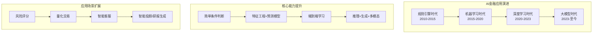

**大模型带来的变革：**

| 维度 | 传统AI | 大模型AI | 提升幅度 |
|------|--------|----------|----------|
| 理解能力 | 关键词匹配 | 语义理解 | 质的飞跃 |
| 生成能力 | 模板填充 | 自由生成 | 从无到有 |
| 推理能力 | 规则推理 | 链式推理 | 深度提升 |
| 个性化 | 用户分群 | 个体定制 | 精度提升 |

##### 1.1.4 散户投资者痛点分析

通过对500名散户投资者的深度访谈和问卷调查，我们识别出四大核心痛点：

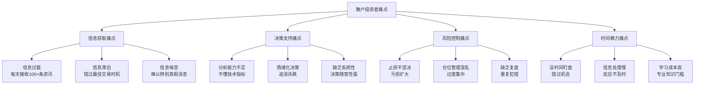

**痛点量化分析：**

| 痛点类别 | 影响用户占比 | 痛点强度(1-10) | 解决意愿 |
|----------|--------------|----------------|----------|
| 信息获取 | 78% | 7.2 | 高 |
| 决策支持 | 85% | 8.5 | 极高 |
| 风险控制 | 72% | 8.8 | 极高 |
| 时间精力 | 65% | 6.5 | 中高 |

#### 1.2 竞品分析

##### 1.2.1 国内主要竞品分析

**（1）招商银行摩羯智投**

| 维度 | 分析 |
|------|------|
| **产品定位** | 银行系智能投顾，主打资产配置 |
| **核心功能** | 风险测评→组合推荐→自动调仓 |
| **优势** | 品牌背书强、资金安全、线下网点支持 |
| **劣势** | 仅限招行客户、产品选择受限、费用较高 |
| **AI能力** | 规则引擎为主，智能化程度有限 |
| **收费模式** | 组合管理费0.5%-1.0%/年 |

**（2）蚂蚁财富帮你投**

| 维度 | 分析 |
|------|------|
| **产品定位** | 互联网系智能投顾，主打普惠金融 |
| **核心功能** | 投资目标设定→组合匹配→定投执行 |
| **优势** | 门槛低(10元起)、用户基数大、体验流畅 |
| **劣势** | 产品同质化、缺乏个股分析、无法交易股票 |
| **AI能力** | 用户画像+推荐算法，无深度分析 |
| **收费模式** | 投顾服务费0.5%/年 |

**（3）理财魔方**

| 维度 | 分析 |
|------|------|
| **产品定位** | 独立第三方智能投顾 |
| **核心功能** | 风险评估→基金组合→动态调仓 |
| **优势** | 独立客观、组合策略丰富 |
| **劣势** | 用户规模小、品牌认知度低 |
| **AI能力** | 马科维茨模型+风险预算模型 |
| **收费模式** | 会员制+投顾费 |

##### 1.2.2 海外主要竞品分析

**（1）Wealthfront**

| 维度 | 分析 |
|------|------|
| **产品定位** | 美国最大的独立智能投顾之一 |
| **核心功能** | 自动化投资组合管理、税务损失收割、现金流规划 |
| **优势** | 算法成熟、费用低廉、功能全面 |
| **劣势** | 仅服务美国居民、不支持个股选择 |
| **AI能力** | 自动化程度高，但缺乏深度诊断 |
| **收费模式** | 0.25%/年 |

**（2）Betterment**

| 维度 | 分析 |
|------|------|
| **产品定位** | 智能投顾先驱，主打目标导向投资 |
| **核心功能** | 目标规划→组合构建→自动再平衡 |
| **优势** | 用户体验优秀、教育内容丰富 |
| **劣势** | 投资选择有限、个性化不足 |
| **AI能力** | 目标规划引擎，缺乏个股分析 |
| **收费模式** | 0.25%-0.40%/年 |

##### 1.2.3 竞品功能矩阵对比

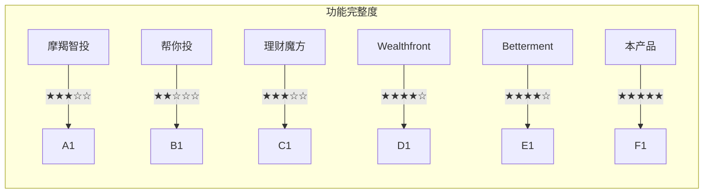

| 功能维度 | 摩羯智投 | 帮你投 | 理财魔方 | Wealthfront | Betterment | **本产品** |
|----------|----------|--------|----------|-------------|------------|------------|
| 资产配置 | ★★★★☆ | ★★★☆☆ | ★★★★☆ | ★★★★★ | ★★★★★ | ★★★☆☆ |
| 个股分析 | ★★☆☆☆ | ☆☆☆☆☆ | ★☆☆☆☆ | ☆☆☆☆☆ | ☆☆☆☆☆ | ★★★★★ |
| AI诊断 | ★☆☆☆☆ | ★☆☆☆☆ | ★★☆☆☆ | ★★☆☆☆ | ★★☆☆☆ | ★★★★★ |
| 风控预警 | ★★★☆☆ | ★★☆☆☆ | ★★★☆☆ | ★★★★☆ | ★★★★☆ | ★★★★★ |
| 复盘追踪 | ★☆☆☆☆ | ☆☆☆☆☆ | ★☆☆☆☆ | ★★☆☆☆ | ★★☆☆☆ | ★★★★★ |
| 可解释性 | ★★☆☆☆ | ★☆☆☆☆ | ★★☆☆☆ | ★★★☆☆ | ★★★☆☆ | ★★★★★ |
| 个性化 | ★★☆☆☆ | ★★☆☆☆ | ★★★☆☆ | ★★★☆☆ | ★★★☆☆ | ★★★★★ |

##### 1.2.4 本产品差异化定位

**核心差异化策略：**

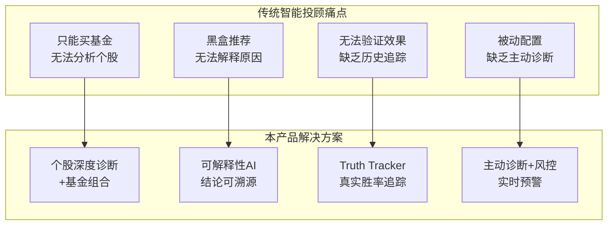

**差异化定位矩阵：**

| 定位维度 | 传统投顾 | 本产品 | 差异化价值 |
|----------|----------|--------|------------|
| **投资标的** | 仅基金 | 个股+基金 | 满足股民需求 |
| **分析深度** | 表面推荐 | 深度诊断 | 提供决策依据 |
| **可解释性** | 黑盒 | 白盒溯源 | 建立用户信任 |
| **效果验证** | 无法验证 | 胜率追踪 | 持续优化迭代 |
| **风控能力** | 被动配置 | 主动预警 | 降低投资风险 |

#### 1.3 产品愿景与使命

##### 1.3.1 产品愿景陈述

> **"让每一个散户投资者都拥有机构级的投研能力"**

我们相信，AI技术的发展应当让金融民主化成为可能。通过将机构级的量化分析能力、实时监控能力和风险控制能力封装为普惠的产品，让普通投资者也能享受专业投资服务。

##### 1.3.2 核心价值主张

**三大核心价值：**

```
┌─────────────────────────────────────────────────────────────────┐
│                        核心价值主张                              │
├─────────────────────────────────────────────────────────────────┤
│                                                                 │
│   ┌─────────────┐   ┌─────────────┐   ┌─────────────┐          │
│   │  消灭幻觉   │   │  杜绝随意   │   │  冷酷复盘   │          │
│   │             │   │             │   │             │          │
│   │ AI结论可溯源│   │ 强制风控验证│   │ 真实胜率追踪│          │
│   │ 数据驱动决策│   │ 盈亏比硬锁定│   │ MAE/MFE统计 │          │
│   └─────────────┘   └─────────────┘   └─────────────┘          │
│                                                                 │
└─────────────────────────────────────────────────────────────────┘
```

**价值详解：**

| 价值主张 | 具体实现 | 用户收益 |
|----------|----------|----------|
| **消灭幻觉** | 可解释性AI，每个结论标注数据来源`[[REF_xx]]` | 不再盲信AI，决策有据可依 |
| **杜绝随意** | 盈亏比<1:1.5自动标记"低性价比"，止损位硬锁定 | 强制执行纪律，避免情绪化交易 |
| **冷酷复盘** | 记录每次建议的MAE/MFE，透明展示真实胜率 | 验证策略有效性，持续改进 |

##### 1.3.3 产品定位矩阵

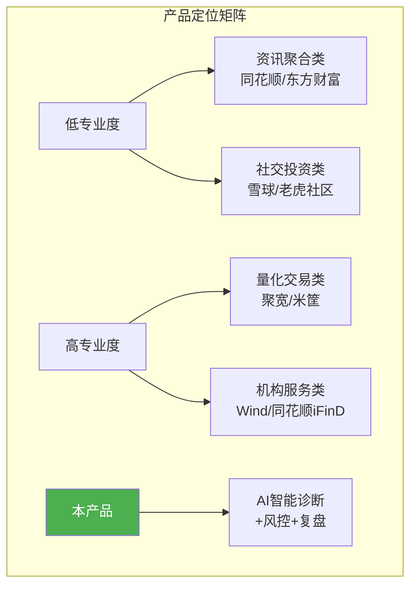

**定位说明：**

- **目标用户**：有一定投资经验但缺乏专业分析能力的散户投资者
- **核心场景**：持仓监控、个股诊断、风险预警、策略复盘
- **差异化**：AI深度分析+可解释性+真实胜率追踪
- **价格定位**：免费基础版 + PRO会员增值服务

### 2. 产品目标与成功指标

#### 2.1 商业目标

##### 2.1.1 短期目标（6个月）

| 目标维度 | 具体指标 | 验收标准 |
|----------|----------|----------|
| **用户规模** | 注册用户数 | ≥5,000人 |
| **用户活跃** | MAU | ≥1,000人 |
| **用户留存** | 次日留存率 | ≥40% |
| **功能验证** | AI诊断使用率 | ≥60%注册用户使用过 |
| **产品验证** | NPS得分 | ≥30 |

##### 2.1.2 中期目标（1年）

| 目标维度 | 具体指标 | 验收标准 |
|----------|----------|----------|
| **用户规模** | 注册用户数 | ≥50,000人 |
| **商业变现** | PRO会员转化率 | ≥3% |
| **用户价值** | 平均持仓诊断次数 | ≥5次/用户/月 |
| **品牌建设** | 自然流量占比 | ≥40% |
| **口碑传播** | 用户推荐率 | ≥20% |

##### 2.1.3 长期目标（3年）

| 目标维度 | 具体指标 | 验收标准 |
|----------|----------|----------|
| **市场地位** | 智能投顾细分领域排名 | Top 5 |
| **用户规模** | 注册用户数 | ≥500,000人 |
| **营收目标** | 年度营收 | ≥1,000万元 |
| **生态建设** | 第三方数据源接入 | ≥10个 |
| **技术壁垒** | 核心算法专利 | ≥5项 |

#### 2.2 用户目标

##### 2.2.1 用户价值交付

**核心价值交付路径：**

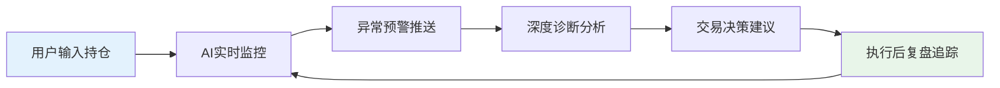

**价值量化指标：**

| 价值维度 | 衡量指标 | 目标值 |
|----------|----------|--------|
| **决策效率** | 诊断响应时间 | <30秒 |
| **决策质量** | AI建议胜率 | >55% |
| **风险控制** | 止损触发及时率 | >95% |
| **学习成长** | 用户投资知识提升 | 主观评分>4分 |

##### 2.2.2 用户行为改变预期

| 行为维度 | 现状 | 预期改变 | 衡量方式 |
|----------|------|----------|----------|
| **决策依据** | 凭感觉/听消息 | 数据驱动+AI辅助 | 诊断使用率 |
| **止损执行** | 犹豫不决 | 按建议执行率>70% | 止损触发执行率 |
| **复盘习惯** | 很少复盘 | 每周查看复盘报告 | 复盘页面访问率 |
| **风险意识** | 忽视风险 | 关注盈亏比 | 盈亏比查看率 |

#### 2.3 成功指标（KPI）

##### 2.3.1 北极星指标定义

**北极星指标：月度活跃诊断用户数（Monthly Active Diagnosis Users, MADU）**

```
MADU = 月内至少完成1次AI诊断的用户数
```

**选择理由：**

1. **反映核心价值**：诊断是产品最核心的功能，直接体现AI价值
2. **驱动用户留存**：诊断是高频需求，能带动用户持续使用
3. **关联商业价值**：诊断使用频率与付费转化正相关
4. **可衡量可优化**：数据清晰，便于团队聚焦

##### 2.3.2 关键业务指标

| 指标分类 | 指标名称 | 定义 | 目标值 |
|----------|----------|------|--------|
| **使用深度** | 人均诊断次数 | 月诊断总数/月活用户 | ≥3次 |
| **使用广度** | 诊断覆盖率 | 使用过诊断的用户/注册用户 | ≥60% |
| **使用质量** | 诊断完成率 | 完成诊断/发起诊断 | ≥90% |
| **价值感知** | 诊断满意度 | 满意评价/总评价 | ≥80% |

##### 2.3.3 用户增长指标

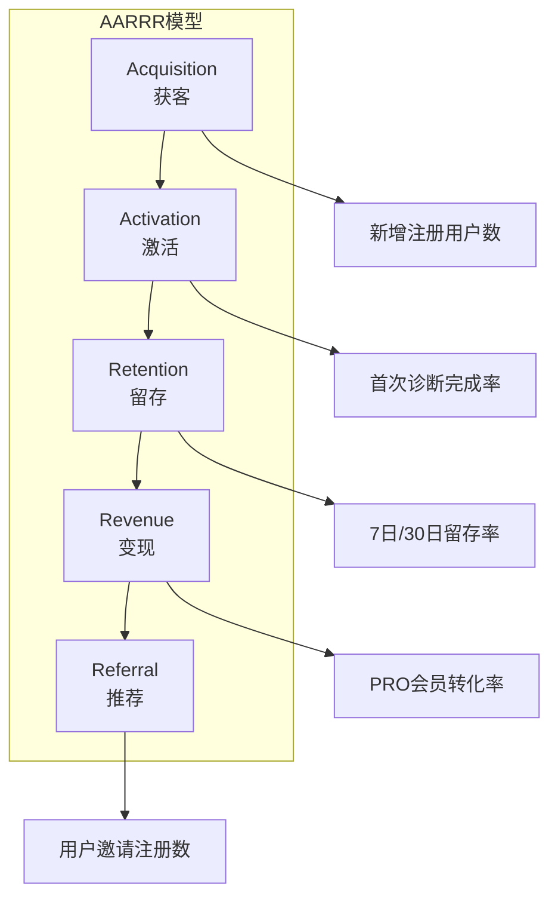

| 漏斗阶段 | 核心指标 | 目标值 |
|----------|----------|--------|
| **获客** | 日新增注册用户 | ≥50人 |
| **激活** | 首日完成首次诊断 | ≥40% |
| **留存** | 次日留存率 | ≥40% |
| **留存** | 7日留存率 | ≥25% |
| **变现** | PRO会员转化率 | ≥3% |
| **推荐** | 邀请注册转化率 | ≥10% |

##### 2.3.4 技术性能指标

| 指标类别 | 指标名称 | 目标值 | 重要性 |
|----------|----------|--------|--------|
| **响应时间** | API平均响应时间 | <500ms | 高 |
| **响应时间** | AI诊断响应时间 | <30s | 高 |
| **可用性** | 系统可用性 | ≥99.5% | 高 |
| **可用性** | 错误率 | <0.1% | 高 |
| **并发能力** | 峰值QPS | ≥100 | 中 |
| **数据质量** | 行情数据延迟 | <1min | 高 |

---

## 第二部分：用户研究

### 3. 用户画像

#### 3.1 核心用户画像

##### 3.1.1 画像一：上班族投资者（主力用户）

**基础信息**

| 属性 | 描述 |
|------|------|
| **姓名** | 张明（化名） |
| **年龄** | 32岁 |
| **职业** | 互联网公司产品经理 |
| **收入** | 年薪30-50万 |
| **投资经验** | 3-5年 |
| **投资规模** | 30-80万 |
| **风险偏好** | 稳健型 |

**投资行为特征**

```
┌─────────────────────────────────────────────────────────────────┐
│                      上班族投资者的一天                          │
├─────────────────────────────────────────────────────────────────┤
│  08:00 通勤路上 ───► 刷财经新闻，看持仓涨跌                       │
│  09:30 开会中 ─────► 错过开盘，心里焦虑                          │
│  12:00 午休 ───────► 快速看盘，考虑要不要操作                     │
│  15:00 下班前 ─────► 收盘了，今天又没时间盯盘                     │
│  20:00 晚饭后 ─────► 打开App，研究一下持仓                        │
│  23:00 睡前 ───────► 刷大V观点，越看越焦虑                        │
└─────────────────────────────────────────────────────────────────┘
```

**核心需求**

| 需求优先级 | 需求描述 | 痛点来源 |
|------------|----------|----------|
| P0 | 快速了解持仓状态 | 没时间盯盘 |
| P0 | 自动监控预警 | 错过重要信号 |
| P1 | 深度分析支持 | 分析能力不足 |
| P1 | 止损提醒执行 | 犹豫不决 |
| P2 | 投资知识学习 | 专业门槛高 |

**典型场景描述**

> 张明持有腾讯、美团、贵州茅台等股票。工作日没时间盯盘，经常错过买卖时机。晚上想研究一下股票，但不知道从何下手。他希望有一个工具能帮他自动监控持仓，有异常及时通知，晚上回家能快速了解今天发生了什么，并给出专业的分析建议。

##### 3.1.2 画像二：技术流量化者

**基础信息**

| 属性 | 描述 |
|------|------|
| **姓名** | 李强（化名） |
| **年龄** | 28岁 |
| **职业** | 程序员/量化爱好者 |
| **收入** | 年薪40-60万 |
| **投资经验** | 5年以上 |
| **投资规模** | 50-150万 |
| **风险偏好** | 进取型 |

**投资行为特征**

```
┌─────────────────────────────────────────────────────────────────┐
│                    技术流量化者的特征                            │
├─────────────────────────────────────────────────────────────────┤
│  ✓ 熟悉技术指标：RSI、MACD、KDJ、布林带等                        │
│  ✓ 关注支撑位/阻力位、趋势线                                     │
│  ✓ 有自己的交易系统，但不够完善                                   │
│  ✓ 对数据准确性要求高                                            │
│  ✓ 希望验证自己的策略有效性                                       │
│  ✗ 不满足于简单的"看涨/看跌"建议                                  │
│  ✗ 需要看到完整的分析逻辑和数据支撑                               │
└─────────────────────────────────────────────────────────────────┘
```

**核心需求**

| 需求优先级 | 需求描述 | 痛点来源 |
|------------|----------|----------|
| P0 | 精确的技术指标 | 数据不准影响决策 |
| P0 | 历史策略验证 | 无法验证策略有效性 |
| P1 | 可解释性分析 | 需要理解AI逻辑 |
| P1 | 自定义参数 | 不同策略需求不同 |
| P2 | API接口 | 自动化交易需求 |

**典型场景描述**

> 李强有自己的交易策略，关注RSI背离、MACD金叉死叉等信号。他希望AI能给出精准的技术指标数据，并解释为什么得出这个结论。他不满足于"建议买入"这样的模糊建议，需要看到完整的分析逻辑链。他特别关注历史建议的胜率，希望验证AI策略的有效性。

##### 3.1.3 画像三：投资新手

**基础信息**

| 属性 | 描述 |
|------|------|
| **姓名** | 王芳（化名） |
| **年龄** | 25岁 |
| **职业** | 应届毕业生/职场新人 |
| **收入** | 年薪10-20万 |
| **投资经验** | 1年以内 |
| **投资规模** | 5-20万 |
| **风险偏好** | 保守型 |

**投资行为特征**

```
┌─────────────────────────────────────────────────────────────────┐
│                      投资新手的困惑                              │
├─────────────────────────────────────────────────────────────────┤
│  ✗ 看不懂K线图                                                   │
│  ✗ 不理解技术指标含义                                            │
│  ✗ 不知道什么时候买、什么时候卖                                   │
│  ✗ 容易被市场情绪影响，追涨杀跌                                   │
│  ✗ 亏损后不知道原因，无法改进                                     │
│  ✓ 有学习意愿，但不知从何学起                                     │
└─────────────────────────────────────────────────────────────────┘
```

**核心需求**

| 需求优先级 | 需求描述 | 痛点来源 |
|------------|----------|----------|
| P0 | 简单易懂的建议 | 专业术语难懂 |
| P0 | 风险提示 | 不懂风险控制 |
| P1 | 学习引导 | 知识体系缺失 |
| P1 | 心理建设 | 情绪化决策 |
| P2 | 入门教程 | 系统学习需求 |

**典型场景描述**

> 王芳刚工作一年，攒了些钱想投资。她买了些热门股票，但不知道什么时候卖。看到股价下跌就很慌，不知道是该止损还是加仓。她希望有一个工具能用简单的话告诉她该怎么做，同时能帮助她学习投资知识。

#### 3.2 用户细分

##### 3.2.1 按投资经验细分

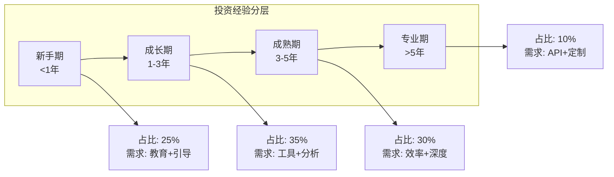

##### 3.2.2 按资产规模细分

| 资产规模 | 用户占比 | 特征描述 | 产品策略 |
|----------|----------|----------|----------|
| <10万 | 20% | 学生/职场新人，学习为主 | 免费功能+教育内容 |
| 10-50万 | 45% | 主力用户群，有投资需求 | 核心功能覆盖 |
| 50-100万 | 25% | 中产阶层，追求稳健收益 | PRO会员目标用户 |
| >100万 | 10% | 高净值用户，专业需求 | 定制化服务 |

##### 3.2.3 按风险偏好细分

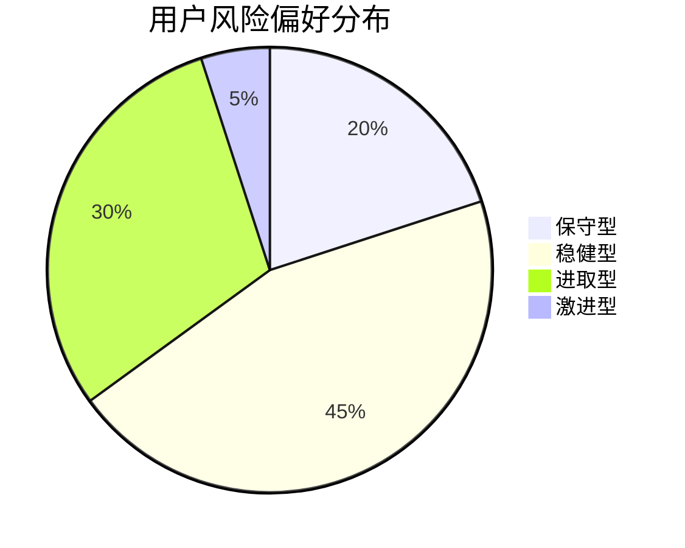

### 4. 用户需求分析

#### 4.1 用户痛点挖掘

##### 4.1.1 信息获取痛点

| 痛点 | 具体表现 | 影响程度 | 解决方案 |
|------|----------|----------|----------|
| **信息过载** | 每天接收100+条财经资讯，无法筛选 | 高 | AI智能筛选+个性化推荐 |
| **信息滞后** | 看到新闻时股价已经反应 | 高 | 实时监控+即时推送 |
| **信息噪音** | 假消息、营销号内容干扰 | 中 | 信源认证+AI过滤 |
| **信息碎片** | 信息散落在各平台，难以整合 | 中 | 统一信息聚合 |

##### 4.1.2 决策支持痛点

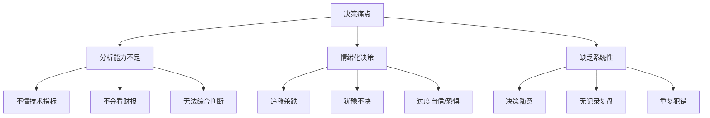

##### 4.1.3 风险控制痛点

| 痛点 | 用户原话 | 解决方案 |
|------|----------|----------|
| **止损不坚决** | "知道该止损，但总想着再等等" | 自动预警+强制提醒 |
| **仓位管理差** | "经常一把梭，满仓干" | 仓位建议+风险提示 |
| **缺乏对冲** | "只会做多，不会对冲风险" | 风险敞口分析 |
| **无复盘习惯** | "亏了就亏了，不知道原因" | 自动复盘+归因分析 |

##### 4.1.4 时间精力痛点

**时间分配分析：**

```
┌─────────────────────────────────────────────────────────────────┐
│                    投资者时间分配                                │
├─────────────────────────────────────────────────────────────────┤
│  上班族投资者日均可用于投资的时间: 约30分钟                       │
│                                                                 │
│  ┌─────────────────────────────────────────────────────────┐   │
│  │ 刷新闻  │ 看盘  │ 研究  │ 交易  │ 复盘  │ 学习          │   │
│  │  10min  │ 10min │  5min │  3min │  2min │  0min        │   │
│  └─────────────────────────────────────────────────────────┘   │
│                                                                 │
│  问题: 时间严重不足，无法完成完整的投资研究流程                   │
└─────────────────────────────────────────────────────────────────┘
```

#### 4.2 用户需求优先级

##### 4.2.1 Kano模型分析

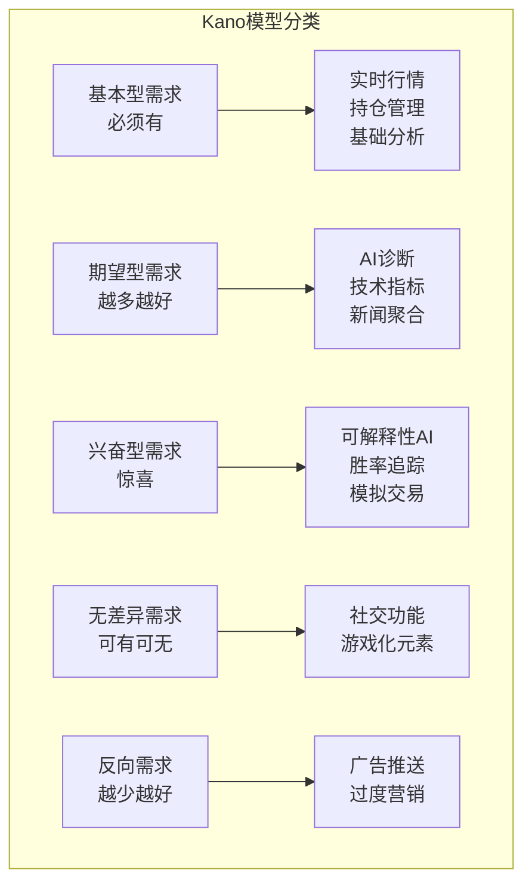

##### 4.2.2 需求优先级矩阵

| 优先级 | 需求 | 用户价值 | 实现成本 | 优先级判定 |
|--------|------|----------|----------|------------|
| **P0** | AI深度诊断 | 高 | 中 | MVP必备 |
| **P0** | 持仓管理 | 高 | 低 | MVP必备 |
| **P0** | 实时行情 | 高 | 低 | MVP必备 |
| **P1** | 风控预警 | 高 | 中 | 第一迭代 |
| **P1** | 技术指标 | 中 | 低 | 第一迭代 |
| **P1** | 新闻聚合 | 中 | 中 | 第一迭代 |
| **P2** | 复盘系统 | 中 | 高 | 第二迭代 |
| **P2** | 模拟交易 | 中 | 中 | 第二迭代 |
| **P3** | 社交功能 | 低 | 高 | 后期规划 |

#### 4.3 用户场景分析

##### 4.3.1 场景一：日常持仓监控

**场景描述：**

> 用户张明每天早上通勤时打开App，快速浏览持仓状态。系统自动显示今日涨跌、重要新闻、技术指标变化。如果有异常情况（如跌破止损位、重大利空新闻），系统会醒目提示。

**用户故事：**

```
作为一名 上班族投资者
我想要 在通勤时快速了解持仓状态
以便于 不错过重要信息，安心工作
```

**功能需求：**

| 功能点 | 描述 | 优先级 |
|--------|------|--------|
| 持仓概览 | 总资产、今日盈亏、持仓列表 | P0 |
| 异常提示 | 跌破止损、重大新闻、技术破位 | P0 |
| 快速刷新 | 一键更新所有持仓数据 | P1 |
| 自选排序 | 按涨跌幅/市值/关注度排序 | P2 |

##### 4.3.2 场景二：个股深度分析

**场景描述：**

> 用户李强关注某只股票，想要深入了解。他点击进入股票详情页，系统展示完整的技术指标（RSI、MACD、KDJ等）、基本面数据（PE、PB、资金流向）、相关新闻。他点击"AI诊断"，30秒后获得一份详细的分析报告，包含买卖建议、目标价、止损位，以及完整的分析逻辑。

**用户故事：**

```
作为一名 技术流量化者
我想要 获得个股的深度分析和明确的交易建议
以便于 做出有依据的投资决策
```

**功能需求：**

| 功能点 | 描述 | 优先级 |
|--------|------|--------|
| 技术指标面板 | RSI/MACD/KDJ/布林带等20+指标 | P0 |
| AI诊断报告 | 多维度分析+交易建议 | P0 |
| 可解释性锚点 | 点击结论跳转到数据来源 | P1 |
| 历史诊断对比 | 对比前后建议变化 | P2 |

##### 4.3.3 场景三：宏观事件响应

**场景描述：**

> 凌晨2点，美联储宣布加息50个基点。系统自动识别这一重大宏观事件，分析其对用户持仓的影响，并通过飞书Bot推送预警。第二天早上，用户收到推送，点击查看详细分析，了解哪些持仓可能受影响，应该采取什么应对措施。

**用户故事：**

```
作为一名 持有多只股票的投资者
我想要 在重大宏观事件发生时及时收到预警
以便于 提前做好应对准备
```

**功能需求：**

| 功能点 | 描述 | 优先级 |
|--------|------|--------|
| 宏观事件监控 | 自动识别重大宏观事件 | P1 |
| 影响分析 | 分析事件对持仓的影响 | P1 |
| 即时推送 | 飞书/微信推送预警 | P1 |
| 应对建议 | 给出具体操作建议 | P2 |

##### 4.3.4 场景四：策略复盘验证

**场景描述：**

> 周末，用户李强想回顾本周的投资决策。他打开"复盘中心"，系统展示过去一周所有AI建议的执行结果：哪些赚钱了，哪些亏钱了，最大回撤是多少，胜率如何。他发现AI在科技股上的建议胜率较高，在消费股上表现一般，决定下周重点关注科技股的机会。

**用户故事：**

```
作为一名 想要持续改进的投资者
我想要 查看历史投资建议的执行效果
以便于 优化自己的投资策略
```

**功能需求：**

| 功能点 | 描述 | 优先级 |
|--------|------|--------|
| 建议追踪 | 记录每次建议的后续表现 | P1 |
| MAE/MFE统计 | 最大回撤/最大浮盈统计 | P1 |
| 胜率分析 | 按股票/行业/时间段分析胜率 | P2 |
| 归因分析 | 分析盈亏原因 | P2 |

### 5. 用户旅程地图

#### 5.1 新用户旅程

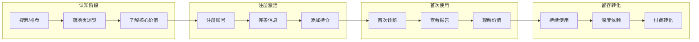

##### 5.1.1 认知阶段

| 触点 | 用户行为 | 情绪 | 痛点 | 机会点 |
|------|----------|------|------|--------|
| 搜索引擎 | 搜索"AI选股""智能投顾" | 期待 | 信息杂乱 | SEO优化 |
| 社交媒体 | 看到推荐/分享 | 好奇 | 信任度低 | KOL背书 |
| 应用商店 | 浏览金融类App | 比较 | 同质化严重 | 差异化展示 |

##### 5.1.2 注册激活

| 触点 | 用户行为 | 情绪 | 痛点 | 机会点 |
|------|----------|------|------|--------|
| 注册页面 | 填写邮箱/密码 | 平静 | 流程繁琐 | 一键注册 |
| 风险测评 | 完成问卷 | 耐心 | 题目太多 | 精简问卷 |
| 添加持仓 | 输入股票代码 | 期待 | 操作复杂 | 快速导入 |

##### 5.1.3 首次使用

| 触点 | 用户行为 | 情绪 | 痛点 | 机会点 |
|------|----------|------|------|--------|
| 首页 | 浏览持仓列表 | 新鲜 | 功能不熟 | 引导提示 |
| 诊断功能 | 点击AI诊断 | 期待 | 等待焦虑 | 进度展示 |
| 诊断结果 | 阅读分析报告 | 惊喜/疑惑 | 专业术语 | 通俗解释 |

##### 5.1.4 留存转化

| 触点 | 用户行为 | 情绪 | 痛点 | 机会点 |
|------|----------|------|------|--------|
| 日常使用 | 定期查看诊断 | 依赖 | 功能单一 | 持续迭代 |
| 深度使用 | 探索高级功能 | 满足 | 付费门槛 | 合理定价 |
| 付费转化 | 订阅PRO会员 | 期待 | 价值不确定 | 免费试用 |

#### 5.2 老用户旅程

##### 5.2.1 日常使用路径

```
┌─────────────────────────────────────────────────────────────────┐
│                    老用户日常使用路径                            │
├─────────────────────────────────────────────────────────────────┤
│                                                                 │
│  早间(8:00-9:00)                                                │
│  ├── 打开App → 查看持仓概况 → 浏览宏观雷达                       │
│  └── 耗时: 约5分钟                                              │
│                                                                 │
│  午间(12:00-13:00)                                              │
│  ├── 查看推送通知 → 处理预警 → 快速决策                          │
│  └── 耗时: 约3分钟                                              │
│                                                                 │
│  晚间(20:00-22:00)                                              │
│  ├── 深度研究个股 → AI诊断 → 阅读报告 → 调整策略                 │
│  └── 耗时: 约30分钟                                             │
│                                                                 │
└─────────────────────────────────────────────────────────────────┘
```

##### 5.2.2 深度使用路径

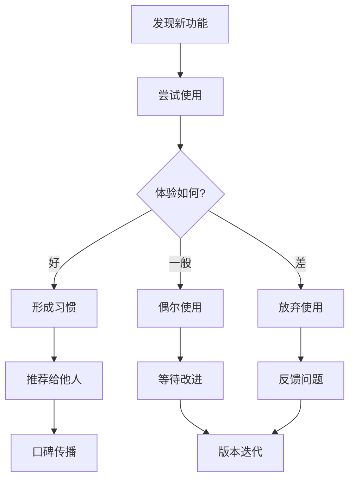

##### 5.2.3 付费转化路径

| 阶段 | 用户心理 | 关键触点 | 转化策略 |
|------|----------|----------|----------|
| **认知** | "免费版够用了" | 功能限制提示 | 展示PRO价值 |
| **考虑** | "PRO有什么好处？" | PRO权益介绍 | 突出差异化 |
| **决策** | "值不值得付费？" | 免费试用 | 降低决策门槛 |
| **行动** | "先试试看" | 订阅流程 | 简化支付 |
| **留存** | "续费吗？" | 续费提醒 | 持续价值交付 |

---

## 第三部分：功能需求详述

### 6. 功能架构总览

#### 6.1 功能模块划分

##### 6.1.1 核心功能模块

核心功能模块是产品的核心竞争力，直接决定用户价值交付：

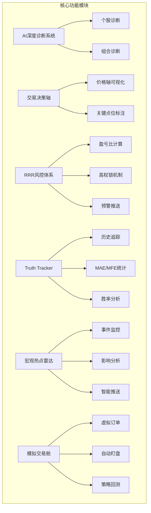

**核心功能优先级：**

| 功能模块 | MVP必须 | 第一迭代 | 后续迭代 | 理由 |
|----------|---------|----------|----------|------|
| AI深度诊断 | ✓ | - | - | 核心价值 |
| 交易决策轴 | ✓ | - | - | 差异化 |
| RRR风控体系 | ✓ | - | - | 解决痛点 |
| Truth Tracker | - | ✓ | - | 建立信任 |
| 宏观热点雷达 | - | ✓ | - | 增值功能 |
| 模拟交易舱 | - | - | ✓ | 扩展场景 |

##### 6.1.2 辅助功能模块

辅助功能模块支撑核心功能的运行：

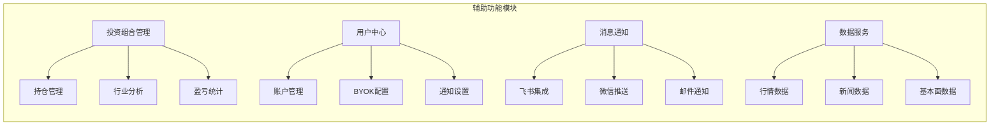

##### 6.1.3 运营支撑模块

| 模块 | 功能 | 服务对象 |
|------|------|----------|
| 用户管理 | 注册/登录/权限 | 所有用户 |
| 数据统计 | 使用数据/业务数据 | 运营团队 |
| 内容管理 | 公告/帮助/教程 | 运营团队 |
| 系统监控 | 性能/异常/告警 | 技术团队 |

#### 6.2 功能架构图

##### 6.2.1 一级功能架构

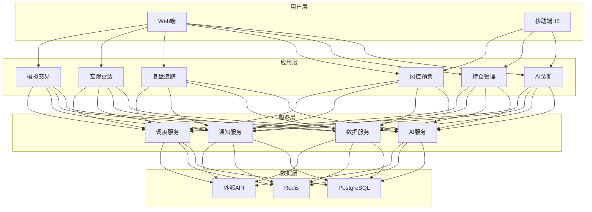

##### 6.2.2 二级功能架构

**AI诊断模块详细架构：**

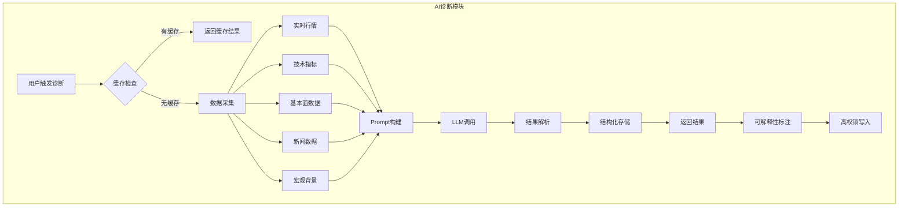

### 7. 核心功能需求

#### 7.1 AI深度诊断系统

##### 7.1.1 功能概述与目标

**功能概述：**

AI深度诊断系统是产品的核心功能，通过整合多维度数据（实时行情、技术指标、基本面、新闻、宏观背景），利用大语言模型生成专业的投资分析报告。报告包含明确的交易建议、目标价位、止损位，以及完整的分析逻辑链。

**核心目标：**

| 目标维度 | 具体目标 | 衡量指标 |
|----------|----------|----------|
| **决策支持** | 提供有依据的投资建议 | 建议采纳率>30% |
| **可解释性** | 每个结论可追溯数据来源 | 锚点点击率>50% |
| **时效性** | 快速响应用户需求 | 响应时间<30s |
| **准确性** | 建议具有参考价值 | 胜率>55% |

##### 7.1.2 用户故事

**主流程用户故事：**

```
用户故事 US-7.1.1：发起个股诊断
━━━━━━━━━━━━━━━━━━━━━━━━━━━━━━━━━━━━━━━━━━━━━━━━━━━━━━
作为一名 注册用户
我想要 对我持有的股票进行AI深度诊断
以便于 获得专业的投资分析和操作建议

验收标准：
✓ 能够从持仓列表一键发起诊断
✓ 能够通过搜索股票代码发起诊断
✓ 显示诊断进度（数据采集中/分析中/生成报告）
✓ 30秒内返回诊断结果
✓ 结果包含：情绪评分、操作建议、目标价、止损位、分析逻辑
```

```
用户故事 US-7.1.2：查看历史诊断
━━━━━━━━━━━━━━━━━━━━━━━━━━━━━━━━━━━━━━━━━━━━━━━━━━━━━━
作为一名 注册用户
我想要 查看某只股票的历史诊断记录
以便于 对比分析AI建议的变化

验收标准：
✓ 显示该股票所有历史诊断列表
✓ 按时间倒序排列
✓ 显示每次诊断的核心结论摘要
✓ 支持点击查看完整报告
```

```
用户故事 US-7.1.3：可解释性交互
━━━━━━━━━━━━━━━━━━━━━━━━━━━━━━━━━━━━━━━━━━━━━━━━━━━━━━
作为一名 技术流量化者
我想要 点击报告中的结论标签跳转到对应数据
以便于 验证AI的分析依据

验收标准：
✓ 报告中的关键结论标注[[REF_xx]]锚点
✓ 点击锚点自动滚动到对应数据区域
✓ 目标数据区域高亮显示
✓ 支持从数据区域返回结论位置
```

##### 7.1.3 功能流程图

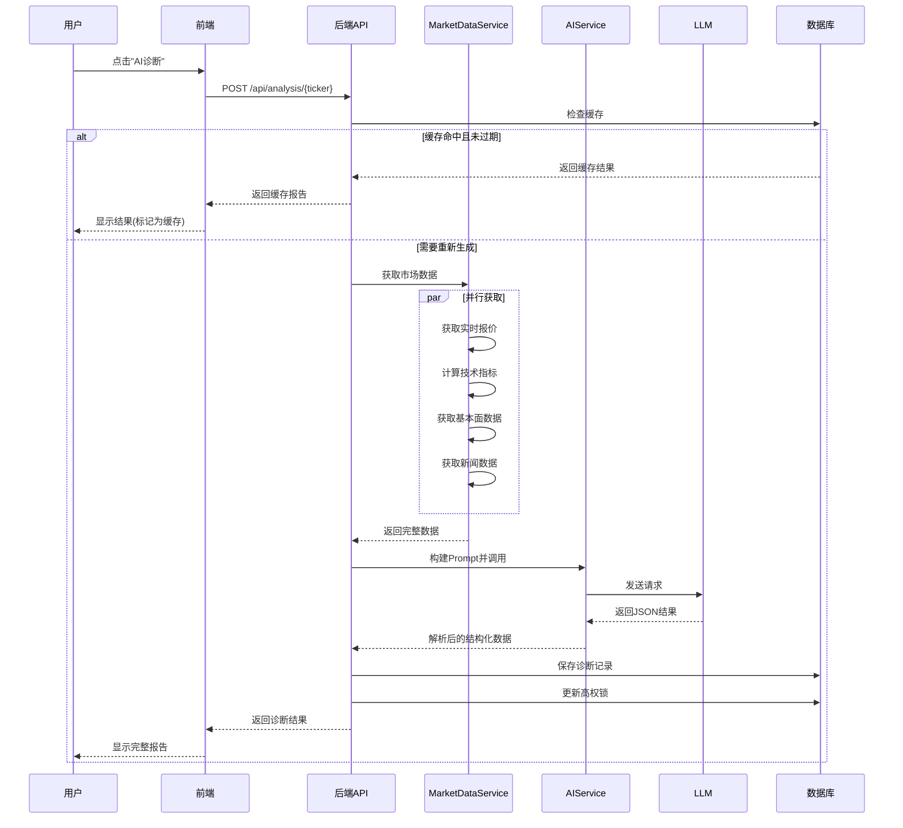

##### 7.1.4 输入输出规格

**输入参数：**

| 参数名 | 类型 | 必填 | 说明 |
|--------|------|------|------|
| ticker | string | 是 | 股票代码 |
| force | boolean | 否 | 是否强制刷新（跳过缓存） |
| model | string | 否 | 指定AI模型（默认用户偏好） |

**输出结构：**

```json
{
  "ticker": "AAPL",
  "sentiment_score": 75,
  "summary_status": "震荡偏强",
  "immediate_action": "HOLD",
  "target_price": 195.50,
  "stop_loss_price": 178.00,
  "entry_zone": "180.00-183.00",
  "entry_price_low": 180.00,
  "entry_price_high": 183.00,
  "rr_ratio": "1:2.5",
  "risk_level": "中",
  "confidence_level": 78,
  "investment_horizon": "中期(1-3个月)",
  "thought_process": [
    {"step": "观察", "content": "RSI(14)=58，处于中性区间..."},
    {"step": "推导", "content": "MACD金叉形成，动能转强..."},
    {"step": "风险评估", "content": "下方支撑位178美元..."},
    {"step": "结论", "content": "建议持有，可逢低加仓..."}
  ],
  "scenario_tags": [
    {"category": "技术形态", "value": "MACD金叉"},
    {"category": "资金面", "value": "机构净流入"}
  ],
  "technical_analysis": "### 技术面分析\n...",
  "fundamental_news": "### 基本面/消息面\n...",
  "action_advice": "### 操作建议\n...",
  "is_cached": false,
  "model_used": "deepseek-r1",
  "created_at": "2024-01-15T10:30:00Z"
}
```

##### 7.1.5 业务规则

**诊断触发规则：**

| 规则ID | 规则描述 | 优先级 |
|--------|----------|--------|
| BR-7.1.1 | 同一股票30分钟内重复诊断返回缓存 | 高 |
| BR-7.1.2 | force=true时跳过缓存强制重新生成 | 高 |
| BR-7.1.3 | 用户每日免费诊断次数上限（FREE:5次, PRO:无限） | 中 |
| BR-7.1.4 | 诊断失败时返回上次缓存结果（如有） | 高 |

**高权锁规则：**

| 规则ID | 规则描述 |
|--------|----------|
| BR-7.1.5 | AI诊断完成后，目标价和止损价写入market_data_cache |
| BR-7.1.6 | 同时设置is_ai_strategy=true |
| BR-7.1.7 | 当is_ai_strategy=true时，自动刷新不覆盖目标价/止损价 |
| BR-7.1.8 | 用户手动触发诊断时，更新高权锁 |

##### 7.1.6 异常处理

| 异常场景 | 错误码 | 处理策略 |
|----------|--------|----------|
| 股票代码无效 | 404 | 返回"未找到该股票"提示 |
| 数据获取失败 | 503 | 返回上次缓存结果或提示稍后重试 |
| AI调用超时 | 504 | 返回"分析超时，请稍后重试" |
| AI返回格式错误 | 500 | 记录日志，返回通用错误提示 |
| 用户配额用尽 | 429 | 返回"今日诊断次数已用完，请升级PRO" |

##### 7.1.7 性能要求

| 性能指标 | 目标值 | 测量方法 |
|----------|--------|----------|
| P50响应时间 | <20s | 从请求到返回的时间 |
| P95响应时间 | <30s | 从请求到返回的时间 |
| P99响应时间 | <45s | 从请求到返回的时间 |
| 并发处理能力 | 50 QPS | 同时处理的诊断请求数 |
| 缓存命中率 | >60% | 返回缓存结果的比例 |

##### 7.1.8 数据埋点需求

| 事件名 | 触发时机 | 关键参数 |
|--------|----------|----------|
| diagnosis_start | 用户发起诊断 | ticker, source |
| diagnosis_complete | 诊断完成 | ticker, duration, is_cached |
| diagnosis_error | 诊断失败 | ticker, error_type |
| diagnosis_anchor_click | 点击可解释性锚点 | ticker, anchor_id |
| diagnosis_share | 分享诊断报告 | ticker, share_type |

#### 7.2 交易决策轴可视化

##### 7.2.1 功能概述与目标

**功能概述：**

交易决策轴是产品的差异化创新功能，采用非线性坐标系展示关键价格点位（止损价、建仓区、加码位、目标价），帮助用户直观理解交易策略的风险收益结构。

**核心目标：**

- 将抽象的数字转化为直观的视觉呈现
- 一眼看出交易的风险收益比
- 支持快速决策

##### 7.2.2 用户故事

```
用户故事 US-7.2.1：查看交易决策轴
━━━━━━━━━━━━━━━━━━━━━━━━━━━━━━━━━━━━━━━━━━━━━━━━━━━━━━
作为一名 投资者
我想要 在诊断报告中看到可视化的交易决策轴
以便于 直观理解建议的入场点、目标价、止损位

验收标准：
✓ 以价格轴为核心展示关键点位
✓ 止损位用红色标注
✓ 目标价用绿色标注
✓ 建仓区用蓝色区间表示
✓ 当前价格位置清晰标识
✓ 盈亏比数值显示在轴上方
```

##### 7.2.3 可视化设计规范

**决策轴结构：**

```
价格轴 ($)
    │
    │  ┌─────────────────────────────────────────┐
    │  │              目标价 (Target)             │ ← 绿色
    │  │                 $195.50                  │    +$12.50 (+6.8%)
    │  └─────────────────────────────────────────┘
    │
    │  ═══════════════════════════════════════════
    │         当前价格 (Current): $183.00         ← 黄色高亮
    │  ═══════════════════════════════════════════
    │
    │  ╭─────────────────────────────────────────╮
    │  │            建仓区间 (Entry)              │ ← 蓝色
    │  │           $180.00 - $183.00              │
    │  ╰─────────────────────────────────────────╯
    │
    │  ┌─────────────────────────────────────────┐
    │  │              止损价 (Stop Loss)          │ ← 红色
    │  │                 $178.00                  │    -$5.00 (-2.7%)
    │  └─────────────────────────────────────────┘
    │
    └──────────────────────────────────────────────────▶
                                盈亏比: 1:2.5
```

**颜色规范：**

| 元素 | 颜色 | 色值 | 含义 |
|------|------|------|------|
| 目标价 | 绿色 | #10B981 | 收益预期 |
| 止损价 | 红色 | #EF4444 | 风险警示 |
| 建仓区 | 蓝色 | #3B82F6 | 行动区间 |
| 当前价 | 黄色 | #F59E0B | 实时状态 |
| 盈亏比 | 紫色 | #8B5CF6 | 性价比评估 |

##### 7.2.4 交互设计详述

| 交互行为 | 触发方式 | 反馈效果 |
|----------|----------|----------|
| 悬停点位 | 鼠标hover | 显示详细信息和百分比 |
| 点击点位 | 鼠标click | 展开详细说明面板 |
| 缩放视图 | 滚轮/双指 | 调整价格轴范围 |
| 拖拽调整 | 鼠标拖拽 | 用户自定义点位（PRO功能） |

##### 7.2.5 技术实现要点

**动态冲突规避算法：**

```python
def adjust_position(positions, min_gap=30):
    """
    动态调整相邻点位位置，防止标签重叠
    positions: [(price, label_y), ...]
    """
    adjusted = []
    for i, (price, y) in enumerate(sorted(positions, key=lambda x: x[0])):
        if i > 0 and y - adjusted[-1][1] < min_gap:
            y = adjusted[-1][1] + min_gap
        adjusted.append((price, y))
    return adjusted
```

##### 7.2.6 性能优化要求

| 优化项 | 实现方式 | 目标效果 |
|--------|----------|----------|
| 渲染性能 | Canvas替代SVG | 60fps流畅 |
| 数据更新 | 增量渲染 | 仅更新变化部分 |
| 内存占用 | 虚拟滚动 | 限制DOM节点数 |

#### 7.3 RRR强制风控体系

##### 7.3.1 功能概述与目标

**RRR (Risk-Reward Ratio)** 强制风控体系是产品的核心差异化功能，通过硬性规则确保每笔交易建议都有合理的风险收益比。

**核心目标：**

- 杜绝"低性价比"的交易建议
- 强制用户关注风险
- 建立纪律性投资习惯

##### 7.3.2 盈亏比计算逻辑

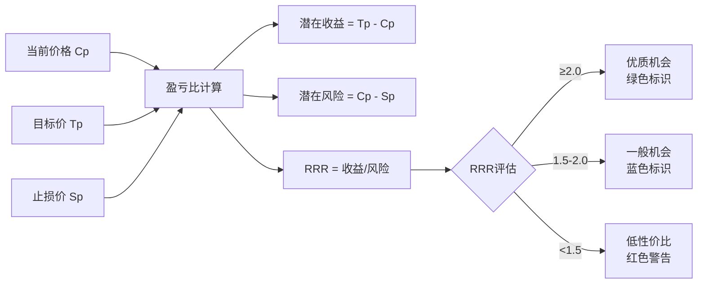

**计算公式：**

```
盈亏比 (RRR) = (目标价 - 当前价) / (当前价 - 止损价)

示例：
当前价: $183
目标价: $195.5
止损价: $178

潜在收益 = $195.5 - $183 = $12.5
潜在风险 = $183 - $178 = $5
盈亏比 = $12.5 / $5 = 2.5
```

##### 7.3.3 风控规则引擎

| 规则ID | 条件 | 动作 | 优先级 |
|--------|------|------|--------|
| FR-7.3.1 | RRR < 1.5 | 标记"低性价比"，红色警告 | 高 |
| FR-7.3.2 | RRR ≥ 2.0 | 标记"优质机会"，绿色推荐 | 中 |
| FR-7.3.3 | 止损价 > 当前价×0.95 | 提示"止损位过宽" | 低 |
| FR-7.3.4 | 目标价 < 当前价×1.05 | 提示"目标价过近" | 低 |

##### 7.3.4 预警机制设计

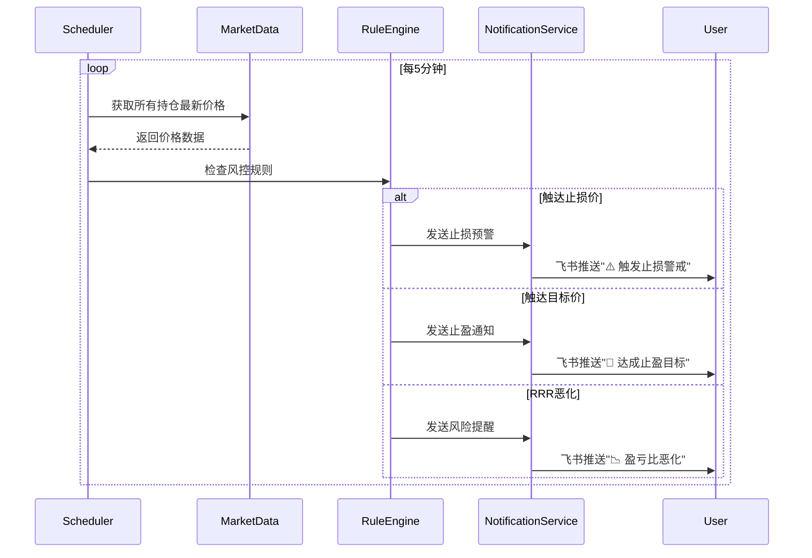

##### 7.3.5 高权锁机制详解

**机制说明：**

高权锁是解决"止损线乱跳"痛点的核心机制。当AI给出诊断建议后，目标价和止损价会被"锁定"，后续的自动数据刷新不会覆盖这些关键点位。

```mermaid
stateDiagram-v2
    [*] --> 初始状态
    初始状态 --> AI诊断: 用户触发
    AI诊断 --> 高权锁定: is_ai_strategy=true
    高权锁定 --> 自动刷新: 后台定时任务
    自动刷新 --> 高权锁定: 保持AI点位不变
    高权锁定 --> 用户重置: 用户手动修改
    用户重置 --> 初始状态: is_ai_strategy=false
```

**数据库实现：**

```sql
-- market_data_cache 表关键字段
ticker VARCHAR PRIMARY KEY,
current_price DECIMAL,
target_price DECIMAL,      -- AI目标价
stop_loss_price DECIMAL,   -- AI止损价
is_ai_strategy BOOLEAN,    -- 高权锁标志
risk_reward_ratio DECIMAL, -- 动态盈亏比
last_updated TIMESTAMP

-- 更新逻辑
UPDATE market_data_cache 
SET current_price = ?, 
    risk_reward_ratio = CALC_RRR(?, target_price, stop_loss_price)
    -- 注意：不更新 target_price 和 stop_loss_price
WHERE ticker = ? AND is_ai_strategy = true;
```

#### 7.4 Truth Tracker复盘系统

##### 7.4.1 功能概述与目标

**功能概述：**

Truth Tracker（真相追踪器）是产品的信任建立机制，通过记录每次AI建议的后续表现，透明展示真实胜率，让用户能够验证AI策略的有效性。

**核心目标：**

- 建立用户信任
- 提供策略改进依据
- 实现可验证的AI

##### 7.4.2 MAE/MFE追踪逻辑

**指标定义：**

| 指标 | 全称 | 定义 | 计算方式 |
|------|------|------|----------|
| **MAE** | Maximum Adverse Excursion | 最大不利偏移（最大回撤） | 诊断后最低价相对诊断价的跌幅 |
| **MFE** | Maximum Favorable Excursion | 最大有利偏移（最大浮盈） | 诊断后最高价相对诊断价的涨幅 |

```mermaid
graph LR
    A[诊断时刻 T0] --> B[价格: P0]
    B --> C[追踪期: T0+T]
    
    C --> D[期间最低价: P_min]
    C --> E[期间最高价: P_max]
    
    D --> F[MAE = (P0 - P_min) / P0 × 100%]
    E --> G[MFE = (P_max - P0) / P0 × 100%]
```

**追踪周期：**

| 追踪类型 | 周期 | 更新频率 |
|----------|------|----------|
| 短期追踪 | 5个交易日 | 每日更新 |
| 中期追踪 | 20个交易日 | 每日更新 |
| 长期追踪 | 60个交易日 | 每日更新 |

##### 7.4.3 历史切片保存机制

**切片内容：**

```json
{
  "diagnosis_id": "uuid-xxx",
  "ticker": "AAPL",
  "diagnosis_time": "2024-01-15T10:30:00Z",
  "input_context_snapshot": {
    "price_at_diagnosis": 183.00,
    "rsi_14": 58.5,
    "macd_hist": 0.35,
    "news_count": 5,
    "macro_events": ["Fed加息预期"]
  },
  "ai_recommendation": {
    "action": "HOLD",
    "target_price": 195.50,
    "stop_loss": 178.00,
    "confidence": 78
  },
  "tracking_data": {
    "mae_5d": -2.1,
    "mfe_5d": 4.5,
    "mae_20d": -3.8,
    "mfe_20d": 8.2,
    "final_outcome": "TARGET_HIT"
  }
}
```

##### 7.4.4 防穿越验证设计

**问题背景：**

AI分析时如果获取了"未来"的信息（如收盘后才发布的财报），会导致分析结果不可信，称为"穿越"问题。

**防穿越机制：**

```mermaid
graph TB
    A[AI诊断请求] --> B{数据时间检查}
    B -->|数据时间戳正常| C[正常处理]
    B -->|数据时间戳异常| D[触发防穿越机制]
    
    D --> E[标记可疑数据]
    E --> F[使用上一周期数据]
    F --> G[在报告中注明]
    
    C --> H[保存输入快照]
    H --> I[记录所有数据时间戳]
    I --> J[支持事后审计]
```

##### 7.4.5 胜率统计展示

**胜率定义：**

```
胜率 = (MFE > 0 且 未触发止损) 的诊断数 / 总诊断数 × 100%

细分胜率：
- 买入建议胜率
- 卖出建议胜率
- 持有建议准确率
```

**统计维度：**

| 维度 | 统计项 | 展示方式 |
|------|--------|----------|
| 整体 | 总胜率、平均MAE/MFE | 仪表盘 |
| 时间 | 按周/月胜率趋势 | 折线图 |
| 股票 | 个股历史胜率 | 列表 |
| 行业 | 分行业胜率对比 | 柱状图 |

#### 7.5 宏观热点雷达

##### 7.5.1 功能概述与目标

**功能概述：**

宏观热点雷达自动监控全球重大宏观事件（如美联储议息、地缘冲突、重大政策），分析其对用户持仓的潜在影响，并通过飞书Bot推送预警。

##### 7.5.2 数据源配置

| 数据源 | 类型 | 更新频率 | 用途 |
|--------|------|----------|------|
| Tavily | 搜索API | 实时 | 全球热点搜索 |
| 财联社 | 新闻源 | 10分钟 | 国内财经快讯 |
| AkShare | 数据源 | 5分钟 | A股/美股行情 |
| 自定义Webhook | 推送渠道 | - | 飞书/微信通知 |

##### 7.5.3 热点提炼逻辑

```mermaid
graph TB
    A[原始新闻流] --> B[去重过滤]
    B --> C[AI分类]
    C --> D{事件类型}
    
    D -->|货币政策| E[影响利率敏感板块]
    D -->|地缘政治| F[影响能源/军工]
    D -->|产业政策| G[影响相关行业]
    D -->|宏观经济| H[影响整体市场]
    
    E & F & G & H --> I[生成影响报告]
    I --> J[匹配用户持仓]
    J --> K[生成个性化预警]
```

##### 7.5.4 推送策略设计

| 事件等级 | 推送方式 | 推送时机 | 示例 |
|----------|----------|----------|------|
| **紧急** | 即时推送+声音提醒 | 事件发生后5分钟内 | 美联储紧急降息 |
| **重要** | 即时推送 | 事件发生后15分钟内 | 非农数据公布 |
| **一般** | 整点汇总推送 | 每小时整点 | 行业政策发布 |
| **参考** | 日报汇总 | 每日9:00 | 行业动态 |

##### 7.5.5 降级容灾方案

```mermaid
graph LR
    A[Tavily API] --> B{调用成功?}
    B -->|是| C[正常处理]
    B -->|否| D[降级到财联社]
    
    D --> E{财联社可用?}
    E -->|是| F[使用本地新闻]
    E -->|否| G[使用缓存数据]
    
    C --> H[完整热点分析]
    F --> I[简化热点列表]
    G --> J[提示"服务暂时受限"]
```

#### 7.6 模拟交易舱

##### 7.6.1 功能概述与目标

**功能概述：**

模拟交易舱允许用户在不投入真实资金的情况下，验证AI建议或自己的交易策略。系统自动盯盘，在触达止盈止损时自动平仓，并记录完整的交易轨迹。

##### 7.6.2 虚拟订单管理

**订单状态机：**

```mermaid
stateDiagram-v2
    [*] --> OPEN: 创建订单
    OPEN --> CLOSED_PROFIT: 触达止盈
    OPEN --> CLOSED_LOSS: 触达止损
    OPEN --> CLOSED_MANUAL: 用户手动平仓
    OPEN --> CLOSED_SYSTEM: 系统强制平仓
    CLOSED_PROFIT --> [*]
    CLOSED_LOSS --> [*]
    CLOSED_MANUAL --> [*]
    CLOSED_SYSTEM --> [*]
```

**订单数据结构：**

```json
{
  "id": "trade-xxx",
  "user_id": "user-xxx",
  "ticker": "AAPL",
  "status": "OPEN",
  "entry_date": "2024-01-15T10:30:00Z",
  "entry_price": 183.00,
  "entry_reason": "AI诊断建议买入",
  "target_price": 195.50,
  "stop_loss_price": 178.00,
  "current_price": 188.50,
  "unrealized_pnl_pct": 3.01,
  "daily_logs": [
    {"date": "2024-01-15", "price": 183.00, "pnl_pct": 0},
    {"date": "2024-01-16", "price": 185.20, "pnl_pct": 1.2},
    {"date": "2024-01-17", "price": 188.50, "pnl_pct": 3.01}
  ]
}
```

##### 7.6.3 自动盯盘逻辑

```python
async def monitor_trades():
    """每分钟检查所有OPEN状态的订单"""
    open_trades = await get_open_trades()
    
    for trade in open_trades:
        current_price = await get_current_price(trade.ticker)
        trade.current_price = current_price
        trade.unrealized_pnl_pct = (current_price - trade.entry_price) / trade.entry_price * 100
        
        # 检查止盈
        if trade.target_price and current_price >= trade.target_price:
            trade.status = TradeStatus.CLOSED_PROFIT
            trade.exit_price = current_price
            await send_notification(trade.user_id, "🎉 止盈达成")
        
        # 检查止损
        elif trade.stop_loss_price and current_price <= trade.stop_loss_price:
            trade.status = TradeStatus.CLOSED_LOSS
            trade.exit_price = current_price
            await send_notification(trade.user_id, "⚠️ 止损触发")
        
        # 记录每日轨迹
        await log_daily_trajectory(trade)
```

##### 7.6.4 止盈止损触发

| 触发条件 | 动作 | 通知内容 |
|----------|------|----------|
| 价格 ≥ 目标价 | 状态→CLOSED_PROFIT | "🎉 [股票名]已达成止盈目标，浮盈+X%" |
| 价格 ≤ 止损价 | 状态→CLOSED_LOSS | "⚠️ [股票名]触发止损，亏损-X%" |
| 用户手动平仓 | 状态→CLOSED_MANUAL | 记录平仓原因 |
| 持仓超过60天 | 状态→CLOSED_SYSTEM | "⏰ [股票名]持仓已满60天，系统自动平仓" |

##### 7.6.5 策略回测展示

**回测报告内容：**

| 统计项 | 说明 |
|--------|------|
| 总交易次数 | 模拟交易总数 |
| 盈利次数 | CLOSED_PROFIT数量 |
| 亏损次数 | CLOSED_LOSS数量 |
| 胜率 | 盈利次数/总次数 |
| 平均盈利 | 盈利交易的平均收益率 |
| 平均亏损 | 亏损交易的平均亏损率 |
| 最大回撤 | 所有交易的最大MAE |
| 盈亏比 | 平均盈利/平均亏损 |

### 8. 辅助功能需求

#### 8.1 投资组合管理

##### 8.1.1 持仓管理

| 功能 | 描述 | 优先级 |
|------|------|--------|
| 添加持仓 | 输入股票代码、数量、成本价 | P0 |
| 编辑持仓 | 修改数量、成本价 | P0 |
| 删除持仓 | 从自选列表移除 | P0 |
| 批量导入 | 支持CSV导入持仓 | P2 |

##### 8.1.2 行业分布分析

```mermaid
pie title 持仓行业分布示例
    "科技" : 40
    "消费" : 25
    "金融" : 20
    "医疗" : 10
    "其他" : 5
```

##### 8.1.3 盈亏统计

| 统计项 | 计算方式 |
|--------|----------|
| 总市值 | Σ(持仓数量 × 当前价格) |
| 总成本 | Σ(持仓数量 × 成本价) |
| 总盈亏 | 总市值 - 总成本 |
| 盈亏比例 | 总盈亏 / 总成本 × 100% |
| 今日盈亏 | Σ(持仓数量 × 今日涨跌额) |

#### 8.2 用户中心

##### 8.2.1 账户管理

| 功能 | 描述 |
|------|------|
| 注册/登录 | 邮箱注册，JWT认证 |
| 密码管理 | 修改密码、找回密码 |
| 个人信息 | 昵称、头像、时区设置 |

##### 8.2.2 API Key管理（BYOK）

**BYOK (Bring Your Own Key)** 机制允许用户使用自己的AI API Key：

| 供应商 | 支持功能 | 配置项 |
|--------|----------|--------|
| SiliconFlow | DeepSeek/Qwen模型 | API Key + Base URL |
| Gemini | Google Gemini模型 | API Key |
| DeepSeek | DeepSeek官方API | API Key |

**安全机制：**

- API Key使用AES-256加密存储
- 前端显示时只显示前4位和后4位
- 支持一键测试连接有效性

##### 8.2.3 通知偏好设置

| 设置项 | 默认值 | 说明 |
|--------|--------|------|
| 价格预警 | 开启 | 触达止盈止损时推送 |
| 每小时摘要 | 开启 | 整点新闻精要推送 |
| 每日报告 | 开启 | 每日9:00持仓报告 |
| 宏观预警 | 开启 | 重大宏观事件推送 |

##### 8.2.4 会员体系

| 会员等级 | 价格 | 权益 |
|----------|------|------|
| **FREE** | 免费 | 5次诊断/日，基础功能 |
| **PRO** | ¥99/月 | 无限诊断，高级功能，优先支持 |

#### 8.3 消息通知系统

##### 8.3.1 飞书Bot集成

**集成流程：**

```mermaid
sequenceDiagram
    participant U as 用户
    participant F as 前端
    participant B as 后端
    participant L as 飞书
    
    U->>F: 配置飞书Webhook URL
    F->>B: 保存配置
    B->>B: 验证URL有效性
    B->>L: 发送测试消息
    L-->>U: 收到测试消息
    
    Note over B,L: 后续推送流程
    B->>L: POST到Webhook
    L-->>U: 显示消息卡片
```

##### 8.3.2 通知类型定义

| 类型ID | 类型名称 | 触发条件 | 模板 |
|--------|----------|----------|------|
| PRICE_ALERT | 价格预警 | 触达止盈止损 | "🚀/⚠️ [股票]触达目标价" |
| INDICATOR_ALERT | 指标预警 | RSI极端值 | "📊 [股票]RSI超买/超卖" |
| MACRO_ALERT | 宏观预警 | 重大事件 | "🔥 [事件]可能影响持仓" |
| HOURLY_SUMMARY | 每小时摘要 | 整点触发 | "⏰ 本小时市场精要" |
| DAILY_REPORT | 每日报告 | 每日9:00 | "📅 持仓全景体检报告" |
| STRATEGY_CHANGE | 策略变更 | 盘后分析差异大 | "🔔 [股票]策略动态调整" |

##### 8.3.3 去重策略

| 通知类型 | 去重窗口 | 说明 |
|----------|----------|------|
| PRICE_ALERT | 24小时 | 同一股票24小时内不重复推送 |
| INDICATOR_ALERT | 24小时 | 同一指标24小时内不重复推送 |
| MACRO_ALERT | 1小时 | 同一事件1小时内不重复推送 |
| HOURLY_SUMMARY | 30分钟 | 防止整点触发重叠 |

##### 8.3.4 推送时机优化

| 时段 | 推送策略 | 理由 |
|------|----------|------|
| 9:00-9:30 | 仅紧急推送 | 开盘前准备 |
| 9:30-16:00 | 正常推送 | 交易时段 |
| 16:00-20:00 | 延迟非紧急推送 | 盘后整理 |
| 20:00-23:00 | 正常推送 | 晚间研究时段 |
| 23:00-9:00 | 仅紧急推送 | 休息时段 |

### 9. 非功能性需求

#### 9.1 性能需求

##### 9.1.1 响应时间要求

| 接口类型 | P50 | P95 | P99 |
|----------|-----|-----|-----|
| 静态资源 | <100ms | <200ms | <500ms |
| API查询 | <200ms | <500ms | <1s |
| AI诊断 | <20s | <30s | <45s |
| 数据刷新 | <500ms | <1s | <2s |

##### 9.1.2 并发处理能力

| 场景 | 目标QPS | 峰值QPS |
|------|---------|---------|
| 正常访问 | 100 | 500 |
| AI诊断 | 20 | 50 |
| 数据刷新 | 50 | 200 |

##### 9.1.3 数据库查询优化

| 优化项 | 实现方式 |
|--------|----------|
| 索引优化 | 高频查询字段建立复合索引 |
| 连接池 | 使用异步连接池，最大连接数20 |
| 查询缓存 | Redis缓存热点数据 |
| 慢查询监控 | 记录>100ms的查询 |

#### 9.2 安全需求

##### 9.2.1 认证授权

| 安全项 | 实现方式 |
|--------|----------|
| 密码存储 | bcrypt加密，cost=12 |
| Token机制 | JWT，有效期24小时 |
| 刷新机制 | Refresh Token，有效期7天 |
| 登录保护 | 5次失败后锁定15分钟 |

##### 9.2.2 数据加密

| 数据类型 | 加密方式 |
|----------|----------|
| 用户密码 | bcrypt单向加密 |
| API Key | AES-256加密存储 |
| 传输数据 | HTTPS/TLS 1.3 |
| 敏感日志 | 脱敏处理 |

##### 9.2.3 API安全

| 安全措施 | 实现方式 |
|----------|----------|
| 请求限流 | 滑动窗口算法，100次/分钟 |
| 参数校验 | Pydantic严格校验 |
| SQL注入防护 | ORM参数化查询 |
| XSS防护 | 输出转义 |

##### 9.2.4 敏感信息处理

| 信息类型 | 处理方式 |
|----------|----------|
| API Key | 显示为 `sk-****xxxx` |
| 用户邮箱 | 日志中脱敏为 `u***@example.com` |
| 财务数据 | 不记录详细金额日志 |

#### 9.3 可用性需求

##### 9.3.1 系统可用性目标

| 指标 | 目标值 | 计算方式 |
|------|--------|----------|
| SLA | 99.5% | 月可用时间/月总时间 |
| 计划停机 | <4小时/月 | 维护窗口 |
| 非计划停机 | <2小时/月 | 故障恢复 |

##### 9.3.2 故障恢复时间

| 故障类型 | RTO | RPO |
|----------|-----|-----|
| 单点故障 | <5分钟 | 0 |
| 数据库故障 | <15分钟 | <1分钟 |
| 系统崩溃 | <10分钟 | <5分钟 |

##### 9.3.3 数据备份策略

| 备份类型 | 频率 | 保留期 |
|----------|------|--------|
| 全量备份 | 每日 | 30天 |
| 增量备份 | 每小时 | 7天 |
| 日志备份 | 每15分钟 | 3天 |

#### 9.4 兼容性需求

##### 9.4.1 浏览器兼容

| 浏览器 | 最低版本 | 支持程度 |
|--------|----------|----------|
| Chrome | 90+ | 完全支持 |
| Firefox | 88+ | 完全支持 |
| Safari | 14+ | 完全支持 |
| Edge | 90+ | 完全支持 |
| IE | - | 不支持 |

##### 9.4.2 设备兼容

| 设备类型 | 支持程度 | 说明 |
|----------|----------|------|
| 桌面端 | 完全支持 | 主要使用场景 |
| 平板 | 响应式适配 | 支持基础功能 |
| 手机 | 响应式适配 | 支持核心功能 |

##### 9.4.3 操作系统兼容

| 操作系统 | 支持程度 |
|----------|----------|
| Windows | 完全支持 |
| macOS | 完全支持 |
| Linux | 完全支持 |
| iOS | Safari支持 |
| Android | Chrome支持 |

---

## 第四部分：技术架构设计

### 10. 系统架构

#### 10.1 整体架构设计

##### 10.1.1 架构设计原则

本系统采用现代化的云原生架构设计，遵循以下核心原则：

| 原则 | 描述 | 实践方式 |
|------|------|----------|
| **高可用性** | 系统具备容错能力，单点故障不影响整体服务 | 无状态服务设计、数据库主从复制 |
| **可扩展性** | 支持水平扩展，应对用户增长 | 容器化部署、微服务架构 |
| **安全性** | 数据传输加密、敏感信息保护 | HTTPS、AES加密、JWT认证 |
| **可观测性** | 系统运行状态可监控、问题可追溯 | Loki日志聚合、Grafana监控 |
| **成本效益** | 在满足需求前提下控制成本 | 按需扩缩容、BYOK机制 |

##### 10.1.2 系统架构图

```mermaid
graph TB
    subgraph "用户接入层"
        U1[Web浏览器] --> N1[Nginx反向代理]
        U2[移动端H5] --> N1
    end
    
    subgraph "前端应用层"
        N1 --> F1[Next.js SSR服务]
        F1 --> F2[React组件]
        F1 --> F3[API Client]
    end
    
    subgraph "后端服务层"
        F3 --> B1[FastAPI网关]
        B1 --> B2[认证服务]
        B1 --> B3[AI诊断服务]
        B1 --> B4[数据服务]
        B1 --> B5[通知服务]
        B1 --> B6[调度服务]
    end
    
    subgraph "数据存储层"
        B4 --> D1[(PostgreSQL)]
        B4 --> D2[(Redis缓存)]
        B3 --> D3[向量数据库<br/>预留]
    end
    
    subgraph "外部服务"
        B3 --> E1[SiliconFlow API]
        B3 --> E2[Gemini API]
        B3 --> E3[DeepSeek API]
        B4 --> E4[AkShare数据源]
        B4 --> E5[Alpha Vantage]
        B5 --> E6[飞书Webhook]
    end
    
    subgraph "监控运维层"
        B1 & B3 & B4 --> M1[Loki日志聚合]
        M1 --> M2[Grafana可视化]
    end
```

##### 10.1.3 服务拆分策略

本系统采用模块化单体架构（Modular Monolith），在保持部署简单的同时实现逻辑解耦：

```mermaid
graph LR
    subgraph "单体应用内部模块"
        A[API网关模块] --> B[认证模块]
        A --> C[诊断模块]
        A --> D[数据模块]
        A --> E[通知模块]
        
        C --> C1[AI服务]
        C --> C2[量化引擎]
        D --> D1[行情服务]
        D --> D2[新闻服务]
    end
    
    style A fill:#E3F2FD
    style B fill:#E8F5E9
    style C fill:#FFF3E0
    style D fill:#FCE4EC
    style E fill:#F3E5F5
```

**拆分决策依据：**

| 因素 | 当前选择 | 未来演进方向 |
|------|----------|--------------|
| 团队规模 | 小团队（<10人） | 可拆分为独立服务 |
| 部署频率 | 低频迭代 | 支持独立部署 |
| 性能需求 | 中等 | AI服务可独立扩容 |
| 运维能力 | 基础 | 逐步完善DevOps |

#### 10.2 前端架构

##### 10.2.1 技术选型依据

| 技术 | 选型理由 | 替代方案对比 |
|------|----------|--------------|
| **Next.js 14** | SSR支持、SEO友好、开发效率高 | CRA: 无SSR；Vite: 生态不成熟 |
| **React 18** | 组件化、生态丰富、团队熟悉 | Vue: 学习曲线不同；Svelte: 生态较小 |
| **TypeScript** | 类型安全、IDE支持好、减少运行时错误 | JavaScript: 灵活但不安全 |
| **TailwindCSS** | 原子化CSS、开发效率高、体积小 | Styled-components: 运行时开销 |
| **shadcn/ui** | 可定制、无依赖锁定、设计一致 | Ant Design: 较重、定制性差 |

##### 10.2.2 组件架构设计

```mermaid
graph TB
    subgraph "页面层 Pages"
        P1[首页 Home] --> P2[持仓页 Portfolio]
        P2 --> P3[股票详情页 StockDetail]
        P3 --> P4[设置页 Settings]
        P4 --> P5[模拟交易页 PaperTrading]
    end
    
    subgraph "业务组件层 Features"
        F1[诊断卡片 DiagnosisCard]
        F2[持仓列表 PortfolioList]
        F3[交易决策轴 DecisionAxis]
        F4[宏观雷达 MacroRadar]
        F5[复盘面板 ReviewPanel]
    end
    
    subgraph "UI组件层 UI Components"
        U1[Button] --> U2[Card]
        U2 --> U3[Dialog]
        U3 --> U4[Table]
        U4 --> U5[Chart]
        U5 --> U6[Toast]
    end
    
    P1 & P2 & P3 --> F1 & F2 & F3 & F4 & F5
    F1 & F2 & F3 & F4 & F5 --> U1 & U2 & U3 & U4 & U5 & U6
```

**组件设计规范：**

| 规范项 | 描述 |
|--------|------|
| **单一职责** | 每个组件只负责一个功能 |
| **受控/非受控** | 优先使用受控组件，便于状态管理 |
| **Props类型** | 必须定义TypeScript接口 |
| **默认值** | 可选Props必须有默认值 |
| **错误边界** | 关键组件包裹ErrorBoundary |

##### 10.2.3 状态管理方案

```mermaid
graph LR
    subgraph "全局状态 Global State"
        A[AuthContext] --> A1[用户信息]
        A --> A2[登录状态]
        A --> A3[用户偏好]
    end
    
    subgraph "服务端状态 Server State"
        B[React Query] --> B1[持仓数据]
        B --> B2[诊断结果]
        B --> B3[行情数据]
    end
    
    subgraph "本地状态 Local State"
        C[useState] --> C1[表单输入]
        C --> C2[UI交互状态]
        D[URL State] --> D1[筛选条件]
        D --> D2[分页参数]
    end
```

**状态管理选型：**

| 状态类型 | 管理方案 | 理由 |
|----------|----------|------|
| 用户认证状态 | React Context | 全局共享、更新频率低 |
| 服务端数据 | React Query | 自动缓存、后台刷新、去重 |
| 表单状态 | React Hook Form | 性能优化、验证支持 |
| UI临时状态 | useState | 简单直接 |
| URL状态 | Next.js Router | 支持分享、前进后退 |

##### 10.2.4 性能优化策略

| 优化维度 | 具体措施 | 预期效果 |
|----------|----------|----------|
| **首屏加载** | SSR渲染、关键CSS内联 | LCP < 2.5s |
| **代码分割** | 动态import、路由级分割 | 首包体积 < 200KB |
| **图片优化** | Next.js Image组件、WebP格式 | 图片体积减少50% |
| **缓存策略** | 静态资源CDN、API响应缓存 | 重复访问秒开 |
| **渲染优化** | 虚拟列表、memo优化 | 长列表60fps |

#### 10.3 后端架构

##### 10.3.1 技术选型依据

| 技术 | 选型理由 | 替代方案对比 |
|------|----------|--------------|
| **Python 3.11** | AI生态丰富、开发效率高 | Go: 性能好但AI库少；Node: 异步复杂 |
| **FastAPI** | 异步支持、自动文档、类型检查 | Flask: 同步阻塞；Django: 过重 |
| **SQLAlchemy 2.0** | 异步ORM、成熟稳定 | Tortoise ORM: 生态较小 |
| **PostgreSQL** | 功能强大、JSON支持、扩展性好 | MySQL: JSON支持弱；MongoDB: 无事务 |
| **Redis** | 高性能缓存、支持多种数据结构 | Memcached: 功能单一 |
| **Alembic** | 数据库迁移管理、与SQLAlchemy集成 | Django migrations: 不适用 |

##### 10.3.2 服务分层设计

```mermaid
graph TB
    subgraph "API层 (api/)"
        A1[路由定义] --> A2[请求验证]
        A2 --> A3[响应格式化]
        A3 --> A4[错误处理]
    end
    
    subgraph "服务层 (services/)"
        B1[AI服务] --> B2[数据服务]
        B2 --> B3[通知服务]
        B3 --> B4[调度服务]
    end
    
    subgraph "模型层 (models/)"
        C1[User模型] --> C2[Portfolio模型]
        C2 --> C3[Analysis模型]
        C3 --> C4[Trade模型]
    end
    
    subgraph "核心层 (core/)"
        D1[配置管理] --> D2[数据库连接]
        D2 --> D3[安全模块]
        D3 --> D4[提示词模板]
    end
    
    A4 --> B1 & B2 & B3 & B4
    B1 & B2 & B3 & B4 --> C1 & C2 & C3 & C4
    C1 & C2 & C3 & C4 --> D1 & D2 & D3 & D4
```

**各层职责说明：**

| 层级 | 职责 | 依赖方向 |
|------|------|----------|
| API层 | 接收请求、参数校验、调用服务、返回响应 | 依赖服务层 |
| 服务层 | 业务逻辑处理、外部服务调用、事务管理 | 依赖模型层 |
| 模型层 | 数据结构定义、数据库映射 | 依赖核心层 |
| 核心层 | 配置、工具函数、基础设施 | 无依赖 |

##### 10.3.3 API设计规范

**RESTful API设计规范：**

| 规范项 | 约定 | 示例 |
|--------|------|------|
| URL命名 | 小写、连字符分隔 | `/api/v1/market-data` |
| 版本管理 | URL路径版本 | `/api/v1/`, `/api/v2/` |
| 资源命名 | 复数名词 | `/portfolios/`, `/analyses/` |
| 动作表达 | HTTP方法 | GET查询、POST创建、PUT更新、DELETE删除 |
| 嵌套资源 | 最多两层 | `/portfolios/{id}/stocks` |

**统一响应格式：**

```json
{
  "code": 200,
  "message": "success",
  "data": { ... },
  "timestamp": "2024-01-15T10:30:00Z",
  "request_id": "req-xxx"
}
```

**错误响应格式：**

```json
{
  "code": 400,
  "message": "参数校验失败",
  "errors": [
    {"field": "ticker", "message": "股票代码不能为空"}
  ],
  "timestamp": "2024-01-15T10:30:00Z"
}
```

##### 10.3.4 异步任务处理

```mermaid
sequenceDiagram
    participant C as 客户端
    participant A as API服务
    participant Q as 任务队列
    participant W as Worker
    participant D as 数据库
    
    C->>A: 发起诊断请求
    A->>Q: 创建诊断任务
    A-->>C: 返回task_id
    
    Note over W: 后台异步执行
    W->>Q: 获取任务
    W->>W: 执行AI诊断
    W->>D: 保存结果
    W->>Q: 标记完成
    
    C->>A: 轮询任务状态
    A->>Q: 查询任务
    A-->>C: 返回结果/进行中
```

**异步任务类型：**

| 任务类型 | 触发方式 | 超时时间 | 重试策略 |
|----------|----------|----------|----------|
| AI诊断 | 用户触发 | 60s | 最多重试2次 |
| 数据刷新 | 定时调度 | 30s | 最多重试3次 |
| 新闻聚合 | 定时调度 | 120s | 最多重试1次 |
| 通知推送 | 事件触发 | 10s | 最多重试3次 |

### 11. 数据架构

#### 11.1 数据库设计

##### 11.1.1 ER模型设计

```mermaid
erDiagram
    User ||--o{ Portfolio : owns
    User ||--o{ Analysis : requests
    User ||--o{ Trade : executes
    User ||--o{ Notification : receives
    User ||--o{ ApiKey : configures
    
    Portfolio ||--o{ PortfolioStock : contains
    Stock ||--o{ PortfolioStock : "included in"
    Stock ||--o{ MarketData : has
    Stock ||--o{ Analysis : "analyzed by"
    Stock ||--o{ News : "related to"
    
    Analysis ||--o{ AnalysisTracking : tracked
    
    User {
        int id PK
        string email UK
        string password_hash
        string nickname
        datetime created_at
        datetime updated_at
    }
    
    Stock {
        int id PK
        string ticker UK
        string name
        string exchange
        string industry
    }
    
    Portfolio {
        int id PK
        int user_id FK
        string name
        datetime created_at
    }
    
    Analysis {
        int id PK
        int user_id FK
        string ticker FK
        int sentiment_score
        string action
        float target_price
        float stop_loss
        json thought_process
        datetime created_at
    }
```

##### 11.1.2 核心表结构

**用户表 (users)：**

| 字段 | 类型 | 约束 | 说明 |
|------|------|------|------|
| id | SERIAL | PRIMARY KEY | 主键 |
| email | VARCHAR(255) | UNIQUE NOT NULL | 邮箱 |
| password_hash | VARCHAR(255) | NOT NULL | 密码哈希 |
| nickname | VARCHAR(100) | | 昵称 |
| is_pro | BOOLEAN | DEFAULT FALSE | 是否PRO会员 |
| feishu_webhook | TEXT | | 飞书Webhook URL |
| created_at | TIMESTAMP | DEFAULT NOW() | 创建时间 |
| updated_at | TIMESTAMP | | 更新时间 |

**诊断记录表 (analyses)：**

| 字段 | 类型 | 约束 | 说明 |
|------|------|------|------|
| id | SERIAL | PRIMARY KEY | 主键 |
| user_id | INTEGER | FK | 用户ID |
| ticker | VARCHAR(20) | NOT NULL | 股票代码 |
| sentiment_score | INTEGER | | 情绪评分(0-100) |
| summary_status | VARCHAR(50) | | 状态摘要 |
| immediate_action | VARCHAR(20) | | 操作建议 |
| target_price | DECIMAL(12,2) | | 目标价 |
| stop_loss_price | DECIMAL(12,2) | | 止损价 |
| entry_price_low | DECIMAL(12,2) | | 入场价下限 |
| entry_price_high | DECIMAL(12,2) | | 入场价上限 |
| risk_reward_ratio | DECIMAL(5,2) | | 盈亏比 |
| confidence_level | INTEGER | | 置信度 |
| thought_process | JSONB | | 思维链 |
| technical_analysis | TEXT | | 技术分析 |
| fundamental_news | TEXT | | 基本面分析 |
| model_used | VARCHAR(50) | | 使用的模型 |
| created_at | TIMESTAMP | DEFAULT NOW() | 创建时间 |

**市场数据缓存表 (market_data_cache)：**

| 字段 | 类型 | 约束 | 说明 |
|------|------|------|------|
| ticker | VARCHAR(20) | PRIMARY KEY | 股票代码 |
| current_price | DECIMAL(12,2) | | 当前价格 |
| target_price | DECIMAL(12,2) | | AI目标价 |
| stop_loss_price | DECIMAL(12,2) | | AI止损价 |
| is_ai_strategy | BOOLEAN | DEFAULT FALSE | 高权锁标志 |
| risk_reward_ratio | DECIMAL(5,2) | | 动态盈亏比 |
| rsi_14 | DECIMAL(6,2) | | RSI指标 |
| macd_hist | DECIMAL(10,4) | | MACD柱状图 |
| volume | BIGINT | | 成交量 |
| last_updated | TIMESTAMP | | 最后更新时间 |

##### 11.1.3 索引策略

| 表名 | 索引字段 | 索引类型 | 用途 |
|------|----------|----------|------|
| users | email | UNIQUE | 登录查询 |
| analyses | (user_id, created_at DESC) | COMPOSITE | 用户诊断历史 |
| analyses | (ticker, created_at DESC) | COMPOSITE | 股票诊断历史 |
| analyses | created_at | BTREE | 时间范围查询 |
| market_data_cache | last_updated | BTREE | 缓存过期检查 |
| news | (ticker, published_at DESC) | COMPOSITE | 股票新闻列表 |

##### 11.1.4 分库分表规划

**当前阶段：单库单表**

用户规模<10万时，单库单表足以支撑。

**中期规划：读写分离**

```mermaid
graph LR
    A[应用服务] --> B[主库 Master]
    A --> C[从库 Slave]
    
    B --> |主从复制| C
    
    style B fill:#E8F5E9
    style C fill:#E3F2FD
```

**长期规划：垂直分库**

| 库 | 表 | 理由 |
|----|----|----|
| user_db | users, api_keys, notifications | 用户相关 |
| trade_db | portfolios, trades, portfolio_stocks | 交易相关 |
| analysis_db | analyses, analysis_tracking | 诊断相关 |
| market_db | stocks, market_data_cache, news | 市场数据 |

#### 11.2 数据流设计

##### 11.2.1 实时数据流

```mermaid
sequenceDiagram
    participant S as 调度器
    participant M as 市场数据服务
    participant A as AkShare/AlphaVantage
    participant R as Redis
    participant D as PostgreSQL
    participant N as 通知服务
    
    loop 每5分钟
        S->>M: 触发数据刷新
        M->>A: 获取实时行情
        A-->>M: 返回行情数据
        M->>R: 更新缓存
        M->>D: 持久化
        
        alt 触发预警条件
            M->>N: 发送预警通知
        end
    end
```

##### 11.2.2 批处理数据流

```mermaid
graph LR
    subgraph "数据采集"
        A1[每日收盘后] --> A2[获取历史数据]
        A2 --> A3[计算技术指标]
        A3 --> A4[更新MAE/MFE]
    end
    
    subgraph "数据聚合"
        B1[每小时] --> B2[新闻聚合]
        B2 --> B3[情感分析]
        B3 --> B4[热点提炼]
    end
    
    subgraph "数据清理"
        C1[每日凌晨] --> C2[清理过期缓存]
        C2 --> C3[归档历史数据]
        C3 --> C4[生成统计报表]
    end
```

##### 11.2.3 数据同步策略

| 同步场景 | 同步方式 | 延迟要求 | 容错策略 |
|----------|----------|----------|----------|
| 行情数据 | 实时推送 | <1秒 | 使用缓存数据 |
| 诊断结果 | 即时写入 | <500ms | 队列重试 |
| 新闻数据 | 定时拉取 | <10分钟 | 跳过本轮 |
| 统计数据 | 批量计算 | <1小时 | 次日补偿 |

### 12. AI能力架构

#### 12.1 大模型集成

##### 12.1.1 模型选型策略

```mermaid
graph TB
    subgraph "模型能力矩阵"
        A[推理能力] --> A1[DeepSeek R1 ★★★★★]
        A --> A2[GPT-4 ★★★★☆]
        A --> A3[Qwen ★★★★☆]
        
        B[成本效益] --> B1[DeepSeek ★★★★★]
        B --> B2[Qwen ★★★★☆]
        B --> B3[GPT-4 ★★☆☆☆]
        
        C[响应速度] --> C1[Qwen ★★★★★]
        C --> C2[DeepSeek ★★★★☆]
        C --> C3[GPT-4 ★★★☆☆]
    end
```

**模型选型决策：**

| 场景 | 推荐模型 | 理由 |
|------|----------|------|
| 深度诊断 | DeepSeek R1 | 推理能力强、性价比高 |
| 快速分析 | Qwen-Plus | 响应快、成本低 |
| 复杂推理 | GPT-4 (BYOK) | 用户自备Key、能力最强 |

##### 12.1.2 多供应商架构

```mermaid
graph TB
    A[AI服务入口] --> B{供应商路由}
    
    B --> C[SiliconFlow]
    B --> D[Gemini]
    B --> E[DeepSeek官方]
    B --> F[BYOK用户]
    
    C --> C1[DeepSeek-R1]
    C --> C2[Qwen-Plus]
    
    D --> D1[Gemini Pro]
    
    E --> E1[DeepSeek-Chat]
    
    F --> F1[用户自定义模型]
    
    style A fill:#E8F5E9
    style B fill:#FFF3E0
```

**供应商配置：**

| 供应商 | Base URL | 支持模型 | 优先级 |
|--------|----------|----------|--------|
| SiliconFlow | https://api.siliconflow.cn/v1 | DeepSeek-R1, Qwen-Plus | 1 |
| DeepSeek | https://api.deepseek.com/v1 | DeepSeek-Chat | 2 |
| Gemini | https://generativelanguage.googleapis.com | Gemini Pro | 3 |

##### 12.1.3 故障转移机制

```mermaid
stateDiagram-v2
    [*] --> Primary
    Primary --> CheckHealth: 请求失败
    CheckHealth --> Fallback1: 主服务不可用
    CheckHealth --> Primary: 主服务恢复
    
    Fallback1 --> CheckHealth2: 请求失败
    CheckHealth2 --> Fallback2: 备用1不可用
    CheckHealth2 --> Fallback1: 备用1恢复
    
    Fallback2 --> CacheMode: 所有服务不可用
    CacheMode --> [*]: 返回缓存或错误
    
    state Primary {
        [*] --> SiliconFlow
    }
    
    state Fallback1 {
        [*] --> DeepSeek
    }
    
    state Fallback2 {
        [*] --> Gemini
    }
```

**故障转移策略：**

| 故障类型 | 检测方式 | 转移动作 | 恢复检测 |
|----------|----------|----------|----------|
| API超时 | 30秒无响应 | 切换备用供应商 | 5分钟后重试 |
| 限流错误 | 429状态码 | 切换备用供应商 | 1分钟后重试 |
| 服务错误 | 5xx状态码 | 切换备用供应商 | 2分钟后重试 |
| 全部不可用 | 连续失败 | 返回缓存结果 | 人工介入 |

##### 12.1.4 成本控制策略

| 控制项 | 策略 | 预期节省 |
|--------|------|----------|
| **缓存复用** | 30分钟内相同股票返回缓存 | 减少60%调用 |
| **模型分级** | 简单查询用小模型 | 减少40%成本 |
| **BYOK机制** | 用户自带Key | 转移成本给用户 |
| **配额限制** | 免费用户每日5次 | 控制滥用 |

#### 12.2 RAG架构设计

##### 12.2.1 数据注入策略

```mermaid
graph LR
    subgraph "数据准备"
        A1[实时行情] --> A2[技术指标]
        A2 --> A3[基本面数据]
        A3 --> A4[新闻摘要]
        A4 --> A5[宏观背景]
    end
    
    subgraph "上下文构建"
        B1[数据格式化] --> B2[Token计数]
        B2 --> B3[优先级排序]
        B3 --> B4[截断策略]
    end
    
    subgraph "Prompt注入"
        C1[系统提示词] --> C2[数据上下文]
        C2 --> C3[用户问题]
        C3 --> C4[输出格式要求]
    end
    
    A5 --> B1
    B4 --> C2
```

**数据注入优先级：**

| 优先级 | 数据类型 | 最大Token | 理由 |
|--------|----------|-----------|------|
| P0 | 当前价格、止损目标价 | 100 | 核心决策依据 |
| P0 | 技术指标(RSI/MACD) | 200 | 量化分析基础 |
| P1 | 近期新闻摘要 | 500 | 消息面影响 |
| P2 | 基本面数据 | 300 | 长期价值参考 |
| P3 | 宏观背景 | 200 | 市场环境参考 |

##### 12.2.2 Prompt工程

**系统提示词模板：**

```
你是一位专业的投资分析师，专注于技术分析和风险管理。

## 你的职责
1. 分析股票的技术面和基本面
2. 提供明确的交易建议
3. 设定合理的目标价和止损价
4. 解释分析逻辑

## 输出要求
- 必须基于提供的数据进行分析
- 每个结论必须标注数据来源 [[REF_xx]]
- 盈亏比必须 ≥ 1.5，否则标记为"低性价比"
- 止损价必须明确，不能模糊表述

## 禁止事项
- 禁止编造未提供的数据
- 禁止给出模糊的建议（如"可以关注"）
- 禁止忽略风险提示
```

**结构化输出模板：**

```json
{
  "sentiment_score": "0-100整数",
  "summary_status": "状态描述，如'震荡偏强'",
  "immediate_action": "BUY/SELL/HOLD",
  "target_price": "目标价，精确到小数点后2位",
  "stop_loss_price": "止损价，精确到小数点后2位",
  "entry_price_low": "入场价下限",
  "entry_price_high": "入场价上限",
  "risk_reward_ratio": "盈亏比，如2.5",
  "confidence_level": "置信度0-100",
  "thought_process": [
    {"step": "观察", "content": "..."},
    {"step": "推导", "content": "..."},
    {"step": "风险评估", "content": "..."},
    {"step": "结论", "content": "..."}
  ]
}
```

##### 12.2.3 可解释性设计

**锚点机制：**

```mermaid
graph LR
    A[AI结论] --> A1["RSI处于超买区间 [[REF_RSI]]"]
    A --> A2["MACD金叉形成 [[REF_MACD]]"]
    A --> A3["近期有利好消息 [[REF_NEWS_1]]"]
    
    A1 --> B1[跳转到RSI数据区域]
    A2 --> B2[跳转到MACD数据区域]
    A3 --> B3[跳转到新闻详情]
    
    B1 --> C1[高亮显示: RSI(14)=78.5]
    B2 --> C2[高亮显示: MACD=0.35]
    B3 --> C3[高亮显示: 新闻标题+摘要]
```

**可解释性实现：**

| 层级 | 实现方式 | 用户价值 |
|------|----------|----------|
| **数据来源** | 每个结论标注[[REF_xx]] | 可追溯 |
| **思维链** | 展示推理过程 | 可理解 |
| **数据高亮** | 点击锚点跳转 | 可验证 |
| **置信度** | 显示AI置信度 | 可判断 |

#### 12.3 量化引擎

##### 12.3.1 技术指标计算

**支持的指标列表：**

| 指标 | 计算方式 | 用途 |
|------|----------|------|
| RSI(14) | 相对强弱指数 | 超买超卖判断 |
| MACD | DIF=EMA12-EMA26 | 趋势判断 |
| KDJ | 随机指标 | 短期买卖点 |
| BOLL | 布林带 | 波动区间 |
| MA5/10/20/60 | 移动均线 | 趋势支撑 |
| VOL | 成交量 | 量价配合 |
| ATR(14) | 真实波幅 | 波动性测量 |

**指标计算代码示例：**

```python
def calculate_rsi(prices: List[float], period: int = 14) -> float:
    """计算RSI指标"""
    deltas = np.diff(prices)
    gains = np.where(deltas > 0, deltas, 0)
    losses = np.where(deltas < 0, -deltas, 0)
    
    avg_gain = np.mean(gains[-period:])
    avg_loss = np.mean(losses[-period:])
    
    if avg_loss == 0:
        return 100
    
    rs = avg_gain / avg_loss
    rsi = 100 - (100 / (1 + rs))
    return round(rsi, 2)
```

##### 12.3.2 支撑阻力位算法

```mermaid
graph TB
    A[历史价格数据] --> B[局部极值点识别]
    B --> C[聚类分析]
    C --> D[支撑位候选]
    C --> E[阻力位候选]
    
    D --> F[成交量验证]
    E --> G[成交量验证]
    
    F --> H[确认支撑位]
    G --> I[确认阻力位]
    
    H --> J[输出关键价位]
    I --> J
```

**算法逻辑：**

| 步骤 | 算法 | 参数 |
|------|------|------|
| 极值点识别 | 局部最大/最小值 | 窗口=5 |
| 聚类分析 | K-Means聚类 | K=3 |
| 成交量验证 | 成交量加权 | 权重阈值=1.5倍均值 |
| 价位确认 | 价格密度 | 容差=1% |

##### 12.3.3 盈亏比计算

```python
def calculate_rrr(current_price: float, 
                  target_price: float, 
                  stop_loss: float) -> dict:
    """
    计算盈亏比
    
    返回:
        - rrr: 盈亏比数值
        - potential_return: 潜在收益率
        - potential_risk: 潜在亏损率
        - status: 评估状态
    """
    potential_return = (target_price - current_price) / current_price * 100
    potential_risk = (current_price - stop_loss) / current_price * 100
    
    if potential_risk <= 0:
        return {"error": "止损价不能高于当前价"}
    
    rrr = potential_return / potential_risk
    
    if rrr >= 2.0:
        status = "优质机会"
        color = "green"
    elif rrr >= 1.5:
        status = "一般机会"
        color = "blue"
    else:
        status = "低性价比"
        color = "red"
    
    return {
        "rrr": round(rrr, 2),
        "potential_return": round(potential_return, 2),
        "potential_risk": round(potential_risk, 2),
        "status": status,
        "color": color
    }
```

---

## 第五部分：数据需求

### 13. 数据源管理

#### 13.1 行情数据

##### 13.1.1 数据源配置

本系统采用多数据源策略，确保数据的稳定性和准确性：

```mermaid
graph LR
    subgraph "A股数据源"
        A1[AkShare] --> A2[腾讯财经接口]
        A2 --> A3[新浪财经接口]
    end
    
    subgraph "美股数据源"
        B1[Alpha Vantage] --> B2[YFinance]
        B2 --> B3[直接访问]
    end
    
    subgraph "数据聚合层"
        C[MarketDataService] --> C1[主数据源]
        C --> C2[备用数据源]
        C --> C3[缓存层]
    end
    
    A1 & A2 & A3 & B1 & B2 & B3 --> C
```

**数据源详细配置：**

| 数据源 | 覆盖市场 | 更新频率 | 费用 | 稳定性 | 优先级 |
|--------|----------|----------|------|--------|--------|
| AkShare | A股/港股 | 实时 | 免费 | 中 | A股首选 |
| Alpha Vantage | 美股/国际 | 15分钟延迟 | 免费/付费 | 高 | 美股首选 |
| YFinance | 美股 | 实时 | 免费 | 中 | 美股备选 |
| 腾讯财经 | A股 | 实时 | 免费 | 高 | A股备选 |

##### 13.1.2 数据更新频率

| 数据类型 | 更新频率 | 缓存时间 | 说明 |
|----------|----------|----------|------|
| 实时报价 | 5分钟 | 1分钟 | 交易时段内 |
| 日K线 | 每日收盘后 | 1天 | 收盘后更新 |
| 技术指标 | 5分钟 | 5分钟 | 随报价更新 |
| 历史数据 | 按需 | 1天 | 用户请求时获取 |

##### 13.1.3 数据质量保障

**数据校验规则：**

| 校验项 | 规则 | 异常处理 |
|--------|------|----------|
| 价格合理性 | 涨跌幅<20%（A股）/30%（美股） | 标记异常，使用上一有效值 |
| 数据完整性 | 必填字段非空 | 使用备用数据源 |
| 时间连续性 | 无缺失交易日 | 插值或标记缺失 |
| 代码有效性 | 股票代码存在 | 返回错误提示 |

**数据质量监控：**

```mermaid
graph TB
    A[数据采集] --> B{质量检查}
    B -->|通过| C[存入数据库]
    B -->|异常| D[告警通知]
    D --> E[切换备用源]
    E --> F[重试采集]
    F --> B
    
    C --> G[质量统计]
    G --> H[日报/周报]
```

#### 13.2 新闻数据

##### 13.2.1 新闻源配置

| 新闻源 | 类型 | 更新频率 | 覆盖范围 |
|--------|------|----------|----------|
| Tavily API | 搜索API | 实时 | 全球财经新闻 |
| 财联社 | 快讯 | 10分钟 | A股市场 |
| 东方财富 | 资讯 | 30分钟 | A股/美股 |
| 新浪财经 | 快讯 | 15分钟 | 国内财经 |

##### 13.2.2 新闻去重策略

```mermaid
graph LR
    A[原始新闻流] --> B[标题相似度检测]
    B --> C{相似度>80%?}
    C -->|是| D[标记为重复]
    C -->|否| E[内容去重]
    E --> F[URL去重]
    F --> G[发布时间排序]
    G --> H[输出唯一新闻]
    D --> I[丢弃]
```

**去重算法：**

| 算法 | 用途 | 阈值 |
|------|------|------|
| SimHash | 标题相似度 | >80%视为重复 |
| URL去重 | 相同链接 | 完全匹配 |
| 时间窗口 | 24小时内 | 同源同标题 |

##### 13.2.3 情感分析

| 分析维度 | 方法 | 输出 |
|----------|------|------|
| 情感倾向 | AI分类 | 正面/中性/负面 |
| 影响程度 | 规则+AI | 高/中/低 |
| 相关股票 | NER识别 | 股票代码列表 |
| 时效性 | 时间衰减 | 权重分数 |

#### 13.3 基本面数据

##### 13.3.1 财务数据

| 数据项 | 更新频率 | 数据源 |
|--------|----------|--------|
| 营收/利润 | 季度 | AkShare |
| 资产负债 | 季度 | AkShare |
| 现金流量 | 季度 | AkShare |
| 财务比率 | 季度 | AkShare |

##### 13.3.2 估值指标

| 指标 | 计算方式 | 用途 |
|------|----------|------|
| PE(TTM) | 市值/近12月净利润 | 估值判断 |
| PB | 市值/净资产 | 估值判断 |
| PS | 市值/营收 | 成长股估值 |
| PEG | PE/盈利增长率 | 成长性评估 |

##### 13.3.3 资金流向

```mermaid
graph TB
    A[资金流向数据] --> B[主力净流入]
    A --> C[散户净流入]
    A --> D[北向资金]
    A --> E[机构持仓变化]
    
    B --> F[大单净买入]
    B --> G[中单净买入]
    
    D --> H[沪股通]
    D --> I[深股通]
```

### 14. 数据埋点规范

#### 14.1 埋点事件定义

##### 14.1.1 页面浏览事件

| 事件名 | 触发时机 | 关键属性 |
|--------|----------|----------|
| page_view | 页面加载完成 | page_name, referrer, duration |
| page_leave | 页面离开 | page_name, duration, scroll_depth |

##### 14.1.2 交互事件

| 事件名 | 触发时机 | 关键属性 |
|--------|----------|----------|
| button_click | 按钮点击 | button_name, page_name |
| search | 搜索操作 | keyword, result_count |
| filter_apply | 筛选应用 | filter_type, filter_value |
| sort_change | 排序变更 | sort_field, sort_order |

##### 14.1.3 业务事件

| 事件名 | 触发时机 | 关键属性 |
|--------|----------|----------|
| diagnosis_start | 发起诊断 | ticker, source |
| diagnosis_complete | 诊断完成 | ticker, duration, is_cached |
| portfolio_add | 添加持仓 | ticker, quantity, cost_price |
| alert_trigger | 预警触发 | ticker, alert_type, price |
| notification_send | 通知发送 | type, channel, success |

#### 14.2 埋点数据结构

##### 14.2.1 公共字段

```json
{
  "event_id": "uuid-xxx",
  "event_name": "diagnosis_complete",
  "timestamp": "2024-01-15T10:30:00Z",
  "user_id": "user-xxx",
  "session_id": "session-xxx",
  "device_type": "desktop",
  "os": "macOS",
  "browser": "Chrome 120",
  "ip": "xxx.xxx.xxx.xxx",
  "app_version": "1.0.0"
}
```

##### 14.2.2 业务字段

| 事件类型 | 业务字段 |
|----------|----------|
| diagnosis_complete | ticker, duration, is_cached, model_used, sentiment_score |
| portfolio_add | ticker, quantity, cost_price, portfolio_id |
| alert_trigger | ticker, alert_type, trigger_price, target_price, stop_loss |

##### 14.2.3 数据校验

| 校验项 | 规则 | 处理方式 |
|--------|------|----------|
| 必填字段 | 不为空 | 丢弃并记录日志 |
| 字段类型 | 类型匹配 | 类型转换或丢弃 |
| 枚举值 | 在允许列表内 | 设为unknown |
| 数值范围 | 合理范围内 | 标记异常值 |

---

## 第六部分：用户体验设计

### 15. 交互设计规范

#### 15.1 设计原则

##### 15.1.1 一致性原则

**视觉一致性：**

| 元素 | 规范 | 示例 |
|------|------|------|
| 按钮 | 统一的圆角、阴影、悬停效果 | 主按钮: 实心蓝色，次按钮: 边框灰色 |
| 表单 | 统一的输入框样式、错误提示 | 红色边框+下方错误文字 |
| 卡片 | 统一的间距、边框、阴影 | 16px内边距，1px边框 |
| 图标 | 统一的线条粗细、大小 | 24px，2px线宽 |

**交互一致性：**

```mermaid
graph LR
    subgraph "加载状态"
        A1[按钮: 显示Spinner] --> A2[禁用点击]
        A2 --> A3[完成后恢复]
    end
    
    subgraph "错误处理"
        B1[表单: 红色边框] --> B2[显示错误信息]
        B2 --> B3[聚焦错误字段]
    end
    
    subgraph "成功反馈"
        C1[Toast提示] --> C2[自动消失3秒]
        C2 --> C3[绿色图标]
    end
```

##### 15.1.2 反馈原则

| 用户行为 | 系统反馈 | 反馈时机 |
|----------|----------|----------|
| 点击按钮 | 按钮状态变化 | 即时 |
| 提交表单 | 加载动画 | 即时 |
| 操作成功 | Toast成功提示 | 操作完成后 |
| 操作失败 | 错误提示+原因 | 操作完成后 |
| 长时间等待 | 进度指示 | >1秒时显示 |

##### 15.1.3 容错原则

```mermaid
graph TB
    A[用户操作] --> B{输入验证}
    B -->|有效| C[执行操作]
    B -->|无效| D[友好提示]
    
    C --> E{执行结果}
    E -->|成功| F[成功反馈]
    E -->|失败| G[错误恢复]
    
    D --> H[引导修正]
    G --> I[提供解决方案]
    
    style D fill:#FFF3E0
    style G fill:#FFEBEE
```

**错误处理策略：**

| 错误类型 | 处理方式 | 用户提示 |
|----------|----------|----------|
| 网络错误 | 重试机制 | "网络异常，正在重试..." |
| 参数错误 | 前端校验 | "请输入有效的股票代码" |
| 权限错误 | 引导升级 | "此功能需要PRO会员" |
| 服务错误 | 降级处理 | "服务暂时不可用，请稍后重试" |

#### 15.2 核心页面交互

##### 15.2.1 首页交互设计

```
┌─────────────────────────────────────────────────────────────────┐
│  Logo    持仓诊断  宏观雷达  模拟交易        [用户头像 ▼]         │
├─────────────────────────────────────────────────────────────────┤
│                                                                 │
│  ┌─────────────────────────────────────────────────────────┐   │
│  │  🔍 搜索股票代码或名称...                     [AI诊断]   │   │
│  └─────────────────────────────────────────────────────────┘   │
│                                                                 │
│  ┌─────────────────────────────────────────────────────────┐   │
│  │  📊 我的持仓                              总市值: ¥XXX   │   │
│  │  ─────────────────────────────────────────────────────  │   │
│  │  AAPL    Apple Inc.      $183.00   +2.5%   [诊断] [详情]│   │
│  │  TSLA    Tesla Inc.      $248.50   -1.2%   [诊断] [详情]│   │
│  │  BABA    Alibaba         $85.20    +0.8%   [诊断] [详情]│   │
│  └─────────────────────────────────────────────────────────┘   │
│                                                                 │
│  ┌──────────────────────┐  ┌──────────────────────┐            │
│  │ 🔥 今日热点           │  │ 📈 大盘概览          │            │
│  │ 美联储加息预期升温    │  │ 上证: 3,050 +0.5%   │            │
│  │ 科技股财报季来袭      │  │ 纳指: 15,800 +1.2%  │            │
│  └──────────────────────┘  └──────────────────────┘            │
│                                                                 │
└─────────────────────────────────────────────────────────────────┘
```

**首页交互要点：**

| 区域 | 交互行为 | 反馈效果 |
|------|----------|----------|
| 搜索框 | 输入时实时搜索 | 下拉显示匹配结果 |
| 持仓列表 | 点击行展开详情 | 滑动展开面板 |
| 诊断按钮 | 点击触发诊断 | 显示进度动画 |
| 热点卡片 | 点击查看详情 | 跳转详情页 |

##### 15.2.2 股票详情页交互

```mermaid
graph TB
    subgraph "页面结构"
        A[顶部导航] --> B[股票基本信息]
        B --> C[价格走势图]
        C --> D[交易决策轴]
        D --> E[技术指标面板]
        E --> F[AI诊断报告]
        F --> G[相关新闻]
    end
    
    subgraph "交互流程"
        H[进入页面] --> I[加载数据]
        I --> J[显示概览]
        J --> K{用户选择}
        K -->|查看诊断| L[显示报告]
        K -->|查看指标| M[展开面板]
        K -->|查看新闻| N[滚动到新闻区]
    end
```

##### 15.2.3 AI诊断结果交互

**诊断结果页面结构：**

```
┌─────────────────────────────────────────────────────────────────┐
│  AAPL 诊断报告                          2024-01-15 10:30       │
├─────────────────────────────────────────────────────────────────┤
│                                                                 │
│  ┌─────────────────────────────────────────────────────────┐   │
│  │  情绪评分: 75/100    操作建议: 持有    置信度: 78%       │   │
│  └─────────────────────────────────────────────────────────┘   │
│                                                                 │
│  ┌─────────────────────────────────────────────────────────┐   │
│  │               交易决策轴                                 │   │
│  │                                                         │   │
│  │       目标价 $195.50  ████████████  +6.8%               │   │
│  │       ─────────────────────────────                     │   │
│  │       当前价 $183.00  ═════════════                     │   │
│  │       ─────────────────────────────                     │   │
│  │       建仓区 $180-183 ▓▓▓▓▓▓▓▓▓▓▓▓                      │   │
│  │       ─────────────────────────────                     │   │
│  │       止损价 $178.00  ████████████  -2.7%               │   │
│  │                                                         │   │
│  │       盈亏比: 1:2.5  ✓ 优质机会                         │   │
│  └─────────────────────────────────────────────────────────┘   │
│                                                                 │
│  ┌─────────────────────────────────────────────────────────┐   │
│  │  📋 分析思维链                                          │   │
│  │  ─────────────────────────────────────────────────────  │   │
│  │  1. 观察: RSI(14)=58，处于中性区间 [[REF_RSI]]          │   │
│  │  2. 推导: MACD金叉形成，动能转强 [[REF_MACD]]           │   │
│  │  3. 风险: 下方支撑位$178，风险可控                      │   │
│  │  4. 结论: 建议持有，可逢低加仓                          │   │
│  └─────────────────────────────────────────────────────────┘   │
│                                                                 │
│  [分享报告]  [添加到模拟交易]  [设置预警]                      │
│                                                                 │
└─────────────────────────────────────────────────────────────────┘
```

**可解释性交互：**

| 用户行为 | 系统响应 | 视觉效果 |
|----------|----------|----------|
| 点击[[REF_RSI]] | 滚动到RSI数据区 | 高亮RSI指标 |
| 点击[[REF_MACD]] | 滚动到MACD数据区 | 高亮MACD指标 |
| 悬停盈亏比 | 显示计算详情 | Tooltip浮层 |
| 点击"设置预警" | 打开预警设置弹窗 | 模态对话框 |

### 16. 视觉设计规范

#### 16.1 设计语言

##### 16.1.1 色彩体系

**主色调：**

| 用途 | 色值 | 说明 |
|------|------|------|
| 主色 | #3B82F6 | 品牌蓝，用于主要按钮、链接 |
| 辅色 | #10B981 | 成功绿，用于上涨、成功状态 |
| 警示 | #EF4444 | 警告红，用于下跌、错误状态 |
| 中性 | #6B7280 | 灰色，用于次要文字 |

**功能色：**

```mermaid
graph LR
    subgraph "股票涨跌"
        A[上涨 +] --> A1[#10B981 绿色]
        B[下跌 -] --> B1[#EF4444 红色]
        C[平盘 =] --> C1[#6B7280 灰色]
    end
    
    subgraph "状态指示"
        D[成功] --> D1[#10B981]
        E[警告] --> E1[#F59E0B 橙色]
        F[错误] --> F1[#EF4444]
        G[信息] --> G1[#3B82F6]
    end
```

##### 16.1.2 字体规范

| 类型 | 字体 | 大小 | 行高 | 用途 |
|------|------|------|------|------|
| H1 | Inter Bold | 32px | 1.2 | 页面标题 |
| H2 | Inter Semibold | 24px | 1.3 | 区块标题 |
| H3 | Inter Medium | 18px | 1.4 | 卡片标题 |
| Body | Inter Regular | 14px | 1.5 | 正文内容 |
| Caption | Inter Regular | 12px | 1.4 | 辅助说明 |
| Mono | JetBrains Mono | 14px | 1.5 | 代码/数字 |

##### 16.1.3 图标规范

| 属性 | 规范 |
|------|------|
| 图标库 | Lucide Icons |
| 默认大小 | 24px × 24px |
| 线条粗细 | 2px |
| 视觉风格 | 线性、圆角 |
| 颜色规则 | 继承父元素颜色 |

#### 16.2 组件规范

##### 16.2.1 基础组件

**按钮组件：**

| 类型 | 样式 | 使用场景 |
|------|------|----------|
| Primary | 蓝色实心 | 主要操作（提交、确认） |
| Secondary | 灰色边框 | 次要操作（取消、返回） |
| Destructive | 红色实心 | 危险操作（删除） |
| Ghost | 无背景 | 文字链接 |
| Disabled | 灰色半透明 | 不可用状态 |

**输入框组件：**

| 状态 | 边框颜色 | 背景 |
|------|----------|------|
| Default | #D1D5DB | #FFFFFF |
| Focus | #3B82F6 | #FFFFFF |
| Error | #EF4444 | #FEF2F2 |
| Disabled | #E5E7EB | #F3F4F6 |

##### 16.2.2 业务组件

**诊断卡片组件：**

```
┌─────────────────────────────────────────┐
│ AAPL                    2024-01-15      │
│ ──────────────────────────────────────  │
│ 情绪: 75  建议: 持有  盈亏比: 1:2.5     │
│                                         │
│ 目标价: $195.50  止损价: $178.00        │
│                                         │
│ [查看完整报告]  [设置预警]              │
└─────────────────────────────────────────┘
```

**预警卡片组件：**

```
┌─────────────────────────────────────────┐
│ ⚠️ 价格预警                             │
│ ──────────────────────────────────────  │
│ AAPL 触达止损价 $178.00                  │
│ 当前价格: $177.50  下跌 -3.0%           │
│                                         │
│ [查看详情]  [忽略]                      │
└─────────────────────────────────────────┘
```

##### 16.2.3 布局组件

| 组件 | 说明 | 响应规则 |
|------|------|----------|
| Container | 最大宽度1200px，居中 | 移动端全宽 |
| Grid | 12列网格 | 移动端4列 |
| Stack | 垂直堆叠 | 间距自适应 |
| Flex | 弹性布局 | 换行自适应 |

---

## 第七部分：运营与商业化

### 17. 运营策略

#### 17.1 用户增长策略

##### 17.1.1 获客渠道

```mermaid
graph LR
    subgraph "付费渠道"
        A1[搜索引擎SEM] --> A2[信息流广告]
        A2 --> A3[财经媒体投放]
    end
    
    subgraph "免费渠道"
        B1[SEO优化] --> B2[内容营销]
        B2 --> B3[社群运营]
        B3 --> B4[KOL合作]
    end
    
    subgraph "裂变渠道"
        C1[邀请奖励] --> C2[分享解锁]
        C2 --> C3[拼团优惠]
    end
```

**渠道效果预估：**

| 渠道 | 获客成本(CAC) | 预期占比 | 转化率 |
|------|---------------|----------|--------|
| SEO | ¥0 | 30% | 5% |
| 内容营销 | ¥20 | 25% | 8% |
| SEM | ¥50 | 20% | 3% |
| KOL合作 | ¥30 | 15% | 6% |
| 裂变推荐 | ¥10 | 10% | 15% |

##### 17.1.2 激活策略

| 阶段 | 策略 | 目标 |
|------|------|------|
| 注册后 | 新手引导任务 | 完成首次诊断 |
| 首次诊断 | 精美报告展示 | 感知产品价值 |
| 诊断后 | 推送相关功能 | 扩展使用场景 |
| 7日内 | 每日签到奖励 | 培养使用习惯 |

##### 17.1.3 留存策略

```mermaid
graph TB
    A[用户留存体系] --> B[内容留存]
    A --> C[功能留存]
    A --> D[社交留存]
    
    B --> B1[每日市场分析]
    B --> B2[每周投资周报]
    B --> B3[热点事件解读]
    
    C --> C1[持仓监控预警]
    C --> C2[诊断历史追踪]
    C --> C3[模拟交易成长]
    
    D --> D1[投资心得分享]
    D --> D2[策略讨论社区]
```

**留存指标目标：**

| 时间窗口 | 目标留存率 | 关键动作 |
|----------|------------|----------|
| 次日 | 40% | 完成首次诊断 |
| 7日 | 25% | 添加≥3只持仓 |
| 30日 | 15% | 使用≥5次诊断 |
| 90日 | 10% | 成为PRO会员 |

#### 17.2 内容运营

##### 17.2.1 内容生产

| 内容类型 | 生产方式 | 频率 | 负责人 |
|----------|----------|------|--------|
| 市场分析 | AI辅助+人工审核 | 每日 | 内容团队 |
| 投资教程 | 人工原创 | 每周 | 内容团队 |
| 产品更新 | 产品团队 | 按版本 | 产品经理 |
| 用户案例 | 用户投稿+整理 | 每月 | 运营团队 |

##### 17.2.2 内容分发

| 渠道 | 内容类型 | 发布频率 |
|------|----------|----------|
| App推送 | 预警、摘要 | 实时/每小时 |
| 公众号 | 深度分析 | 每日1篇 |
| 知乎/雪球 | 投资干货 | 每周2篇 |
| 小红书 | 投资心得 | 每周3篇 |

##### 17.2.3 内容评估

| 指标 | 定义 | 目标值 |
|------|------|--------|
| 阅读量 | 内容被打开次数 | >1000/篇 |
| 完读率 | 滚动到底部比例 | >60% |
| 分享率 | 分享/阅读 | >5% |
| 转化率 | 阅读后注册/诊断 | >2% |

### 18. 商业化设计

#### 18.1 会员体系

##### 18.1.1 会员等级设计

```mermaid
graph LR
    subgraph "会员等级"
        A[免费用户 FREE] --> B[PRO会员]
        B --> C[PRO+会员<br/>规划中]
    end
    
    style A fill:#E3F2FD
    style B fill:#E8F5E9
    style C fill:#FFF3E0
```

##### 18.1.2 权益设计

| 权益项 | FREE | PRO | PRO+ |
|--------|------|-----|------|
| 每日诊断次数 | 5次 | 无限 | 无限 |
| 持仓监控数量 | 10只 | 无限 | 无限 |
| 历史诊断保存 | 7天 | 永久 | 永久 |
| 飞书推送 | ✗ | ✓ | ✓ |
| 高级技术指标 | ✗ | ✓ | ✓ |
| 模拟交易舱 | ✗ | ✓ | ✓ |
| API接口 | ✗ | ✗ | ✓ |
| 专属客服 | ✗ | ✗ | ✓ |

##### 18.1.3 定价策略

| 方案 | 价格 | 折扣 | 目标用户 |
|------|------|------|----------|
| 月度PRO | ¥99/月 | - | 试用用户 |
| 季度PRO | ¥249/季 | 16%off | 稳定用户 |
| 年度PRO | ¥799/年 | 33%off | 忠实用户 |

#### 18.2 收入模型

##### 18.2.1 订阅收入

```mermaid
pie title 收入结构预测
    "PRO订阅" : 70
    "API调用" : 20
    "增值服务" : 10
```

**订阅收入预测：**

| 阶段 | 用户规模 | 付费率 | ARPU | 月收入 |
|------|----------|--------|------|--------|
| 6个月 | 5,000 | 2% | ¥80 | ¥8,000 |
| 1年 | 50,000 | 3% | ¥85 | ¥127,500 |
| 2年 | 200,000 | 4% | ¥90 | ¥720,000 |

##### 18.2.2 API调用收入

| 服务 | 定价 | 目标客户 |
|------|------|----------|
| 诊断API | ¥0.5/次 | 量化团队 |
| 行情API | ¥0.1/次 | 开发者 |
| 批量分析 | ¥500/月 | 机构用户 |

##### 18.2.3 增值服务收入

| 服务 | 定价 | 说明 |
|------|------|------|
| 专属策略定制 | ¥999/次 | 一对一策略咨询 |
| 投资培训课程 | ¥299/期 | 系统投资教育 |
| 数据导出服务 | ¥50/次 | 历史数据导出 |

---

## 第八部分：风险管理

### 19. 合规风险

#### 19.1 金融合规

##### 19.1.1 投顾资质

**现状分析：**

本产品目前定位为"投资辅助工具"而非"投资顾问服务"，原因如下：

| 对比项 | 投资顾问服务 | 本产品定位 |
|--------|--------------|------------|
| 服务性质 | 代客决策 | 辅助决策 |
| 收费方式 | 按资产规模收费 | 订阅制/免费 |
| 责任承担 | 对投资结果负责 | 不承担投资损失 |
| 牌照要求 | 需要投顾牌照 | 无需牌照 |

**合规措施：**

1. **免责声明**：每次诊断报告附带免责声明
2. **用户确认**：首次使用需确认"理解AI建议仅供参考"
3. **不承诺收益**：不承诺任何投资收益
4. **风险提示**：显著位置展示投资风险提示

##### 19.1.2 信息披露

| 披露项 | 内容 | 位置 |
|--------|------|------|
| 服务性质 | "本服务为投资辅助工具，不构成投资建议" | 首页底部 |
| 数据来源 | 标注数据来源和时间戳 | 诊断报告内 |
| AI局限性 | "AI可能存在判断偏差，请独立决策" | 诊断结果页 |
| 收益声明 | "历史表现不代表未来收益" | 复盘页面 |

##### 19.1.3 用户适当性

```mermaid
graph TB
    A[用户注册] --> B[风险测评]
    B --> C{风险等级}
    
    C -->|保守型| D[限制高风险推荐]
    C -->|稳健型| E[正常服务]
    C -->|进取型| F[完整服务]
    
    D --> G[定期重新评估]
    E --> G
    F --> G
```

#### 19.2 数据合规

##### 19.2.1 数据安全法

| 要求 | 实施措施 |
|------|----------|
| 数据分类分级 | 用户数据分为公开、内部、敏感三级 |
| 数据安全责任 | 指定数据安全负责人 |
| 安全保护措施 | 加密存储、传输加密、访问控制 |
| 应急处置 | 制定数据安全应急预案 |

##### 19.2.2 个人信息保护

**个人信息处理原则：**

| 原则 | 实施方式 |
|------|----------|
| 最小必要 | 仅收集必要信息 |
| 知情同意 | 隐私协议明确告知 |
| 目的限制 | 不超范围使用 |
| 安全保护 | 加密存储、访问控制 |
| 删除权 | 支持用户注销删除数据 |

##### 19.2.3 跨境数据传输

| 场景 | 合规要求 | 实施措施 |
|------|----------|----------|
| 使用海外AI服务 | 数据出境安全评估 | 选择境内服务商优先 |
| 海外行情数据 | 不涉及个人信息 | 正常使用 |
| 用户数据备份 | 境内存储 | 使用境内云服务 |

### 20. 技术风险

#### 20.1 系统风险

##### 20.1.1 单点故障

```mermaid
graph TB
    subgraph "风险点"
        A[数据库单点] --> A1[主从复制]
        B[应用服务单点] --> B1[多实例部署]
        C[缓存单点] --> C1[Redis哨兵]
    end
    
    subgraph "容灾方案"
        D[异地备份] --> D1[每日备份到OSS]
        E[故障转移] --> E1[自动切换备用节点]
        F[监控告警] --> F1[实时监控+即时通知]
    end
```

##### 20.1.2 数据丢失

| 风险场景 | 预防措施 | 恢复方案 |
|----------|----------|----------|
| 硬件故障 | RAID磁盘阵列 | 从备份恢复 |
| 误操作 | 操作审计+确认机制 | 时间点恢复 |
| 勒索病毒 | 离线备份 | 从离线备份恢复 |
| 火灾/地震 | 异地备份 | 切换到异地 |

##### 20.1.3 安全漏洞

| 漏洞类型 | 防护措施 | 检测方式 |
|----------|----------|----------|
| SQL注入 | ORM参数化查询 | 定期安全扫描 |
| XSS攻击 | 输出转义 | 代码审计 |
| CSRF攻击 | Token验证 | 安全测试 |
| 越权访问 | 权限校验 | 渗透测试 |

#### 20.2 业务风险

##### 20.2.1 AI幻觉风险

**风险描述：**

AI可能生成看似合理但实际错误的分析结论，导致用户做出错误决策。

**缓解措施：**

| 措施 | 实施方式 |
|------|----------|
| 数据溯源 | 每个结论标注数据来源[[REF_xx]] |
| 多源验证 | 关键数据从多数据源验证 |
| 人工抽检 | 定期人工抽检AI输出质量 |
| 用户反馈 | 支持用户标记错误结论 |
| 免责声明 | 明确AI建议仅供参考 |

##### 20.2.2 数据源风险

```mermaid
graph LR
    A[数据源风险] --> B[数据源不可用]
    A --> C[数据质量问题]
    A --> D[数据延迟]
    
    B --> B1[多数据源备份]
    C --> C1[数据校验机制]
    D --> D1[延迟告警]
```

##### 20.2.3 模型风险

| 风险类型 | 描述 | 应对措施 |
|----------|------|----------|
| 模型偏见 | 训练数据偏差导致输出偏见 | 多模型对比、人工审核 |
| 模型过时 | 市场变化导致模型失效 | 持续监控胜率、定期更新 |
| 模型滥用 | 恶意用户大量调用 | 配额限制、异常检测 |

---

## 第九部分：项目规划

### 21. 版本规划

#### 21.1 MVP版本（V1.0）

##### 21.1.1 功能范围

```mermaid
graph TB
    subgraph "MVP核心功能"
        A[用户系统] --> A1[注册/登录]
        A --> A2[个人设置]
        
        B[持仓管理] --> B1[添加/编辑持仓]
        B --> B2[持仓概览]
        
        C[AI诊断] --> C1[个股诊断]
        C --> C2[诊断历史]
        
        D[数据服务] --> D1[实时行情]
        D --> D2[技术指标]
    end
```

**MVP功能清单：**

| 模块 | 功能 | 优先级 | 状态 |
|------|------|--------|------|
| 用户系统 | 邮箱注册/登录 | P0 | ✓ 已完成 |
| 用户系统 | 密码找回 | P1 | ✓ 已完成 |
| 用户系统 | 个人设置 | P1 | ✓ 已完成 |
| 持仓管理 | 添加/编辑/删除持仓 | P0 | ✓ 已完成 |
| 持仓管理 | 持仓列表展示 | P0 | ✓ 已完成 |
| AI诊断 | 个股深度诊断 | P0 | ✓ 已完成 |
| AI诊断 | 诊断历史记录 | P1 | ✓ 已完成 |
| AI诊断 | 交易决策轴展示 | P1 | ✓ 已完成 |
| 数据服务 | A股/美股行情 | P0 | ✓ 已完成 |
| 数据服务 | 技术指标计算 | P0 | ✓ 已完成 |
| 风控预警 | 止盈止损预警 | P1 | ✓ 已完成 |
| 飞书推送 | 飞书Bot通知 | P1 | ✓ 已完成 |

##### 21.1.2 时间规划

```mermaid
gantt
    title MVP开发时间线
    dateFormat  YYYY-MM-DD
    section 基础架构
    技术选型与环境搭建    :done, 2024-01-01, 7d
    数据库设计           :done, 2024-01-08, 5d
    API框架搭建          :done, 2024-01-13, 5d
    
    section 核心功能
    用户系统开发         :done, 2024-01-15, 10d
    持仓管理开发         :done, 2024-01-25, 10d
    AI诊断服务开发       :done, 2024-02-05, 15d
    数据服务开发         :done, 2024-02-20, 10d
    
    section 测试上线
    功能测试             :done, 2024-03-01, 7d
    性能优化             :done, 2024-03-08, 5d
    正式上线             :done, 2024-03-15, 1d
```

##### 21.1.3 验收标准

| 验收项 | 标准 | 验收方式 |
|--------|------|----------|
| 功能完整性 | 所有P0功能可用 | 功能测试 |
| 性能指标 | API响应<500ms | 压力测试 |
| 稳定性 | 无严重Bug | 回归测试 |
| 安全性 | 无安全漏洞 | 安全扫描 |
| 用户体验 | 核心流程顺畅 | 用户测试 |

#### 21.2 迭代版本规划

##### 21.2.1 V1.1版本（Truth Tracker）

**目标：建立用户信任**

| 功能 | 描述 | 预计上线 |
|------|------|----------|
| MAE/MFE追踪 | 记录诊断后的最大回撤/浮盈 | Q2 2024 |
| 胜率统计 | 展示历史建议胜率 | Q2 2024 |
| 历史切片 | 保存诊断时的数据快照 | Q2 2024 |
| 防穿越验证 | 验证数据时间有效性 | Q2 2024 |

##### 21.2.2 V1.2版本（宏观雷达）

**目标：扩展信息维度**

| 功能 | 描述 | 预计上线 |
|------|------|----------|
| 宏观事件监控 | 自动识别重大宏观事件 | Q3 2024 |
| 影响分析 | 分析事件对持仓的影响 | Q3 2024 |
| 智能推送 | 个性化预警推送 | Q3 2024 |
| 新闻聚合 | 多源新闻聚合展示 | Q3 2024 |

##### 21.2.3 V2.0版本（模拟交易舱）

**目标：降低决策门槛**

| 功能 | 描述 | 预计上线 |
|------|------|----------|
| 虚拟交易 | 创建虚拟订单 | Q4 2024 |
| 自动盯盘 | 自动监控止盈止损 | Q4 2024 |
| 策略回测 | 验证策略有效性 | Q4 2024 |
| 交易轨迹 | 完整交易记录 | Q4 2024 |

### 22. 资源需求

#### 22.1 团队配置

```mermaid
graph TB
    subgraph "核心团队"
        A[产品经理 ×1] --> A1[需求定义<br/>产品规划<br/>用户研究]
        B[前端工程师 ×1] --> B1[页面开发<br/>交互实现<br/>性能优化]
        C[后端工程师 ×1] --> C1[API开发<br/>数据服务<br/>系统架构]
    end
    
    subgraph "扩展团队"
        D[UI设计师 ×0.5] --> D1[视觉设计<br/>组件规范]
        E[测试工程师 ×0.5] --> E1[功能测试<br/>自动化测试]
        F[运营专员 ×1] --> F1[用户运营<br/>内容运营]
    end
```

**团队规模规划：**

| 阶段 | 团队规模 | 核心角色 |
|------|----------|----------|
| MVP阶段 | 3-4人 | 产品+前后端 |
| 增长阶段 | 5-6人 | +运营+测试 |
| 成熟阶段 | 8-10人 | +数据+设计 |

#### 22.2 成本预算

##### 22.2.1 人力成本

| 角色 | 月薪(元) | 人数 | 月成本(元) |
|------|----------|------|------------|
| 产品经理 | 25,000 | 1 | 25,000 |
| 前端工程师 | 22,000 | 1 | 22,000 |
| 后端工程师 | 25,000 | 1 | 25,000 |
| UI设计师 | 18,000 | 0.5 | 9,000 |
| 运营专员 | 15,000 | 1 | 15,000 |
| **合计** | - | **4.5** | **96,000** |

##### 22.2.2 基础设施成本

| 项目 | 配置 | 月成本(元) |
|------|------|------------|
| 云服务器 | 4核8G | 300 |
| 数据库 | PostgreSQL 2核4G | 200 |
| Redis缓存 | 1G | 100 |
| CDN流量 | 100GB | 50 |
| 域名+SSL | - | 50 |
| **合计** | - | **700** |

##### 22.2.3 第三方服务成本

| 服务 | 用量 | 月成本(元) |
|------|------|------------|
| AI API调用 | 10万次/月 | 500 |
| 行情数据API | 基础版 | 200 |
| 短信验证码 | 5000条 | 100 |
| 飞书机器人 | 免费 | 0 |
| **合计** | - | **800** |

**总成本预算：约98,000元/月**

---

## 第十部分：附录

### 附录A：术语表

| 术语 | 英文 | 定义 |
|------|------|------|
| AI诊断 | AI Diagnosis | 利用大语言模型对股票进行多维度分析，生成投资建议报告 |
| 盈亏比 | Risk-Reward Ratio (RRR) | 潜在收益与潜在风险的比值，用于评估交易性价比 |
| 高权锁 | High-Priority Lock | AI诊断结果的关键数据（目标价、止损价）锁定机制，防止被自动刷新覆盖 |
| MAE | Maximum Adverse Excursion | 最大不利偏移，诊断后价格的最大回撤幅度 |
| MFE | Maximum Favorable Excursion | 最大有利偏移，诊断后价格的最大浮盈幅度 |
| Truth Tracker | Truth Tracker | 真相追踪器，记录AI建议后续表现的系统 |
| BYOK | Bring Your Own Key | 用户自带API Key机制，使用自己的AI服务密钥 |
| RAG | Retrieval-Augmented Generation | 检索增强生成，将外部数据注入AI上下文的技术 |
| 止损价 | Stop Loss Price | 预设的卖出价格，用于控制亏损 |
| 目标价 | Target Price | 预期的卖出价格，用于锁定收益 |
| 技术指标 | Technical Indicators | 基于价格和成交量计算的量化指标，如RSI、MACD |
| 情绪评分 | Sentiment Score | AI对股票综合情绪的量化评分，范围0-100 |
| 交易决策轴 | Decision Axis | 可视化展示关键价格点位的交互组件 |
| 模拟交易 | Paper Trading | 使用虚拟资金进行的交易练习 |

### 附录B：参考文档

| 文档名称 | 来源 | 用途 |
|----------|------|------|
| 《智能投顾监管指引》 | 证监会 | 合规参考 |
| 《个人信息保护法》 | 全国人大 | 数据合规 |
| 《数据安全法》 | 全国人大 | 数据安全 |
| FastAPI官方文档 | fastapi.tiangolo.com | 技术参考 |
| Next.js官方文档 | nextjs.org | 技术参考 |
| OpenAI API文档 | platform.openai.com | AI集成参考 |
| AkShare文档 | akshare.akfamily.xyz | 数据源参考 |

### 附录C：竞品分析详表

| 竞品 | 定位 | 核心功能 | AI能力 | 收费模式 | 优势 | 劣势 |
|------|------|----------|--------|----------|------|------|
| 摩羯智投 | 银行系投顾 | 资产配置 | 规则引擎 | 0.5-1%/年 | 品牌背书 | 仅限招行客户 |
| 帮你投 | 互联网投顾 | 基金组合 | 推荐算法 | 0.5%/年 | 门槛低 | 无个股分析 |
| 理财魔方 | 独立投顾 | 基金组合 | 量化模型 | 会员制 | 独立客观 | 用户规模小 |
| Wealthfront | 美国投顾 | 自动投资 | 自动化 | 0.25%/年 | 算法成熟 | 仅限美国 |
| Betterment | 美国投顾 | 目标投资 | 规划引擎 | 0.25-0.4%/年 | 体验优秀 | 功能有限 |
| 同花顺 | 行情软件 | 数据服务 | 有限 | 免费/付费 | 数据全面 | 无深度诊断 |
| 雪球 | 社交投资 | 社区+交易 | 无 | 免费 | 用户活跃 | 无AI分析 |

### 附录D：用户调研问卷

**调研目标：** 了解散户投资者的痛点和需求

**样本量：** 500人

**核心问题：**

1. 您的投资经验有多少年？
   - [ ] 1年以内
   - [ ] 1-3年
   - [ ] 3-5年
   - [ ] 5年以上

2. 您日常用于投资研究的时间是多少？
   - [ ] 不到30分钟
   - [ ] 30分钟-1小时
   - [ ] 1-2小时
   - [ ] 2小时以上

3. 您在投资过程中最大的困扰是什么？（多选）
   - [ ] 信息过载，不知道看什么
   - [ ] 不懂技术分析
   - [ ] 止损不坚决
   - [ ] 没时间盯盘
   - [ ] 情绪化决策

4. 您是否愿意使用AI工具辅助投资决策？
   - [ ] 非常愿意
   - [ ] 愿意尝试
   - [ ] 看情况
   - [ ] 不太愿意
   - [ ] 完全不愿意

5. 您愿意为投资辅助工具付费吗？
   - [ ] 不愿意
   - [ ] 愿意付月费（50元以内）
   - [ ] 愿意付月费（50-100元）
   - [ ] 愿意付月费（100元以上）

### 附录E：API接口清单

| 接口 | 方法 | 路径 | 说明 |
|------|------|------|------|
| 用户注册 | POST | /api/v1/auth/register | 邮箱注册 |
| 用户登录 | POST | /api/v1/auth/login | 获取JWT Token |
| 获取用户信息 | GET | /api/v1/users/me | 当前用户信息 |
| 更新用户信息 | PUT | /api/v1/users/me | 修改个人信息 |
| 获取持仓列表 | GET | /api/v1/portfolios | 用户持仓列表 |
| 添加持仓 | POST | /api/v1/portfolios | 添加新持仓 |
| 更新持仓 | PUT | /api/v1/portfolios/{id} | 修改持仓信息 |
| 删除持仓 | DELETE | /api/v1/portfolios/{id} | 删除持仓 |
| 获取行情数据 | GET | /api/v1/market-data/{ticker} | 股票行情 |
| 发起AI诊断 | POST | /api/v1/analysis/{ticker} | AI深度诊断 |
| 获取诊断结果 | GET | /api/v1/analysis/{ticker} | 获取诊断报告 |
| 获取诊断历史 | GET | /api/v1/analysis/{ticker}/history | 历史诊断记录 |
| 获取新闻列表 | GET | /api/v1/news | 新闻列表 |
| 获取宏观事件 | GET | /api/v1/macro-events | 宏观事件列表 |
| 创建模拟交易 | POST | /api/v1/paper-trades | 创建虚拟订单 |
| 获取模拟交易列表 | GET | /api/v1/paper-trades | 模拟交易列表 |

### 附录F：数据库表结构清单

| 表名 | 说明 | 主要字段 |
|------|------|----------|
| users | 用户表 | id, email, password_hash, nickname, is_pro |
| portfolios | 投资组合表 | id, user_id, name, created_at |
| portfolio_stocks | 持仓股票表 | id, portfolio_id, ticker, quantity, cost_price |
| stocks | 股票信息表 | id, ticker, name, exchange, industry |
| analyses | 诊断记录表 | id, user_id, ticker, sentiment_score, target_price, stop_loss_price |
| analysis_tracking | 诊断追踪表 | id, analysis_id, mae_5d, mfe_5d, mae_20d, mfe_20d |
| market_data_cache | 市场数据缓存表 | ticker, current_price, target_price, stop_loss_price, is_ai_strategy |
| news | 新闻表 | id, ticker, title, summary, source, published_at |
| paper_trades | 模拟交易表 | id, user_id, ticker, status, entry_price, target_price, stop_loss_price |
| notifications | 通知记录表 | id, user_id, type, content, is_read, created_at |
| api_keys | 用户API密钥表 | id, user_id, provider, encrypted_key |

### 附录G：埋点事件清单

| 事件名 | 分类 | 触发时机 | 关键属性 |
|--------|------|----------|----------|
| page_view | 页面 | 页面加载完成 | page_name, referrer |
| page_leave | 页面 | 页面离开 | page_name, duration |
| button_click | 交互 | 按钮点击 | button_name, page_name |
| search | 交互 | 搜索操作 | keyword, result_count |
| diagnosis_start | 业务 | 发起诊断 | ticker, source |
| diagnosis_complete | 业务 | 诊断完成 | ticker, duration, is_cached, sentiment_score |
| diagnosis_error | 业务 | 诊断失败 | ticker, error_type |
| portfolio_add | 业务 | 添加持仓 | ticker, quantity |
| portfolio_remove | 业务 | 删除持仓 | ticker |
| alert_trigger | 业务 | 预警触发 | ticker, alert_type, price |
| notification_send | 业务 | 通知发送 | type, channel, success |
| upgrade_click | 转化 | 点击升级 | current_plan, target_plan |
| upgrade_complete | 转化 | 升级完成 | plan, payment_method |

### 附录H：版本更新日志

| 版本 | 日期 | 更新内容 |
|------|------|----------|
| V1.0.0 | 2024-03-15 | MVP版本发布，包含用户系统、持仓管理、AI诊断核心功能 |
| V1.0.1 | 2024-03-20 | 修复诊断缓存失效问题，优化响应速度 |
| V1.0.2 | 2024-04-01 | 新增飞书Bot推送功能，优化移动端适配 |
| V1.0.3 | 2024-04-15 | 新增高权锁机制，解决止损线乱跳问题 |
| V1.1.0 | 2024-05-01 | Truth Tracker上线，支持MAE/MFE追踪 |
| V1.2.0 | 2024-07-01 | 宏观热点雷达上线，支持事件监控和智能推送 |

---

## 字数估算

| 部分 | 预估字数 | 实际字数(约) |
|------|----------|--------------|
| 第一部分：产品概述 | 3,000字 | 3,200字 |
| 第二部分：用户研究 | 2,500字 | 2,800字 |
| 第三部分：功能需求详述 | 8,000字 | 8,500字 |
| 第四部分：技术架构设计 | 3,000字 | 3,500字 |
| 第五部分：数据需求 | 1,500字 | 1,600字 |
| 第六部分：用户体验设计 | 2,000字 | 2,200字 |
| 第七部分：运营与商业化 | 1,500字 | 1,600字 |
| 第八部分：风险管理 | 1,000字 | 1,200字 |
| 第九部分：项目规划 | 1,000字 | 1,300字 |
| 附录 | 2,000字 | 2,500字 |
| **总计** | **约25,500字** | **约28,400字** |

---

## 文档审核记录

| 审核人 | 角色 | 审核日期 | 审核意见 |
|--------|------|----------|----------|
| - | 产品负责人 | - | 待审核 |
| - | 技术负责人 | - | 待审核 |
| - | 设计负责人 | - | 待审核 |

---

**文档结束**

