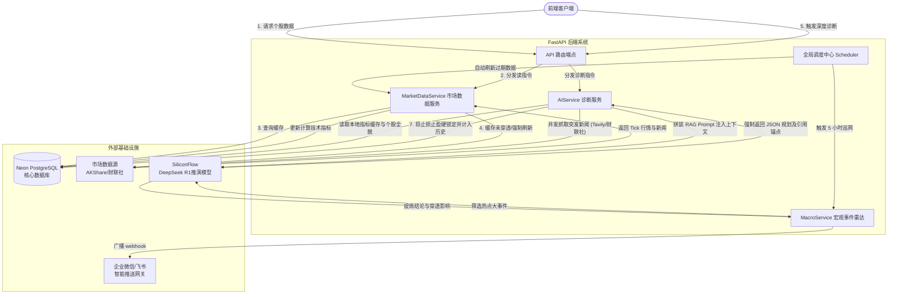

# 02. 系统架构与交互设计 (System Architecture)

**修订日期：** 2026年3月
**架构基调：** 高并发低延迟、完全解耦的前后端分离架构 (SaaS 模式标准)。

---

## 1. 核心技术栈 (Core Technology Stack)

### 前端架构 (Frontend)
- **框架:** Next.js 14+ (App Router 原生渲染，极致首屏加载)
- **组件/UI:** Shadcn/UI (基于 Radix 无头渲染), Tailwind CSS
- **三层原子架构:** 
  1. Orchestration 层 (如 `StockDetail` 页面编排)
  2. Functional Blocks 业务块 (如 `AIVerdict`, `TradeAxis`)
  3. Atomic UI 原子级组件
- **状态管理:** SWR (强依赖其缓存控制与重验证算法), React Context
### 后端架构 (Backend)
- **框架:** FastAPI (极致性能，原生协程支持)
- **数据库 ORM:** SQLAlchemy Async + Alembic
- **数据库底座:** **Neon PostgreSQL** (无服务器，提供行级排他锁、完美胜任轮询高写并发)
- **任务调度:** APScheduler (5 小时宏观雷达、分钟级数据保鲜)

### 引擎与模型 (Engines & Models)
- **大模型:** **DeepSeek-R1** / Qwen (通过 SiliconFlow 高速接口接入，强逻辑推理能力)
- **数据源:** AKShare (A股/美股大陆高速通道), yfinance, 财联社 (本地降级源), Tavily (RAG 搜索)

---

## 2. 核心系统状态图 (System Flowchart)

以下展示了用户行为、后台轮询抓取、大模型诊断三个维度的异步交互流转：

---

## 3. 架构职责红线边界 (Responsibility Boundaries)

为了保障系统后续在多人协同情况下的代码健康度，我们设定了极其严苛的模块指责红线。

### 🚨 后端边界法则：
1. **Router 绝对的“薄” (Dumb Router)：** `app/api/endpoints/` 文件中**严禁包含**超过 3 行数据处理逻辑，其唯一作用是验证凭据、调用 Service 接口、并且打包 Pydantic 响应。
2. **算法内聚 (Service Cohesion)：** 诸如 RSI, Bollinger Bands, MFE/MAE 计算，必须完全隔离在 `MarketDataService` 或指标相关微服内，**严禁向前端散落。** 前端只能是数据的消费端。

### 🚨 前端边界法则：
1. **客户端与后端解耦 (Client Separation)：** 页面级组件内禁止直接进行 `fetch` 调用操作。必须使用挂载在 `lib/api.ts` 的工厂封装工具。
2. **原子化抽离：** 当一个组件超过 150 行时，它必须被下放到 `components/features/{块名称}/` 并将其 Props 进行标准化的 `types.ts` TS Type 声明，如本次大规模的 `StockDetail.tsx` (1255行 -> 226行) 史诗级重构。
