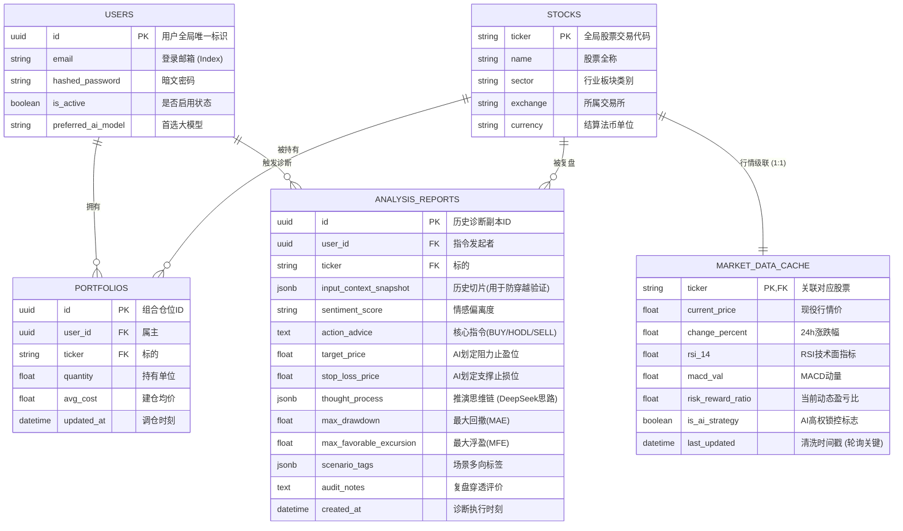

# 03. 数据库设计与数据契约 (Database Schema & Contracts)

**存储底座:** Neon PostgreSQL Serverless
**ORM:** SQLAlchemy (Async)

---

## 1. 实体关系图 (ER Diagram)

数据库采用了规范化的关系型设计。此图为最新版本的数据库脉络，包含 `max_drawdown` 与 `max_favorable_excursion` 等支持 **Truth Tracker 2.0** 的深度量化字段。

---

## 2. 关键表设计深度剖析

### 2.1 行情缓存表 (`market_data_cache`)
该表肩负了过滤三方金融 API (AKShare/Yahoo) 限流打击的核心任务。  
后台的自动守护进程 (Daemon) 会 `ORDER BY last_updated ASC` 找出“最陈旧”的数据实施抓取续命，有效保证在用户高频刷新下不会触发熔断。

**重大特性：高权锁 (`is_ai_strategy`)**
*   当用户要求大模型诊断过后，AI 推演的 `target_price` 会被反写回来，并且表列 `is_ai_strategy` 被置 `True`。
*   一旦设为 `True`，即证明该股票存在高级别的量化追踪。所有通用的技术指标计算在算盘口支撑位时，**无权且强制**不去覆盖由大模型锁定的支撑和阻力点位。彻底解决自动刷新导致止损线乱跳的顽疾。

### 2.2 复盘溯源表 (`analysis_reports`)
它是 Truth Tracker (多维复盘系统) 的物理载体。
*   **防穿越性 (`input_context_snapshot`):** 当时提供给大模型的价格、新闻环境，完整地用 JSONB 进行留底，防止由于未来消息泄露导致的“后视镜分析偏差”。
*   **风控穿顶追踪 (`max_drawdown` & `max_favorable_excursion`):** (近期由 SQLite 升级 PostgreSQL 架构时添置) MFE/MAE 精确化到了浮点双精度。这是判断此笔指令下发后，能否熬过市场洗盘考验的技术试金石。

---

## 3. 并发锁优化 (为什么不再纠结于 SQLite?)

项目起初为了方便，大量使用 SQLite 并开启 WAL 日志。但在**“后台自动爬虫抓取写入 + 前端用户点击 AI 推演”**的 RAG 聚合场景下，频繁爆发 `database is locked`：
*   SQLite 的原生文件级排他锁会导致 I/O 串行阻塞。
*   我们切换并升级到 **Neon PostgreSQL**，全面拥抱云原生的 MVCC（多版本并发控制），使得前端读取历史记录与后台大批量的 K 线清洗处理彼此隔离，彻底解放了系统的 QPS（查询每秒）瓶颈。
