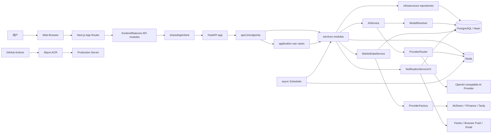
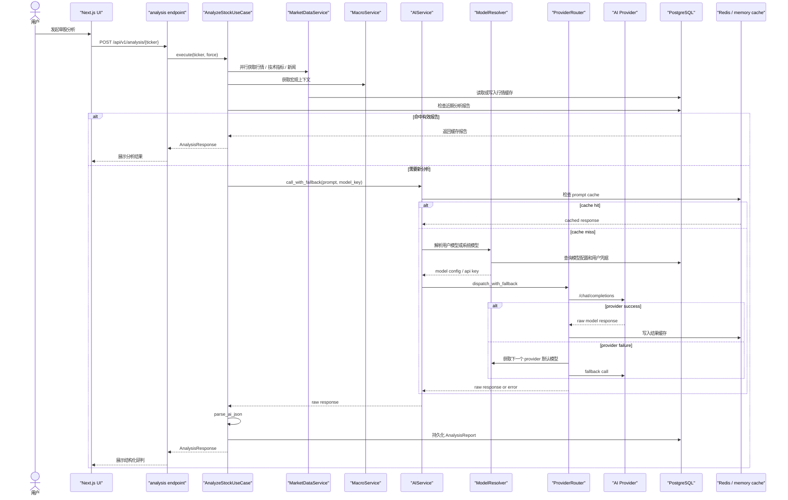
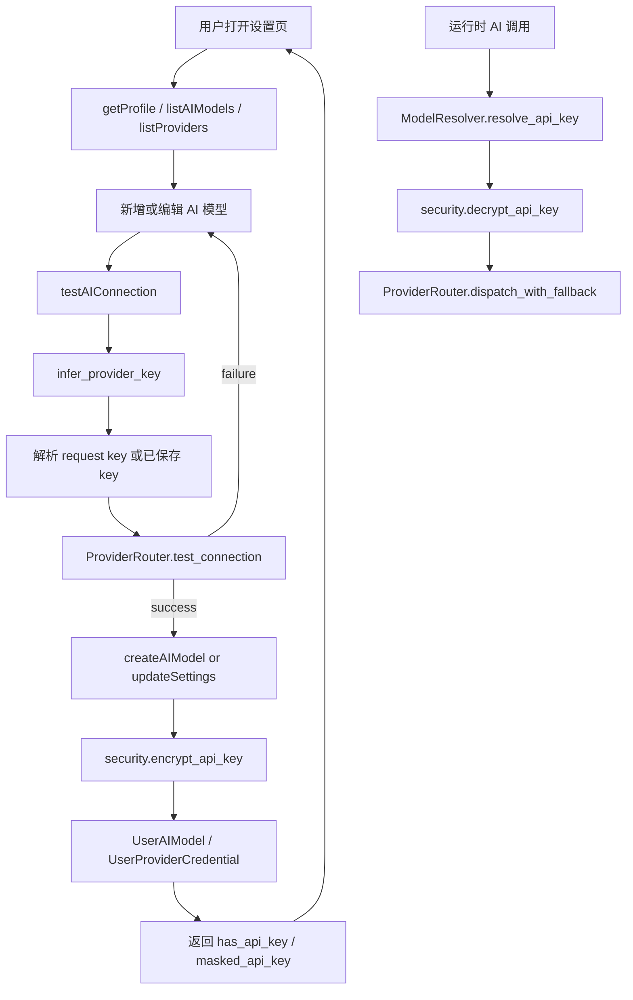
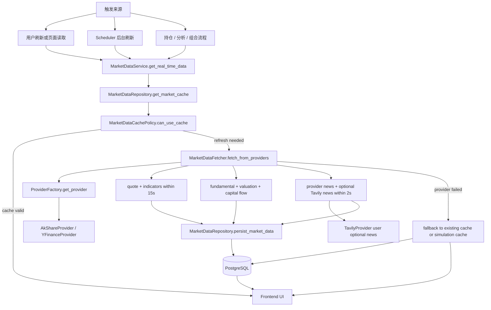
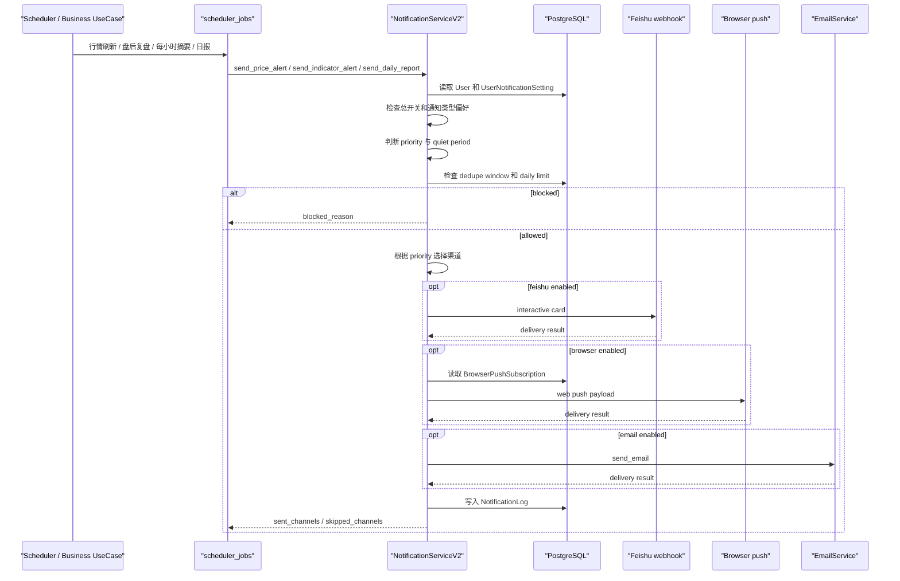
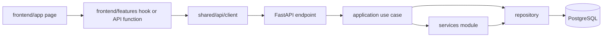
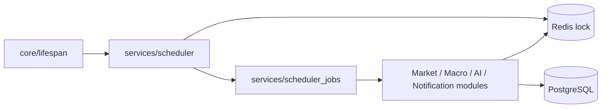

# 09. Architecture Overview

**文档定位：** 本文档从系统视角梳理当前架构，帮助人类开发者、Codex 和 Claude Code 快速理解项目的 Module、Interface、Seam、Adapter、主要流程和外部依赖。

**生成依据：** `README.md`、`AGENTS.md`、`docs/02_Developer_SOP_and_Guide.md`、`docs/05_Current_Feature_Status_Matrix.md`、`docs/07_Agent_Architecture_Design.md`、`backend/app/services/**`、`frontend/features/**`。

---

## 1. 架构定位

AI Smart Investment Advisor 当前是一个清晰模块化单体：

- Web 前端负责页面编排、用户交互、API 调用和结果展示。
- FastAPI 后端负责鉴权、业务编排、数据契约、AI 调用、行情聚合、通知路由和后台调度。
- PostgreSQL/Neon 是主数据源。
- Redis 用于缓存、去重、调度器分布式锁和通知辅助。
- 外部 Provider 包括 AI Provider、行情 Provider、Tavily 新闻搜索、Feishu webhook、邮件和浏览器推送。

当前 6 个月内的合理架构原则是：保持单体，增强 Module 深度和 Interface 清晰度，优先契约同步、故障降级和敏感信息安全，不提前拆微服务。

---

## 2. 系统架构图

---

## 3. 核心 Module 与 Seam

| Module | Interface | Implementation | Depth / Leverage |
|--------|-----------|----------------|------------------|
| `frontend/shared/api/client` | 统一请求、鉴权注入、401 refresh、非 POST 5xx retry | Axios client 和 interceptors | 前端调用者只需要知道领域 API，不重复处理 token 和 retry |
| `frontend/features/**/api.ts` | 领域级函数，例如 `analyzeStock`、`updateSettings`、`refreshAllStocks` | HTTP endpoint、超时、响应映射 | 页面层不需要知道 URL 细节和响应修正逻辑 |
| `backend/app/api/v1/endpoints/**` | HTTP request/response contract | FastAPI router、依赖注入、限流 | Router 薄层，保持业务流向 use case 和 services |
| `backend/app/application/**` | 业务用例，例如单股分析、组合分析、持仓操作 | 多数据源聚合、业务规则、持久化调用 | 把一个用户动作背后的多步骤流程集中起来 |
| `MarketDataService` | `get_real_time_data`、`fetch_market_data`、`persist_market_data` | 缓存策略、Provider 抓取、持久化回退 | 行情调用方不用关心 AkShare/YFinance/Tavily 和 cache fallback |
| `MarketDataProvider` | quote、fundamental、historical、ohlcv、news、full data | `AkShareProvider`、`YFinanceProvider`、`TavilyProvider` | 这是真实 seam，多 Adapter 按市场和用户偏好切换 |
| `AIService` | `call_with_fallback` 和分析生成入口 | prompt、cache、user model 优先、系统 fallback | 调用方只关心模型 key 和 prompt，不关心 Provider 路由 |
| `ModelResolver` | model config、provider list、API key resolution | DB 查询、credential 解密、环境变量 fallback、cache | 把 BYOK 和系统 key 解析集中到一个 Module |
| `ProviderRouter` | provider dispatch、connection test、cache result | provider 排序、fallback、错误归类、OpenAI-compatible call | 供应商容灾集中，避免业务代码直接绑死某个 Provider |
| `NotificationServiceV2` | 语义化通知发送方法和 `send_notification` | 用户偏好、优先级、静默时段、去重、日限额、渠道路由 | 通知业务只表达意图，不重复实现偏好和渠道规则 |
| `Scheduler` | 常驻后台循环 | Redis lock、定时刷新、盘后复盘、日报、StockCapsule、模拟交易 | 后台任务集中调度，避免散落在请求路径 |

---

## 4. AI 调用时序图

### AI 调用观察

- `AIService` 是业务调用方进入 AI 的主要 Interface。
- `ModelResolver` 是 BYOK、系统 key、provider config 的集中解析 Module。
- `ProviderRouter` 是供应商容灾 Module，避免 use case 直接依赖某个 Provider。
- `AnalyzeStockUseCase` 在进入长耗时 AI 调用前提交 DB 事务，减少连接池被长时间占用的风险。

---

## 5. BYOK 配置流程图

### BYOK 安全要点

- 前端只应展示 `has_api_key` 和 `masked_api_key`，不要长期持有明文 key。
- 保存时通过 `security.encrypt_api_key` 加密进入 `UserAIModel` 或 `UserProviderCredential`。
- 调用时通过 `ModelResolver.resolve_api_key` 统一解析，优先级为用户统一凭据、legacy user config、用户字段、系统环境变量。
- 连接测试和真实调用都应避免把明文 key 写入日志。

---

## 6. 行情刷新流程图

### 行情刷新观察

- `MarketDataService` 是行情 Module 的主 Interface。
- `ProviderFactory` 是行情 Provider 的 Seam，按 ticker、用户数据源配置和显式 preferred_source 选择 Adapter。
- `MarketDataFetcher` 对核心数据设置 15 秒超时，对新闻设置更激进的短超时，符合“页面不能被第三方拖死”的原则。
- Tavily 被设计为用户可选凭据，不从系统环境变量兜底，这能降低成本和隐私风险。

---

## 7. 通知流程时序图

### 通知流程观察

- `NotificationServiceV2.send_notification` 是通知系统最重要的深 Module。
- 通知调用方表达语义，例如 price alert、indicator alert、daily report，而不是重复处理渠道和限额。
- `POLICIES` 把通知类型映射到偏好字段、默认优先级和去重窗口，是通知规则的核心 Interface。
- 旧 `NotificationService` 主要保留 Feishu 底层兼容能力，业务通知已经转向 V2。

---

## 8. 当前架构的主要数据流

### 8.1 用户请求路径

### 8.2 后台任务路径

---

## 9. Architecture Deepening Opportunities

这些不是立即重构要求，而是后续提高 Locality、Leverage 和 AI-navigability 的候选点。

### 9.1 User Settings Module 需要加深

- **Files:** `backend/app/api/v1/endpoints/user.py`、`frontend/features/user/api.ts`、`frontend/app/settings/page.tsx`
- **Problem:** 用户资料、BYOK、数据源、Feishu、Tavily、通知开关、AI 模型管理集中在一个较大的 endpoint 和设置页里。Interface 对调用方暴露的概念较多，维护者理解一个设置变更时需要跨多个分支阅读。
- **Solution:** 按领域拆出 settings-oriented Module，例如 AI model settings、provider credentials、data source preferences、notification content settings。Router 保持聚合，但 Implementation 分散到更深的 use case 或 manager Module。
- **Benefits:** 提升 Locality。BYOK 和数据源逻辑各自有稳定 Interface，测试可以围绕 Module 行为而不是大 endpoint 分支。

### 9.2 Market Data Fetcher 可以把外部数据容错策略变成显式 Interface

- **Files:** `market_data.py`、`market_data_fetcher.py`、`market_data_policy.py`、`market_providers/**`
- **Problem:** 当前 `MarketDataFetcher.fetch_from_providers` 已经承载并发、超时、Tavily 可选新闻、fundamental 增强、异常吞吐等多种策略。它很有用，但 Interface 仍接近 Implementation 复杂度。
- **Solution:** 把 quote、technical、fundamental、news 的抓取策略和超时策略沉淀为更明确的 internal Module，保持 `MarketDataService.get_real_time_data` 对外不变。
- **Benefits:** 提升 Leverage。未来接入 IBKR、Alpha Vantage 或更多市场时，可以复用策略而不是继续扩大 fetcher。

### 9.3 Notification Policy Module 值得独立成规则核心

- **Files:** `notification_service_v2.py`、`notification_settings.py`、notification models
- **Problem:** `NotificationServiceV2` 很深，但当前同时负责 policy、routing、delivery、history。随着通知类型增多，规则和渠道 Implementation 可能互相干扰。
- **Solution:** 保留 `send_notification` Interface，将 policy resolution、channel routing、delivery adapter 拆为内部 Module。
- **Benefits:** Locality 更强。通知规则测试不需要 mock Feishu/browser/email，渠道测试也不需要重复构造完整偏好策略。

### 9.4 AI Provider 调用日志需要检查敏感信息边界

- **Files:** `ai_provider.py`、`provider_router.py`、`ai_service.py`
- **Problem:** AI 调用日志目前记录 prompt 和 response，便于追踪，但投资分析输入可能包含用户持仓、策略或其他敏感上下文。
- **Solution:** 明确 AI logging Interface，区分开发诊断、生产审计和敏感字段脱敏策略。
- **Benefits:** 在不牺牲可观测性的前提下减少隐私风险，也让测试能覆盖“什么可以记录，什么不能记录”。

### 9.5 Scheduler 任务注册可以从循环里抽出为任务表

- **Files:** `scheduler.py`、`scheduler_jobs.py`
- **Problem:** 常驻循环清楚但较长，新增任务时容易继续加 if block。任务的 schedule、lock、error mode、last-run state 分散在循环变量中。
- **Solution:** 保持单进程 async scheduler，但用任务描述表表达 interval、trigger window、handler、last_run_key。
- **Benefits:** Leverage 更高。新增 StockCapsule、日报、宏观、模拟交易任务时，调用方只需要理解任务注册 Interface。

---

## 10. 维护规则

- 本文档只记录当前架构和重要流程图，不替代 `docs/02` 的研发 SOP。
- 功能状态以 `docs/05_Current_Feature_Status_Matrix.md` 为准。
- AI 协作中产生的长期设计决定写入 `docs/08_Agent_Decision_Log.md`。
- 当 AI Provider、行情 Provider、通知策略或调度任务发生结构性变化时，应同步更新本文档对应图。
