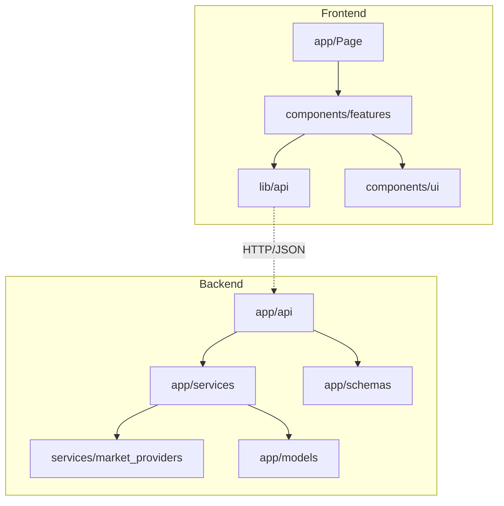

# 🏛️ 系统架构蓝图 (Architecture Blueprint)

本文档定义了 AI Investment Advisor 的系统分层架构与职责边界，是后续 AI 辅助开发的核心基准。

## 1. 物理结构树 (Project Structure)

### 📂 后端 (Backend: FastAPI)

```text
backend/app/
├── api/             # 路由表现层：定义接口路径，参数校验 (Router/Endpoint)
├── core/            # 核心基础设施：数据库连接、安全、全局配置 (Infra)
├── models/          # 领域模型：SQLAlchemy ORM 定义 (Database Models)
├── schemas/         # 数据契约：Pydantic IO 类型定义 (IO Schemas)
└── services/        # 业务逻辑层：核心计算、三方 API 聚合 (Business Logic)
```

### 📂 前端 (Frontend: Next.js)

```text
frontend/
├── app/             # 路由与页面定义 (App Router Pages)
├── components/      # 组件库
│   ├── features/    # 领域相关组件 (如 PortfolioList, StockDetail)
│   └── ui/          # 基础原子组件 (Shadcn UI)
├── lib/             # 基础设施：API 客户端、工具函数 (API Client/Utils)
└── types/           # 类型系统：TypeScript 接口定义 (TS Types)
```

## 2. 职责边界红线 (Responsibility Boundaries)

### 🔴 后端红线

1. **路由层 (app/api) 禁令**：禁止在路由文件内编写复杂的业务逻辑（如指标计算、正则解析、三方 API 调用）。路由层仅负责：验证用户权限、解析参数、调用 Service、返回 Response。
2. **逻辑下沉原则**：所有金融逻辑（如 RRR 计算、RSI 逻辑）必须封装在 `app/services/` 内单向输出给路由。
3. **Provider 隔离**：数据源（Tencent, AkShare, Sina）必须在 `services/market_providers/` 下隔离，通过 Factory 动态注入。

### 🔵 前端红线
1. **API 数据流向**：禁止在组件内直接使用 `fetch` 或 `axios` 调用后端。必须统一通过 `lib/api.ts` 导出的封装函数进行。
2. **组件解耦**：`components/ui` 绝对禁止包含业务逻辑。`components/features` 应当尽可能通过 Props 接收数据，减少对全局状态的依赖。

## 3. 依赖流向图 (Dependency Map)



## 4. 潜在耦合风险预警
- **正则依赖**：目前部分端点（如 `analysis.py`）包含正则提取逻辑，后续需合并至 `AIService` 统一处理。
- **循环引用**：在添加新 Service 时，严禁 Service 之间直接互相引用，如有需要应通过 `AppContainer` 或三级抽象处理。
